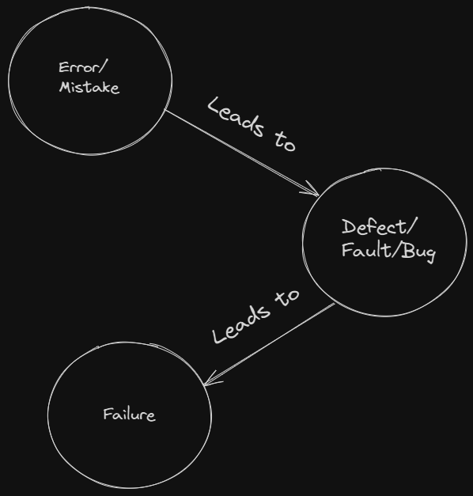

# Content Of Table

- [Fundamentals of Testing](#fundamentals-of-testing)
  - [What is Testing?](#what-is-testing)
  - [Test Objectives](#test-objectives)
  - [Principles of Testing](#principles-of-testing)
  - [Independence of Testing](#independence-of-testing)
  - [Errors, Defects, Failures, and Root Causes](#errors-defects-failures-and-root-causes)
  - [Testing and Debugging](#testing-and-debugging)
  - [Testing Process](#testing-process)
  - [QA vs QC](#qa-vs-qc)

## Fundamentals of Testing

### What is Testing?

Testing in software development is the process of evaluating the functionality of a software application to find any software bugs. It checks whether the developed software met the specified requirements and identifies any defect in the software in order to produce a quality product.

### Test Objectives

**Explanation:**

Test objectives are the goals and outcomes that need to be achieved by testing a specific item or system. They are derived from the product objectives, requirements, and test strategy. Test objectives guide the testing process and provide a clear focus for the testing effort. They also serve as a basis for the test evaluation and test closure activities.

**Key Concepts:**

1. **Evaluating Work Products:** This involves assessing various work products like requirements, user stories, designs, and code to ensure they meet the specified criteria.

2. **Finding Defects:** One of the primary objectives of testing is to find defects in the system under test.

3. **Coverage:** Test objectives often include achieving a certain level of coverage, which could be in terms of requirements, risk, functionality, code.

4. **Risk Reduction:** Testing helps in reducing the risk of failure in the production environment.

5. **Verification and Validation:** Test objectives often include verifying that the system meets the specified requirements (verification) and that it fulfills its intended purpose (validation).

6. **Regulatory Compliance:** In certain domains, complying with regulatory requirements is a key test objective.

7. **Information for Decision Making:** Testing provides information about the system, to stakeholders.

8. **Building Confidence:** Testing helps in building confidence that the system is working as expected and is ready for release.

9. **User Satisfaction:** Ultimately, the objective of testing is to ensure that the system satisfies the user's needs and expectations.

### Principles of Testing

**Explanation:**

The principles of testing are the fundamental guidelines that steer the testing process. They include concepts like early testing, which advocates for starting the testing process as early as possible in the software development lifecycle, and the understanding that exhaustive testing is impossible, which acknowledges that we can't test every single scenario due to time and resource constraints.

The Rule-oriented Approach that guide what to test, how to test, and when to test.

**Key Concepts:**

1. **Testing shows presence of defects:** Testing can show that defects are present, but cannot prove that there are no defects. Testing reduces the probability of undiscovered defects remaining in the software but, even if no defects are found, it is not a proof of correctness.

2. **Exhaustive testing is impossible:** It's not possible to test all combinations of inputs, scenarios, and paths in the software. Instead, risk analysis, priorities, and techniques like boundary value analysis and equivalence partitioning are used to focus the testing effort.

3. **Early testing:** To find defects early, testing activities should start as early as possible in the software development lifecycle and should be focused on defined objectives.

    

4. **Defect clustering:** A small number of modules usually contain most of the defects discovered during pre-release testing, or are responsible for most of the operational failures. This is also known as the **Pareto principle**, also known as the 80-20 rule, which states that approximately 80% of the issues occur due to 20% of the modules

5. **Pesticide paradox:** If the same tests are repeated over and over again, eventually they will no longer find new bugs. To overcome this, the test cases need to be regularly reviewed and revised, and new and different tests need to be written to exercise different parts of the software or system.

6. **Testing is context dependent:** Testing is done differently in different contexts. For example, Android application software is tested differently from an e-commerce site.

7. **Absence-of-errors fallacy:** If the system does not fulfill the users' needs and expectations, finding and fixing defects does not necessarily improve the system. A system that is 100% bug-free is not necessarily useful to the user.

### Independence of Testing

**Explanation:**

Independence of testing refers to the concept where the testing of a software product is conducted by a person or a team that is separate and independent from the team that developed the software. This is done to ensure an unbiased perspective while identifying defects and issues in the software.

The level of independence can vary. It can range from developers doing their own testing, to testing done by a separate team within the same organization, or even testing done by an entirely separate organization.

**Key Concepts:**

1. **Objectivity:** Independent testing provides an objective view of the software, which helps in identifying defects that might be overlooked by the development team due to familiarity with the code.

2. **Bias Reduction:** Since the testing team is separate from the development team, it reduces the risk of bias and ensures a more thorough and impartial testing process.

3. **Expertise:** Independent testers often have specialized skills and expertise in testing methodologies and tools, which can contribute to a more effective testing process.

4. **Accountability:** Having a separate testing team holds the development team accountable for the quality of their work, as any defects found can be traced back to the development process.

5. **Quality Assurance:** Independent testing is a key component of quality assurance, as it verifies and validates the software product against the defined requirements and specifications.

### Errors, Defects, Failures, and Root Causes

**Explanation:**

These terms are often used in the context of software testing to describe different aspects of problems that can occur during the development and operation of software.

1. **Error:** An error, also known as a mistake, is a human action or decision that produces an incorrect or unexpected result. In software development, this could be a programmer accidentally typing the wrong variable name or misunderstanding a requirement.

2. **Defect:** A defect, also known as a bug, is a flaw in the system or a deviation from the expected behavior. It's the result of an error made by the people creating the software. For example, a piece of code that doesn't do what it's supposed to do is a defect.

3. **Failure:** A failure is the manifestation of a defect during execution of the software. It's when the software doesn't do what the user expects it to do. For example, if a user clicks a button and nothing happens, that's a failure.

4. **Root Cause:** The root cause is the deepest underlying cause of a defect or a failure. Identifying the root cause helps in preventing the recurrence of similar defects in the future. For example, the root cause of a defect could be a lack of understanding of the requirements, or a mistake in the code.

**Key Concepts:**

1. **Error Detection:** Identifying errors during the development process can prevent them from becoming defects in the software.

2. **Defect Identification:** Finding and fixing defects is a key part of software testing. The goal is to find them before the software is released.

3. **Failure Analysis:** When a failure occurs, it's important to analyze it to understand the underlying defect that caused it.

4. **Root Cause Analysis:** This is a problem-solving method used to identify the underlying reasons or causes of a defect or failure. The goal is to address these root causes to prevent similar issues in the future.

### Testing and Debugging

**Explanation:**

Testing and debugging are two crucial steps in the software development process that work together to ensure the quality of the software product.

1. **Testing:** This is the process of executing a program or system with the intent of finding errors. The goal of testing is to ensure that the software behaves as expected and meets its requirements. It involves various types of tests such as unit tests, integration tests, system tests, and acceptance tests.

2. **Debugging:** Once an error has been identified through testing, debugging is the process of finding the exact location and cause of that error in the code. Debugging involves stepping through the code, examining variables, and understanding the program flow to fix the error.

While testing aims to find errors, debugging aims to understand and fix these errors.

**Key Concepts:**

1. **Error Detection:** Testing is used to detect errors in the software. It verifies that the software behaves as expected under various conditions.

2. **Error Diagnosis and Fixing:** Debugging is used to diagnose and fix the errors detected during testing. It involves tracing the error to its source in the code and correcting it.

3. **Software Quality:** Both testing and debugging are essential for ensuring software quality. Testing ensures that the software meets its requirements, while debugging ensures that any errors that are found are properly fixed.

4. **Iterative Process:** Testing and debugging are iterative processes. As new features are added or existing ones are modified, the software needs to be tested and potentially debugged again to ensure it continues to function correctly.

### Testing Process

**Explanation:**

The test process is influenced by a number of contextual factors, including the needs and expectations of stakeholders, the skills and availability of team members, the criticality of the test object, the type of software and technology used, project constraints, organizational factors, the software development lifecycle, and the availability and usability of tools.

**Key Concepts:**

1. **Test Planning:** This involves defining the test objectives and selecting an approach that best achieves these objectives within the constraints of the overall context. It includes defining the scope of testing, estimating the resources required, and scheduling the testing activities.

2. **Test Monitoring and Control:** This involves the ongoing checking of all test activities and the comparison of actual progress against the plan. It also involves taking necessary actions to meet the objectives of testing.

3. **Test Analysis:** This involves analyzing the test basis to identify testable features and to define and prioritize associated test conditions. It also involves evaluating the test basis and the test objects to identify any defects they may contain and to assess their testability.

4. **Test Design:** This involves elaborating the test conditions into test cases and other testware. It also involves identifying coverage items, defining the test data requirements, designing the test environment, and identifying any other required infrastructure and tools.

5. **Test Implementation:** This involves creating or acquiring the testware necessary for test execution. It includes organizing test cases into test procedures, creating manual and automated test scripts, prioritizing test procedures, and setting up the test environment.

6. **Test Execution:** This involves running the tests in accordance with the test execution schedule. It includes comparing actual test results with expected results, logging the test results, and analyzing anomalies to identify their likely causes.

7. **Test Completion:** Test completion is the last step in the software testing life cycle, where we finalize all testing activities and document the results. Our main goal is to ensure the software product is ready for production release.

### QA vs QC

**Explanation:**
Quality Assurance (QA) and Quality Control (QC) are two fundamental aspects of quality management, but they serve different purposes and involve different activities.

- **Quality Assurance (QA):** QA is a proactive process that focuses on preventing defects in the development process. It involves the implementation of systematic activities and procedures to ensure that the product meets the specified requirements and standards. QA is process-oriented and aims to improve and stabilize production and associated processes to avoid issues that lead to defects.

- **Quality Control (QC):** QC is a reactive process that focuses on identifying defects in the final product. It involves the inspection and testing of the product to ensure it meets the required quality standards. QC is product-oriented and aims to identify and correct defects in the finished product before it reaches the customer.

- **Role of a Tester:** A tester primarily engages in QC activities. They focus on identifying defects in the final product through various testing methods such as functional testing, regression testing, and performance testing. Testers ensure that the product meets the required quality standards before it is delivered to the customer.

**Key Concepts:**

- **Process vs Product:**
  - QA is process-oriented, focusing on improving and stabilizing production processes.
  - QC is product-oriented, focusing on identifying defects in the final product.

- **Proactive vs Reactive:**
  - QA is proactive, aiming to prevent defects through planned and systematic activities.
  - QC is reactive, aiming to identify and correct defects in the final product.

- **Activities:**
  - QA activities include process definition, process implementation, process monitoring, and process improvement.
  - QC activities include product inspection, product testing, and defect reporting.

- **Goals:**
  - The goal of QA is to improve development and test processes so that defects do not arise when the product is being developed.
  - The goal of QC is to identify defects after a product is developed and before it is released.

- **Examples:**
  - QA: Implementing a new software development methodology, conducting process audits, and providing training to improve process quality.
  - QC: Performing functional testing, conducting code reviews, and executing automated tests to find defects in the software.
