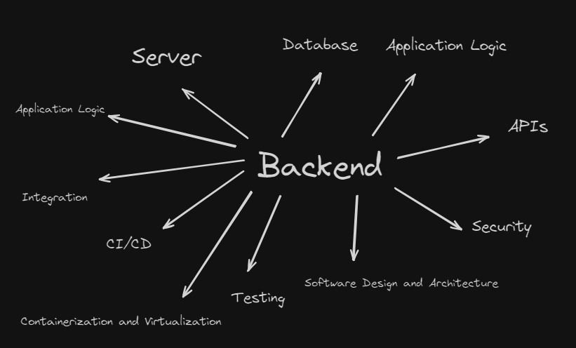

# Table of Contents

- [What is Backend?](#what-is-backend)

## What is Backend?

**Explanation:**

The backend refers to the server-side part of a web application. It is responsible for managing the database, server, and application logic. The backend is what powers the frontend, which is the part of the application that users interact with directly.

**Key Concepts:**

1. **Server**: The hardware or software that provides services to other computers over a network. Examples include Linux servers running frameworks like Django, Express, or Spring.
2. **Database**: Systems that store and retrieve data. This includes both NoSQL and SQL databases.
3. **Application Logic**: The code that defines the application's functionality, including business logic, authentication, and authorization.
4. **APIs**: Application Programming Interfaces that allow different software systems to communicate with each other.
5. **Security**: Measures to protect data and ensure that only authorized users can access certain parts of the application, such as hashing passwords.
6. **Software Design and Architecture**: The structure of the software, which can be monolithic (MVC) or microservices-based.
7. **Testing**: Ensuring the application works as expected through various types of testing.
8. **CI/CD**: Continuous Integration and Continuous Deployment practices to automate testing and deployment.
9. **Integration**: Connecting with other services and applications, such as third-party APIs and cloud platforms.
10. **Containerization and Virtualization**: Techniques to create isolated environments for running applications, using tools like Docker and Kubernetes.
