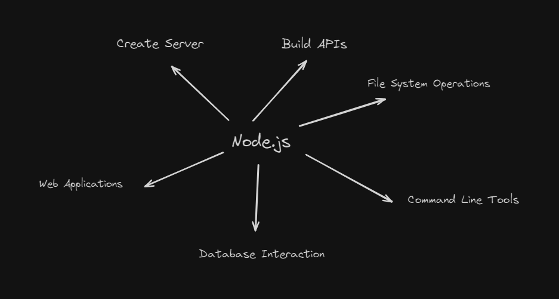

# Table of Contents

- [Node.js Introduction](#nodejs-introduction)
- [Process](#process)
- [Running application](#running-application)
- [Monitor Change](#monitor-change)
- [Modules](#modules)
- [Working with Files](#working-with-files)
- [Environment Variables](#environment-variables)

## Node.js Introduction

**Explanation:**

Node.js is a runtime environment that allows JavaScript to be run on the server side, outside of a browser. It's built on Chrome's V8 JavaScript engine.

While JavaScript was traditionally used for client-side scripting in the browser, Node.js extends its capabilities to server-side scripting as well.



**Key Concepts:**

1. **Create Server**: You can create HTTP servers to handle client requests and responses.
2. **Build APIs**: Develop RESTful APIs to interact with databases and other services.
3. **File System Operations**: Perform file system operations like reading, writing, and deleting files.
4. **Database Interaction**: Interact with databases such as MongoDB, MySQL, and PostgreSQL.
5. **Command Line Tools**: Create command line tools and scripts.
6. **Web Applications**: Create web applications using template engines like EJS, Pug.

**Resources:**

- [Node: Docs](https://nodejs.org/en)

## Process

**Explanation:**

Each program running on a computer represents a `process`. It's a top level task that an operating system such as Windows or Linux uses to encapsulate a running program:

- Code that is running
- Memory that is allocated to it by the OS
- Files that it has open

**Key Concepts:**

- **Standard Input/Output (stdin/stdout)**: The `process` object allows you to read from the standard input and write to the standard output.
- **Environment Variables**: You can access environment variables using `process.env`.
- **Process Arguments**: The `process.argv` property returns an array containing the command-line arguments passed when the Node.js process was launched.
- **Exit Codes**: The `process.exit()` method allows you to exit the current process with a specified exit code.
- **Current Working Directory**: The `process.cwd()` method returns the current working directory of the Node.js process.

**Syntax:**

- **Reading from Standard Input**:

  ```js
  process.stdin.on('data', (data) => {
    console.log(`You typed: ${data.toString()}`);
  });
  ```

- **Writing to Standard Output:**

  ```js
  process.stdout.write('Hello, World!\n');
  ```

- **Accessing Environment Variables:**

  ```js
  console.log(process.env.PATH);
  ```

- **Accessing Process Arguments:**

  ```js
  process.argv.forEach((val, index) => {
  console.log(`${index}: ${val}`);
  });
  ```

- **Exiting the Process:**

  ```js
  process.exit(1); // Exit with a failure code
  ```

- **Getting Current Working Directory:**

  ```js
  console.log(`Current working directory: ${process.cwd()}`);
  ```

## Running application

**Explanation:**

We can run applications in different ways using just `node`, `npm`, `npx`, or `pnpm`.

- **What is npm:** npm (Node Package Manager) is the default package manager for Node.js. It allows developers to install, share, and manage dependencies (libraries and packages) for their Node.js projects.
- **The package.json:** It contains metadata about the project and its dependencies. You can create a `package.json` file manually or automatically using `npm init` or `npm init -y`.
- **Global Install:** (`-g`): Installs the package globally on your system, making it available from any directory `npm install -g <pacakge name>`.
- **Local Install:** Installs the package in the current project directory, making it available only within the project `npm install <pacakge name>`.
- **Semantic Versioning (SemVer):** Is a versioning scheme for software that uses a three-part version number: `MAJOR.MINOR.PATCH`.

**Key Concepts:**

- **Node**:
  - Directly execute JavaScript files.
  - Commonly used for running server scripts.
  - Example: `node app.mjs`

- **npm**:
  - Manages project dependencies.
  - Runs scripts defined in `package.json`.
  - Example: `npm run start`

- **npx**:
  - Executes binaries from npm packages.
  - Useful for running one-off commands.
  - Example: `npx nodemon app.mjs`

- **pnpm**:
  - Faster and more efficient alternative to npm.
  - Uses a content-addressable filesystem to store all files.
  - Example: `pnpm run build`

**Syntax:**

- **Node**: `node <filename.js>`
- **npm**: `npm run <script-name>`
- **npx**: `npx <package-name>`
- **pnpm**: `pnpm run <script-name>`

1. **Node**:

    ```sh
    node app.mjs
    ```

2. **npm**:

    ```sh
    npm run start
    ```

3. **npx**:

    ```sh
    npx nodemon app.mjs
    ```

4. **pnpm**:

    ```sh
    pnpm run build
    ```

## Monitor Change

**Explanation:**

Monitoring changes in your application files can help in automatically restarting the server whenever a file is modified. This can be achieved using tools like `nodemon`.

**Key Concepts:**

- **--watch**: A flag used to specify directories or files to watch for changes.
- **nodemon**: A utility that automatically restarts your Node.js application when file changes in the directory are detected.

**Syntax:**

- **nodemon**: `nodemon [your node app]`
- **--watch**: `nodemon --watch [directory or file] [your node app]`

## Modules

**Explanation:**

Modules in Node.js are reusable pieces of code that can be exported from one file and imported for use in another file. This helps in organizing and managing code efficiently.

- **CommonJS Modules**: The default module system in Node.js, using `require` and `module.exports`.
  - **Synchronous Loading**: CommonJS modules are loaded synchronously. This means that when you `require` a module, Node.js will read the file, execute it, and return the exports object before moving on to the next line of code.

- **ES6 Modules**: A newer module system using `import` and `export` statements.
  - **Asynchronous Loading**: ES6 modules are loaded asynchronously. This means that when you import a module, the loading and execution of the module can happen in parallel with other operations.

**Syntax:**

- **CommonJS Modules**:
  
  - Importing multiple exports:

      ```js
      function add(a, b) {
        return a + b;
      }
      function subtract(a, b) {
        return a - b;
      }
      module.exports = { add, subtract };
      ```

      ```js
      const { add, subtract } = require('./math');
      console.log(add(2, 3));
      console.log(subtract(5, 3));

- **ES6 Modules**:

  - Importing multiple exports:

      ```js
      export function add(a, b) {
        return a + b;
      }
      export function subtract(a, b) {
        return a - b;
      }
      ```

      ```js
      import { add, subtract } from './math.mjs';
      console.log(add(2, 3));
      console.log(subtract(5, 3));
      ```

  - Importing all exports as an object:

      ```js
      export function add(a, b) {
        return a + b;
      }
      export function subtract(a, b) {
        return a - b;
      }
      ```

      ```js
      import * as math from './math.mjs';
      console.log(math.add(2, 3));
      console.log(math.subtract(5, 3));
      ```

  - Default export and import:

      ```js
      export default function add(a, b) {
        return a + b;
      }
      ```

      ```js
      import add from './math.mjs';
      console.log(add(2, 3));
      ```

  - Mixing default and named exports:

      ```js
      export default function add(a, b) {
        return a + b;
      }
      export function subtract(a, b) {
        return a - b;
      }
      ```

      ```js
      import add, { subtract } from './math.mjs';
      console.log(add(2, 3));
      console.log(subtract(5, 3));
      ```

## Working with Files

**Explanation:**

Node.js provides a built-in module called `fs` (file system) that allows you to interact with the file system. You can perform various operations such as reading, writing, updating, and deleting files.

**Key Concepts:**

- **Synchronous vs Asynchronous**: Node.js provides both synchronous and asynchronous methods for file operations. Synchronous methods block the execution of code until the operation is complete, while asynchronous methods do not block the execution and use callbacks or promises to handle the result.
- **Reading Files**: You can read the contents of a file using methods like `fs.readFile` (asynchronous) and `fs.readFileSync` (synchronous).
- **Writing Files**: You can write data to a file using methods like `fs.writeFile` (asynchronous) and `fs.writeFileSync` (synchronous).
- **Appending to Files**: You can append data to an existing file using methods like `fs.appendFile` (asynchronous) and `fs.appendFileSync` (synchronous).
- **Deleting Files**: You can delete a file using methods like `fs.unlink` (asynchronous) and `fs.unlinkSync` (synchronous).
- **__dirname and __filename**: These are global variables in Node.js that provide the directory name and the file name of the current module, respectively.
- **Path Module**: The `path` module provides utilities for working with file and directory paths.

**Syntax:**

- **Reading a File (Asynchronous)**:

  ```js
  import { readFile } from 'fs/promises';

  async function readFileAsync(fileName) {
    try {
      const data = await readFile(fileName, 'utf8');
      console.log(data);
    } catch (err) {
      console.error(err);
    }
  }

  readFileAsync('example.txt');

- **Reading a File (Synchronous):**

```js
import { readFileSync } from 'fs';

function readFileSyncFunction(fileName) {
  try {
    const data = readFileSync(fileName, 'utf8');
    console.log(data);
  } catch (err) {
    console.error(err);
  }
}

readFileSyncFunction('example.txt');
```

- **Writing to a File (Asynchronous):**

```js
import { writeFile } from 'fs/promises';

async function writeFileAsync(fileName, content) {
  try {
    await writeFile(fileName, content);
    console.log('File has been written');
  } catch (err) {
    console.error(err);
  }
}

writeFileAsync('example.txt', 'Some content to write to the file');
```

- **Writing to a File (Synchronous):**

```js
import { writeFileSync } from 'fs';

function writeFileSyncFunction(fileName, content) {
  try {
    writeFileSync(fileName, content);
    console.log('File has been written');
  } catch (err) {
    console.error(err);
  }
}


writeFileSyncFunction('example.txt', 'Some content to write to the file');
```

- **Appending to a File (Asynchronous):**

```js
import { appendFile } from 'fs/promises';

async function appendFileAsync(fileName, content) {
  try {
    await appendFile(fileName, content);
    console.log('Content has been appended');
  } catch (err) {
    console.error(err);
  }
}

// Usage
appendFileAsync('example.txt', 'Some content to append to the file');
```

- **Appending to a File (Synchronous):**

```js
import { appendFileSync } from 'fs';

function appendFileSyncFunction(fileName, content) {
  try {
    appendFileSync(fileName, content);
    console.log('Content has been appended');
  } catch (err) {
    console.error(err);
  }
}

appendFileSyncFunction('example.txt', 'Some content to append to the file');
```

- **Deleting a File (Asynchronous):**

```js
import { unlink } from 'fs/promises';

async function deleteFileAsync(fileName) {
  try {
    await unlink(fileName);
    console.log('File has been deleted');
  } catch (err) {
    console.error(err);
  }
}

deleteFileAsync('example.txt');
```

- **Deleting a File (Synchronous):**

```js
import { unlinkSync } from 'fs';


function deleteFileSyncFunction(fileName) {
  try {
    unlinkSync(fileName);
    console.log('File has been deleted');
  } catch (err) {
    console.error(err);
  }
}

deleteFileSyncFunction('example.txt');
```

- **Using __dirname and __filename with Path Module:**

```js
const { readFileSync } = require('fs');
const { join } = require('path');

function readFileWithDir(fileName) {
  console.log('__dirname:', __dirname);
  console.log('__filename:', __filename);

  const filePath = join(__dirname, fileName);
  try {
    const data = readFileSync(filePath, 'utf8');
    console.log(data);
  } catch (err) {
    console.error(err);
  }
}

readFileWithDir('example.txt');
```

```js
import { readFileSync } from 'fs';
import { join, dirname } from 'path';
import { fileURLToPath } from 'url';

// Convert the module URL to a file path
const __filename = fileURLToPath(import.meta.url);
const __dirname = dirname(__filename);

function readFileWithDir(fileName) {
  console.log('__dirname:', __dirname);
  console.log('__filename:', __filename);

  const filePath = join(__dirname, fileName);
  try {
    const data = readFileSync(filePath, 'utf8');
    console.log(data);
  } catch (err) {
    console.error(err);
  }
}

readFileWithDir('example.txt');
```

## Environment Variables

**Explanation:**

Environment variables are key-value pairs that are used to configure the environment in which a process runs. They are often used to store configuration settings and sensitive information such as API keys, database connection strings, and other configuration data that should not be hard-coded into the application.

**Key Concepts:**

- **process.env**: The `process.env` object in Node.js provides access to the environment variables of the current process. You can read and set environment variables using this object.
- **dotenv package**: The `dotenv` package is a popular Node.js module that loads environment variables from a `.env` file into `process.env`. This is useful for managing environment-specific configurations.
- **cross-env**: The `cross-env` package allows you to set environment variables across different operating systems in a consistent manner. This is particularly useful for setting environment variables in npm scripts.

**Why We Need to Use Environment Variables:**

- **Configuration Management**: Environment variables allow you to manage configuration settings for different environments (development, testing, production) without changing the code.
- **Security**: Sensitive information such as API keys, database credentials, and other secrets can be stored in environment variables instead of hard-coding them into the application.
- **Flexibility**: Environment variables provide a flexible way to configure applications, making it easier to change settings without modifying the codebase.
- **Portability**: Using environment variables makes it easier to deploy applications across different environments and platforms.

**Why Node.js Might Be Challenging for Working with Environment Variables:**

- **Lack of Built-in Support for Environment Files**: Node.js does not have built-in support for loading environment variables from files like `.env`. This requires the use of additional packages like `dotenv`.
- **Cross-Platform Issues**: Setting environment variables can be different across operating systems (Windows vs. Unix-based systems). This can lead to inconsistencies and requires tools like `cross-env` to handle these differences.
- **Process Restart Required**: Changes to environment variables typically require restarting the Node.js process to take effect, which can be inconvenient during development.
- **Potential for Security Risks**: If not managed properly, environment variables can be exposed, leading to security vulnerabilities. It's not accidentally committed to version control.

**Syntax:**

- **Accessing Environment Variables with process.env**:

  ```js
  // Accessing an environment variable
  const dbHost = process.env.DB_HOST;
  console.log(`Database Host: ${dbHost}`);
  ```

- **Using dotenv to Load Environment Variables:**

  ```bash
  # Install the dotenv package:
  npm install dotenv
  ```

- **Create environment-specific .env files:**

  ```bash
  # .env.prod:
  DB_HOST=prod-db-host
  DB_USER=prod-user
  DB_PASS=prod-pass 
  ```

  ```bash
  # .env.dev:
  DB_HOST=dev-db-host
  DB_USER=dev-user
  DB_PASS=dev-pass

- **Using cross-env to Set Environment Variables in npm Scripts:**

  ```bash
  # Install the cross-env package:
  npm install cross-env
  ```

  ```json
  // Use cross-env in your package.json scripts:
  "scripts": {
    "start": "cross-env NODE_ENV=production node app.js",
    "dev": "cross-env NODE_ENV=development node app.js"
  }

  ```

  ```js
  // Run env files on specific requirements
  if (process.env.NODE_ENV === "prod") {
    dotenv.config({ path: ".env.prod" });
  } else {
    dotenv.config({ path: ".env.dev" });
  }

  ```

  ```js
  // Access the environment variable in your application:
  console.log(`Running in ${process.env.NODE_ENV} mode`);
  ```
