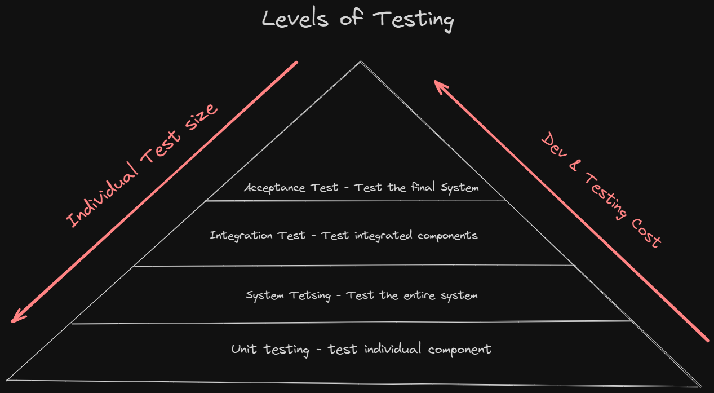

# Content of Table

- [Levels of Testing](#levels-of-testing)
  - [Component Testing (Unit Testing)](#component-testing-unit-testing)
  - [Component Integration Testing (Unit Integration Testing)](#component-integration-testing-unit-integration-testing)
  - [System Testing](#system-testing)
  - [System Integration Testing](#system-integration-testing)
  - [Acceptance Testing](#acceptance-testing)

## Levels of Testing

### Component Testing (Unit Testing)

**Explanation:**

Komponentų testavimas, dar vadinamas vienetų testavimu(Unit Testing), yra pirmasis programinės įrangos testavimo lygis, kai testuojami atskiri programinės įrangos komponentai (arba vienetai). Tikslas - patvirtinti, kad kiekvienas programinės įrangos vienetas veikia taip, kaip numatyta. Vienetas yra mažiausia testuojama bet kurios programinės įrangos dalis, dažnai funkcija arba metodas objektinio programavimo atveju.

**Key Concepts:**

1. **Izoliacija:** Atliekant vienetų testavimą, komponentai testuojami izoliuotai nuo likusios sistemos dalies. Tai reiškia, kad jei testas nepavyksta, aišku, jog klaida yra testuojamame vienete.

2. **Atskyrimas ir (arba) modeliavimas:** Norint pasiekti izoliaciją, gali tekti imituoti kitus komponentus, su kuriais vienetas sąveikauja, dažnai naudojant tokius metodus kaip modeliavimas arba modeliavimas.

3. **White-Box testavimas:** Vienetų testavimas yra "baltosios dėžės" testavimo rūšis, nes norint parašyti testus, reikia žinoti vidinį vieneto veikimą.

4. **Automatizuoti:** Vieneto testai paprastai yra automatizuoti ir atliekami kaip surinkimo proceso dalis. Tai leidžia reguliariai atlikti regresinius testus, nes kodų bazė vystosi.

5. **Test-Driven Development (TDD):** Vienetų testavimas yra pagrindinė TDD, kūrimo metodikos, pagal kurią prieš rašant kodą rašomi nesėkmingi vienetų testai, kad jie būtų atlikti, dalis.

6. **Apimtis(Coverage:)** - tai rodiklis, rodantis, kokia dalis kodo bazės yra patikrinta vienetiniais testais. Pageidautina didelė aprėptis, nes ji sumažina neaptiktos klaidos tikimybę.

### Component Integration Testing (Unit Integration Testing)

**Explanation:**

Komponentų integravimo testavimas, dar vadinamas vienetų integravimo testavimu, yra dviejų ar daugiau vienetų (komponentų) sujungimo ir jų kaip grupės testavimo procesas. Šio lygio testavimo tikslas - atskleisti integruotų vienetų sąveikos klaidas.

**Key Concepts:**

1. **Vienetų sąveika:** Pagrindinis integracijos testavimo tikslas - patikrinti skirtingų vienetų sąveikos taškus. Tikrinama, kaip gerai jie veikia kartu ir ar nekyla problemų, kai tarp jų keičiamasi duomenimis.

2. **Top-Down ir Bottom-Up požiūriai:** Tai du paplitę integracijos testavimo metodai. Taikant požiūrį "iš viršaus į apačią", testavimas pradedamas nuo viršutinių modulių ir pereinama į žemesnius lygius. Taikant metodą "iš apačios į viršų", testavimas pradedamas nuo žemesnio lygio modulių ir pereinama prie aukštesnio lygio modulių.

3. **Sandvičo / hibridinis požiūris:** Tai iš viršaus žemyn ir iš apačios į viršų požiūrių derinys. Kai kurios sistemos dalys testuojamos nuo viršaus į apačią, o kitos - nuo apačios į viršų.

## System Testing

**Explanation:**

Sistemos testavimas - tai testavimo lygis, kuriuo patvirtinamas visas integruotas programinės įrangos produktas. Sistemos testavimo tikslas - įvertinti sistemos atitiktį nustatytiems reikalavimams.

**Key Concepts:**

1. **Visos sistemos testavimas:** Sistemos testavimas apima visos sistemos kaip visumos testavimą. Jis atliekamas su visa integruota sistema, siekiant įvertinti sistemos atitiktį nustatytiems reikalavimams.

2. **Juodosios dėžės testavimas:** Sistemos testavimas yra juodosios dėžės testavimo rūšis, kai daugiausia dėmesio skiriama sistemos įvesties ir išvesties duomenims. Atliekant sistemos testavimą neatsižvelgiama į vidinę taikomosios programos struktūrą.

3. **Funkcinis ir nefunkcinis testavimas:** Sistemos testavimas apima ir funkcinį, ir nefunkcinį testavimą. Funkciniu testavimu tikrinama, ar sistema elgiasi taip, kaip tikimasi, o nefunkciniu testavimu tikrinami tokie aspektai kaip našumas, tinkamumas naudoti, patikimumas.

4. **Testavimo aplinka:** Sistemos testavimas turėtų būti atliekamas aplinkoje, kuri tiksliai atspindi gamybinę aplinką.

### System Integration Testing

**Explanation:**

Sistemos integracijos testavimas (SIT) - tai testavimo etapas, kurio metu atskiri programinės įrangos sistemos vienetai ar komponentai sujungiami ir testuojami kaip grupė. Pagrindinis SIT tikslas - užtikrinti, kad skirtingi sistemos komponentai veiktų kartu taip, kaip tikimasi.

**Key Concepts:**

1. **Sistemų sąveika:** SIT daugiausia dėmesio skiria duomenų perdavimui tarp sistemos modulių. Ji tikrina, kaip gerai moduliai veikia kartu ir ar nekyla problemų, kai tarp jų keičiamasi duomenimis.

2. **Testavimo aplinka:** SIT turėtų būti atliekamas aplinkoje, kuri tiksliai atspindi gamybinę aplinką.

3. **Pagrindiniai elementai ir tvarkyklės:** SIT metu trūkstamų komponentų elgsenai imituoti naudojami pagrindiniai elementai ir tvarkyklės. Stubas - tai fiktyvus modulis, imituojantis modulio, su kuriuo sąveikauja testuojamas vienetas, elgseną. Vairuotojas yra modulis, kuris iškviečia testuojamą vienetą.

4. **Testavimas nuo pradžios iki galo:** SIT dažnai laikomas testavimo nuo galo iki galo (angl. end-to-end, E2E) tipu, nes gali apimti testavimo procesus, kurie apima kelias sistemas nuo pradžios iki pabaigos.

### Acceptance Testing

**Explanation:**

Priėmimo testavimas(Acceptance Testing) yra paskutinis programinės įrangos testavimo lygis, atliekamas po sistemos ir integracijos testavimo. Šio tipo testavimas atliekamas siekiant patikrinti, ar sistema yra paruošta naudojimui. Juo siekiama įvertinti sistemos atitiktį verslo reikalavimams ir įvertinti, ar ji parengta pristatymui.

**Key Concepts:**

1. **Vartotojo perspektyva:** Priėmimo testavimas atliekamas iš vartotojo perspektyvos. Juo siekiama užtikrinti, kad sistema atitiktų naudotojo poreikius ir galėtų atlikti užduotis pagal realius scenarijus.

2. **Verslo reikalavimai:** Pagrindinis priimtinumo testavimo tikslas - patvirtinti sistemos atitiktį verslo reikalavimams. Juo tikrinama, ar sistema sukurta pagal reikalavimus ir tenkina naudotojo poreikius.

3. **Alfa ir beta testavimas:** Alfa testavimą atlieka vidinės testavimo grupės, o beta testavimą atlieka ribotas skaičius galutinių naudotojų realioje aplinkoje.

4. **Vartotojo priėmimo testavimas (UAT):** Tai paskutinis priėmimo testavimo etapas, kurio metu tikrieji naudotojai išbando programinę įrangą, kad patvirtintų sistemos funkcionalumą ir tinkamumą naudoti realiomis sąlygomis.
