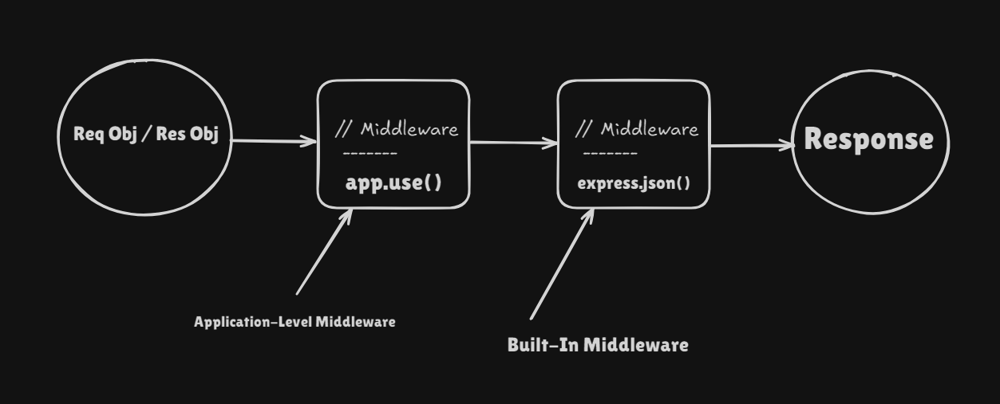

# Table of Contents

- [Express.js Introduction](#expressjs-introduction)
- [Setting Up an Express Server](#setting-up-an-express-server)
- [Middleware 1 Part](#middleware-1-part)
- [Routing](#routing)
- [Handling Requests and Responses](#handling-requests-and-responses)
- [Error Handling](#error-handling)
- [Middleware](#middleware)

## Express.js Introduction

**Explanation:**

Express.js is a minimal and flexible Node.js web application framework. It simplifies the process of creating server-side applications and APIs by providing a thin layer of fundamental web application features without obscuring Node.js features.

**Key Concepts:**

- **Request and Response Objects**: Express provides `req` and `res` objects that represent the HTTP request and response. These objects provide methods and properties to handle data and send responses.
- **Routing**: Defines how an application responds to client requests to specific endpoints (URLs) and HTTP methods (GET, POST, PUT, DELETE, PATCH).
- **Middleware**: Functions that execute during the lifecycle of a request to the Express server. Middleware functions can perform tasks such as logging, authentication, and data parsing.

## Setting Up an Express Server

1. **Install Node.js and npm:** Express.js is a Node.js framework, so you'll need to have Node.js and npm (node package manager) installed on your machine. You can download Node.js and npm from [here](https://nodejs.org/en/download/).

    ```bash
    # Verify the installation
    node -v
    npm -v
    ```

2. **Initialize a new Node.js project:** Use `npm init -y` to create a new package.json file.

3. **Install dependencies:** Navigate into your new project folder and install the dependencies.

    ```bash

    <!-- Your project file -->
    cd myapp
    <!-- Install node_module -->
    npm install

    ```

4. **Install Express.js:** Once you have Node.js and npm installed, you can install Express.js globally on your machine or locally in your project folder.

    ```bash
    # Locally
    npm install express
    ```

5. **Creating a Basic Express.js Server:** This step involves setting up a simple Express.js server that listens on a specific port and responds to GET requests at the root URL.

    ```js

    // Importing express module
    import express from 'express';

    // Creating an express application
    const app = express();

    // Have the app listen on a specific port
    const port = 3000;
    app.listen(port, () => {
        console.log(`Server is running and listening on port ${port}`);
    });

    ```

6. **Start the server:** You can start the Express.js server using the following command.

    ```bash
    npm start
    ```

## Middleware 1 Part

**Explanation:**

Middleware functions are functions that have access to the request object (`req`), the response object (`res`), and the next middleware function in the application’s request-response cycle. These functions can perform various tasks such as executing code, modifying the request and response objects, ending the request-response cycle, and calling the next middleware function in the stack.



**Key Concepts:**

1. **Application-Level Middleware:** Bind application-level middleware to an instance of the app object by using the `app.use()` and `app.METHOD()` functions.
2. **Built-In Middleware:** Express has a few built-in middleware functions such as `express.json()` - Parsing JSON Payloads: It converts the JSON string in the request body into a JavaScript object and assigns it to `req.body`

## Routing

**Explanation:**

Routing refers to how an application's endpoints (URIs) respond to client requests. In Express.js, you define routing using methods of the Express app object that correspond to HTTP methods.

**Key Concepts:**

1. **Route Path:** In combination with a request method, a route path defines the endpoints at which requests can be made.

2. **Route Handlers:** Functions that execute when a route is accessed. Handlers can be callbacks or middleware functions.

3. **Route Parameters:** Parameters are variable parts of a route path. They can be used to capture dynamic values at specific positions in the route path.

**Syntax:**

```js

app.METHOD(PATH, HANDLER)

```

- `app` is an instance of express.

- `METHOD` is an HTTP request method, in lowercase.

- `PATH` is a path on the server.

- `HANDLER` is the function executed when the route accessed.

## Handling Requests and Responses

**Explanation:**

HTTP requests are the core of any web application. In Express.js, routes are defined to respond to HTTP requests. Each route can have one or more handler functions, which are executed when the route accessed.

**Key Concepts:**

1. **HTTP Methods:** Express.js provides methods that correspond to `HTTP request` methods: `get`, `post`, `put`, `delete`.

2. **Request Object:** The request object represents the `HTTP request` and has properties for the request query string, `parameters`, `body`, `HTTP headers`.

3. **Response Object:** The response object represents the `HTTP response` that an Express app sends when it gets an `HTTP request`.

4. **URL Parameters:** These are the parts of the URL that are dynamic. They allow you to create routes that can change based on the data sent in the URL. In Express.js, you can access them through `req.params`.

5. **Query Parameters:** These are the key-value pairs that appear after the question mark (?) in a URL and are separated by the ampersand (&). They are typically used to send non-sensitive data to the server. In Express.js, you can access them through `req.query`.

**Syntax:**

_*GET*

```js

// Handling GET request send
app.get('/', (req, res) => {
  res.send('Hello');
});

// Handling GET request to send HTML
app.get('/html', (req, res) => {
  const htmlContent = `
    <!DOCTYPE html>
    <html>
    <head>
      <title>Example Page</title>
    </head>
    <body>
      <h1>Welcome to the Example Page</h1>
      <p>This is a sample HTML response.</p>
    </body>
    </html>
  `;
  res.send(htmlContent);
});

// Handling GET request json
app.get('/', (req, res) => {
    const responseObject = {
    message: 'GET request to the homepage',
    status: 'success',
    data: {
      id: 1,
      name: 'Example'
    }
  };
  res.json(responseObject);

// Handling GET request res.status(200).json();
app.get('/', (req, res) => {
  try {
    const responseObject = {
      message: 'GET request to the homepage',
      status: 'success',
      data: {show
        id: 1,
        name: 'Example'
      }
    };
    res.status(200).json(responseObject);
  } catch (error) {
    console.error('Error handling GET request:', error);
    res.status(500).json({ message: 'Internal Server Error' });
  }
});
});

```

_*POST*

```js

// Handling POST request
app.post('/status-json', (req, res) => {
  try {
    const responseObject = {
      message: 'POST request to /status-json',
      status: 'success',
      receivedData: req.body // req.body is what information will to be request from server side
    };
    res.status(200).json(responseObject);
  } catch (error) {
    console.error('Error handling POST request:', error);
    res.status(500).json({ message: 'Internal Server Error' });
  }
});
```

_*PUT*

```js

// Handling PUT request
app.put('/user', (req, res) => {
  res.send('PUT request to /user');
});

```

_*DELETE*

```js

// Handling DELETE request
app.delete('/user', (req, res) => {
  res.send('DELETE request to /user');
});

```

_*PATH params*

```js

// Handling URL parameters
app.get('/users/:userId', (req, res) => {
  res.send(`User ID is: ${req.params.userId}`);
});

```

_*QUERY params*

```js

// Handling query parameters
app.get('/search', (req, res) => {
  res.send(`You searched for: ${req.query.q}`);
});

```

## Middleware

**Explanation:**

## Error Handling
