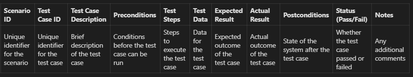
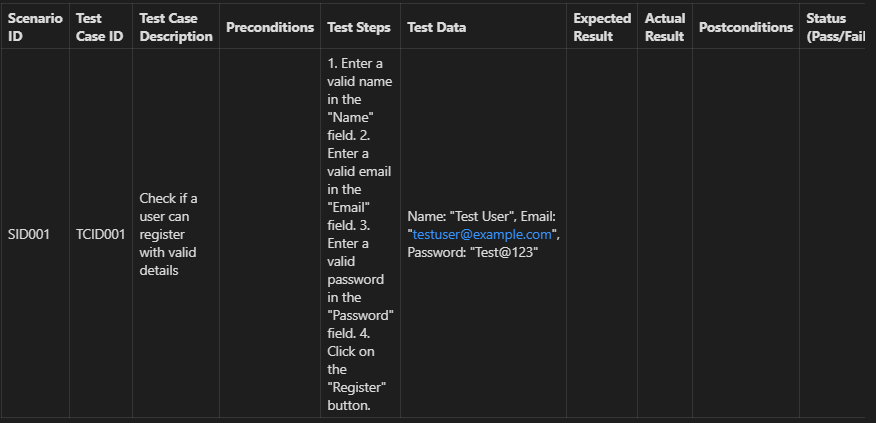
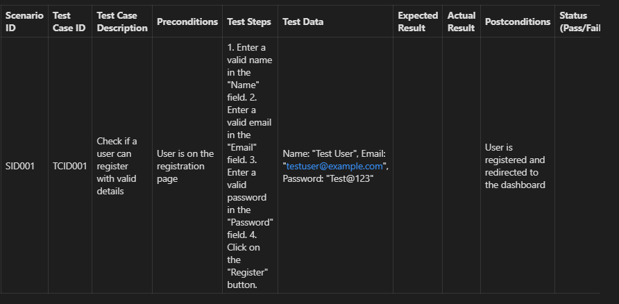

- [Test Design Techniques](#test-design-techniques)
  - [Understanding Test Cases](#understanding-test-cases)
  - [Test Case Design Process](#test-case-design-process)
  - [Test Case Design Strategies](#test-case-design-strategies)
  - [Testware](#testware)
  - [Test Case Management](#test-case-management)

# Test Design Techniques

## Understanding Test Cases

**Explanation:**

Testavimo scenarijai - tai sąlygų arba kintamųjų, pagal kuriuos testuotojas nustato, ar testuojama sistema atitinka reikalavimus arba ar ji veikia teisingai, rinkinys. Testavimo atvejų kūrimo procesas taip pat gali padėti rasti problemų, susijusių su reikalavimais ar programos dizainu, kurias galima ištaisyti prieš kodavimą ar įgyvendinimą.

**Key Concepts:**

1. **Scenarijaus ID:** Unikalus scenarijaus, kuriam priklauso šis bandymo atvejis, identifikatorius.
2. **Testavimo atvejo ID:** Unikalus kiekvieno testavimo atvejo identifikatorius.
3. **Testavimo atvejo aprašymas:** Trumpai apie tai, kas yra testavimo atvejis.
4. **Preconditions:** Sąlygos, kurios turi būti įvykdytos, kad testavimo atvejis būtų paleistas.
5. **Testavimo žingsniai:** Išsamūs veiksmai, kurių reikia imtis norint įvykdyti testavimo atvejį.
6. **Testavimo duomenys:** Duomenys, kuriuos reikia įvesti į sistemą vykdant testavimo atvejį.
7. **Tikėtinas rezultatas:** Tikėtinas testavimo atvejo rezultatas.
8. ** Realus rezultatas: Faktinis testavimo atvejo rezultatas, užpildytas po testavimo atvejo vykdymo.
9. **Postsąlygos:** Sistemos būsena po testo atvejo įvykdymo.
10. **Statutas (įveiktas/neįveiktas):** ar testo atvejis buvo įveiktas, ar neįveiktas.
11. **Pastabos:** Bet kokios papildomos pastabos apie bandymo atvejį.

## Test Case Design Process

**Explanation:**

Testavimo atvejo projektavimo procesas - tai sisteminis požiūris į sąlygų arba kintamųjų rinkinio, pagal kurį testuotojas nustatys, ar testuojama sistema atitinka reikalavimus arba veikia teisingai, kūrimą. Procesas apima į scenarijų orientuotą požiūrį, kuriame daugiausia dėmesio skiriama realiems naudojimo atvejams ir naudotojų keliams.

**Key Concepts:**

1. **Testavimo reikalavimų nustatymas:** Tai pirmas žingsnis, kurio metu nustatote, ką reikia testuoti. Tai gali būti pagrįsta programinės įrangos reikalavimais, naudotojų istorijomis, naudojimo atvejais ar bet kokios kitos formos programinės įrangos dokumentais.

2. **Nustatykite testavimo scenarijus:** Nustatykite scenarijus, pagal kuriuos sistema bus naudojama. Šie scenarijai turėtų būti pagrįsti realiais naudojimo atvejais ir apimti visas pagrindines sistemos funkcijas.

3. **Nustatykite testavimo atvejį:** Kiekvienam scenarijui nustatykite testavimo atvejų rinkinį, apimantį visus galimus kelius, kuriais gali eiti naudotojas. Apibrėžkite kiekvieno testavimo atvejo tikslą, ką jis turėtų pasiekti ir kokią funkciją ar sistemos dalį jis apima.

4. **Projektuokite testavimo veiksmus:** Išsamiai aprašykite veiksmus, kuriuos reikia atlikti norint atlikti kiekvieną testavimo atvejį. Jie turėtų būti aiškūs ir glausti, nepaliekant vietos dviprasmybėms.

5. **Nustatykite testavimo duomenis:** Nustatykite testavimui naudotinus duomenis.Tai gali būti sistemos įvesties duomenys arba duomenys, kuriuos sistema naudoja tam tikroms operacijoms atlikti.

6. **Nustatykite išankstines ir paskesnes sąlygas:** Nurodykite sistemos būseną prieš ir po kiekvieno testavimo atvejo įvykdymo.Tai padeda užtikrinti, kad sistema būtų teisingai parengta bandymui ir kad bandymas turėtų laukiamą poveikį sistemai.

7. **Nustatykite laukiamus rezultatus:** Apibrėžkite, koks yra laukiamas kiekvieno testavimo atvejo rezultatas.Būtent su juo lyginsite faktinius rezultatus, kad nustatytumėte, ar testavimo atvejis buvo sėkmingas, ar ne.

8. **Peržiūrėkite ir patvirtinkite testavimo atvejį:** Paveskite kolegoms ar suinteresuotosioms šalims peržiūrėti testavimo atvejus, kad jie būtų tikslūs ir išsamūs.Patvirtinus testavimo atvejus, juos galima vykdyti.

9. **Įvykdyti testavimo atvejį ir užregistruoti rezultatus:** Įvykdykite testavimo atvejus, užregistruokite rezultatus ir palyginkite juos su laukiamais rezultatais.

| Scenario ID | Test Case ID | Test Case Description | Preconditions | Test Steps | Test Data | Expected Result | Actual Result | Postconditions | Status | Notes |
|-------------|--------------|-----------------------|---------------|------------|-----------|-----------------|---------------|----------------|--------|-------|
| SID001      | TCID001      | Check if a user can register with valid details | User is on the registration page | 1. Enter a valid name in the "Name" field. 2. Enter a valid email in the "Email" field. 3. Enter a valid password in the "Password" field. 4. Click on the "Register" button. | Name: "Test User", Email: "testuser@example.com", Password: "Test@123" | User is successfully registered and redirected to the dashboard | User is successfully registered and redirected to the dashboard | User is registered and redirected to the dashboard | Pass |  |

*Statutas:*

  1. **Pass:** Testo atvejis išlaikytas, t. y. faktinis rezultatas sutampa su laukiamu rezultatu.

  2. **Nepavykęs:** Bandymo atvejis nepavyko, t. y. faktinis rezultatas neatitiko laukiamo rezultato.

  3. **Blocked:** Bandymo atvejis negalėjo būti įvykdytas, nes nepavyko atlikti būtino bandymo atvejo arba nebuvo atliktas sąrankos veiksmas.

  4. **Neįvykdytas:** Testo atvejis dar nebuvo įvykdytas.

  5. **Vykdoma:** Testo atvejis šiuo metu vykdomas.

10. **Prireikus atnaujinkite testavimo atvejį:** Jei sistema pasikeičia arba jei testavimo atvejis netiksliai išbandė sistemą, prireikus atnaujinkite testavimo atvejį.

## Testware

**Explanation:**

Testavimo programinė įranga - tai testavimo proceso metu sukurti artefaktai, reikalingi testams planuoti, kurti ir vykdyti, pavyzdžiui, dokumentacija, scenarijai, įvesties duomenys, laukiami rezultatai, įdiegimo ir šalinimo procedūros, failai, duomenų bazės, aplinka ir bet kokia papildoma programinė įranga ar įrankiai, naudojami testuojant.

**Key Concepts:**

1. **Testavimo dokumentacija:** Tai apima testavimo planus, testavimo projektus, testavimo atvejus ir testavimo procedūras.

2. **Testų scenarijai:** Tai automatinės instrukcijos, kurias vykdys automatinio testavimo įrankiai.

3. **Testavimo duomenys:** Tai duomenys, kurie bus naudojami sistemai testuoti. Jie gali būti įvedami tiesiogiai į sistemą arba naudojami testavimo scenarijuose.

4. **Tikėtini rezultatai:** Tai rezultatai, kuriuos tikimasi pamatyti atlikus testą.

5. **Testavimo aplinka:** Tai apima aparatinę ir programinę aplinką, kurioje bus atliekami testai, ir bet kokią kitą programinę įrangą ar priemones, kurios bus naudojamos testams atlikti.

6. **Testavimo priemonės:** Tai papildoma programinė įranga ar priemonės, naudojamos testams nustatyti, vykdyti ar jų rezultatams patikrinti.

## Test Case Management

**Explanation:**

Testavimo atvejų valdymas. Jis padeda organizuoti, dokumentuoti ir atlikti testavimus, suteikdamas įrankius, skirtus testavimo atvejams rašyti ir tvarkyti struktūrizuotu formatu.

**Key Concepts:**

1. **Testavimo atvejų saugykla:** Centralizuota vieta, kurioje saugomi ir tvarkomi visi testavimo scenarijai. Ji padeda palaikyti testavimo atvejų nuoseklumą ir pakartotinį panaudojimą.

2. **Testų vykdymo stebėjimas:** Stebėti, kurie testų atvejai buvo įvykdyti, jų rezultatus ir rastas klaidas ar problemas.

3. **Testų aprėptis:** užtikrinama, kad būtų išbandytos visos programos dalys. Tai padeda nustatyti sritis, kurios nebuvo išbandytos.

4. **Testavimo atvejų versijų nustatymas:** Laikui bėgant sekti testavimo atvejų pakeitimus. Tai svarbu, kai keičiasi taikomoji programa ir reikia atnaujinti bandymų atvejus.

5. **Testavimo atvejų eiliškumo nustatymas:** Nustatymas, kokia tvarka turėtų būti vykdomi testavimo atvejai, remiantis tokiais veiksniais kaip rizika, funkcionalumo svarba ir kt.

6. **Ataskaitų teikimas ir metrika:** Įžvalgų apie testavimo procesą teikimas, pavyzdžiui, įvykdytų, išlaikytų, neįvykdytų testavimo atvejų skaičius.