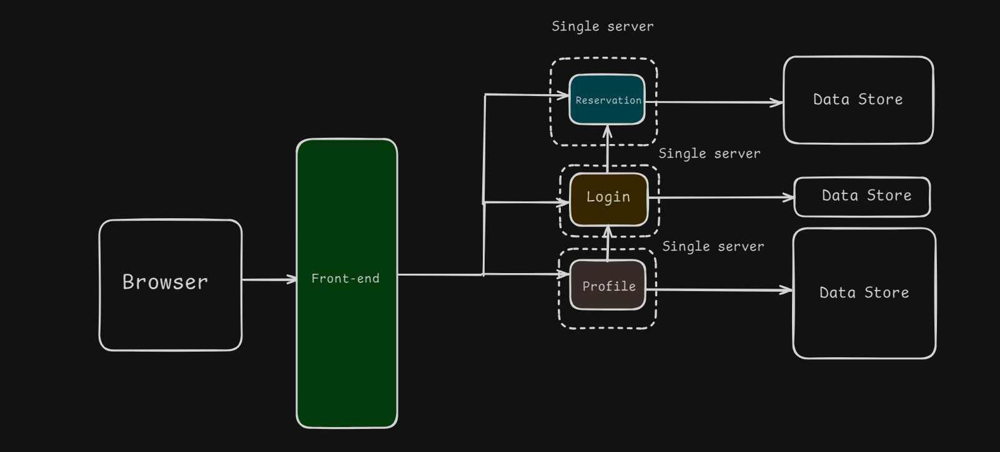

# Table of Contents

- [Monolithic Architecture](#monolithic-architecture)
- [Microservices Architecture](#microservices-architecture)

## Monolithic Architecture

**Explanation:**

Monolithic architecture is a traditional model for the design of a software program. In this architecture, all components of the software are interconnected and interdependent. This means that the application is a single unified unit.

**Key Concepts:**

- **Single Codebase:** The entire application is built and deployed as a single unit.

- **Tight Coupling:** All components are tightly coupled, meaning changes in one part of the system can affect the entire system.

- **Shared Memory:** Components often share the same memory space.

- **Simplicity:** Easier to develop and deploy initially, but can become complex as the application grows.

- **Performance:** Can be optimized for performance since all components are in a single process.

## Microservices Architecture

**Explanation:**

Microservices architecture is a design pattern where an application is composed of small, independent services that communicate over well-defined APIs. Each service is focused on a specific business function and can be developed, deployed, and scaled independently.

**Key Concepts:**

- **Decoupling:** Each microservice is independent, allowing for easier maintenance and updates.

- **Scalability:** Individual services can be scaled independently based on demand.

- **Resilience:** Failure in one service does not necessarily impact the entire system.

- **Technology Diversity:** Different services can use different technologies and programming languages.

- **Continuous Delivery:** Enables frequent and reliable delivery of large, complex applications.
