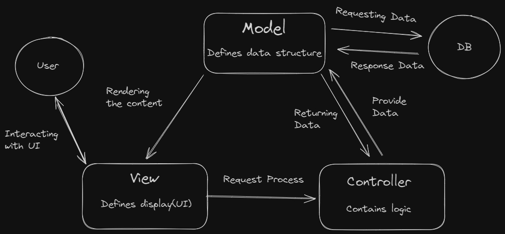

# Table of Contents

- [Model-View-Controller (MVC) design pattern](#model-view-controller-mvc-design-pattern)

## Model-View-Controller (MVC) design pattern

**Explanation:**

Model-View-Controller (MVC) is a software architectural pattern that separates an application into three main logical components: the Model, the View, and the Controller. Each of these components is built to handle specific development aspects of an application.

**Key Concepts:**

- **Model:** The model represents the data and the business logic of the application. It directly manages the data, logic, and rules of the application. For example, in a shopping list app, the model would handle the data related to the items in the list, such as adding, removing, or updating items.

- **View:** The view defines how the app's data should be displayed. As a example would be shopping list app, the view would define how the list is presented to the user, and receive the data to display from the model.

- **Controller:** The controller acts as an intermediary between the model and the view. It listens to the input from the view, processes it (possibly updating the model), and returns the output display to the view. For example, in a shopping list app, the controller would handle user actions like adding an item to the list, updating the model with the new item, and then updating the view to display the new item.
