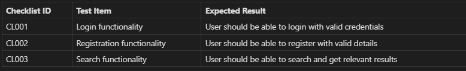

# Content of Table

- [Dynamic Techniques](#dynamic-techniques)
  - [Collaboration-based Test Approaches](#collaboration-based-test-approaches)
    - [User Acceptance Testing (UAT)](#user-acceptance-testing-uat)
    - [Collaborative User Story Writing](#collaborative-user-story-writing)
    - [Alpha and Beta Testing](#alpha-and-beta-testing)
  - [Black-box Testing Techniques](#black-box-testing-techniques)
    - [Equivalence Partitioning](#equivalence-partitioning)
    - [Boundary Value Analysis](#boundary-value-analysis)
    - [Decision Table Testing](#decision-table-testing)
    - [State Transition Testing](#state-transition-testing)
  - [Experience-based Techniques](#experience-based-techniques)
    - [Error Guessing](#error-guessing)
    - [Exploratory Testing](#exploratory-testing)
    - [Checklist-Based Testing](#checklist-based-testing)
    - [Smoke and Sanity Testing](#smoke-and-sanity-testing)
  - [Confirmation Testing](#confirmation-testing)
    - [Regression Testing](#regression-testing)

## Dynamic Techniques

**Explanation:**

Dynamic techniques are methods used in software development that involve the execution of the software. These techniques are used to validate the functional behavior of software, to ensure it is working as expected. They are often used in conjunction with static techniques, which are used without executing the software.

**Key Concepts:**

1. **Collaboration-based Test Approaches:** These approaches involve the team working together to write user stories, perform user acceptance testing, and conduct alpha and beta testing.

2. **Black-box Testing Techniques:** These techniques, such as equivalence partitioning, boundary value analysis, and decision table testing, focus on the functionality of the software without considering its internal structure.

3. **Experience-based Techniques:** These techniques, including error guessing, exploratory testing, and checklist-based testing, rely on the tester's experience and knowledge.

4. **White-box Testing Techniques:** These techniques, such as statement testing and coverage, decision testing and coverage, and path testing, focus on the internal structure of the software.

5. **Confirmation Testing:** This includes re-testing and regression testing to ensure
that defects have been corrected and that modifications have not introduced new issues.

## Collaboration-based Test Approaches

**Explanation:**

Collaboration-based test approaches involve the collective participation of various stakeholders in the testing process.

**Key Concepts:**

1. **User Acceptance Testing (UAT):** This is the final phase in the testing process before the software is released for use. The aim is to validate the software against business requirements.

2. **Collaborative User Story Writing:** This involves the team working together to write user stories, which are descriptions of a software feature from an end-user perspective.

3. **Alpha and Beta Testing:** Alpha testing is performed by internal staff before the software is released to external testers (beta testers).

4. **Operational acceptance testing:** This is performed to ensure that the system meets the requirements for operation and maintenance.

5. **Contractual and regulatory acceptance testing:** This is performed to ensure that the system meets the requirements specified in the contract and any applicable regulations.

### Collaborative User Story Writing

**Explanation:**

Collaborative User Story Writing involves the team working together to write user stories, which are descriptions of a software feature from an end-user perspective.

**Key Concepts:**

1. **Collaboration:** The process involves all relevant stakeholders, including developers, testers, business analysts, and users.

2. **End-user Perspective:** User stories are written from the perspective of the end user, focusing on their needs and experiences.

3. **Acceptance Criteria:** Each user story includes acceptance criteria, which define the boundaries of a user story and are used to confirm when a story is completed and working as intended.

4. **Iteration Planning:** User stories are often used in agile development methodologies during iteration planning or sprint planning meetings.

5. **User Stories:** A User Story is written from the perspective of a user who wants to derive value from the product. It should focus on the user's desired outcomes and be embedded in the context where the user seeks value from the product.

**Syntax:**

A user story is typically written in the format: **"As a [type of user], I want [an action] so that [benefit/a value]"**.

```text
WHO: As a [user type]
WHAT: I want [action to perform]
WHY: So that [the desired outcome]
```

**Example:**

*User Story 1:*

```text
User Story:

"As a Online Shopper, I want to read reviews of a product before making the decision so that I can reduce the uncertainty."
```

*User Story 2:*

```text
User Story:

As a User,

I want to drag and drop tasks within a list

So that I can reorder them quicly and easily
```

### User Acceptance Testing (UAT)

**Explanation:**

User Acceptance Testing (UAT) is the final phase in the testing process before the software is released for use. The aim of UAT is to validate the software against business requirements. It is typically conducted by the end-users or clients of the software to ensure that the system meets their needs and is ready for use in real-world scenarios.

**Key Concepts:**

1. **Real-world Scenarios:** UAT involves testing the software under real-world scenarios to ensure it can handle tasks it was designed for.

2. **End-user Involvement:** The testing is typically conducted by the end-users or clients, not by the developers or testers.

3. **Business Requirements:** The focus of UAT is to validate that the software meets the business requirements and not just the technical specifications.

4. **Final Phase:** UAT is usually the last phase of testing, conducted after unit, integration, and system testing.

5. **Acceptance Criteria:** The software is tested against predefined acceptance criteria to determine if it is ready for delivery. These criteria are essential for ensuring the software meets the end users' needs and requirements. There are two common formats for writing acceptance criteria: the Given-When-Then (Behavior-Driven Development - BDD) format and the Checklist format.

  **Given-When-Then (BDD) Format Example:**

  1. Given some initial context (the state of the system),
  2. When an event occurs (an action is carried out),
  3. Then ensure some outcomes.

  ```text
  Acceptance Criteria:

  - Given I have a product in my shopping cart,
    When I click on 'Checkout' and complete the payment process,
    Then I should receive an order confirmation.
  ```

  **Checklist Format Example:**

  ```text
  Acceptance Criteria:

  -  Navigate from the homepage to the registration page.
  -  View a form on the registration page requesting name, email address, and password.
  ```

### Alpha and Beta Testing

**Explanation:**

Alpha and Beta Testing are stages of software testing that are conducted to ensure the quality of the product before it is released to the end-users. Alpha testing is performed internally within the organization by a specialized testing team. Beta testing, on the other hand, is performed by a limited number of end-users who are not part of the organization.

**Key Concepts:**

1. **Alpha Testing:** This is the first phase of testing where the software is tested internally within the organization. It is typically performed by a specialized testing team.

2. **Beta Testing:** This is the second phase of testing where the software is released to a limited number of end-users to gather feedback and identify any potential issues that were not found during alpha testing.

3. **Feedback Loop:** Both alpha and beta testing provide valuable feedback that can be used to improve the quality of the software.

## Black-box Testing Techniques

**Explanation:**

Black-box testing techniques focus on the functionality of the software without considering its internal structure. The tester is unaware of the internal workings of the system and tests the software based on the input and the output.

**Key Concepts:**

1. **Equivalence Partitioning:** This is a software testing technique that divides the input data of a software unit into partitions of equivalent data from which test cases can be derived.

2. **Boundary Value Analysis:** This is a method for designing test cases that focuses on the boundary or edge conditions of the software.

3. **Decision Table Testing:** This is a good way to deal with a combination of inputs, which produce different results.

4. **State Transition Testing:** This is used where some aspect of the system can be described in what is called a "finite state machine".

### Equivalence Partitioning

**Explanation:**

Equivalence Partitioning is a software testing technique that divides the input data of a software unit into partitions of equivalent data from which test cases can be derived.

1. **Input Validation:**

- **Scenario:** Validating user input in registration forms, login forms, or any data entry forms.
- **Example:** Ensuring that a username is between 5 to 10 characters, a password meets complexity requirements, and an age is within a valid range.

**Key Concepts:**

- **Partitioning:** Dividing input data into different **Equivalence Classes**. Each equivalence class represents a set of input values that are treated the same by the software, meaning that one test case can be used to test the entire class.
- **Representative Values:** Selecting representative values from each partition for testing.
- **Reduction of Test Cases:** Minimize the number of test cases by selecting representative values from each equivalence partition, ensuring comprehensive coverage with fewer tests. This approach eliminates the need for detailed step-by-step scenarios, as each equivalence class effectively acts as a scenario. Additionally, it removes the necessity for detailed steps to reproduce.
- **In some scenarios:** Traditional test case tables might still be necessary, especially when preparing for automation testing that involves navigating through multiple pages or completing specific actions. While Equivalence Partitioning can handle input-based scenarios efficiently, when automating workflows that require multiple steps, such as navigating through pages, clicking buttons, or following a sequence of actions, detailed steps to reproduce are necessary.

**Example 1 Equivalence Class, Test Input, Expected Outcome:**

| Test Case ID    | Equivalence Class      | Test Input  | Expected Outcome                       |
|-----------------|------------------------|-------------|----------------------------------------|
| TCID-001        | Age less than 13       | 10          | Registration rejected, error message   |
| TCID-002        | Age between 13 and 100 | 30          | Registration accepted                  |
| TCID-003        | Age greater than 100   | 110         | Registration rejected, error message   |

**Example 2 Equivalence Class Description, Valid/Invalid, Expected Outcome:**

| Test Case ID    | Equivalence Class Description            | Valid/Invalid | Expected Outcome                       |
|-----------------|------------------------------------------|---------------|----------------------------------------|
| TCID-001        | String length between 5 to 10 characters | Valid         | Username accepted                      |
| TCID-002        | String length less than 5 characters     | Invalid       | Username rejected, error message       |
| TCID-003        | String length more than 10 characters    | Invalid       | Username rejected, error message       |
| TCID-004        | Starts with a letter                     | Valid         | Username accepted                      |
| TCID-005        | Does not start with a letter             | Invalid       | Username rejected, error message       |
| TCID-006        | Non-string input                         | Invalid       | Username rejected, error message       |

**Example 3 Input Parameter, Equivalence Class Description, Valid/Invalid, Example Value, Expected Outcome:**

| Test Case ID    | Input Parameter | Equivalence Class Description            | Valid/Invalid | Example Value   | Expected Outcome                       |
|-----------------|-----------------|------------------------------------------|---------------|-----------------|----------------------------------------|
| TCID-001        | Password        | Contains at least one number             | Valid         | "Passw0rd"      | Password accepted                      |
| TCID-002        | Password        | Does not contain any number              | Invalid       | "Password"      | Password rejected, error message       |
| TCID-003        | Password        | Contains at least one uppercase letter   | Valid         | "Passw0rd"      | Password accepted                      |
| TCID-004        | Password        | Does not contain any uppercase letter    | Invalid       | "password1"     | Password rejected, error message       |
| TCID-005        | Password        | Contains at least one lowercase letter   | Valid         | "Passw0rd"      | Password accepted                      |
| TCID-006        | Password        | Does not contain any lowercase letter    | Invalid       | "PASSWORD1"     | Password rejected, error message       |
| TCID-007        | Password        | String length at least 8 characters      | Valid         | "Passw0rd"      | Password accepted                      |
| TCID-008        | Password        | String length less than 8 characters     | Invalid       | "Pass1"         | Password rejected, error message       |
| TCID-009        | Password        | Non-string input                         | Invalid       | 12345678        | Password rejected, error message       |

### Boundary Value Analysis

**Explanation:**

Boundary Value Analysis (BVA) is a software testing technique focused on identifying errors that occur at the boundaries of input domains rather than those in the middle. Since many defects often manifest at the edges of input ranges, BVA emphasizes testing values at and around these boundaries to ensure robust system behavior.

1. **Input Range Validation:**

- **Scenario:** Validating numerical input ranges in forms, configuration settings, or any system that requires numerical limits.
- **Example:** Ensuring that an age is between 18 and 60, a temperature setting is between 15°C and 30°C, and a file upload size is between 1MB and 10MB.

2. **Date Range Validation:**

- **Scenario:** Validating date ranges in booking systems, scheduling applications, or any system that requires date inputs.
- **Example:** Ensuring that a booking date is within the allowed range, a subscription start and end date are valid, and a project deadline is within the acceptable timeframe.

3. **Financial Transactions:**

- **Scenario:** Validating system that handles financial transactions.
- **Example:** Ensuring that a transaction amount is within the allowed limits, a discount percentage is within the valid range, and a loan amount is between the minimum and maximum allowed values.

**Key Concepts:**

- **Boundary Values:** Many errors tend to occur at the edges of input ranges.

- **Edge Values:** Edge values refer to inputs just inside and just outside the boundary values.

- **Valid and Invalid Partitions:** The input domain is divided into partitions of valid and invalid inputs. Testing is performed on both.
  - **Valid Partition:** Contains input values that are within the acceptable range of the system.
  - **Invalid Partition:** Contains input values that fall outside the acceptable range.

- **2-Value BVA (Two-Point Boundary Value Analysis):** In 2-value BVA, testing focuses on the exact boundary points. Each boundary is tested with two values: one at the lower boundary and one at the upper boundary. This approach provides basic coverage by verifying that the system correctly handles the minimum and maximum allowable inputs.


- **3-Value BVA (Three-Point Boundary Value Analysis):** In 3-value BVA, testing extends to include values just below, exactly at, and just above each boundary. Each boundary is tested with three values, ensuring that edge cases are handled properly and off-by-one errors are caught.


- **Testing Strategy:** Select inputs from valid and invalid partitions, focusing on:
  - **2-Value BVA:** Testing at the exact lower and upper boundaries.
  - **3-Value BVA:** Testing just below, exactly at, and just above each boundary for thorough coverage.

- **Reduced Number of Test Cases:** By focusing on boundary values, the number of test cases is reduced compared to traditional methods, making it easier to maintain.

- **Scenario Column:** While a "Scenario" column can provide additional context and make the test cases more understandable, it is not strictly necessary for BVA. The primary focus of BVA is on testing the boundaries of input ranges. Including a "Scenario" column can help testers and stakeholders understand the purpose of each test case more clearly, but it can be omitted if the table is already clear and understandable.

  **Example 1: Age Validation**

  | Test Case ID  | Boundary Type             | Value Description         | Value | Valid/Invalid | Scenario                          |
  |---------------|---------------------------|---------------------------|-------|---------------|-----------------------------------|
  | TC001         | Lower Boundary            | Exact lower boundary      | 18    | Valid         | Minimum age for registration      |
  | TC002         | Upper Boundary            | Exact upper boundary      | 60    | Valid         | Maximum age for registration      |
  | TC003         | Just Below Lower Boundary | Just below lower boundary | 17    | Invalid       | Below minimum age                 |
  | TC004         | Just Above Lower Boundary | Just above lower boundary | 19    | Valid         | Just above minimum age            |
  | TC005         | Just Below Upper Boundary | Just below upper boundary | 59    | Valid         | Just below maximum age            |
  | TC006         | Just Above Upper Boundary | Just above upper boundary | 61    | Invalid       | Above maximum age                 |

### Decision Table Testing

**Explanation:**

Decision Table Testing is a software testing technique used to test system behavior based on different combinations of inputs and their corresponding outputs.

1. **Multiple criteria:**

- **Scenario:** Validating system behavior based on various input conditions and their combinations.
- **Example:** Ensuring that a system correctly processes user input based on different combinations of conditions such as user role, authentication status, and resource access level.

**Key Concepts:**

- **Notation:** refers to the symbols and conventions used to represent conditions and actions
  - **domain-specific notation:** refers to the use of terms and symbols that are specific to a particular domain or industry.
  - **Boolean Notation:** Boolean notation uses binary values (True/False or T/F) to represent conditions and actions. This type of notation is straightforward and commonly used in decision tables and logical expressions.
- **Conditions:** The different input variables or conditions that affect the system's behavior.
  - **T:** True, the condition is satisfied.
  - **F:** False, the condition is not satisfied.
  - **–:** Value of the condition is irrelevant for the action outcome. This means that regardless of whether the condition is true or false, it does not affect the resulting action.
  - **N/A:** Not applicable, the condition is not relevant or cannot be applied in the context of the given rule.
- **Actions:** The possible outcomes or actions that result from the combinations of conditions.
  - **X:** The action should occur.
  - **Blank:** The action should not occur.
- **Decision Table:** A tabular representation that maps conditions to actions, showing all possible combinations of inputs and their corresponding outputs.

| Test Case ID | Condition 1 | Condition 2 | Condition 3 | Action 1 | Action 2 |
|--------------|-------------|-------------|-------------|----------|----------|
| TC001        | T           | F           | T           | X        |          |
| TC002        | F           | T           | F           |          | X        |
| TC003        | –           | T           | F           | X        |          |
| TC004        | T           | –           | T           |          | X        |
| TC005        | N/A         | F           | T           |          |          |
| TC006        | T           | T           | F           | X        |          |

**Example 1 Loan Approval System:**

| Test Case ID | Credit Score | Income Level | Employment Status | Loan Amount | Expected Result |
|--------------|--------------|--------------|-------------------|-------------|-----------------|
| TC001        | High         | High         | Employed          | Low         | Loan Approved   |
| TC002        | Low          | High         | Employed          | Low         | Loan Denied     |
| TC003        | High         | Low          | Employed          | High        | Loan Denied     |
| TC004        | High         | High         | Unemployed        | Low         | Loan Denied     |
| TC005        | High         | High         | Employed          | High        | Loan Approved   |
| TC006        | Low          | Low          | Unemployed        | High        | Loan Denied     |

**Example 2 N/A:**

| Test Case ID | Condition 1 (User Authenticated) | Condition 2 (Admin Privileges) | Condition 3 (Resource Available) | Action 1 (Grant Access) | Action 2 (Deny Access) |
|--------------|----------------------------------|--------------------------------|----------------------------------|-------------------------|------------------------|
| TC001        | T                                | F                              | T                                | X                       |                        |
| TC002        | F                                | T                              | F                                |                         | X                      |
| TC003        | –                                | T                              | F                                | X                       |                        |
| TC004        | T                                | –                              | T                                |                         | X                      |
| TC005        | N/A                              | F                              | T                                |                         |                        |
| TC006        | T                                | T                              | F                                | X                       |                        |

- In **TC005**, "N/A" for Condition 1 means that the user's authentication status does not matter for this particular test case. This could be used to test scenarios where the system's behavior is independent of whether the user is authenticated or not.

**Example 4 Payment Processing System:**

| Test Case ID | Condition 1 (Card Valid) | Condition 2 (Sufficient Funds) | Condition 3 (Payment Gateway Available) | Action 1 (Process Payment) | Action 2 (Show Error) |
|--------------|--------------------------|--------------------------------|-----------------------------------------|----------------------------|-----------------------|
| TC001        | T                        | T                              | T                                       | X                          |                       |
| TC002        | F                        | T                              | T                                       |                            | X                     |
| TC003        | T                        | F                              | T                                       |                            | X                     |
| TC004        | T                        | T                              | F                                       |                            | X                     |
| TC005        | F                        | F                              | T                                       |                            | X                     |
| TC006        | T                        | F                              | F                                       |                            | X                     |

### State Transition Testing

**Explanation:**

State Transition Testing is a software testing technique used to test the behavior of an application under test (AUT) for different input conditions in a sequence. It is particularly useful for systems where the system's current state is dependent on a sequence of past events or inputs.

- **Different input conditions in a sequence**

  - **Scenario:** Testing an online booking system for flight reservations.
  - **Example:** System correctly processes a sequence of inputs such as selecting a departure city, selecting a destination city, choosing travel dates, selecting a flight, and entering passenger details.

- **Interactive Applications:**

  - **Scenario:** Testing a role-playing game (RPG) where the player's state changes based on actions such as moving, attacking, or using items.
  - **Example:** Move command transitions the player from "Idle" to "Moving."

- **Interacting with External Applications in Web Workflows:**

  - **Scenario:** Testing an integrated workflow in a stateful web application that requires interaction with multiple external programs.
  - **Example:** Project management web application correctly handles a sequence of user actions that involve opening and interacting with external programs.

- **Protocol Testing:**

  - **Scenario:** Testing a network communication protocol for a client-server application.
  - **Example:** Client and server correctly handle a sequence of messages such as connection requests, data transfers, file download requests, and disconnections.

- **Embedded Systems:**

  - **Scenario:** Testing the state transitions of thermostat system.
  - **Example:** Ensuring that the smart thermostat correctly handles a sequence of inputs such as setting the desired temperature, detecting the current temperature, turning the heating or cooling system on or off, and entering energy-saving mode.

**Key Concepts:**

- **State:** Describe what the system is doing or what condition of the system under different inputs."

  - **Initial and Final State:** The state in which the system starts is known as the initial state, and the state where it ends is known as the final state.
    - **Initial Idle:** The thermostat starts in the "Idle" state, where it is not actively heating or cooling.
    - **Final Idle:** The thermostat returns to the "Idle" state after completing its heating or cooling cycle, or after resolving an error.

  ```text
  States:

  Idle: The thermostat is not actively heating or cooling.

  Heating: The thermostat is actively heating to reach the desired temperature.

  Cooling: The thermostat is actively cooling to reach the desired temperature.

  Energy-Saving: The thermostat is in an energy-saving mode, maintaining a less aggressive temperature range.

  Error: The thermostat has encountered an error, such as a sensor failure.
  ```

- **Events:** An event is an occurrence that may trigger a state condition.

  - **Event Dependencies:** Events are often dependent on the current state of the system and can include user actions, system conditions, or external inputs.

  ```text
  Events:

  Set Heating: The user sets the thermostat to heating mode.

  Set Cooling: The user sets the thermostat to cooling mode.

  Set Energy-Saving: The user sets the thermostat to energy-saving mode.

  Temperature Reached: The desired temperature is reached.

  Error Detected: An error is detected in the system.

  Reset: The system is reset after an error.
  ```

- **Actions:** Operations that occur as a result of a state transition. They define what the system does when it moves from one state to another based on an event.

  ```text
  Actions:

  Start Heating: Begin heating to reach the desired temperature.

  Start Cooling: Begin cooling to reach the desired temperature.

  Enter Energy-Saving Mode: Adjust settings to maintain an energy-efficient temperature range.

  Stop Heating/Cooling: Stop the heating or cooling process.

  Display Error: Show an error message or indicator.

  Clear Error: Clear the error state and return to idle.
  ```

- **Transition:** The change from one state to another state of the system.

  - **Triggering Events:** triggered by events and often involve actions that the system performs as it moves from one state to another.

  - **Scenario:** Each transition can be considered a scenario that describes how the system moves from one state to another based on specific events and actions.

- **State Diagram:** A graphical representation of all possible states, transitions, and events of the system.

  - **Non-Sequential Transitions:** State transitions do not necessarily follow a linear or sequential path. Instead, they represent how a system moves from one state to another based on specific events.

  ```text
  [Idle] --(Set Heating)--> [Heating]
  [Idle] --(Set Cooling)--> [Cooling]
  [Idle] --(Set Energy-Saving)--> [Energy-Saving]

  [Heating] --(Temperature Reached)--> [Idle]
  [Heating] --(Error Detected)--> [Error]

  [Cooling] --(Temperature Reached)--> [Idle]
  [Cooling] --(Error Detected)--> [Error]

  [Energy-Saving] --(Set Heating)--> [Heating]
  [Energy-Saving] --(Set Cooling)--> [Cooling]
  [Energy-Saving] --(Error Detected)--> [Error]

  [Error] --(Reset)--> [Idle]
  ```

  - **Sequential Transitions:** In some cases, it is important to represent sequential transitions, where the system must follow a specific order of states. Sequential transitions are needed when the system's behavior depends on a strict sequence of events.

  ```text
  [Idle] --(Set Heating)--> [Heating]
  [Heating] --(Temperature Reached)--> [Idle]
  [Idle] --(Set Cooling)--> [Cooling]
  [Cooling] --(Temperature Reached)--> [Idle]
  ```

- **State Table:** A tabular representation of all possible states, transitions, and events, similar to the state diagram but in a tabular form.

| Test Case ID | Current State   | Event              | Next State      | Action                  |
|--------------|-----------------|--------------------|-----------------|-------------------------|
| TC001        | Idle            | Set Heating        | Heating         | Start Heating           |
| TC002        | Idle            | Set Cooling        | Cooling         | Start Cooling           |
| TC003        | Idle            | Set Energy-Saving  | Energy-Saving   | Enter Energy-Saving Mode|
| TC004        | Heating         | Temperature Reached| Idle            | Stop Heating            |
| TC005        | Cooling         | Temperature Reached| Idle            | Stop Cooling            |
| TC006        | Energy-Saving   | Set Heating        | Heating         | Start Heating           |
| TC007        | Energy-Saving   | Set Cooling        | Cooling         | Start Cooling           |
| TC008        | Heating         | Error Detected     | Error           | Display Error           |
| TC009        | Cooling         | Error Detected     | Error           | Display Error           |
| TC010        | Energy-Saving   | Error Detected     | Error           | Display Error           |
| TC011        | Error           | Reset              | Idle            | Clear Error             |
| TC012        | Idle            | Set Heating        | Heating         | Start Heating           |
| TC013        | Heating         | Temperature Reached| Idle            | Stop Heating            |
| TC014        | Idle            | Set Cooling        | Cooling         | Start Cooling           |
| TC015        | Cooling         | Temperature Reached| Idle            | Stop Cooling            |

- **Coverage:**

  - **All states coverage:** Ensuring that every state in the system is tested at least once.
  - **Valid transitions coverage:** Ensuring that all valid transitions between states are tested.
  - **All transitions coverage:** Ensuring that every possible transition, including invalid ones, is tested to verify the system's behavior.

**Example role-playing game (RPG):**

  *States:*

  ```text
  Idle: The player is standing still and not performing any actions.
  Moving: The player is moving from one location to another.
  Attacking: The player is engaged in combat, attacking an enemy.
  Defending: The player is defending against an enemy attack.
  Using Item: The player is using an item from their inventory.
  Dead: The player has been defeated and is no longer active
  ```

  *Events:*

  ```text
  Move Command: The player issues a command to move.
  Attack Command: The player issues a command to attack.
  Defend Command: The player issues a command to defend.
  Use Item Command: The player issues a command to use an item.
  Receive Damage: The player receives damage from an enemy.
  Health Depleted: The player's health reaches zero.
  ```

  *Actions:*

  ```text
  Start Moving: The player begins moving.
  Start Attacking: The player begins attacking.
  Start Defending: The player begins defending.
  Use Item: The player uses an item.
  Take Damage: The player takes damage.
  Die: The player dies.
  ```

  *State Diagram:*

  ```text
  [Idle] --(Move Command)--> [Moving]
  [Idle] --(Attack Command)--> [Attacking]
  [Idle] --(Defend Command)--> [Defending]
  [Idle] --(Use Item Command)--> [Using Item]
  [Idle] --(Receive Damage)--> [Idle]
  [Idle] --(Health Depleted)--> [Dead]

  [Moving] --(Stop Command)--> [Idle]
  [Moving] --(Receive Damage)--> [Moving]
  [Moving] --(Health Depleted)--> [Dead]

  [Attacking] --(Stop Command)--> [Idle]
  [Attacking] --(Receive Damage)--> [Attacking]
  [Attacking] --(Health Depleted)--> [Dead]

  [Defending] --(Stop Command)--> [Idle]
  [Defending] --(Receive Damage)--> [Defending]
  [Defending] --(Health Depleted)--> [Dead]

  [Using Item] --(Item Used)--> [Idle]
  [Using Item] --(Receive Damage)--> [Using Item]
  [Using Item] --(Health Depleted)--> [Dead]

  [Dead] --(Revive Command)--> [Idle]

  [Idle] --(Attack Command)--> [Attacking]
  [Attacking] --(Receive Damage)--> [Defending]
  [Defending] --(Use Item Command)--> [Using Item]
  [Using Item] --(Attack Command)--> [Attacking]
  [Attacking] --(Health Depleted)--> [Dead]
  ```

  *State Transition Table:*

  | Test Case ID | Current State | Event              | Next State  | Action             |
  |--------------|---------------|--------------------|-------------|--------------------|
  | TC001        | Idle          | Move Command       | Moving      | Start Moving       |
  | TC002        | Idle          | Attack Command     | Attacking   | Start Attacking    |
  | TC003        | Idle          | Defend Command     | Defending   | Start Defending    |
  | TC004        | Idle          | Use Item Command   | Using Item  | Use Item           |
  | TC005        | Idle          | Receive Damage     | Idle        | Take Damage        |
  | TC006        | Idle          | Health Depleted    | Dead        | Die                |
  | TC007        | Moving        | Stop Command       | Idle        | Stop Moving        |
  | TC008        | Moving        | Receive Damage     | Moving      | Take Damage        |
  | TC009        | Moving        | Health Depleted    | Dead        | Die                |
  | TC010        | Attacking     | Stop Command       | Idle        | Stop Attacking     |
  | TC011        | Attacking     | Receive Damage     | Attacking   | Take Damage        |
  | TC012        | Attacking     | Health Depleted    | Dead        | Die                |
  | TC013        | Defending     | Stop Command       | Idle        | Stop Defending     |
  | TC014        | Defending     | Receive Damage     | Defending   | Take Damage        |
  | TC015        | Defending     | Health Depleted    | Dead        | Die                |
  | TC016        | Using Item    | Item Used          | Idle        | Finish Using Item  |
  | TC017        | Using Item    | Receive Damage     | Using Item  | Take Damage        |
  | TC018        | Using Item    | Health Depleted    | Dead        | Die                |
  | TC019        | Dead          | Revive Command     | Idle        | Revive             |
  | TC020        | Idle          | Attack Command     | Attacking   | Start Attacking    |
  | TC021        | Attacking     | Receive Damage     | Defending   | Start Defending    |
  | TC022        | Defending     | Use Item Command   | Using Item  | Use Item           |
  | TC023        | Using Item    | Attack Command     | Attacking   | Start Attacking    |
  | TC024        | Attacking     | Health Depleted    | Dead        | Die                |

## Experience-based Techniques

**Explanation:**

Experience-based techniques in software testing are those that leverage the tester's knowledge, skills, and background to design and execute tests. They are less formal and structured than specification-based or structure-based techniques.

### Error Guessing

**Explanation:**

Error Guessing is a software testing technique where the tester applies their experience and intuition to guess the problematic areas of the application. This technique is based on the tester's ability to find bugs or defects based on their past experiences and knowledge.

### Exploratory Testing

**Explanation:**

Exploratory Testing is a type of software testing where test design and test execution happen simultaneously without explicitly planning the detailed test cases in advance. The tester actively controls the design of the tests as they are performed and uses information gained while testing to design new and better tests.

**Key Concepts:**

1. **Charters:** A charter is a mission or goal for the exploratory testing session. It provides direction and scope for the testing activities, including the target of the test, the duration of the test session, the type of testing or the test ideas to be explored, and the expected outcome or output.

    

2. **Time-boxed Sessions:** Exploratory testing is often conducted in time-boxed sessions, typically ranging from 60 to 120 minutes.

### Checklist-Based Testing

**Explanation:**

Checklist-Based Testing is a software testing technique where the tester uses a checklist as a guide during the testing process. The checklist contains a set of important aspects or features of the application that need to be tested. This method ensures that the tester does not miss out on testing critical functionalities of the application.

**Key Concepts:**

1. **Checklist Creation:** The checklist is created based on the requirements and specifications of the application. It includes all the important features and functionalities that need to be tested.

    

2. **Guided Testing:** The checklist serves as a guide for the tester during the testing process. It helps to ensure that all necessary areas of the application are covered.

### Smoke and Sanity Testing

- **Smoke Testing:** This is a high-level type of testing done to ensure that the basic functions of a program work correctly. It is often done when a new build is released to test if the build is stable and it can be tested thoroughly later.

- **Sanity Testing:** This is a narrow regression testing that focuses on one or a few areas of functionality. Sanity testing is usually unscripted, helps to identify the dependent missing functionalities, and is used to determine if a section of the application is still working after a minor change.

- **Difference between Smoke and Sanity Testing:** Smoke testing is done to make sure software functionalities are working for a new build, while Sanity testing is done during the release phase to check for the main functionalities of the application without going deeper. Smoke testing is scripted or documented, whereas Sanity testing is usually unscripted.

## Confirmation Testing

**Explanation:**

Confirmation Testing, also known as re-testing, is a type of testing performed to confirm that a test case which previously failed has been corrected after the defects have been fixed. The purpose of confirmation testing is to verify that the original defect has been successfully removed; it is not to uncover new defects.

**Key Concepts:**

1. **Defect Fix Verification:** The main purpose of confirmation testing is to verify that the defects identified in earlier tests have been fixed.

2. **Regression Testing:** Alongside confirmation testing, regression testing is often performed to ensure that the defect fixes haven't introduced new issues elsewhere in the system.

### Regression Testing

**Explanation:**

Regression testing is a type of software testing that ensures that previously developed and tested software still performs the same way after it is changed or interfaced with other software. Changes may include software enhancements, patches, configuration changes. The purpose of regression testing is to ensure that code changes do not introduce new bugs or regressions.
