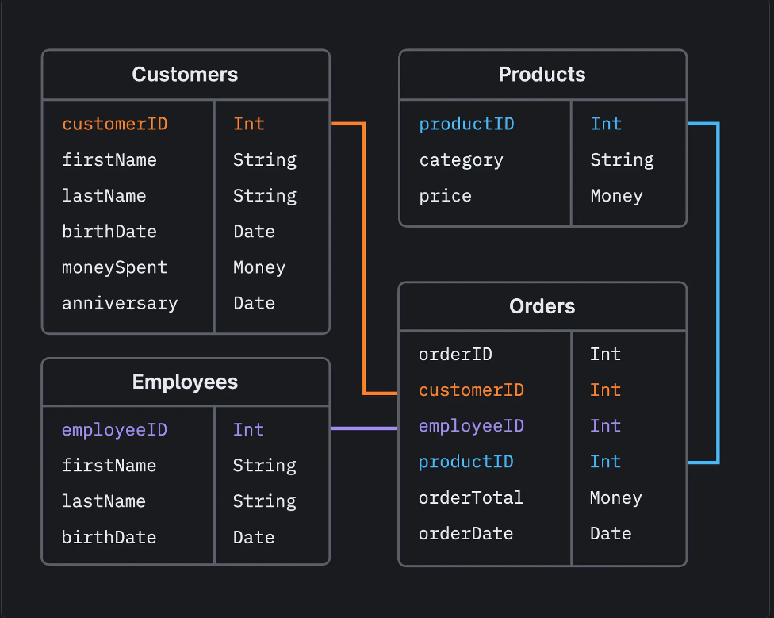
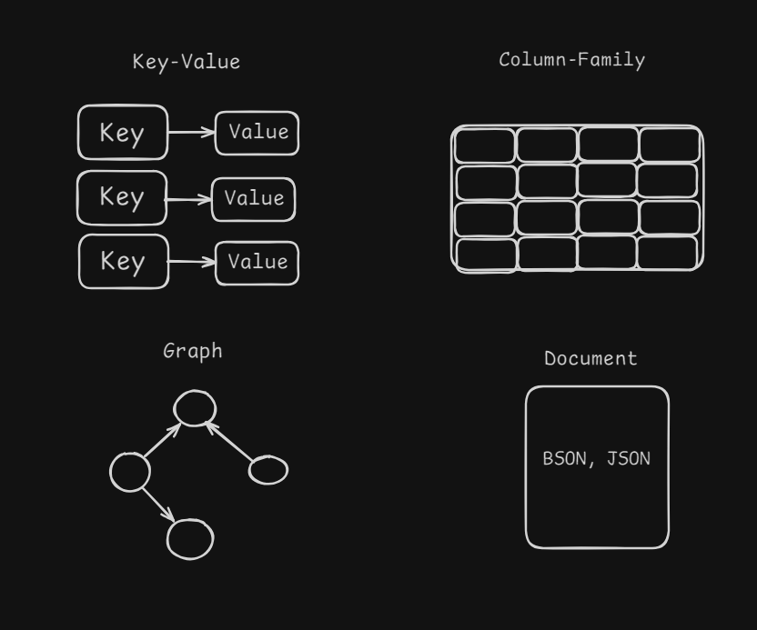

# Table of Contents

- [Relational Databases](#relational-databases)
- [Non-relational databases](#non-relational-databases)

## Relational Databases

**Explanation:**

Relational databases store data in tables, which are organized into rows and columns. Each table represents a different entity, and relationships between tables are established through foreign keys.

**Key Concepts:**

- **Tables:** Structures that store data in rows and columns.
- **Rows:** Individual records in a table.
- **Columns:** Attributes of the data stored in a table.
- **Primary Key:** A unique identifier for each row in a table.
- **Foreign Key:** A field in one table that uniquely identifies a row in another table, creating a relationship between the two tables.
- **SQL (Structured Query Language):** The standard language used to interact with relational databases.
- **ACID Properties:** A set of properties that ensure reliable processing of database transactions (Atomicity, Consistency, Isolation, Durability).

  - **Atomicity:**
    Atomicity ensures that all steps in a single database transaction are either fully-completed or reverted to their original state. For example, in a reservation system, both tasks—booking seats and updating customer details—must be completed in a single transaction. You cannot have seats reserved for an incomplete customer profile. No changes are made to the data if any part of the transaction fails.

  - **Consistency:**
    Consistency guarantees that data meets predefined integrity constraints and business rules. Even if multiple users perform similar operations simultaneously, data remains consistent for all. For example, consistency ensures that when transferring funds from one account to another, the total balance before and after the transaction remains the same. If Account A has $200 and Account B has $400, the total balance is $600. After A transfers $100 to B, A has $100 and B has $500. The total balance is still $600.

  - **Isolation:**
    Isolation ensures that a new transaction, accessing a particular record, waits until the previous transaction finishes before it commences operation. It ensures that concurrent transactions do not interfere with each other, maintaining the illusion that they are executing serially. For example, in a multi-user inventory management system, if one user updates the quantity of a product, another user accessing the same product information will see a consistent and isolated view of the data, unaffected by the ongoing update until it is committed.

  - **Durability:**
    Durability ensures that the database maintains all committed records, even if the system experiences failure. It guarantees that when ACID transactions are committed, all changes are permanent and unimpacted by subsequent system failures. For example, in a messaging application, when a user sends a message and receives a confirmation of successful delivery, the durability property ensures that the message is never lost. This remains true even if the application or server encounters a failure.

## Non-relational databases

**Explanation:**

NoSQL databases use a flexible schema model that supports a wide variety of unstructured data such as documents, key-value, wide columns, and graphs. Choosing NoSQL databases for their flexibility, high performance, horizontal scalability, and ease of development.

**Key Concepts:**

- **BASE Properties:**
  - **Basically Available:** Instead of making it compulsory for immediate consistency, BASE-modelled NoSQL databases ensure the availability of data by spreading and replicating it across the nodes of the database cluster.
  - **Soft State:** Due to the lack of immediate consistency, the data values may change over time. The BASE model breaks away from the concept of a database that enforces its own consistency, delegating that responsibility to developers.
  - **Eventually Consistent:** While BASE does not require immediate consistency, it does not mean that consistency is never achieved. Eventually, the system will become consistent, but until it does, data reads are still possible (even though they might not reflect the most current state).

- **Flexible Schema:**
  - NoSQL databases do not require a predefined schema, allowing for dynamic and flexible data structures.
  - This flexibility makes it easier to adapt to changing data requirements without the need for complex migrations.

- **Data Models:**
  - **Document Stores:** Store data in documents, typically using formats like JSON, BSON, or XML. Each document is a self-contained unit that can contain nested structures. Examples: MongoDB.
  - **Key-Value Stores:** Store data as a collection of key-value pairs, optimized for fast read and write operations. Examples: Redis, DynamoDB.
  - **Column-Family Stores:** Store data in columns rather than rows, allowing for efficient storage and retrieval of large datasets. Each column family contains rows with a unique key and multiple columns. Examples: Apache Cassandra, HBase.
  - **Graph Databases:** Store data in nodes, edges, and properties, making them ideal for representing and querying complex relationships. Optimized for traversing and querying graph structures. Examples: Neo4j.

- **Horizontal Scalability:**
  - NoSQL databases are designed to scale out by adding more servers to handle increased load, rather than scaling up by adding more power to a single server.
  - This horizontal scalability allows NoSQL databases to handle large amounts of data and high traffic more efficiently.
