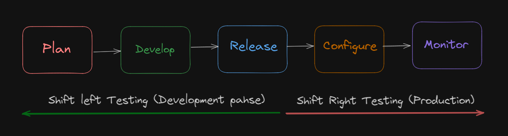
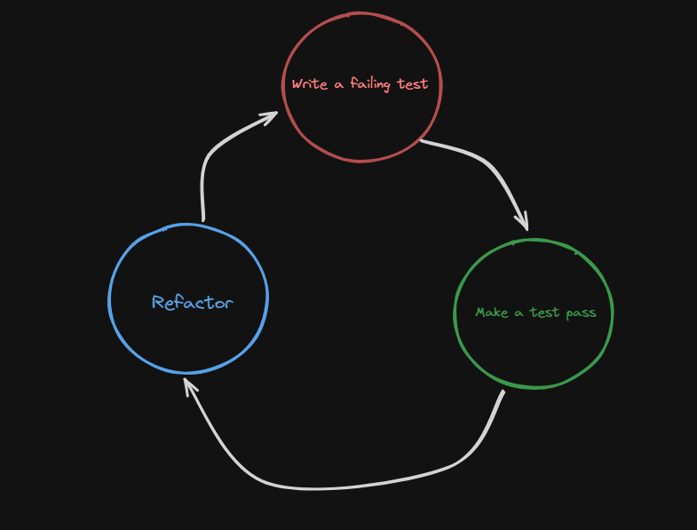
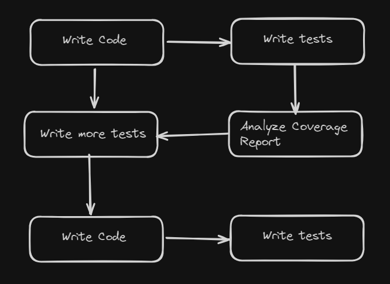
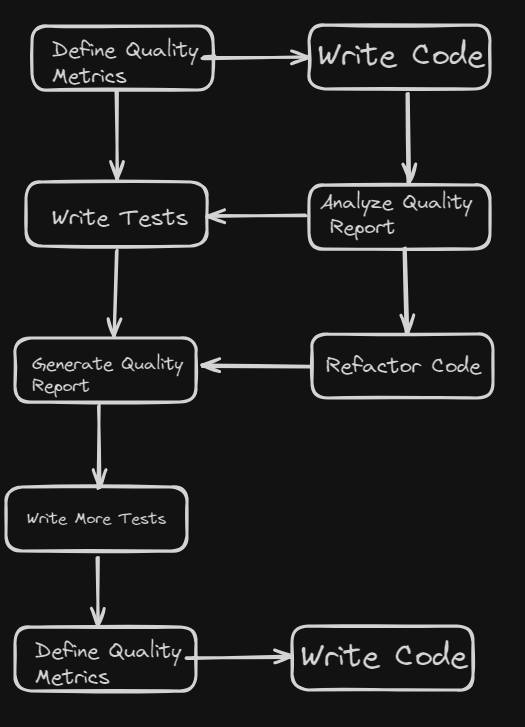
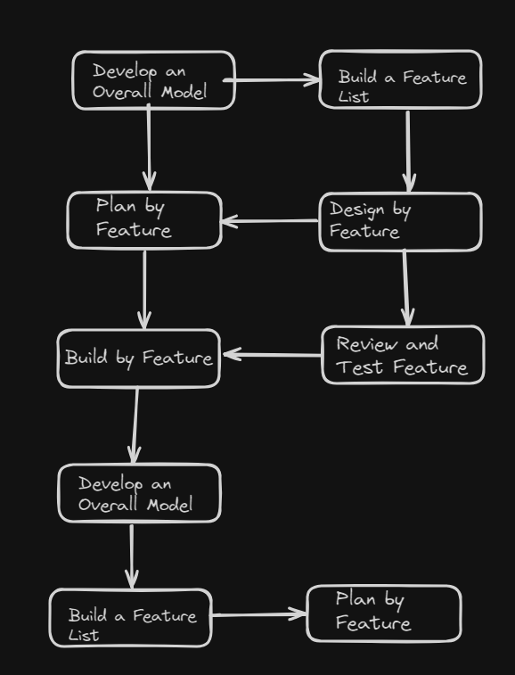
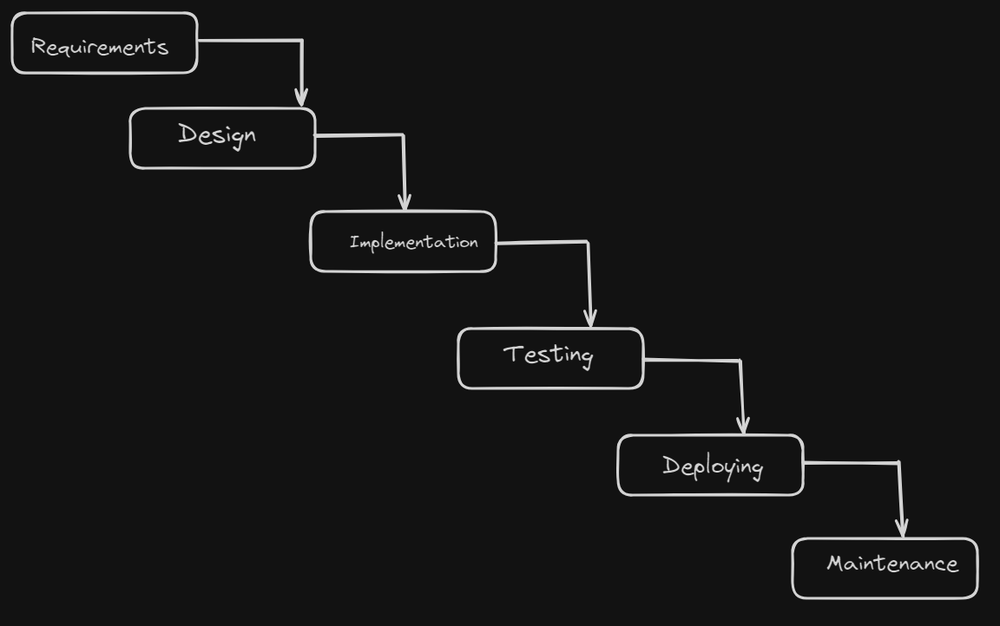
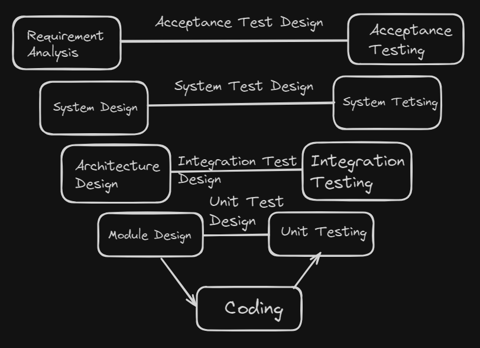

# Content of Table

- [Testing Throughout the Software Development Lifecycle](#testing-throughout-the-software-development-lifecycle)
  - [Testing Approaches in Software Development](#testing-approaches-in-software-development)
  - [Software Development Life Cycle (SDLC) Models](#software-development-life-cycle-sdlc-models)
  - [Software Testing Life Cycle (STLC)](#software-testing-life-cycle-stlc)
  - [Role of Testing in DevOps](#role-of-testing-in-devops)

## Testing Throughout the Software Development Lifecycle

**Paaiškinimas:**

1. **Testavimo metodai kuriant programinę įrangą:** Aptariamos įvairios testavimo strategijos, tokios kaip „Shift Left“ ir „Right“ metodas, nuolatinis testavimas, į testavimą orientuotas kūrimas (TDD), į elgseną orientuotas kūrimas (BDD), į priėmimą orientuotas kūrimas (ATDD), tiriamasis testavimas, porinis programavimas, chaoso inžinerija, dirbtinis intelektas ir mašininis mokymasis testavime bei testavimo kvadrantai.

2. **Programinės įrangos kūrimo gyvavimo ciklo (SDLC) modeliai:** Apžvelgiami įvairūs programinės įrangos kūrimo modeliai ir metodikos, įskaitant į procesą orientuotą, į aprėptį orientuotą, į kokybę orientuotą ir į funkcijas orientuotą kūrimą. Taip pat aptariamos įvairios praktikos, pavyzdžiui, ankstyvas ir dažnas grįžtamasis ryšys bei kodo peržiūros. Toliau nagrinėjami įvairūs SDLC modeliai, pavyzdžiui, krioklio modelis, V formos modelis, judrus modelis, ekstremalus programavimas (XP) ir spiralinis modelis.

3. **Programinės įrangos testavimo gyvavimo ciklas (STLC):** Aptariamos programinės įrangos testavimo gyvavimo ciklo sąvokos ir vaidmenys.

4. **Testavimo vaidmuo „DevOps“ ir „Agile“ metodikose:** Aptariama testavimo svarba ir vaidmuo „DevOps“ ir „Agile“ metodikose, įskaitant visos komandos požiūrį ir iteracijų planavimą bei vykdymą „Agile“ metodikoje.

### Testing Approaches in Software Development

**Paaiškinimas:**

Programinės įrangos kūrimo testavimo metodai - tai strategijos, naudojamos programinės įrangos kokybei ir funkcionalumui užtikrinti. Jų tikslas - ankstyvuoju kūrimo proceso etapu užfiksuoti problemas, sumažinti klaidų skaičių ir pagerinti bendrą galutinio produkto kokybę.

**Pagrindinės sąvokos:**

1. **Testavimo į kairę ir į dešinę metodas:** Šis metodas apima ankstyvą ir dažną testavimą kūrimo proceso pradžioje (poslinkis į kairę) ir tęstinį testavimą diegimo ir priežiūros etapuose (poslinkis į dešinę). Kairę pusę galima laikyti planavimo ir dokumentavimo etapais, o dešiniąją - kodavimo, diegimo ir priežiūros etapais.

    - **Vėlyvasis testavimas:** Testavimo „shift left“ esmė - perkelti visą testavimo veiklą į ankstesnius kūrimo proceso etapus, pageidautina - į reikalavimų rinkimo ir testavimo planavimo etapą.

    - **Bendradarbiavimo metodas:** Testavimas „iš kairės į kairę“ skatina glaudų bendradarbiavimą ne tik tarp QA komandos ir kūrimo komandos, bet ir kitų suinteresuotųjų šalių, pavyzdžiui, verslo analitikų ar projektų vadovų.

    - **Automatizavimas:** QA komandos, nusprendusios taikyti „shift left“ testavimą ir nuolatinį testavimą, taip pat pravartu investuoti į automatizavimą, kad pagreitintų testavimą ir padidintų veiklos efektyvumą.

    - **Tęstinis integravimas ir tęstinis pristatymas (CI/CD):** Tęstinis integravimas (CI) ir tęstinis pristatymas (CD) - tai sujungtos praktikos ir priemonės, skirtos automatizuoti programinės įrangos pakeitimų kūrimo, testavimo ir diegimo procesą.

    

2. **Nutrūkstamas testavimas:** Tai automatinių testų atlikimas viso kūrimo proceso metu, kad problemos būtų užfiksuotos iš karto, kai tik jų atsiranda.

3. **Testais pagrįsta plėtra (TDD):** Tai kūrimo metodika, pagal kurią testai rašomi prieš pradedant rašyti tikrąjį kodą. Tada kodas rašomas taip, kad išlaikytų šiuos testus. Testų pirmumo metodas yra TDD dalis, kai pirmiausia rašomi testai, o kodas kuriamas remiantis šiais testais.

    

4. **Į elgseną orientuotas kūrimas (BDD):** Tai kūrimo metodika, pagal kurią elgsenos specifikacijos rašomos prieš faktinį kodą. Vėliau šios specifikacijos paverčiamos testais, o kodas rašomas taip, kad išlaikytų šiuos testus.

5. **Priėmimo testais grindžiamas kūrimas (ATDD):** Tai bendradarbiavimo metodas, kai vartotojai, testuotojai ir kūrėjai nustato priėmimo testus prieš pradedant kodavimą.

6. **Programavimas poromis:** Tai metodas, kai du programuotojai dirba kartu vienoje darbo vietoje. Vienas rašo kodą, o kitas peržiūri kiekvieną kodo eilutę jos rašymo metu. Tai gali padėti anksti pastebėti problemas.

7. **AI ir mašininis mokymasis testavime:** dirbtinis intelektas ir mašininis mokymasis naudojami siekiant pagerinti testavimo procesų efektyvumą ir veiksmingumą. Jie gali padėti automatizuoti testavimo atvejų rašymą, numatyti, kur gali atsirasti klaidų, ir optimizuoti testavimo pastangas.

8. **Testavimo kvadrantai:** Tai modelis, padedantis komandoms nustatyti, kokio tipo testavimo reikia, kada jį reikia atlikti ir kas jį turėtų atlikti. Pagal jį testavimas skirstomas į keturis kvadrantus, atsižvelgiant į tai, ar testai yra skirti verslui, ar technologijoms, ir į tai, ar jie padeda komandai, ar kritikuoja produktą.

    - **Kvadrantas 1** - su technologijomis susiję testai, kurie padeda komandai: Šiam kvadrantui priskiriami į technologijas orientuoti testai, kuriais vadovaujamasi kuriant. Dažnai tai yra automatizuoti testai. Pavyzdžiai: vienetų testai, komponentų testai ir API testai.

    - **2 kvadrantas** - į verslą orientuoti testai, padedantys komandai: Šiam kvadrantui priskiriami testai, kurie yra orientuoti į verslą ir naudojami aprašyti ir patvirtinti, ką sistema turėtų daryti. Šie testai dažnai yra automatizuoti ir apima tokius testus kaip funkciniai testai.

    - **3 kvadrantas** - į verslą orientuoti testai, kurie kritikuoja produktą: Šiam kvadrantui priskiriami į verslą orientuoti testai, kurie naudojami grįžtamajam ryšiui teikti. Šie testai dažnai atliekami rankiniu būdu ir yra tiriamojo pobūdžio. Pavyzdžiai: tiriamasis testavimas, tinkamumo naudoti testavimas, naudotojo priėmimo testavimas ir alfa / beta testavimas.

    - **4 kvadrantas** - į technologijas orientuoti bandymai, kuriais kritikuojamas produktas: Šiam kvadrantui priskiriami į technologijas orientuoti testai, kurie naudojami produktui kritikuoti iš nefunkcinių reikalavimų perspektyvos. Šie bandymai dažnai yra automatizuoti ir apima našumo testavimą, saugumo testavimą, apkrovos testavimą ir streso testavimą.

    

## Software Development Life Cycle (SDLC) Models

**Paaiškinimas:**

Programinės įrangos kūrimo gyvavimo ciklo (SDLC) modeliai - tai metodikos, kuriomis vadovaujamasi kuriant programinę įrangą. Šie modeliai suteikia struktūrizuotą požiūrį į programinės įrangos kūrimą, užtikrinantį, kad galutinis produktas būtų patikimas, kokybiškas ir atitiktų naudotojo reikalavimus.

**Pagrindinės sąvokos:**

1. **Į procesą orientuotas požiūris:** Šiame požiūryje daugiausia dėmesio skiriama programinės įrangos kūrimo procesui, akcentuojant planavimą, tvarkaraščius, tikslines datas, biudžetus ir visos sistemos įgyvendinimą vienu metu.

2. **Programinės įrangos kūrimo metodikos:** Tai konkretūs metodai, naudojami programinės įrangos kūrimo procesui struktūrizuoti, planuoti ir kontroliuoti. Jie apima į aprėptį orientuotą kūrimą (daugiausia dėmesio skiriama testų aprėpčiai), į kokybę orientuotą kūrimą (daugiausia dėmesio skiriama bendrai kokybei) ir į funkcijas orientuotą kūrimą (daugiausia dėmesio skiriama funkcijų kūrimui).

    - **Coverage-Driven Development:**

      **Paaiškinimas:**

      Apimtimi pagrįsta kūrimas - tai programinės įrangos kūrimo metodas, kuris pabrėžia testų aprėpties svarbą kūrimo procese.

      
  
    - **Quality-Driven Development:**

      **Paaiškinimas:**

      Į kokybę orientuoto kūrimo (angl. Quality-Driven Development, QDD) tikslas - užtikrinti, kad kokybės standartų būtų laikomasi kiekviename programinės įrangos kūrimo ciklo etape.

      

    - **Feature-Driven Development:**

      **Paaiškinimas:**

      Programinė įranga kuriama atliekant nedideles, klientui svarbias funkcijas arba ypatybes po vieną.

      

3. **Programinės įrangos kūrimo praktika:** Tai metodai, naudojami tobulinant kūrimo procesą, pavyzdžiui, ankstyvas ir dažnas grįžtamasis ryšys ir kodo peržiūros.

4. **Sekvencinis SDLC modelis:** Tai SDLC modelio tipas, kai kūrimas vyksta nuosekliai žemyn per kelis etapus. Pavyzdžiai: krioklio modelis ir V formos modelis.

    - **Waterfall Model:**

      **Paaiškinimas:**

      „Waterfall“ modelis yra linijinis programinės įrangos kūrimo metodas.

      

    - **V-Model:**

      **Paaiškinimas:**

      Kiekvienas kūrimo ciklo etapas yra tiesiogiai susijęs su testavimo etapu.

      

      **Pagrindinės sąvokos:**

      - **Patikrinimas:** Programinės įrangos kūrimo ciklo metu reguliariai vertinkite tarpinius darbo produktus, kad įsitikintumėte, jog einate teisingu keliu. Tai gali būti kodo peržiūros, projekto peržiūros arba kitų dokumentų peržiūra.

      - **Tvirtinimas:** Kai galutinis produktas bus paruoštas, palyginkite jį su naudotojo reikalavimais, kad įsitikintumėte, jog jis atitinka nurodytus reikalavimus. Tai gali būti naudotojo priėmimo testavimas arba beta testavimas.

5. **Iteracinis ir inkrementinis SDLC modelis:** Tai SDLC modelio tipas, kai programinė įranga kuriama inkrementiniu būdu, o kūrimo procesas kartojamas mažomis iteracijomis. Pavyzdžiai: „Agile“ modelis, ekstremalusis programavimas (XP) ir spiralinis modelis.

    **Agile modelis:**

      **Paaiškinimas:**

      Taikant „Agile“ metodiką, testavimas yra integruotas į visą kūrimo procesą, o ne atskiras etapas. Taikant šį metodą, dažnai vadinamą „Agile Testing“, pabrėžiamas bendradarbiavimas, klientų pasitenkinimas ir lankstumas prisitaikant prie pokyčių. Juo siekiama greitai sukurti aukštos kokybės programinę įrangą, testavimo veiklą vykdant nuolat per visą kūrimo ciklą.

      **Pagrindinės sąvokos:**

      1. **Agile manifestas:** Agile manifestas - tai dokumentas, kuriame išdėstytos pagrindinės Agile kūrimo vertybės ir principai. Jame pabrėžiami asmenys ir sąveika, veikianti programinė įranga, bendradarbiavimas su klientais ir reagavimas į pokyčius.

      2. **Visos komandos požiūris:** Taikant „Agile“, už kokybę ir testavimą atsakinga visa komanda. Tai reiškia, kad testavimo veikloje dalyvauja visi - nuo programuotojų iki verslo analitikų. Toks požiūris skatina bendradarbiavimą, bendrą supratimą ir ankstyvą problemų nustatymą.

      3. **Agile planavimas ir vykdymas:** Testavimas įtraukiamas į kiekvieną „Agile“ kūrimo proceso iteraciją (arba sprintą). Kiekvienos iteracijos pradžioje komanda suplanuoja atliktinus darbus, įskaitant testavimo veiklą. Per iteraciją testai nuolat projektuojami, vykdomi ir peržiūrimi.

      

6. **Programinės įrangos kūrimo vaidmenys:** Tai įvairūs programinės įrangos kūrimo procese dalyvaujantys vaidmenys, kurių kiekvienas turi konkrečią atsakomybę ir užduotis. Jie gali apimti tokius vaidmenis kaip projekto vadovas, programinės įrangos kūrėjas, kokybės užtikrinimo testuotojas.

## Software Testing Life Cycle (STLC)

**Paaiškinimas:**

Programinės įrangos testavimo gyvavimo ciklas (angl. Software Testing Life Cycle, STLC) - tai konkrečių veiksmų, atliekamų testavimo proceso metu siekiant užtikrinti programinės įrangos kokybę, seka. Jis yra bendro programinės įrangos kūrimo gyvavimo ciklo (SDLC) dalis, tačiau jame daugiausia dėmesio skiriama būtent testavimo tikslams, strategijoms ir rezultatams.

**Pagrindinės sąvokos:**

1. **Programinės įrangos testavimo gyvavimo ciklo koncepcijos:** STLC apima keletą etapų, kurių kiekvienas turi savo tikslus ir rezultatus. Šie etapai paprastai apima reikalavimų analizę, testavimo planavimą, testavimo atvejų kūrimą, aplinkos sukūrimą, testavimo vykdymą ir testavimo ciklo užbaigimą.

2. **Vaidmenys programinės įrangos testavime:** STLC dalyvauja įvairūs vaidmenys, kurių kiekvienas turi konkrečias pareigas. Tai gali būti testavimo vadovas (prižiūri testavimo procesą), testavimo vadovas (planuoja ir organizuoja testavimo veiksmus), testavimo analitikas (kuria testavimo atvejus).

## Role of Testing in DevOps

**Paaiškinimas:**

DevOps metodikoje, kuri sujungia programinės įrangos kūrimą (Dev) ir IT operacijas (Ops). Jis nėra atskiras etapas, o integruotas į kiekvieną kūrimo ir diegimo proceso dalį.

**Pagrindinės sąvokos:**

1. **Nepertraukiamas testavimas:** „DevOps“ sistemoje testavimas atliekamas nuolat viso kūrimo proceso metu. Tai apima vienetų testavimą, integracinį testavimą, sistemos testavimą ir priėmimo testavimą.

2. **Testavimas, perkeltas į kairę:** Pagal šį metodą testavimas atliekamas kuo anksčiau kūrimo proceso metu (perkeliant jį „į kairę“ laiko juostoje). Tai padeda anksti užfiksuoti ir išspręsti problemas, todėl sumažėja vėlesnio jų šalinimo sąnaudos ir pastangos.

3. **Automatizavimas:** DevOps sistemoje plačiai naudojamos automatizuotos testavimo priemonės, kurios pagreitina testavimo procesą ir padaro jį efektyvesnį. Tai apima automatizuotus vienetų testus, integracijos testus ir vartotojo sąsajos testus.

4. **Infrastruktūra kaip kodas (IaC):** DevOps sistemoje infrastruktūra dažnai valdoma naudojant kodą, o tai reiškia, kad ją galima testuoti taip pat kaip ir taikomosios programos kodą. Tai padeda užfiksuoti su infrastruktūra susijusias problemas, kurios gali turėti įtakos programai.

5. **Monitoringas ir registravimas:** DevOps sistemoje naudojamas nuolatinis monitoringas ir registravimas, kad būtų galima stebėti taikomosios programos našumą ir realiuoju laiku nustatyti problemas. Šie duomenys taip pat gali būti naudojami informuojant apie būsimus bandymus.

