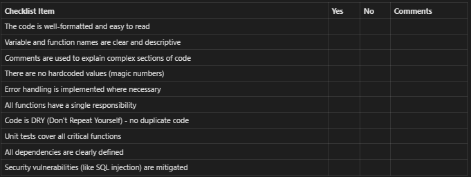

# Content of Table

- [Static Techniques](#static-techniques)
  - [Benefits of Early and Frequent Stakeholder Feedback](#benefits-of-early-and-frequent-stakeholder-feedback)
  - [Review Process Activities](#review-process-activities)
  - [Review Types](#review-types)
  - [Checklist-based reviewing](#checklist-based-reviewing)
  - [Scenario-based reviewing](#scenario-based-reviewing)
  - [Static Analysis](#static-analysis)
  - [Model-Based Analysis](#model-based-analysis)

## Static Techniques

**Explanation:**

Static techniques are used in this process to validate the code, design documents, and software requirements without actually executing the software.

**Key Concepts:**

1. **Benefits of Early and Frequent Stakeholder Feedback:** Getting feedback from stakeholders early and often can help catch misunderstandings or errors in the requirements or design before coding begins.

2. **Review Process Activities:** The review process typically involves planning the review, conducting the review, reporting the results, and taking any necessary follow-up actions.

3. **Review Types:** There are several types of reviews, including informal reviews, walkthroughs, technical reviews, and inspections. Each type of review has its own purpose, level of formality, and process.

4. **Checklist-based reviewing:** This is a technique where reviewers use a checklist of common errors to guide their review.

5. **Scenario-based reviewing:** In this technique, reviewers use a set of predefined scenarios to guide their review.

6. **Static Analysis:** This is a technique where tools are used to analyze code for potential errors, and security vulnerabilities.

7. **Model-Based Analysis:** This is a technique where models of the software (like data flow diagrams or entity-relationship diagrams) are analyzed to find errors or potential improvements.

### Benefits of Early and Frequent Stakeholder Feedback

**Explanation:**

It allows for the identification and rectification of misunderstandings or errors in the requirements or design before the coding begins. This can save time, effort, and resources that would otherwise be spent on rework.

**Key Concepts:**

1. **Error Detection:** Early feedback can help detect errors or misunderstandings in the initial stages of development, making it easier and less costly to fix them.

2. **Improved Quality:** Regular feedback can lead to improvements in the quality of the software, as it allows for continuous refinement of requirements and design.

3. **Risk Mitigation:** Early and frequent feedback can help identify and mitigate risks in the project, as potential issues can be identified and addressed sooner.

4. **Better Alignment with Business Needs:** Regular interaction with stakeholders ensures that the software being developed aligns with the business needs and expectations.

5. **Efficient Use of Resources:** By catching and addressing issues early, resources can be used more efficiently, reducing the time and cost of development.

## Review Process Activities

**Explanation:**

The review process in static techniques involves a systematic examination of software design documents, requirements, and code.

**Key Concepts:**

1. **Planning:** This initial stage involves defining the review's scope, objectives, and the documents to be reviewed. The team members involved in the review are also identified and assigned roles.

2. **Kick-off:** In this stage, the review's scope and objectives are communicated to the team. The documents to be reviewed are distributed, and the review process is explained.

3. **Individual Review:** Each reviewer independently examines the documents for potential issues. They may use techniques like checklist-based reviewing or scenario-based reviewing to guide their examination.

4. **Review Meeting:** The reviewers meet to discuss their findings. Any disagreements or misunderstandings are resolved.

5. **Rework:** Based on the review meeting, necessary changes are made to the documents or code.

6. **Follow-up:** The changes are verified to ensure they've been correctly implemented and have resolved the identified issues.

### Review Types

**Explanation:**

Reviews are a type of static testing where software documents (like requirements, design documents, and code) are examined by a person or a group of people. The goal is to find and fix errors, improve the quality of the software, and ensure it meets its requirements.

**Key Concepts:**

1. **Informal Review:** An informal review is a flexible process where the documents are reviewed without a formal process or documentation of defects. It's often used for quickly catching obvious errors or getting an overview of the document's quality.

2. **Walkthrough:** A walkthrough is a type of review where the author of the document presents it to the reviewers and walks them through it.

3. **Technical Review:** A technical review is a more formal process where a team of qualified personnel reviews the technical content of the document.

4. **Inspections:** An inspection is a very formal review process where the document is examined in detail by a team of reviewers.

### Checklist-based reviewing

**Explanation:**

Checklist-based reviewing is a static testing technique where reviewers use a predefined checklist to guide their review of software documents like requirements, design documents, and code. The checklist typically includes common errors or issues to look for, ensuring a systematic and thorough review.

**Key Concepts:**

1. **Systematic Review:** The use of a checklist ensures that the review is systematic and covers all important aspects of the document.

2. **Common Errors:** The checklist typically includes common errors or issues to look for.

3. **Consistency:** Checklists help ensure consistency across reviews, as all reviewers are guided by the same list of items to check.

### Scenario-based reviewing

**Explanation:**

Scenario-based reviewing is a static testing technique where reviewers use predefined scenarios to guide their review of software documents like requirements, design documents, and code.

**Key Concepts:**

**Use Cases:** Scenarios often represent potential use cases for the software.

**Path Analysis:** Scenarios can also represent potential paths through the software, helping reviewers identify issues like unreachable code or potential bottlenecks.

**Contextual Understanding:** By reviewing the software in the context of a scenario, reviewers can gain a better understanding of how the software is supposed to work.

**Issue Identification:** Scenario-based reviewing can help identify issues that might not be caught in a more general review, like usability issues or issues that only occur in specific scenarios.

**User Perspective:** Helps improving the usability and user-friendliness of the software.

**Example:**

  **Scenario:** User logs in and updates profile information

  **Steps:**

  1. User navigates to the login page
  2. User enters their username and password
  3. User clicks the 'Log In' button
  4. User is taken to their profile page
  5. User clicks the 'Edit Profile' button
  6. User updates their profile information
  7. User clicks the 'Save Changes' button
  8. User's updated profile information is saved

### Static Analysis

**Explanation:**

Is a method of debugging by examining the code without executing the program. Static Analysis is typically performed by both developers and software testers

  1. **Developers** perform static analysis as part of their coding and debugging process. They use static analysis tools to check their code for errors, bugs, or code.

  2. **Software Testers** Can use static analysis tools to check the code for potential issues that might not be caught by dynamic testing. This can include things like checking potential security vulnerabilities, or areas of the code that are overly complex and might need refactoring.

**Key Concepts:**

1. **Choose a Static Analysis Tool:** The choice of tool depends on the programming language you're using and the specific requirements of your project. Examples Pylint for Python, ESLint for JavaScript.

2. **Configure the Tool:** You can configure and choose which rules you want to enforce, based on your team's coding standards and the specific needs of your project.

3. **Run the Tool:** This can be done manually, but it's often integrated into the build process or the continuous integration pipeline, so it runs automatically whenever the code is built or committed.

4. **Review the Results:** The tool will provide a report of any issues it found, such as potential bugs, or violations of coding standards.

5. **Fix the Issues:** Update the source code to fix the issues identified by the static analysis tool. This might involve fixing bugs, refactoring code, or making the code conform to coding standards.

6. **Repeat the Process:** Static analysis is not a one-time process. It should be done regularly, ideally every time the code is built or committed, to catch new issues as they are introduced.

### Model-Based Analysis

**Explanation:**

Model-based analysis is a static testing technique where models of the software (like data flow diagrams, entity-relationship diagrams, or state transition diagrams) are analyzed to find errors or potential improvements.

**Key Concepts:**

1. **High-Level Understanding:** Models provide a high-level view of the system, making it easier to understand the system's behavior and identify potential issues.

2. **Error Detection:** By analyzing the models, errors in the system's design or behavior can be identified and corrected before the code is written.

3. **Design Improvement:** Model-based analysis can also identify potential improvements in the system's design, leading to more efficient and effective software.

4. **Communication:** Models can serve as a communication tool between different stakeholders (like developers, testers, and business analysts), helping to ensure a shared understanding of the system.

5. **Documentation:** The models used in model-based analysis can also serve as documentation, providing a visual representation of the system's behavior.

**Example:**

- **UML Class Diagram**

  
