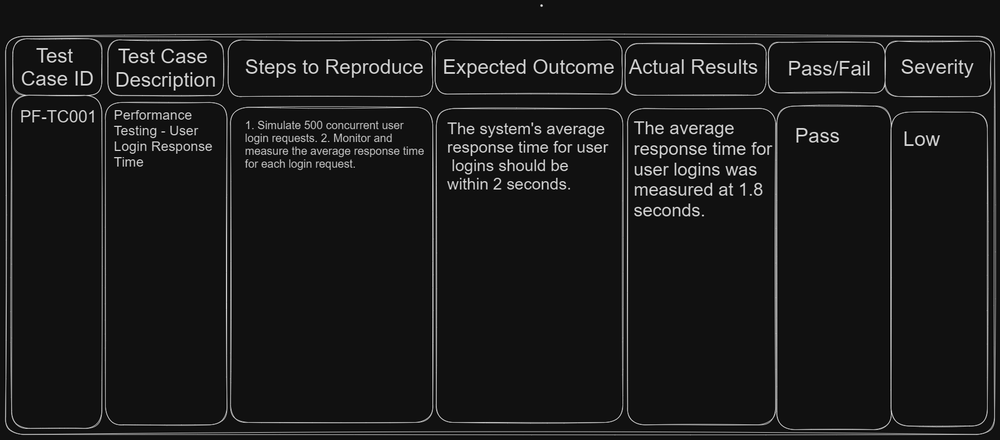
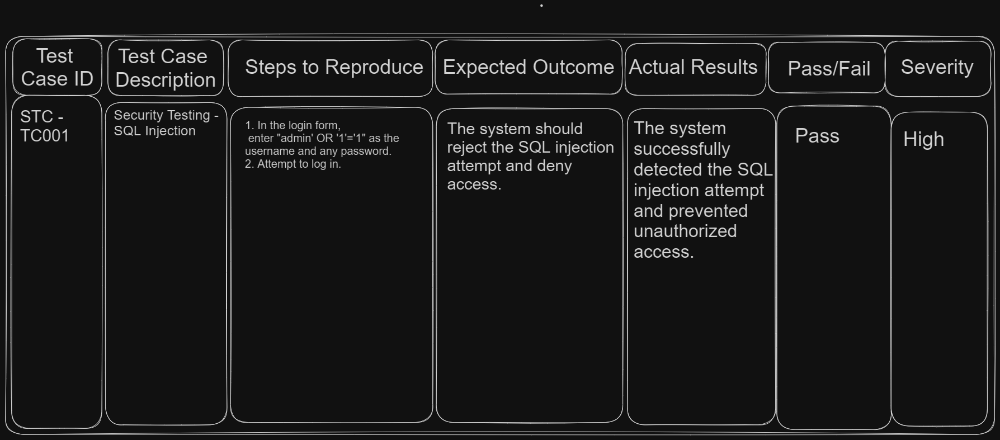
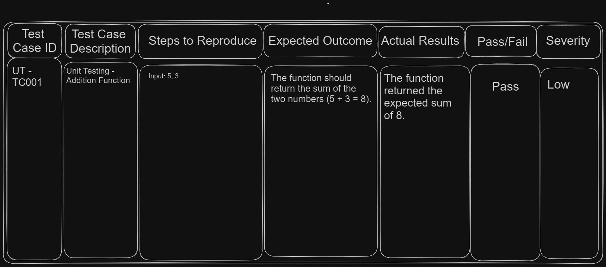
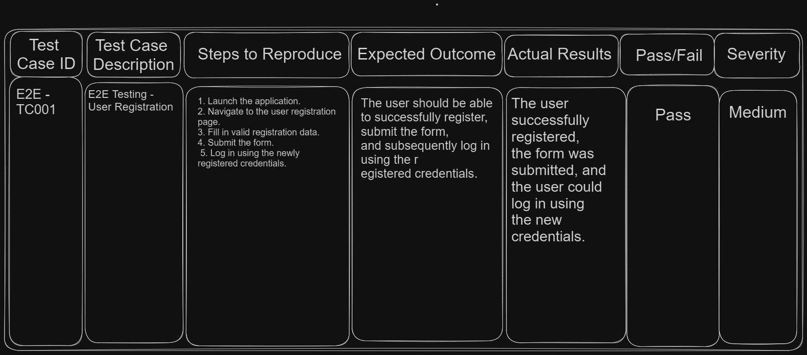
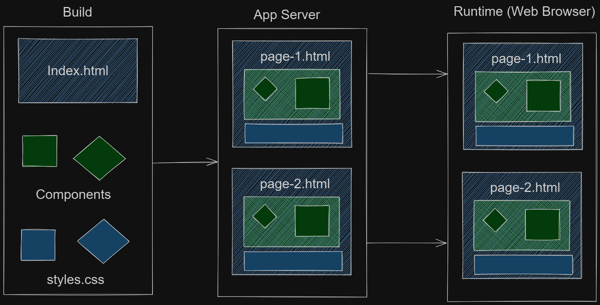

# Table of Contents

- [Internet](#internet)
- [QA Basics](#qa-basics)
- [Project Managment](#project-managment)
- [Manual Testing](#manual-testing)
- [Software Testing and Development Life Cycle](#software-testing-and-development-life-cycle)
- [Non-Functional Testing](#non-functional-testing)
  - [Accessibility testing](#accessibility-testing)
  - [Load and Performance Testing](#load-and-performance-testing)
  - [Security Testing](#security-testing)
- [Testing Techniques](#testing-techniques)
    - [Non-Functional Techniques](#non-functional-techniques)
    - [Functional Techniques](#functional-techniques)
- [Automated Testing](#automated-testing)
  - [Frontend Automation](#frontend-automation)
  - [Backend Automation](#backend-automation)
    - [API](#api)
- [Frameworks](#frameworks)
  - [Jest](#jest)

# QA Basics

- [What is Quality Assurance?](#what-is-quality-assurance)
  - [What is Quality?](#what-is-quality)
  - [What is Assurance?](#what-is-assurance)
  - [Quality Assurance in Software Testing](#quality-assurance-in-software-testing)
- [Tester Mindset](#tester-mindset)
- [Test Oracles](#test-oracles)
- [Test Prioritization](#test-prioritization)
- [Black Box vs Gray Box vs White Box Testing](#black-box-vs-gray-box-vs-white-box-testing)
  - [Differences and similarities](#differences-and-similarities)
  - [When to apply each approach](#when-to-apply-each-approach)
- [Test Case Design](#test-case-design)
  - [Types of Test Cases](#types-of-test-cases)
  - [Test Case Format](#test-case-format)
  - [Test case Types](#test-case-types)
  - [Test Case Requirements](#test-case-requirements)
  - [Common Mistakes](#common-mistakes)

## What is Quality Assurance?

### What is Quality?

**Explanation:**

Quality refers to the degree of excellence or superiority of a product or service. These factors include reliability, performance, security, usability, and the ability to meet customer expectations effectively.

**Key Concepts:**

- **Fitness for Purpose**: A product or service should effectively serve its intended purpose. This means that it should meet the specific needs and requirements

- **Conformance to Requirements**: Ultimately, quality is about satisfying customer needs and expectations.  

- **Customer Satisfaction**: The product satisfies customer needs and expectations.

- **Continuous Improvement**: Quality is not a one-time achievement but an ongoing commitment.

### What is Assurance?

**Explanation:**

It involves activities aimed at building confidence that a product or service will meet its quality objectives.

**Key Concepts:**

- **Preventive Activities**: Assurance includes a range of preventive activities that are designed to stop defects from occurring in the first place. 

- **Process Adherence**: Ensuring that processes are followed consistently.

- **Standardization**: Implementing best practices and standards.

- **Early Detection**: Identifying and addressing issues early in the development lifecycle.

### Quality Assurance in Software Testing

**Explanation:**

Quality Assurance (QA): ensure software products meet specified quality standards.

**Key Concepts:**

- **Process Improvement**: QA involves the continuous identification and implementation of improvements in the testing process.

- **Standardization**: Establishing testing standards and guidelines.

- **Test Planning**: These plans outline the testing objectives, strategies, and schedules, ensuring that testing efforts align with project goals.

- **Metrics and Measurement**: Key performance indicators (KPIs).


**Resources:**

- [Article: What is Quality Assurance(QA)?](https://www.guru99.com/all-about-quality-assurance.html)
- [Article: Why Is ISTQB Certification Important for QA Professionals?](https://www.testdevlab.com/blog/why-is-istqb-certification-important-for-qa-professionals)
- [Article: What is QA?](https://www.investopedia.com/terms/l/lean-six-sigma.asp)

**Tasks**

- [Intro](../tasks/QA/images/taskManualTesting1.png)

## Tester Mindset

**Explanation:**

The "Tester Mindset" refers to the collection of qualities, attitudes, and approaches that make a software tester effective in their role. It involves a combination of critical thinking, attention to detail, empathy, curiosity, and a commitment to delivering high-quality software.

**Key Concepts:**

- **Attention to Details:** One of the primary mindsets for a successful software tester is attention to details. Testers need to develop the ability to spot even the smallest errors or anomalies within the application.

- **Analytical Skills:** Building strong analytical skills is another key aspect. Testers should possess the capability to analyse complex systems and recognize or find out potential problems. This involves breaking down the software into its components, understanding their interactions, and identifying vulnerabilities.

- **Curiosity:** Testers should have an innate motivation to explore various test scenarios. This curiosity is what drives including or dealing with all or nearly all elements or aspects test coverage, especially when dealing with intricate applications.

- **Persistence:** Persistence plays a pivotal role in a tester's mindset. Testers must be unwavering in their efforts to discover and replicate bugs. This determination in locating and resolving issues is a cornerstone of effective testing.

- **Creativity:** Creativity is a fundamental mindset for testers. It enables them to devise innovative solutions for testing challenges. Thinking creatively and employing unique approaches can be instrumental in uncovering latent problems.

- **Collaboration:** Effective collaboration skills are indispensable. Testers need to seamlessly interact with diverse stakeholders, including business analysts, developers, and scrum masters, especially in agile environments.

- **Risk Management:** Testers should possess the capability to estimate and manage risks associated with the software. Understanding potential risks and executing robust testing strategies.

- **Customer Focus:** Testers should empathize with end-users, understand their needs and expectations. This user-centric approach ensures that the software aligns with user requirements, resulting in a positive user experience.

- **Continuous Learning:** Commitment to continuous learning is a non-negotiable trait. Testers must stay updated on emerging technologies, evolving testing methodologies, and industry trends. Embracing new knowledge is vital for professional growth.

- **Adaptability:** Testers should be flexible and capable of adjusting to changing project requirements, shifting environments, and software updates. Adaptability ensures that testing remains effective in dynamic situations.

**Resources:**

- [Video: Explanation of Tester Mindset](https://www.youtube.com/watch?v=BCuZfdbWnl8)

## Test Oracles

**Explanation:**

A test oracle is a fundamental concept in software testing. It acts as a reference point to verify whether the actual output of a software application aligns with the expected output defined in test cases. A match indicates a pass, while a mismatch results in a fail.

**Key Concepts:**

1. **Manual vs. Automated Test Oracles:** Test oracles come in two primary forms: manual and automated. Manual test oracles involve human experts who estimate the correctness of the software application's behavior. In contrast, automated test oracles use software tools or algorithms to perform the comparison.

2. **Implementation Approaches:** Methods of implememnting:

  - **Requirement Specification:** Expected results are defined within the project's requirement specifications, and test cases are designed to verify compliance with these requirements.

  - **Historical Data:** Test cases can be based on the output of previous versions of the software, utilizing historical data to determine expected results.

  - **Program Analysis:** Test cases are designed by analyzing the internal programming structure of the software application. The code is estimate and to determine expected outcomes, and these are validated against the actual application output.

 - **Validation and Verification:** The primary purpose of test oracles is to validate and verify the correctness of a software   application. By comparing actual and expected outputs, testers can identify whether test cases pass or fail, ultimately ensuring the software meets its intended behavior.

**Resources:**

- [Video: Explanation of Test Oracles](https://www.youtube.com/watch?v=DR22zNNetp0)

## Test Prioritization

**Explanation:**

Test case prioritization becomes especially valuable when there is a large number of test cases, and there is a need to execute them efficiently within a limited time frame. 

**Key Concepts:**

- **Risk-Based Prioritization:** This technique involves prioritizing test cases based on the associated risks. Test cases are estimate for their potential impact on the project, and those with higher risks are executed first. Conversely, if a test case poses minimal risk, it may not be executed.

- **Requirements-Based Prioritization:** Test cases are prioritized according to the criticality of the requirements they cover. Essential features or requirements vital to the customer or business receive higher priority.

- **Business Value-Based Prioritization:** Prioritizing test cases is aligned with the business's objectives and goals. If certain test cases contribute significantly to delivering business value, they are prioritized for execution.

- **Functional Priority-Based Prioritization:** Test cases related to critical functionalities are given priority. This approach ensures that key functionalities are thoroughly tested, accounting for their complexity and importance.

- **Time-Based Prioritization:** Test cases are prioritized to meet specific time constraints or deadlines. For instance, if there's a need to execute a set of test cases within a week, prioritization is adjusted to meet the timeline.

- **Customer Reputation-Based Prioritization:** Customer feedback and reputation play a significant role in prioritization. If a customer emphasizes the importance of specific test cases, they are prioritized to meet customer expectations.

- **Impact-Based Prioritization:** Test cases are prioritized based on their potential impact on the application. If a test case's absence could lead to significant issues, it receives a higher priority for execution.

- **Regression-Based Prioritization:** This method focuses on prioritizing test cases affected by recent changes or regression issues. Test cases related to areas with frequent regressions are prioritized to ensure stability.

- **Resource-Based Prioritization:** Resources like hardware, human resources, and test environments influence prioritization. Test cases are prioritized based on the availability of necessary resources, such as hardware or skilled testers.

- **Historical Failures-Based Prioritization:** Test cases that historically tend to fail when executed are given special attention. These consistently problematic test cases are prioritized to address recurring issues effectively.

**Resources:**

- [Video: Test Prioritization Techniques](https://www.youtube.com/watch?v=drUfHG6tav8)

## Black Box vs Gray Box vs White Box Testing

**Explanation:**

Black Box Testing, Gray Box Testing, and White Box Testing are three different approaches to software testing, each with its own characteristics and purposes. These terms describe how much information and knowledge the tester has about the internal workings of the software being tested.

**Resources:**

- [Video: Black Box vs Gray Box vs White Box Testing](https://www.youtube.com/watch?v=CPVMbZYeiF4)

### Differences and Similarities

**Explanation:**

Black box testing, gray box testing, and white box testing are three distinct testing approaches that involve different levels of access to the internal components of the software.

**Key Concepts:**

*Black Box Testing:*

- **Access to Code**: Testers have no knowledge of the internal code or logic.

- **Focus**: Testing is based on external behavior and functional requirements.

- **Testers Role**: Testers focus on inputs and expected outputs without knowledge of the internal implementation.

- **Similarities**: It is similar to how end-users interact with the system.

**Resources:**

- [Article: Black Box Testin](https://www.guru99.com/black-box-testing.html)

**Key Concepts:**

*Gray Box Testing:*

- **Access to Code**: Testers have partial knowledge of the internal code and logic.

- **Focus**: Testing combines aspects of both black box and white box testing.

- **Testers Role**: Testers can design tests based on the understanding of internal logic to target specific areas.

- **Similarities**: It bridges the gap between black box and white box testing.

**Resources:**

- [Article: Gray Box Testing](https://www.guru99.com/grey-box-testing.html)

**Key Concepts:**

*White Box Testing:*

- **Access to Code**: Testers have complete knowledge of the internal code and logic.

- **Focus**: Testing is based on code structure, paths, and logic flow.

- **Testers Role**: Testers can design tests to cover specific code paths and conditions.

- **Similarities**: It is akin to how developers analyze the code.

**Resources:**

- [Article: White Box Testing](https://www.guru99.com/white-box-testing.html)

### When to Apply Each Approach

**Explanation:**

The choice of when to apply Black Box, Gray Box, or White Box Testing depends on various factors, including the testing objectives, the level of knowledge about the software under test, and the specific testing phase within the software development life cycle.

1. **Black Box Testing:**

- *When to Apply:*

  - **Functional Testing:** Use Black Box Testing primarily for functional testing to ensure that the software meets its specified requirements and behaves as expected from a user's perspective.

  - **Acceptance Testing:** It's commonly used during acceptance testing to determine if the software meets the user's acceptance criteria.

  - **System Testing:** Black Box Testing can be applied at the system level to verify interactions between components and subsystems.
  
  - **Usability Testing:** For evaluating the software's user-friendliness and overall user experience.

- **Advantages:**

  - Reflects how end-users interact with the software.
  - Doesn't require knowledge of internal code, making it suitable for non-technical testers.
  - Emphasizes real-world scenarios and user expectations.

2. **Gray Box Testing:**

- *When to Apply:*

  - **Integration Testing:** Gray Box Testing can be useful for integration testing to verify that different software components work together as expected.

  - **Security Testing:** It's often applied in security testing to identify vulnerabilities that may require some knowledge of the application's internal architecture.

  - **Database Testing:** Useful when testing applications that interact with databases, as some knowledge of data structures and queries can be beneficial.

  - **API Testing:** For testing APIs where understanding data flows and possible integration issues is important.

- **Advantages:**

  - Provides a balance between functional and structural testing.
  - Suitable for uncovering integration-related issues.
  - Helps identify security vulnerabilities that may not be apparent in Black Box Testing.

3. **White Box Testing:**

- *When to Apply:*

  - **Unit Testing:** White Box Testing is essential for unit testing, where individual code units (functions, methods) are tested in isolation.

  - **Code Coverage Analysis:** Used to measure code coverage and ensure that all code paths are exercised.

  - **Security Testing:** Especially useful for identifying code-level security vulnerabilities like SQL injection, buffer overflows, and insecure authentication.

  - **Performance Tuning:** Can be applied to optimize code performance by analyzing and improving algorithms and data structures.

- **Advantages:**

  - Enables thorough code analysis and identification of code-level defects.
  - Essential for ensuring code quality and security.
  - Ideal for developers and testers with knowledge of the software's internal workings.

## Test Case Design

**Explanation:**

We will explore the fundamentals of test case design, including the types, format, and requirements of test cases.

**Key Concepts:**

- Test case types (positive, negative, destructive)

- Test case format (ID, summary, preconditions, steps, post conditions, expected results, actual results, status)

- Test case requirements (comprehensiveness, repeatability, reusability)

### Types of Test Cases

**Explanation:**

The three types of test cases: positive, negative, and destructive.

**Key Concepts:**

- Positive test cases (using valid inputs)

- Negative test cases (using invalid inputs)

- Destructive test cases (stress testing)

**Example:**

- Positive test cases are used to validate that software behaves correctly with valid inputs, such as logging in with correct credentials. 

- Negative test cases, on the other hand, aim to ensure the software handles invalid inputs appropriately, like incorrect login credentials. 

- Destructive test cases were also discussed, which test the software's limits and may involve actions like rapid clicking or stress testing.

### Test Case Format

**Explanation:**

We will break down the format of a test case, including its eight essential elements. Understanding this format is crucial for creating effective test cases.

**Key Concepts:**

- Test case elements (ID, summary, preconditions, steps, post conditions, expected results, actual results, status)

**Example:**

Eight elements that make up a test case format: 

1. These elements include ID (unique identifier)

2. Summary (brief description)

3. Preconditions (actions needed before the test)

4. Steps (actions for verification)

5. Post conditions (actions to return the system to its original state)

6. Expected results

7. Actual results

8. Status

### Test Case Types

**Explanation:*

It discusses the flexibility in naming and structuring test cases.

**Key Concepts:**

- Different test case formats

- Variability in naming and section terminology

**Example:**

- That test cases can vary in format and structure. For instance, some may use a shorter format with only a few key elements like summary, priority, steps, and expected results. 

- The terminology used in different sections may also vary, with "inputs" used instead of "steps" or "outputs" instead of "results."

### Test Case Requirements

**Explanation:**

Discusses the need for accuracy, clarity, and repeatability in test case documentation.

**Key Concepts:**

- including or dealing with all or nearly all aspects of test cases

- Clear and accurate descriptions

- Repeatability and ease of understanding

**Example:**

- Test cases should be comprehensive and not depend on other cases

- They should provide clear and accurate descriptions of steps and expected results to ensure repeatability.

### Common Mistakes

**Explanation:**

Highlights common mistakes made by QA engineers when writing test cases.

**Key Concepts:**

- Avoiding abstract summaries

- Ensuring clickable links

- Balancing detail in descriptions

**Example:**

- Avoiding overly abstract summaries, advocating for specific and clear descriptions like `"check adding a product to the wishlist"` instead of a generalized `"check wishlist functionality."` 

- Stressed the need to ensure that embedded links in test cases are clickable and lead to the correct pages. 

- [Download: Test Case Table Credits Thomas Hamilton](https://drive.google.com/uc?export=download&id=0ByI5-ZLwpo25eXFlcU5ZMTJsT28)

**Resources:**

- [Article: Writing Effective Test Cases and Test Case Structure and Format](https://www.guru99.com/test-case.html)
- [Article: Test Case Design](https://www.guru99.com/software-testing-techniques.html)

**Tasks:**

- [Tasks: Learning Write Test Cases](./tasks/testCaseDesignTask.md)

# Project Managment

**Resources:**

- [Page: Project Managment](../teamwork(Project-managment)/README.md)

# Manual Testing

- [Test Planning](#test-planning)
- [Test Driven Development vs Behavior Driven Development](#test-driven-development-vs-behavior-driven-development)
- [Test Cases and Scenarios](#test-cases-and-scenarios)
- [Reporting](#reporting)
  - [Test Summary Report](#test-summary-report)
  - [Test Case Report](#test-case-report)
    - [Test Case vs Test Case Report](#test-case-vs-test-case-report)
  - [Defect Report (Bug Report)](#defect-report-bug-report)
  - [Regression Test Report](#regression-test-report)
  - [Test Execution Log](#test-execution-log)
- [Compatibility](#compatibility)
- [Verification and Validation](#verification-and-validation)

## Test Planning

**Explanation:**

Test planning involves defining the overall testing strategy for a project, outlining objectives, scope, resources, schedules, and risks.

**Key Concepts:**

- **Objectives:** Define testing goals and expectations.

- **Scope:** Specify what will be tested and what won't.

- **Test Strategy:** Decide on test levels, types, techniques, and environments.

- **Test Schedule:** Allocate timeframes for testing activities.

- **Risk Assessment:** Identify potential risks and mitigation strategies.

**Resources:**

- [Docs: Test Plan](./assets/manualTesting/testPlanDocs.md)

**Example:**

- [Test Planning Example](./assets/manualTesting/testPlanning.md)

## Test Driven Development vs Behavior Driven Development

### Explanation:
Test Driven Development (TDD) and Behavior Driven Development (BDD) are two software development methodologies that prioritize writing tests before or alongside code to ensure software quality and behavior. While both share the goal of improving software quality, they differ in their focus, syntax, and application.

### Key Concepts:

**Test Driven Development (TDD):**

**Focus:** 

TDD primarily centers on writing unit tests for individual code components (functions, methods, or classes).

**Syntax:** 

TDD tests are often written using testing frameworks like JUnit, NUnit, or pytest. These tests typically focus on inputs, expected outputs, and internal logic.

**Example:** 

In TDD, you'd write a test for a specific function, supply inputs, and verify that the function produces the expected outputs.

**Behavior Driven Development (BDD):**

- **Focus:** 

BDD emphasizes specifying the behavior of a system or feature from a user's perspective, focusing on high-level functionality.

- **Syntax:** 

BDD tests use a more natural language format, often with "Given-When-Then" clauses. Tools like Cucumber and SpecFlow are commonly used for BDD tests.

**Example:** 

In BDD, you'd describe scenarios in a human-readable format, like "Given a user is logged in, when they click the 'logout' button, then they should be logged out."

**Example:**

**Test Driven Development (TDD):**
1. Write a test case that checks if a sorting algorithm correctly sorts an array.
2. Implement the sorting algorithm.
3. Run the test case, ensuring it passes.

**Behavior Driven Development (BDD):**
1. Describe a high-level feature, such as user authentication.
2. Define scenarios like user login and logout using "Given-When-Then" statements.
3. Use BDD tools to automate and validate these scenarios against the actual application.

**Resources:**

- [Article: Test-Driven Development (TDD)](https://www.guru99.com/test-driven-development.html)

## Test Cases and Scenarios

**Explanation:**

Test cases and scenarios define the steps, conditions, and expected outcomes for testing different aspects of a software application.

- [Test Cases and Scenarios](./assets/manualTesting/testCasesandScenarios.md)

**Key Concepts:**

- **Test Case:** A set of inputs, actions, and expected results.

- **Test Scenario:** A sequence of related test cases.

- **Coverage:** Ensure comprehensive coverage of functionalities.

- **Traceability:** Link test cases to requirements for validation.

**Resources:**

- [Article: Test Cases and Scenarios](https://www.guru99.com/test-case-vs-test-scenario.html)

## Reporting

**Explanation:**

Reporting involves documenting and communicating testing activities, results, and defects to stakeholders.

**Key Concepts:**

- **Test Execution Reports:** Summarize test runs and outcomes.

- **Defect Reports:** Document defects found during testing.

- **Status Updates:** Keep stakeholders informed about progress.

- **Metrics and KPIs:** Measure testing effectiveness.

**Resources:**

- [Article: Reporting](https://www.guru99.com/defect-management-process.html)

### Test Summary Report

**Explanation**

- [Explanation: Test Summary Report](../QA/assets/explanation/testSummaryReport.md)

**Example**

- [Test Summary Report](./assets/manualTesting/testSummaryReport.md)

### Test Case Report

**Explanation**

A Test Case Report, also known as a Test Execution Report, provides an overview of the status and results of executed test cases.

**Example**

- [Test Case Report](./assets/manualTesting/testCaseReport.md)

### Test Case vs Test Case Report

1. **Test Case:**

- **Purpose:** A test case is a detailed document that outlines the specific steps to be followed, the conditions to be met, and the expected outcomes to verify a particular aspect of a software application.

- **Content:** Test cases include information such as test case ID, test steps, input data, expected results, preconditions, and postconditions. They are used by testers to execute tests systematically.

- **Focus:** Test cases are focused on the specific actions to be taken during testing and the expected results, helping testers ensure that the software functions correctly.

2. **Test Case Report** (or Test Execution Report):

- **Purpose**: A Test Case Report, often referred to as a Test Execution Report, provides an overview of the status and results of executed test cases for a specific testing phase or cycle.

- **Content**: Test Case Reports typically include project details, test phase information, test execution dates, the total number of test cases executed, the number of test cases passed and failed, details about the test environment, an overall summary of the testing effort (example overall status, comments), and a list of individual test cases with their execution statuses and any specific comments.

- **Focus**: Test Case Reports focus on summarizing the outcomes of testing efforts and providing stakeholders with a high-level view of the testing progress and results. They help project managers, stakeholders, and team members assess the quality and readiness of the software.

### Defect Report (Bug Report)

**Explanation**

Defect Reports are separate documents used to document and track issues or defects identified during testing. You do not typically write Defect Reports (Bug Reports) within individual test cases.

- Defect Reports document issues found during testing, which may result from executing test cases. These reports are used to communicate the problems to developers or the relevant team responsible for fixing the defects.

**Example**

- [Defect Report (Bug Report)](./assets/manualTesting/bugReport.md)

### Regression Test Report

Regression testing is performed to ensure that new code changes, updates, or enhancements to a software application do not introduce new defects or negatively impact existing functionality. 

- **Regression Test Report:** 

Once you have executed the regression tests, you compile the results into a Regression Test Report. This report summarizes the status of all the regression test cases, indicating which ones passed, which ones failed, and any other relevant information about the testing process.

- **Mitigation Strategies:**

- Managing and executing regression tests can be challenging, and there may be a need to modernize testing practices.

1. **Continuous Integration/Continuous Deployment (CI/CD):** Implement CI/CD pipelines to automate the build, testing, and deployment process. This ensures that regression tests are run automatically with each code change, reducing the risk of regression issues going unnoticed.

2. **Version Control and Code Reviews:** Implement robust version control practices and code review processes to catch issues early in the development cycle, reducing the likelihood of introducing regressions.

### Test Execution Log

**Explanation:**

Test logs provide a detailed record of the test execution process, including what was tested, how it was tested, and the results of the tests.

**Example:**

- [Test Execution Log](./assets/manualTesting/testExecutionLog.md)

## Compatibility

**Explanation:**

Compatibility testing ensures that software works across various environments, browsers, devices, and operating systems.

**Example:**

- [Compatibility](./assets/manualTesting/compatibility.md)

**Key Concepts:**

- **Browser Compatibility:** Test across different web browsers.

- **Device Compatibility:** Test on various devices (desktop, mobile, tablet).

- **Operating System Compatibility:** Test on different OS versions.

- **Challenges:** Address differences in rendering, functionality, and performance.

**Resources:**

- [Article: Compatibility Testing](https://www.guru99.com/compatibility-testing.html)

## Verification and Validation

**Explanation:** 

Verification and validation are two independent procedures used together to ensure that a product, service, or system meets its requirements.

**Key Concepts:** 

Verification focuses on confirming whether the procedure used to achieve results is correct, while validation focuses on ensuring that the results themselves meet customer requirements.

**Example:**

Verification is checking the correctness of the chosen path to reach a destination (point A to point B). Once the path is chosen, the validation step confirms whether it successfully fulfills the requirement of reaching point B.

In the context of software development, verification involves reviewing work products like requirements, architecture, design, and code. Various types of reviews, such as requirement review, design review, and code review, are conducted to ensure that the chosen procedures are correct.

On the other hand, validation in software development involves testing the results themselves. It checks whether the software output, behavior, or results align with customer requirements. This includes unit tests, integration tests, system tests, and acceptance tests.

In summary, verification focuses on the procedure's correctness, while validation checks whether the results meet customer requirements.

**Resources:**

- [Article: Verification and Validation](https://www.guru99.com/verification-v-s-validation-in-a-software-testing.html)

# Software Testing and Development Life Cycle

**Explanation:**

The Software Testing and Development Life Cycle is a structured approach that encompasses various phases from the inception of a software project to its completion and release. It ensures that the software meets its intended requirements, is free of defects, and aligns with quality standards.

**Key Concepts:**

- **Requirement Analysis**: This initial phase involves understanding and documenting all project requirements, including functional and non-functional aspects. It sets the foundation for the entire testing process.

- **Test Planning**: Test planning is crucial for outlining the scope of testing, identifying necessary resources, creating schedules, defining deliverables, and estimating efforts. It helps in organizing and managing the testing process effectively.

- **Test Case Design**: In this phase, test cases are designed based on the identified requirements. Test scenarios and cases are created to cover various aspects of the software's functionality, ensuring comprehensive testing.

- **Test Execution**: Test execution involves setting up the testing environment, running test cases, and documenting the results. Testers execute the test cases as per the test plan and report any defects they encounter.

- **Defect Reporting and Tracking**: During test execution, defects or issues are identified and reported to the development team. A defect tracking system is used to manage and monitor the status of these reported defects until they are resolved.

- **Test Closure**: Test closure marks the end of the testing phase. It involves evaluating whether all functionalities have been tested, no new defects are found, testing schedules are met, and there are no project risks related to testing.

**Example:**

For instance, when developing software, the initial requirement analysis phase involves understanding the customer's needs and creating a requirement traceability matrix (RTM) to map requirements to test cases.

During test planning, the scope of testing is defined, resources are allocated, and schedules are established. Test cases are designed in the test case design phase, covering various scenarios and conditions.

Test execution is where the actual testing takes place, with testers running test cases, documenting results, and reporting defects when issues are found. Defects are tracked and managed until closure.

Finally, in the test closure phase, it is determined whether all planned testing activities have been completed successfully, and the project is ready for the next phase, which could be deployment or further development.

# Non-Functional Testing

## Accessibility Testing

- [Wave](#wave)

**Explanation:**

Accessibility testing ensures that a software application is usable by individuals with disabilities, making it inclusive for all users. It involves evaluating the application's design, content, and functionality to ensure compliance with accessibility standards and guidelines.

**Key Concepts:**

- **WCAG Guidelines:** Web Content Accessibility Guidelines provide criteria for accessible design.

- **Types of Disabilities:** Visual, auditory, cognitive, and motor impairments.

- **Tools:** Automated accessibility testing tools and manual assessments.

- **Benefits:** Ensures equal access, avoids legal issues, and improves user satisfaction.

**Resources:**

- [Article: WCAG 2 Overview](https://www.w3.org/WAI/standards-guidelines/wcag/)
- [Article: Accessibility Testing](https://www.geeksforgeeks.org/software-testing-accessibility-testing/)
- [Documentation: Chrome DevTools](https://developer.chrome.com/docs/devtools/)

### Wave

## Load and Performance Testing

- [JMeter](#jmeter)
      - [What is JMeter?](#what-is-jmeter-introduction-uses)
        - [Why Use JMeter?](#why-use-jmeter)
      - [How to Setup Apache JMeter](#how-to-download-install-apache-jmeter)
      - [JMeter Elements](jmeter-elements)
        - [Thread Group](#thread-group)
        - [Samplers](#samplers)
        - [Listeners](#listeners)
        - [Configuration](#configuration)
      - [JMeter GUI](#jmeter-gui)
        - [Test Plan](#test-plan)
        - [Workbench](#workbench)
      - [How to Use JMeter for Performance & Load Testing](#how-to-use-jmeter-for-performance-load-testing)
        - [Performance Testing](#performance-testing)
        - [Load Testing](#load-testing)
      - [JMeter Timers](#jmeter-timers)
        - [Constant](#constant)
        - [Gaussian Random](#gaussian-random)
        - [Uniform](#uniform)
      - [How to use Assertions in JMeter](#how-to-use-assertations-in-jmeter)
      - [Controllers in JMeter](#controllers-in-jmeter)
        - [Loop](#loop)
        - [Simple](#simple)
        - [Transaction](#transactions)
        - [Module](#module)
        - [Random](#random)
      - [Processor in JMeter](#processor-in-jmeter)
        - [PreProcessor](#preprocessor)
        - [PostProcessor](#postprocessor)
      - [JMeter Distributed (Remote) Testing](#jmeter-distributed-remote-testing)
        - [Master Slave Configuration](#master-slave-configuration)
      - [HTTP Proxy Server in JMeter](#http-proxy-server-in-jmter)

**Explanation:**

Load and Performance Testing assess the responsiveness, stability, and scalability of a software application under different levels of load and stress. It helps identify bottlenecks, analyze response times, and ensure optimal performance.

**Key Concepts:**

- **Load Testing:** Evaluates application behavior under expected load.

- **Stress Testing:** Tests application behavior under extreme load conditions.

- **Performance Testing:** Ensures application meets response time requirements.

- **Metrics:** Response time, throughput, resource utilization, and error rates.

- **Purpose:** Identify performance issues before application launch.

**Resources:**

- [Article: Load Testing vs Stress Testing vs Performance Testing](https://www.guru99.com/performance-vs-load-vs-stress-testing.html)

## JMeter

### What is JMeter?

**Explanation:**

JMeter is a tool used for performance and load testing of web applications. It helps you simulate multiple users accessing your application to assess its performance under heavy loads.

**Resources:**

- [What is JMeter? Introduction & Uses](https://www.guru99.com/introduction-to-jmeter.html)

### Why Use JMeter?

- **Performance Testing:** JMeter is a valuable tool for assessing how your web application performs under different conditions. By simulating multiple users concurrently accessing your application, you can identify performance bottlenecks and optimize them.

- **Scalability Testing:** JMeter allows you to test the scalability of your application. You can gradually increase the load on your application and determine how it handles increased traffic.

- **Stress Testing:** JMeter helps you determine the breaking point of your application. You can apply heavy loads to see at what point it starts to fail or slow down significantly.

- **Realistic User Simulation:** JMeter allows you to create realistic test scenarios by simulating user interactions, such as clicking links, submitting forms, and navigating through web pages.

**Key Concepts:**

- **Thread Groups:** Thread Groups in JMeter define the number of virtual users and the test executionschedule. This is where you simulate user behavior.

- **Samplers:** Samplers are responsible for sending different types of requests to your application,such as HTTP requests or database queries, to simulate user actions.

- **Listeners:** Listeners capture and display the results of your tests, including response times,error rates, and other performance metrics.

- **Configuration Elements:** Configuration elements allow you to set up variables and parameters foryour test, making it more flexible and adaptable.

- **Assertions:** Assertions are used to validate whether your application's responses meet specificcriteria. They help ensure your application is functioning correctly.

- **Timers:** Timers introduce delays between requests to simulate realistic user behavior and controlthe load on the server.

- **Controllers:** Controllers, such as Loop and Transaction Controllers, help you manage the flow andlogic of your test plan. 

- **Processors:** Processors, like PreProcessors and PostProcessors, allow you to manipulate databefore sending requests and extract data from server responses.

### How to Setup Apache JMeter

**Documentation How To Setup JMeter:**

- [Documentation How To Setup JMeter](../tasks/QA/JMeter/setupJMeter.md)

**Resources:**

- [How to Download & Install Apache JMeter](https://www.guru99.com/guide-to-install-jmeter.html)

### JMeter Elements

**Resources:**

- [What is Element in JMeter?](https://www.guru99.com/jmeter-element-reference.html)

### Thread Group

**Explanation:** 

In JMeter, a Thread Group represents a group of virtual users (threads) that will execute a set of test cases. Each thread simulates a real user performing a series of actions on your application.

**Example:** 

Let's say you have a Thread Group with 100 threads. If you configure it to send HTTP requests to your website, these 100 threads will simulate 100 simultaneous users accessing your site

### Samplers 

**Explanation:** 

Samplers are responsible for sending requests to your server during a test. They simulate various types of user interactions, such as HTTP requests, FTP requests, JDBC requests, etc.

**Example:**

If you want to test the response time of a web page, you would use an HTTP Request sampler. You configure it with the URL of the page, and JMeter sends requests to that URL from multiple threads.

### Listeners

**Explanation:** 

Listeners are used to collect and display the results of your test plan. They provide various types of reports, such as tables, graphs, and trees, to help you analyze the test results.

**Example:** 

Commonly used listener is the "View Results Tree" listener. It displays detailed information about each request/response, including response time, response data, and more, making it easier to identify issues.

### Configuration

**Explanation:** 

Configuration elements allow you to set up variables and values that can be used in your test plan. They help you parameterize your test, making it more dynamic.

**Example:** 

Let's say you have a JDBC Configuration element where you define your database connection details. You can then use these variables in your JDBC Request samplers to execute queries against the database.

### JMeter GUI

**Explanation:** 

The JMeter GUI (Graphical User Interface) is the interface used to create, configure, and run test plans in JMeter. It provides a user-friendly environment for designing and managing performance tests.

**Example:** 

When you launch JMeter, you interact with the GUI to add Thread Groups, Samplers, Listeners, and other test elements. You can visually organize your test plan, configure settings, and monitor test execution.

- You typically start by creating a Test Plan in the JMeter GUI.

**Resources:**

- [JMeter GUI: Test Plan & Workbench](https://www.guru99.com/hands-on-with-jmeter-gui.html)

### Test Plan

**Explanation:** 

A Test Plan is the core container in JMeter where you organize your test elements, define the test scenario, and set various configurations. It acts as a blueprint for your performance tests.

- Inside the Test Plan, you structure your test using Thread Groups, Samplers, Controllers, and other elements.

**Example:** 

Within a Test Plan, you can include Thread Groups to simulate user behavior, add Samplers to send requests, incorporate Logic Controllers to control the flow, and use Listeners to collect and display test results.

### How to Use JMeter for Performance & Load Testing

**Resources:**

- [How to Use JMeter for Performance & Load Testing](https://www.guru99.com/jmeter-performance-testing.html)

### Performance Testing

**Explanation:**

Performance testing focuses on evaluating the responsiveness, speed, and stability of an application under normal conditions. Follow these steps for performance testing:

### Load Testing

**Explanation:**

Load testing assesses how a system performs under a specific load, typically heavier than normal. Follow these steps for load testing:
**Example:**

- [Create Load Test and Performance](../tasks/QA/JMeter/introPerformanceLoad.md)

### JMeter Timers

**Explanation:** 

Timers in JMeter allow you to introduce delays, pacing, or think times between requests or samplers in your test plan. This helps simulate realistic user behavior during performance and load testing.

**Resources:**

- [Jmeter Timers: Constant, Gaussian Random, Uniform](https://www.guru99.com/timers-jmeter.html)

### Constant Timer

**Explanation:** 

The Constant Timer adds a fixed delay, specified in milliseconds, between the execution of each sampler to create a constant pacing between requests.

**Use Case:** 

Use the Constant Timer when you want to maintain a consistent time gap between consecutive requests. For example, you can set a Constant Timer to add a 500ms delay between each HTTP request to simulate a steady stream of users interacting with your application.

**Configuration:**

- Set the "Thread Delay" field to the desired delay in milliseconds.

### Gaussian Random Timer

**Explanation:**

The Gaussian Random Timer introduces random delays based on a Gaussian distribution (bell curve). You specify the deviation and offset to control the distribution.

**Use Case:** 

Use the Gaussian Random Timer when you want to simulate varying user think times that follow a normal distribution. This can mimic real-world user behavior where some users pause longer between actions than others.

**Configuration:**

- Set the "Deviation" field to control the width of the distribution.
- Set the "Offset" field to specify the central point of the distribution.
- Optionally, set "Random Delay Maximum" to limit the maximum delay introduced.

### Uniform Timer

**Explanation:**

The Uniform Random Timer introduces random delays within a specified range. It randomly selects a value between the configured minimum and maximum delay for each timer execution.

**Use Case:** 

Use the Uniform Random Timer when you want to simulate a range of think times between requests. This can represent a broader range of user behaviors.

**Configuration:**

- Set the "Constant Delay Offset" field to define the minimum delay in milliseconds.
- Set the "Random Delay Maximum" field to specify the maximum additional delay.

**Example:**

- [Create JMeter Timers](../tasks/QA/JMeter/jMeterTimers.md)

### How to use Assertions in JMeter

**Explanation:**

Assertions in JMeter are used to validate whether the responses received from the server meet specific criteria or conditions. They help ensure that your application is behaving as expected during a test.

**Example:**

- [How to Create Assertations](../tasks/QA/JMeter/assertions.md)

**Resources:**

- [Article: How to use Assertions in JMeter](https://www.guru99.com/assertions-in-jmeter.html)

### Controllers in JMeter

**Explanation:**

Controllers in JMeter are elements that allow you to control the flow and logic of your test plan. They help structure and manage the execution of requests, samplers, and other elements in your performance test.

**Resources:**

- [Article: Controllers in JMeter: Loop, Simple, Transaction, Module, Random](https://www.guru99.com/controllers-in-jmeter.html)

### Loop Controller

**Explanation:** 

The Loop Controller allows you to repeatedly execute its child elements for a specified number of times. It's useful for simulating actions that need to be repeated in your test, such as multiple login attempts or data submissions.

**Use Case:**

Suppose you want to simulate 100 login attempts to test how your application handles them. You can place the login request inside a Loop Controller and set the loop count to 100.

### Simple Controller

**Explanation:** 

The Simple Controller is a basic container that groups and organizes other elements. It doesn't affect the flow or logic of your test but serves as a way to structure your test plan.

**Use Case:**

You can use the Simple Controller to organize and group related requests, timers, or other elements within your test plan. It helps maintain a clean and organized test structure.

### Transaction Controller

**Explanation:**

The Transaction Controller is used to measure the response time of a set of requests and their subcomponents as a single unit. It allows you to group related requests together and measure their combined response time.

**Use Case:**

Suppose you want to measure the response time of a series of requests, such as login, search, and checkout, as a single transaction. You can place these requests inside a Transaction Controller to measure their combined response time.

### Module Controller

**Explanation:** 

The Module Controller is used for modularizing and reusing parts of your test plan. It allows you to reference and execute elements from external Test Fragments, making your test plans more modular and maintainable.

**Use Case:**

When you have common test elements that you want to reuse across multiple test plans, you can create Test Fragments containing those elements and then use Module Controllers in your main test plans to reference and execute the fragments.

### Random Controller

**Explanation:** 

The Random Controller selects and executes child elements randomly for each iteration. It's used to simulate random user behaviors within your test, such as clicking on random links or performing actions at random intervals.

**Use Case:** 

If you want to simulate user interactions that are not strictly sequential, you can place various actions inside a Random Controller. During each iteration, one of the child elements is randomly selected and executed.

### Processors in JMeter

**Explanation:**

Processors in JMeter are elements that allow you to manipulate or process data before and after samplers. They are used to modify, extract, or perform actions on the requests and responses during the test.

**Resources:**

- [Article: Processor in JMeter: PreProcessor & PostProcessor](https://www.guru99.com/processor-in-jmeter.html)

### PreProcessor

**Explanation:**

A PreProcessor is an element that is executed before each sampler in a thread group. It allows you to manipulate the request or perform actions before sending it to the server. 

**Use Case:**

You can use a PreProcessor to add or modify request parameters, extract values from a previous response, or set variables before a sampler sends a request.

**Common PreProcessors:**

- **User Parameters PreProcessor**: Allows you to define user-specific parameters for each thread/user.
- **BeanShell PreProcessor**: Executes custom Java code before a sampler.
- **JSR223 PreProcessor**: Executes custom code in languages like Groovy, JavaScript, and more.

### PostProcessor

**Explanation:**

A PostProcessor is an element that is executed after a sampler in a thread group. It allows you to process the response data or perform actions on it.

**Use Case:**

You can use a PostProcessor to extract data from the response, assert response content, or perform actions like extracting links from HTML responses.

**Common PostProcessors:**

- **Regular Expression Extractor**: Allows you to extract data using regular expressions from the response.
- **JSON Extractor**: Extracts data from JSON responses.
- **XPath Extractor**: Extracts data using XPath expressions from XML or HTML responses.
- **Boundary Extractor**: Extracts data between specified boundaries in the response content.
- **CSS/JQuery Extractor**: Extracts data using CSS or jQuery-like selectors from HTML responses.
- **Debug PostProcessor**: Logs response data to assist in debugging.

### JMeter Distributed (Remote) Testing

**Explanation:**

JMeter Distributed Testing allows you to distribute the load of your performance tests across multiple machines, referred to as "slaves," while a central machine, called the "master," orchestrates and controls the test execution. This setup helps you simulate a higher number of virtual users and generate more load on your target application.

**Resources:**

- [Jmeter Distributed (Remote) Testing: Master Slave Configuration](https://www.guru99.com/jmeter-distributed-testing.html)

### Master-Slave Configuration

**Explanation:** 

In a Master-Slave configuration, one machine (the master) controls the test execution, while one or more additional machines (the slaves) perform the actual load testing. The master sends test plans and instructions to the slaves, which execute the test and report results back to the master.

**Use Case:**

Distributed testing is useful when your load testing requirements exceed the capacity of a single machine. It allows you to simulate a higher number of concurrent users and generate a larger load on your application.

**Example:**

- [Create Master-Slave Configuration](../tasks/QA/JMeter/masterSlaveConfig.md) 

### HTTP Proxy Server in JMeter

**Explanation:**

The HTTP Proxy Server in JMeter is a component that allows you to record HTTP requests sent by a web browser so that you can create performance test scripts based on real user interactions with a website. It acts as an intermediary between your browser and the web server, capturing HTTP requests and responses.

**Example** 

- [Create HTTP Proxy Server in JMeter](../tasks/QA/JMeter/httpProxyServer.md)

**Resources:**

- [HTTP Proxy Server in JMeter](https://www.guru99.com/how-to-use-jmeter-for-http-proxy-server-testing.html)


## Security Testing

- [Authentication authorization](#authentication-authorization)
- [Vulnerability Scanning](#vulnerability-scanning)
- [OWASP](#owasp)
- [Attack vectors](#attack-vectors)
- [Secrets Management](#secrets-management)

**Explanation:**

Security Testing ensures that a software application is resilient to security threats and vulnerabilities. It aims to identify and mitigate potential security risks to protect data and systems.

**Key Concepts:**

- **Authentication:** Verifying user identity.

- **Authorization:** Controlling user access to resources.

- **Vulnerability Scanning:** Automated detection of security weaknesses.

- **OWASP:** Common web application security risks.

- **Attack Vectors:** Paths for exploiting vulnerabilities.

- **Secrets Management:** Secure handling of sensitive information.

**Resources:**

- [Article: What is Security Testing?](https://www.guru99.com/what-is-security-testing.html)

### Authentication authorization

**Explanation:**

Authentication verifies the identity of users or systems, while authorization controls access to specific resources or functionalities based on user roles and permissions.

**Key Concepts:**

- **Authentication Factors:** Knowledge-based (passwords), possession-based (tokens), and biometrics.

- **Authorization Models:** Role-based, attribute-based, and policy-based.

- **Single Sign-On (SSO):** Allows access to multiple systems with a single login.

- **Least Privilege Principle:** Users get the minimum access necessary.

- **Authentication vs. Authorization:** Distinct but interconnected security aspects.

**Resources:**

- [Article: Authentication vs. Authorization](https://auth0.com/docs/get-started/identity-fundamentals/authentication-and-authorization)

### Vulnerability Scanning

**Explanation:**

Vulnerability Scanning involves automated tools that scan an application or network for known security vulnerabilities, misconfigurations, and weaknesses.

**Key Concepts:**

- **Automated Scanning:** Tools like Nessus, OpenVAS, and Qualys.

- **CVE Database:** Common Vulnerabilities and Exposures for tracking known vulnerabilities.

- **Continuous Scanning:** Regular scans to identify new vulnerabilities.

- **Penetration Testing:** Manual testing to validate findings and identify unknown issues.

**Resources:**

### OWASP

**Explanation:**

The OWASP is a list of the most critical web application security risks. It serves as a guide for developers, testers, and security professionals to prioritize security measures.

**Key Risks:**

1. **Injection Attacks**

**Resources:**

- [Injection Attacks](./assets/securityTesting/injectionAttacks.md)

2. **Broken Authentication**

3. **Sensitive Data Exposure**

4. **XML External Entities (XXE)**

5. **Broken Access Control**

6. **Security Misconfigurations**

7. **Cross-Site Scripting (XSS)**

8. **Insecure Deserialization**

9. **Using Components with Known Vulnerabilities**

10. **Insufficient Logging & Monitoring**

**Resources:**

- [10 Most Common Web Security Vulnerabilities](https://www.guru99.com/web-security-vulnerabilities.html)

### Attack vectors

**Explanation:**

Attack Vectors are specific paths or techniques used by malicious actors to exploit vulnerabilities and compromise a system's security.

**Key Concepts:**

- **SQL Injection:** Manipulating SQL queries to access or modify data.

- **Cross-Site Request Forgery (CSRF):** Forcing users to perform actions without their consent.

- **Cross-Site Scripting (XSS):** Injecting malicious scripts into web pages viewed by other users.

- **Phishing:** Deceptive techniques to trick users into revealing sensitive information.

- **Zero-Day Exploits:** Attacks targeting newly discovered vulnerabilities.

**Resources:**

- [What is an attack vector?](https://www.cloudflare.com/en-gb/learning/security/glossary/attack-vector/)

### Secrets Management

**Explanation:**

Secrets Management involves securely storing, accessing, and distributing sensitive information such as passwords, API keys, and cryptographic keys.

**Key Concepts:**

- **Key Management:** Safeguarding encryption keys used to protect data.

- **Vaults and Key Stores:** Secure storage solutions for secrets.

- **Rotation and Expiry:** Regularly changing secrets to minimize exposure.

- **Access Control:** Restricting who can access and modify secrets.

- **Audit Trails:** Monitoring and recording access to secrets.

**Resources:**

- [Secrets Management: Tools & Best Practice](https://snyk.io/learn/secrets-management/)

# Testing Techniques

**Resources:**

- [Article: Testing Techniques](https://www.guru99.com/non-functional-testing.html)

## Non-Functional Techniques

- [Load Testing](#load-testing)
- [Performance Testing](#performance-testing)
- [Stress Testing](#stress-testing)
- [Security Testing](#security-testing)
- [Accessibility Testing](#accessibility-testing)

### Load Testing

**Explanation:**

Load testing involves assessing a system's performance under specific load conditions to determine its capacity and capability to handle a certain volume of users or transactions.

**Key Concepts:**

- **Load:** The amount of work a system is subjected to during testing.

- **Objective:** Identify performance bottlenecks, measure response times, and assess system scalability.

- **Types:** Concurrent users, transactions, or data volume are typically tested.

- **Tools:** Load testing tools like JMeter, Gatling, or locust can automate load simulations.


**Resources:**

- [Article: Load Testing](https://loadninja.com/load-testing/)

**Tasks:**

- [Loading Testing](../tasks/QA/testingTechniques/loadTesting.md)

### Performance Testing

**Explanation:**

Performance testing evaluates a system's responsiveness, stability, and overall performance under varying conditions, ensuring it meets user expectations.

**Key Concepts:**

- **Types:** Includes load testing, stress testing, and endurance testing.

- **Metrics:** Key performance indicators (KPIs) such as response time, throughput, and resource utilization.

- **Benefits:** Identifies performance bottlenecks, enables capacity planning, and ensures user satisfaction.



**Resources:**

- [Article: Performance Testing](https://www.guru99.com/performance-testing.html)

**Tasks:**

- [performance Testing](../tasks/QA/testingTechniques/performanceTesting.md)

### Stress Testing

**Explanation:**

Stress testing evaluates a system's behavior under extreme conditions that exceed its normal operational capacity. It helps identify breaking points and potential failures.

**Key Concepts:**

- **Types:** Overloading system resources, such as memory, CPU, or network.

- **Purpose:** Determine system stability and reliability under high stress.

- **Challenges:** Requires careful planning to avoid damaging the system during testing.


**Resources:**

- [Article: Stress Testing](https://www.guru99.com/stress-testing-tutorial.html)
- [Article: What is a DoS Attack and How to DoS Someone [Ping of Death]](https://www.guru99.com/ultimate-guide-to-dos-attacks.html)

**Tasks**

- [Stress Testing](../tasks/QA/testingTechniques/stressTesting.md)

### Security Testing

**Explanation:**

Security testing assesses a system's vulnerabilities and weaknesses to identify potential security risks and protect against unauthorized access, data breaches, and other threats.

**Key Concepts:**

- **Types**: Includes penetration testing, vulnerability scanning, and security code reviews.

- **Objectives**: Identify vulnerabilities, assess risk levels, and ensure compliance with security standards.

- **Criticality**: Security testing is crucial to protect sensitive data and user privacy.



**Resources:**

- [Article: Security Testing](https://www.guru99.com/what-is-security-testing.html)
- [Article: SQL Injection Tutorial](https://www.guru99.com/learn-sql-injection-with-practical-example.html)

### Accessibility Testing

**Explanation:**

Accessibility testing ensures that a software application is usable by people with disabilities, conforming to accessibility standards and guidelines.

**Key Concepts:**

- **Types**: Involves testing for visual, auditory, cognitive, and motor impairments.

- **Guidelines**: Compliance with standards like WCAG (Web Content Accessibility Guidelines).

- **Importance**: Accessibility testing promotes inclusivity and ensures software is usable by all users.


**Resources:**

- [Article: Accessibility Testing](https://www.guru99.com/accessibility-testing.html)

**Tasks**

- [Accessibility Testing](../tasks/QA/testingTechniques/accessibilityTesting.md)

## Functional Techniques

- [Experience-based](#experience-based)
  - [Exploratory Testing](#exploratory-testing)
  - [Ad Hoc Testing](#ad-hoc-testing)
- [Boundary value](#boundary-value)
- [Equivalence Partitioning](#equivalence-partitioning)
- [Decision Table Testing](#decision-table-testing)
- [State Transition Testing](#state-transistion-testing)
- [Smoke and Sanity Testing](#smoke-and-sanity-testing)
- [Regression Testing](#regression-testing)
- [Unit Testing](#unit-testing)
- [E2E testing](#e2e-testing)
- [Integration Testing](#integration-testing)

### Experience-based

### Exploratory Testing

**Explanation:**

Exploratory testing is a style of software testing that places emphasis on personal freedom and responsibility for individual testers. It involves testers exploring an application without predefined test cases or strict requirements. Testers aim to discover issues, learn about the application, and document their findings, often with a focus on finding bugs early in the development process.

**Key Concepts:**

- **Freedom and Responsibility:** Testers have the freedom to explore the application as they see fit, relying on their experience and intuition. They take personal responsibility for the quality of their work and continuously optimize their testing process.

- **Learning and Discovery:** Exploratory testing is about learning and understanding the application, its features, and its behavior. Testers may identify potential issues that weren't apparent from the requirements or documentation.

- **Ad Hoc Testing:** Testers conduct testing sessions in an ad hoc manner, without rigid test scripts or predefined steps. They interact with the application as an end-user might, trying to uncover defects.

- **Session-Based Testing:** Exploratory testing is often organized into sessions with predefined time limits. Testers take notes during these sessions, recording what they've tested, what they've found, and any issues they've encountered.

**Example:**

In the provided video, the presenter demonstrates exploratory testing on a CRM (Customer Relationship Management) web application. The tester explores the application by adding a new user, observing how it responds to different inputs, noting down issues, and learning about its behavior. During the session, the tester records findings, such as the application's response to invalid input and the structure of HTTP requests. This hands-on approach helps identify potential defects and unexpected behavior.

**Resources:**

- [Article: Exploratory Testing](https://www.guru99.com/exploratory-testing.html)
- [Video: Exploratory Testing](https://www.youtube.com/watch?v=aX42Qr0eeuI&t=658s)

**Tasks**

- [Exploratory Testing](../tasks/QA/testingTechniques/exploratoryTesting.md)

### Ad Hoc Testing

**Explanation:**

Ad hoc testing is an informal and unstructured approach to software testing. It involves testing an application randomly, without following a predefined test plan or documentation. The goal of ad hoc testing is to discover critical defects and vulnerabilities that may be missed in formal or structured testing methods.

**Key Concepts:**

- Random and unstructured testing.

- Focuses on critical flows and breaking the application.

- Relies on the tester's experience and intuition.

- Minimal to no documentation.

**Example:**

Imagine testing a login page without a documented test plan. Testers might try various combinations of input, including special characters, non-English characters, and invalid data, to uncover potential issues.

### Boundary value

**Explanation:**

Boundary value analysis, also known as boundary value testing, is a black box testing technique used to design test cases by focusing on the boundaries of acceptable input values. In this technique, testers test the extreme values or boundaries of input ranges to ensure that the system functions correctly at these critical points.

**Key Concepts:**

- Black box testing technique.

- Focuses on boundary values, including minimum and maximum acceptable inputs.

- Aims to identify issues related to boundary conditions.

- Typically applied to input fields or parameters.

**Example:**

Consider a test scenario where the speed of a car should be between 40 and 80 km/h to achieve optimal fuel efficiency. Test cases for boundary value analysis in this scenario could include:

- Test case 1: Speed = 39 km/h (Below the minimum boundary) - Expect an invalid result.
- Test case 2: Speed = 40 km/h (Minimum boundary) - Expect a valid result.
- Test case 3: Speed = 41 km/h (Just above the minimum boundary) - Expect a valid result.
- Test case 4: Speed = 79 km/h (Just below the maximum boundary) - Expect a valid result.
- Test case 5: Speed = 80 km/h (Maximum boundary) - Expect a valid result.
- Test case 6: Speed = 81 km/h (Above the maximum boundary) - Expect an invalid result.

### Equivalence Partitioning

**Explanation:**

Equivalence Partitioning is a straightforward yet highly efficient software testing technique used to create test cases. It involves categorizing input data into partitions or groups based on certain characteristics or behaviors. The fundamental idea is to test representative values from each partition to ensure adequate test coverage.

**Key Concepts:**

- Input data is grouped into partitions.

- Elements within the same partition behave similarly.

- Testing is focused on representative values from each partition.

- Helps reduce the number of test cases while maintaining coverage.

**Syntax:**

Equivalence Partitioning involves dividing input data into partitions based on their equivalence in terms of expected behavior. Each partition is then tested with at least one representative test case.

**Example:**

Consider a console-based application that determines whether a given number is even or odd. The partitions for this application could be:
1. Even numbers: Numbers with no remainder when divided by 2.
2. Odd numbers: Numbers with a remainder of 1 when divided by 2.
3. Invalid input: Any input that is not a positive integer.

Test cases based on equivalence partitions:
- Test case 1: Input = 2 (Even number) - Expect "This number is even."
- Test case 2: Input = 9 (Odd number) - Expect "This number is odd."
- Test case 3: Input = "abc" (Invalid input) - Expect "Invalid input."
- Test case 4: Input = 1.2 (Invalid input) - Expect "Invalid input."


**Resources:**

### Decision table

### Decision Table Testing

**Explanation:**

Decision Table Testing is a black-box testing technique used to systematically test combinations of input conditions or rules to determine the corresponding actions or outcomes. It is particularly useful when the behavior of a software application depends on multiple input conditions or factors.

**Key Concepts:**

- Decision tables are used to model combinations of input conditions and expected actions.

- Each rule or condition combination in the decision table represents a test case.

- Decision tables help identify valid and invalid input combinations.

- Test cases are derived from the possible combinations of input conditions.

**Syntax:**

In decision table testing, you create a table that lists all possible combinations of input conditions and the corresponding expected actions or outcomes. Each row in the table represents a unique test case.

**Example:**

Consider a scenario where an insurance company determines insurance premiums based on the age of the policyholder and the insurance class. A decision table could look like this:

| Rule | Age Range | Insurance Class | Premium | Excess |
|------|-----------|-----------------|---------|--------|
| 1    | 21-29     | A               | 90      | 2500   |
| 2    | 30-39     | A               | 100     | 2200   |
| 3    | 21-29     | B               | 70      | 500    |
| 4    | 30-39     | B               | 80      | 700    |
| 5    | 40-49     | C               | 120     | 1000   |
| 6    | 50-59     | C               | 150     | 1200   |
| 7    | 40-49     | D               | 100     | 800    |
| 8    | 50-59     | D               | 130     | 900    |

In this example, there are eight rules representing different combinations of age ranges and insurance classes. Each rule specifies the premium and excess amount based on these conditions. These rules can be used as test cases to validate the software's behavior.

**Resources:**

### State Transition Testing

**Explanation:**

State Transition Testing is a black-box testing technique that focuses on the behavior of a software application in response to different states and transitions between those states. In this technique, the software's behavior is analyzed based on various input events or conditions that trigger transitions from one state to another.

**Key Concepts:**

- State Transition Diagrams (also known as Statecharts) are often used to model the states and transitions of the software.

- States represent the different conditions or modes in which the software can operate.

- Transitions represent the events or inputs that cause the software to change from one state to another.

- Test cases are designed to validate the software's behavior as it moves through different states and transitions.

**Syntax:**

State Transition Testing involves creating state transition diagrams that visually represent the states and transitions of the software. Test cases are derived from these diagrams to ensure comprehensive coverage of state transitions.

**Example:**

Consider an Automated Teller Machine (ATM) as an example. The ATM can be in various states, such as "Card Inserted," "PIN Entered," "Access Granted," and "Access Denied." The transitions between these states are triggered by events like "Card Insertion," "PIN Entry," and "Access Attempts."

A simplified State Transition Diagram for ATM behavior could look like this:

```
Start
|
V
Card Inserted --> PIN Entered --> Access Granted
|               |
|               |
|               V
|               Access Denied --> Card Retained
|
+-------------- Card Ejected
```

In this diagram:
- "Start" represents the initial state.
- "Card Inserted" is a state triggered by the event of inserting a card.
- "PIN Entered" represents the state when a correct PIN is entered.
- "Access Granted" represents successful access to the account.
- "Access Denied" represents failed attempts to access.
- "Card Retained" is the state where the ATM retains the card after multiple failed attempts.
- "Card Ejected" is the state when the card is ejected by the user.

Test cases can be derived from different paths through this diagram to validate the ATM's behavior under various scenarios.

**Resources:**

### Smoke and Sanity Testing

**Explanation:**

Smoke Testing and Sanity Testing are two essential levels of software testing that serve different purposes during the software development lifecycle. Both are preliminary tests performed before detailed testing begins.

**Smoke Testing:**

- **Definition:** Smoke Testing is a high-level, shallow, and non-exhaustive testing technique.

- **Objective:** It checks whether the essential and critical functionalities of the software are working without encountering major issues.

- **Scope:** It covers the entire application but focuses on surface-level testing.

- **Automation:** Smoke tests are often automated and executed frequently.

- **Documentation:** Smoke testing results may be documented for traceability.

- **Testing Responsibility:** Both developers and testers can perform smoke testing.

- **Testing Occurrence:** It is typically performed after a new build is created to ensure basic functionality.

- **Stability:** Conducted when the software build may not be entirely stable.

- **Verification:** Validates if the build is acceptable for further testing.

- **Purpose:** To quickly identify glaring issues and prevent wasting effort on unstable builds.

**Sanity Testing:**

- **Definition:** Sanity Testing is a narrow and deep testing technique.

- **Objective:** It verifies specific changes, new features, or bug fixes introduced in the software.

- **Scope:** It focuses on particular functionalities, areas, or modules of the software.

- **Automation:** Sanity testing is usually manual and not frequently automated.

- **Documentation:** Extensive documentation is not required for sanity testing.

- **Testing Responsibility:** Primarily the responsibility of testers.

- **Testing Occurrence:** Typically conducted after smoke testing, as the software build becomes more stable.

- **Stability:** Performed when the software build is relatively stable.

- **Verification:** Ensures that recent changes and fixes are working as intended.

- **Purpose:** To verify that specific changes have not introduced new issues and that targeted areas are functioning correctly.

**Comparison:**

- **Smoke Testing** is a general health check-up of the software at a high level, like checking vital signs.

- **Sanity Testing** is a specialized health check-up that delves deep into specific functionalities.

- **Smoke Testing** helps determine if the build is acceptable for further testing.

- **Sanity Testing** validates recent changes and fixes.

- **Smoke Testing** is both automated and manual and can be performed by developers and testers.

- **Sanity Testing** is primarily manual and is the responsibility of testers.

- **Smoke Testing** is performed on less stable builds to quickly identify critical issues.

- **Sanity Testing** is conducted on more stable builds to ensure recent changes are functioning correctly.

**Resources:**

- [Article: Sanity Testing Vs. Smoke Testing – Difference Between Them](https://www.guru99.com/smoke-sanity-testing.html)
- [Video: Sanity Testing Vs. Smoke Testing](https://www.youtube.com/watch?v=u5gC4bD9cCQ)

**Tasks:**

- [Smoke and Sanity Testing](../tasks/QA/testingTechniques/smokeAndSanityTesting.md)

### Smoke and Sanity Testing

### Regression Testing

**Explanation:**

Regression Testing verifies that new code changes do not negatively impact existing functionalities.

**Key Concepts:**

- **Purpose**: Prevent introduction of new defects while modifying code.

- **Scope**: Re-tests affected areas and related functionalities.

- **Automated Regression**: Automated tests for efficient testing.

**Resources:**

- [Article: Regression Testing](https://www.guru99.com/regression-testing.html)
- [Video: Regression Testing](https://www.youtube.com/watch?v=AWX6WvYktwk&t=71s)

### Unit Testing

**Explanation:**

Unit Testing involves testing individual units or components of a software application in isolation to ensure their correctness.

**Key Concepts:**
- **Focus**: Tests small code units like functions, methods, or classes.

- **Isolation**: Isolates units from the rest of the application.

- **Automation**: Often automated for efficient execution.

- **White Box Testing**: Requires knowledge of code internals.



**Resources:**

- [Unit Testing](https://www.guru99.com/unit-testing-guide.html)

### End-to-End (E2E) Testing

**Explanation:**

End-to-End (E2E) Testing validates the complete flow of an application, simulating real user scenarios.

**Key Concepts:**

- **Scope**: Verifies interactions between different system components.

- **User Journeys**: Tests complete user workflows.

- **Real-World Scenarios**: Simulates how users interact with the application.

- **Challenges**: Requires testing across various layers and technologies.



**Resources:**

- [End-to-End (E2E) Testing](https://www.guru99.com/end-to-end-testing.html)

### Integration Testing

**Explanation:**

Integration Testing ensures that different components or modules of a software application work together seamlessly.

**Key Concepts:**

- **Interaction**: Validates interactions between integrated components.
- **Functionalities**: Tests combined functionalities of integrated parts.
- **Top-Down and Bottom-Up**: Different integration strategies.
- **Dependencies**: Identifies defects at the component interface level.


**Resources:**

- [Integration Testing](https://www.guru99.com/integration-testing.html)

# Automated Testing

Automated testing is a crucial practice in software development that involves using tools and scripts to automatically test software applications. This ensures that the software functions correctly, performs well, and meets its intended requirements. Automated testing helps identify bugs, regressions, and performance issues early in the development process.

## Frontend Automation

- [Basic Introduction](#basic-introduction)
  - [HTML/CSS/JavaScript Basics](#html-css-javascript-basics)
  - [Browser DevTools](#browser-devtools)
  - [Caching](#caching)
  - [SSR vs CSR vs SSG](#ssr-csr-ssg)
  - [SWAs, PWAs and Jamstack](#swas-pwas-jamstack)
  - [Responsive vs adaptive](#responsive-vs-adaptive)

Frontend automation focuses on automating tasks related to the user interface (UI) and the frontend of web applications. It streamlines development processes, enhances code quality, and improves the overall user experience.

### Basic Introduction

#### HTML/CSS/JavaScript Basics

**Resources:**

*html*
- [HTML](../frontend/html/README.md)

*css*
- [CSS](../frontend/css/README.md)

*JavaScript*
- [JavaScript](../languages/javaScript/README.md)

#### Browser DevTools

**Explanation:**

Browser DevTools are integrated developer tools available in web browsers. They provide a set of features that aid in web development and debugging.

**Key Concepts:**

- **Inspecting and Debugging:** DevTools allow developers to inspect HTML, CSS, and JavaScript, making it easier to identify and fix issues in the frontend code.
- **Network Monitoring:** You can monitor network requests and responses to optimize performance and troubleshoot issues.
- **Performance Profiling:** DevTools offer performance profiling tools to identify bottlenecks and improve website speed.

**Resources:**

- [Article: What are browser developer tools?](https://developer.mozilla.org/en-US/docs/Learn/Common_questions/Tools_and_setup/What_are_browser_developer_tools)

#### Caching

**Explanation:**

Caching ensures that the resources downloaded once are reused instead of doing a fresh fetch again. It is useful for increasing subsequent page load speed by reusing cached images, fonts, and other static assets. Caching should not be typically done on dynamic content. For example list of posts or comments. As part of the testing strategy, both caching and cache invalidation (not getting stale dynamic content) needs to be tested.

**Key Concepts:**

- **Browser Cache:** Browsers can cache static assets like images and stylesheets, improving page load times.

- **Content Delivery Networks (CDNs):** CDNs use caching to distribute content globally, reducing server load and improving content delivery.

- **Cache Control Headers:** Developers can control caching behavior using HTTP headers to set expiration times for cached resources.

**Resources:**

- [Video: Caching - Simply Explained](https://www.youtube.com/watch?v=6FyXURRVmR0)

#### SSR vs CSR vs SSG

**Explanation:**

These are different approaches to rendering web content that impact how web applications are built and perform.

**Key Concepts:**

- **Server-Side Rendering (SSR):** In SSR, web pages are rendered on the server and sent to the client as fully formed HTML. This can improve initial page load times and SEO.



- **Advantages of Server-Side Rendering (SSR):**

1. **Improved SEO:** One of the primary advantages of SSR is its positive impact on search engine optimization (SEO). Search engines can easily crawl and index content that is rendered on the server side. This can lead to better search engine rankings and increased discoverability of your web pages.

2. **Faster Initial Page Load:** SSR can result in faster initial page loads compared to Client-Side Rendering (CSR) or Single-Page Applications (SPAs). When the server sends a fully rendered HTML page to the client, users can see and interact with the content sooner.

3. **Accessibility:** SSR can improve accessibility by ensuring that the HTML content is available to assistive technologies and can be easily parsed by screen readers. This can help make your web application more inclusive.

4. **Security:** SSR can enhance security by keeping sensitive logic and data on the server, reducing the risk of exposing critical information to the client-side code.

**Disadvantages of Server-Side Rendering (SSR):**

1. **Increased server load:** Since the server is responsible for rendering HTML, it can put a strain on the server’s resources, resulting in slower response times and increased server costs.

2. **Increased complexity:** Since the server is responsible for rendering HTML, it requires more server-side code, which can be more challenging to maintain and debug. 

- **Client-Side Rendering (CSR):** CSR relies on rendering content in the user's browser using JavaScript, enabling dynamic updates without full page reloads.


**Advantages of Client-Side Rendering (CSR):**

1. **Faster Subsequent Page Loads:** Once the initial page is loaded, subsequent interactions within the application can be very fast because only data needs to be fetched from the server, and the client can 
handle rendering and updates. This can provide a more responsive user experience.

2. **Reduced Server Load:** CSR offloads a significant portion of the rendering work to the client, which can lead to reduced server load and lower hosting costs, especially when dealing with a large number of users.

**Disadvantages of Client-Side Rendering (CSR):**

1. **SEO:** One of the primary limitations of CSR is its impact on search engine optimization (SEO). Search engines primarily crawl HTML content, and CSR applications rely heavily on JavaScript to render content. This can lead to indexing issues, resulting in lower search rankings.

2. **Performance on slower devices or connections:** CSR can be more resource-intensive, which can lead to slower load times and poorer performance on slower devices or connections. This can result in a less optimal user experience, particularly for users on mobile devices or in areas with poor internet connectivity.

3. **Accessibility:** CSR can pose challenges for web accessibility. Since much of the content is rendered dynamically on the client-side, it can be difficult for screen readers and other assistive technologies to navigate and interpret the content.

4. **Initial load times:** While CSR can offer a more dynamic user experience once the page has loaded, the initial load time can be slower. This can result in a poor user experience, particularly for users who are not on high-speed connections.


- **Static Site Generation (SSG):** SSG pre-generates web pages at build time, offering the benefits of both SSR and CSR for performance and security.


**Advantages of Static Site Generation (SSG):**

1. **Performance:** SSG generates pre-rendered HTML files, which can be served quickly to users. This results in fast page load times, benefiting both user experience and search engine rankings. There is no need for server-side processing or database queries during runtime.

2. **Scalability:** Static sites are highly scalable because they can be served from a Content Delivery Network (CDN) with minimal server resources. Handling high traffic loads becomes more manageable and cost-effective.

3. **SEO Benefits:** SSG is SEO-friendly by default. Search engines can easily crawl and index static HTML pages, leading to better search engine rankings.

4. **Reliability:** With no server-side code execution, static sites are more reliable and less prone to server crashes or downtime.

**Disadvantages of Static Site Generation (SSG):**

1. **Limited Interactivity:** Static sites are less suitable for highly interactive web applications that require real-time data updates or user-generated content. Complex client-side functionality often requires additional JavaScript.

2. **Content Updates:** Making real-time content updates can be challenging with SSG. When content changes frequently, regenerating and redeploying the entire site can become cumbersome.

3. **Dynamic Data:** SSG is not well-suited for sites that heavily rely on dynamic data, such as e-commerce websites with real-time inventory tracking or forums with user-generated content.

4. **Build Time:** Generating static sites can take longer, especially for large websites with a lot of content. This can impact development speed and time-to-market.

5. **Complexity for Large Sites:** For very large websites with thousands of pages, managing content and build processes can become complex.

**Resources:**

- [Article: Comparison of CSR, SSR, SSG](https://dev.to/pahanperera/visual-explanation-and-comparison-of-csr-ssr-ssg-and-isr-34ea)

#### SPAs(SWAs), PWAs and Jamstack

**Explanation:**

These are modern architectural patterns and approaches in web development.

**Key Concepts:**

**Single-Page Applications (SPAs):** SPAs load a single HTML page and dynamically update content, providing a smooth user experience.
**Progressive Web Apps (PWAs):** PWAs offer app-like experiences on the web, including offline access and push notifications.
**Jamstack:** Jamstack is an architectural pattern that decouples the frontend and backend, using APIs and pre-rendering for performance and security.

**Resources:**

- [Article: SPAs(SWAs)](https://www.staticapps.org/)
- [Article: PWAs and Jamstack](https://bejamas.io/blog/jamstack-pwa/)

#### Responsive vs adaptive

**Explanation:**

These design approaches ensure optimal user experiences on various devices.

**Key Concepts:**

**Responsive Design:** Responsive web design adapts to different screen sizes and orientations using flexible layouts and media queries, providing a consistent user experience.
**Adaptive Design:** Adaptive design involves creating multiple versions of a website tailored to specific device categories, ensuring specialized user experiences.

**Resources:**

- [Article: Responsive web design vs. adaptive](https://www.wix.com/blog/responsive-vs-adaptive-design)

## Backend Automation

### API

- [Postman](#postman)

# Frameworks

## Jest

- [Introduction to Jest](#introduction-to-jest)
- [Setting up Jest](#setting-up-jest)
- [Writing Your First Test](#writing-your-first-test)
- [Running Tests](#running-tests)
- [Matchers in Jest](#matchers-in-jest)
- [Testing Asynchronous Code](#testing-asynchronous-code)
- [Mocking and Spies](#mocking-and-spies)
- [Configuring Jest](#configuring-jest)
- [Test Suites and Test Organizing](#test-suites-and-test-organizing)
- [Test Coverage Reporting](#test-coverage-reporting)
- [Practices for Writing Tests](#practices-for-writing-tests)
- [Troubleshooting and Debugging](#troubleshooting-and-debugging)
- [Advanced Topics](#advanced-topics)
- [Continuous Integration with Jest](#continuous-integration-with-jest)

### Introduction to Jest

- [What is Jest?](#what-is-jest)
- [Why Unit Testing is Important and why is not so important?](#why-unit-testing-is-important-and-why-not-important)
- [Pros and Cons using jest](#pros-and-cons-of-using-jest)

**Resources:**

- [Site: Docs Jest](https://jestjs.io/docs/getting-started)

#### What is Jest?

Jest is a JavaScript testing framework that makes it easy to write and run unit tests for your code. It was developed by Facebook and is widely used in the JavaScript community.

#### Why Unit Testing is Important and why is not so important?

Unit testing is essential in software development as it helps ensure the correctness of individual components or units of code. However, it's also important to recognize that not all code requires unit testing. Understanding when to write unit tests and when not to is crucial for efficient development.

#### Pros and Cons using jest

**Pros of Using Jest**

- **Easy Setup**: Jest provides a straightforward setup process, making it accessible for beginners.
- **Powerful Matchers**: It offers a wide range of built-in matchers for making assertions in your tests.
- **Snapshot Testing**: Jest supports snapshot testing, which simplifies testing of UI components.
- **Mocking and Spying**: Jest provides robust mocking and spying capabilities for functions and modules.
- **Great Documentation**: Jest's documentation is comprehensive and user-friendly, making it easier to get started.

**Cons of Using Jest**

- **Large Bundle Size**: Jest can add some size to your bundle, which may be a concern in certain scenarios.
- **Learning Curve**: While Jest is beginner-friendly, mastering all its features may take some time.
- **Limited to JavaScript/TypeScript**: Jest is primarily designed for JavaScript and TypeScript, which may not be suitable for projects in other languages.
- **Integration Tests**: For complex integration tests, Jest may not be the best choice, and other tools like Cypress may be more appropriate.

### Setting up Jest

- [Installation](#installation)
- [Configuration](#configuration)
- [First Jest Test](#first-jets-test)

Before setting up Jest, ensure that you have the following prerequisites in place:

- **Node.js**: Jest requires Node.js to run. You can download and install Node.js from the [official website](https://nodejs.org/).

- **npm or pnpm**: npm (Node Package Manager) or pnpm (Fast, disk space efficient package manager) is needed to manage dependencies and install Jest. npm comes bundled with Node.js, while you can install pnpm separately if you prefer:

To install pnpm globally:
```bash
 npm install -g pnpm
```

### Installation

Once you have Node.js and npm (or pnpm) set up, you can proceed with installing Jest as a development dependency in your project. Here's how to do it with npm:

```bash
npm install --save-dev jest
```

Here's how to do it with npm:

```bash
pnpm add --save-dev jest
```

2. - [Docs: Babel](https://babeljs.io/setup)

  - Install `npm install @babel/preset-env --save-dev`

  - Create in root file `.babelrc` or `babel.config.json` and add:

  ```json
  {
    "presets": ["@babel/preset-env"]
  }
  ```

### Configuration

Jest allows you to configure various aspects of your testing environment through a `jest.config.js` file or by using command-line options. Configuration can include specifying test file patterns, setting up reporters, and defining custom setup and teardown scripts. Creating a Jest configuration tailored to your project's needs is essential for efficient testing.

*jest.config.js example*
```js
export default {
  // Indicates which files should be considered for testing.
  testMatch: ["**/__tests__/**/*.js?(x)", "**/?(*.)+(spec|test).js?(x)"],

  // A list of directories to search for custom matchers.
  setupFilesAfterEnv: ["<rootDir>/jest.setup.js"],

  // An array of file extensions your modules use.
  moduleFileExtensions: ["js", "json", "jsx", "node"],

  // The test environment that will be used for testing.
  testEnvironment: "jsdom",

  // Transform files with Babel to enable ES6+ support.
  transform: {
    "^.+\\.js?$": "babel-jest",
  },
};
```

- `testMatch`: Specifies the file patterns that Jest will consider for testing. In this example, it includes files in the `__tests__` directory and files with `.spec.js` or `.test.js` extensions.
- `setupFilesAfterEnv`: An array of setup files that will be executed before running the tests. You can use this to set up custom matchers or other test-related configurations.
- `moduleFileExtensions`: Defines the file extensions that Jest should look for when resolving modules. This configuration ensures that Jest can handle files with these extensions.
- `testEnvironment`: Specifies the environment in which your tests will run. In this example, it's set to jsdom, which simulates a browser-like environment for testing JavaScript code.
- `transform`: Configures how Jest should transform files before running tests. In this case, it uses `babel-jest` to transform JavaScript files, enabling ES6+ support.

*Example package.json for Jest Scripts*
```json
{
  "name": "your-project",
  "version": "1.0.0",
  "description": "Your project description",
  "scripts": {
    "test": "jest"
  },
  "devDependencies": {
    "jest": "29.6"
  }
}
```

*flags to customize how Jest runs your tests*

1. **Test Files:** You can specify one or more patterns to match test files. 

```bash
jest -- my-test-file.test.js
```

2. **Test Suites:** You can run specific test suites by providing their names using the `--testNamePattern`.

```bash
jest -- --testNamePattern="my specific test suite"
```

3. **Running Tests in Parallel:** You can enable parallel test execution using the `--runInBand`.

```bash
jest -- --runInBand
```

4. **Watch Mode:** To run Jest in watch mode, where it watches for file changes and re-runs tests automatically, you can use the `--watch`.

```bash
jest -- --watch
```

5. **Coverage Reporting:** You can generate and view code coverage reports using the `--coverage`.

```bash
jest -- --coverage
```

6. **Filter by Tags:** If you use test tags or labels, you can filter tests by tags using the `--testPathPattern`.

```bash
jest -- --testPathPattern="tags"
```

7. Verbose Output: For more detailed output during testing, you can use the `--verbose`.

```bash
jest -- --verbose
```

### First Jest Test

After installing Jest and configuring it, you're ready to write your first test. Jest test files typically have a `.test.js` or `.spec.js` extension and are placed in a folder called `__tests__`. In your test file, you'll define test suites using `describe` and individual test cases using `it` or `test`.

```js
// myFunction.js
/**
 * Adds two numbers together.
 *
 * @param {number} a - The first number to be added.
 * @param {number} b - The second number to be added.
 * @returns {number} The result of adding `a` and `b`.
 * @throws {Error} If either `a` or `b` is not a number.
 */
export function add(a, b) {
  if (typeof a !== 'number' || typeof b !== 'number') {
    throw new Error('Both arguments must be numbers');
  }
  return a + b;
}
```
```js
/**
 * @jest-environment jsdom
 */

// __tests__/myFunction.test.js
import { add } from '../myFunction';

describe('add function', () => {
  it('should add two numbers correctly', () => {
    expect(add(1, 2)).toBe(3);
  });

  it('should handle negative numbers', () => {
    expect(add(-1, 2)).toBe(1);
  });

  it('should return NaN for non-numeric input', () => {
    expect(isNaN(add('hello', 2))).toBe(true);
  });
});
```

### Writing Your First Test

- [Creating Test Files](#creating-test-files)
- [Writing Test Suites and Test Cases](#writing-test-suites-and-test-cases)
- [Assertions in Jest](#assertions-in-jest)

#### Creating Test Files

Before you can start testing your code, you need a dedicated place for your test code. Learn how to create test files and organize your test suite in a way that makes it easy to maintain and run your tests.

#### Writing Test Suites and Test Cases

Tests in Jest are organized into test suites and test cases. Discover how to structure your tests effectively using `describe` and `it` (or `test`) blocks. We'll show you how to group related tests and write clear and concise test case descriptions.

#### Assertions in Jest

Assertions are at the core of testing. You'll learn how to use Jest's built-in assertion functions to make statements about your code's behavior. We'll cover common assertions like `expect`, `toBe`, `toEqual`, and more, helping you validate your code's correctness.

### Running Tests

- [Using the Jest CLI](#using-the-jest-cli)
- [Running Specific Tests](#running-specific-tests)
- [Watching for Changes](#watching-for-changes)

After writing your tests, it's time to execute them to ensure your code behaves as expected. Jest provides various ways to run your tests efficiently.

## Using the Jest CLI

Jest offers a command-line interface (CLI) that simplifies running tests. Learn how to use the jest command to execute your test suite. It's as simple as running `npm test` or `pnpm test` to start your tests.

## Running Specific Tests

Sometimes, you may want to run only a specific test suite or test case, such as when debugging or focusing on a particular part of your code. Discover how to target specific tests using options like `--testNamePattern` or by using the `.only` modifier in your test file.

## Watching for Changes

Jest's watch mode is a handy feature that allows you to continuously run your tests while keeping an eye on your code changes. This helps ensure your tests stay up to date as you make code modifications.

#  Matchers in Jest

- [Introduction to Matchers](#introduction-to-matchers)
- [Common Matchers](#common-matchers)
- [Custom Matchers](#custom-matchers)

Matchers are essential tools in Jest that allow you to make assertions and validate the behavior of your code. 

## Introduction to Matchers

Matchers are essential tools in Jest that allow you to make assertions and validate the behavior of your code. Jest provides a wide range of built-in matchers to suit various testing needs.

```javascript
test('Basic equality check', () => {
  expect(2 + 2).toBe(4); // Uses the toBe matcher
});

test('String containment', () => {
  expect('Hello World').toContain('World'); // Uses the toContain matcher
});
```

- We use the toBe matcher to assert that the result of `2 + 2` is equal to `4`.
- We use the toContain matcher to assert that the string `'Hello World'` contains the substring `'World'`.

## Common Matchers

Jest comes with a set of common matchers that you can use to make typical assertions in your tests. Explore matchers like `toBe`, `toEqual`, `toContain`, `toHaveLength`, and more. These matchers help you check for equality, presence, and other conditions.

```javascript
test('Equality check with objects', () => {
  const obj1 = { name: 'Name' };
  const obj2 = { name: 'Name' };
  expect(obj1).toEqual(obj2); // Uses the toEqual matcher for deep equality
});

test('Array length check', () => {
  const fruits = ['apple', 'banana', 'cherry'];
  expect(fruits).toHaveLength(3); // Uses the toHaveLength matcher
});
```

- We use the toEqual matcher to assert that obj1 and obj2 have the same properties and values, performing a deep equality check.
- We use the toHaveLength matcher to check that the fruits array has a length of 3.

## Custom Matchers

In some cases, you may need to create custom matchers tailored to your specific project or use case. Discover how to build your own matchers to encapsulate complex logic or simplify repetitive assertions. Custom matchers enhance the expressiveness and readability of your tests.

```javascript
expect.extend({
  toBeEven(received) {
    const pass = received % 2 === 0;
    if (pass) {
      return {
        message: () => `Expected ${received} not to be even`,
        pass: true,
      };
    } else {
      return {
        message: () => `Expected ${received} to be even`,
        pass: false,
      };
    }
  },
});

test('Custom matcher for even numbers', () => {
  expect(4).toBeEven(); // Uses a custom matcher
  expect(5).not.toBeEven(); // Uses a custom matcher with "not"
});
```

- We define a custom matcher toBeEven that checks if a number is even.
- We use the custom matcher to assert that 4 is even and that 5 is not even.

**Resources:**

**tasks:**

- [basics: Easy](../tasks/QA/jest/basicTestingEasy.js)

# Testing Asynchronous Code

- [Handling Promises](#handling-promises)
- [Using async/await](#using-async-await)
- [Timers and Delays](#timers-and-delays)

**Explanation:**

Testing asynchronous code is essential because many JavaScript applications involve asynchronous operations, such as fetching data from APIs, handling timeouts, or processing promises.

**Key Concepts:**

1. **Asynchronous Code:** Asynchronous code in JavaScript doesn't execute immediately. It may involve network requests, file operations, timers, or promise-based operations. Testing such code requires handling its asynchronicity.

2. **Callbacks:** Traditional asynchronous code often uses callbacks to handle asynchronous operations. In Jest, you can use `done` callbacks or `async/await` to test functions with callbacks.

3. **Promises:** Modern JavaScript often uses promises for asynchronous operations. Jest provides built-in support for testing promise-based code using `async/await` or `.then()` chains.

4. **Timers:** Jest provides functions like j`est.useFakeTimers()` to control timers during testing. You can advance timers manually to test code involving `setTimeout, setInterval`.

5. **Mocking APIs:** When your code depends on external APIs (HTTP requests), you can use Jest's mocking capabilities to replace real API calls with mock responses, ensuring predictable tests.

6. **async/await:** Modern JavaScript syntax allows you to use `async/await` for cleaner and more readable asynchronous code. Jest fully supports testing functions that return promises or are marked as `async`.

7. **setTimeout and setInterval:** Jest provides `jest.useFakeTimers()` to control and advance timers during testing. You can verify code that depends on timers without waiting for real-time intervals.

8. **Promise.resolve() and Promise.reject():** These functions can be used to simulate resolved and rejected promises for testing promise-based code paths.

## Handling Promises

**Explanation:**

Handling promises in Jest involves testing asynchronous code that returns promises. This is essential for scenarios where you need to wait for asynchronous operations, such as API calls or asynchronous functions, to complete before making assertions. Jest provides several methods and approaches to handle promises during testing.

**Key Concepts:**

1. **Promises:** Promises are a way to represent asynchronous operations in JavaScript. They can be in a pending, resolved, or rejected state, and you can use .then() and .catch() to handle their results or errors.

2. **async/await:** Modern JavaScript syntax includes async/await, which provides a more readable and intuitive way to work with promises in asynchronous code.

3. **Promise.resolve() and Promise.reject():** These methods allow you to create promises that are immediately resolved or rejected, which can be useful for testing different promise scenarios.

4. **await Keyword:** When working with asynchronous code in an async function, you can use the await keyword to pause execution until a promise is resolved.

**Syntax:**

- Using `async/await`:

```javascript
test('Testing asynchronous code with async/await', async () => {
  const result = await asyncFunction(); // Assuming asyncFunction returns a promise
  expect(result).toBe(expectedValue);
});
```

- Using `.then()` Chain:

```javascript
test('Testing asynchronous code with .then() chain', () => {
  return asyncFunction().then((result) => {
    expect(result).toBe(expectedValue);
  });
});
```

- Using `Promise.resolve()`:

```javascript
test('Testing resolved promise', () => {
  return Promise.resolve(expectedValue).then((result) => {
    expect(result).toBe(expectedValue);
  });
});
```

- Using `Promise.reject()`:

```javascript
test('Testing rejected promise', () => {
  return Promise.reject(new Error('Failed')).catch((error) => {
    expect(error.message).toBe('Failed');
  });
});
```

**Example:**

- [Example: Handling Promises](./assets/examples/testingAsynchronousCode/handlingPromises.md)

**Resources:**

**tasks:**

## Using async/await

**Explanation:**

`async/await` is a modern JavaScript feature that simplifies working with asynchronous code by making it look more like synchronous code. In Jest, you can use `async/await` to handle asynchronous operations such as promises, API requests, and timers in your tests. This allows you to write more readable and maintainable asynchronous test cases.

**Key Concepts:**

`async` **Function:** To use `await`, you need to define your test function as `async`. An `async` function returns a promise, which can be awaited inside the function.

`await` **Keyword**: `await` is used inside an async function to pause execution until a promise is resolved. It allows you to work with the result of the resolved promise.

**Syntax:**

Using `async/await`:

```javascript
test('Testing asynchronous code with async/await', async () => {
  const result = await asyncFunction(); // Assuming asyncFunction returns a promise
  expect(result).toBe(expectedValue);
});
```

**Example:**

- [Example: Using async/await](./assets/examples/testingAsynchronousCode/usingAsyncAwait.md)

**Resources:****Key Concepts:**

**tasks:**

## Timers and Delays

**Explanation:**

Timers and delays are common in JavaScript applications, and Jest provides utilities to handle them during testing. You can use Jest's built-in functions to control and verify timers, including `setTimeout`, `setInterval`, and `jest.useFakeTimers()`. This ensures that you can test code that depends on time-related operations without waiting for actual timeouts or intervals.

**Key Concepts:**

`setTimeout` **and** `setInterval`: These functions are used to schedule code execution after a specified delay (for `setTimeout`) or at regular intervals (for `setInterval`).

`jest.useFakeTimers()`: Jest provides a function to mock timers. When you call `jest.useFakeTimers()`, it replaces the real timers with fake ones, allowing you to control time-related functions during testing.

`jest.advanceTimersByTime()`: You can use this function to manually advance the timers by a specific amount of time. This is useful for testing code that depends on time passing.

**Syntax:**

Using `jest.useFakeTimers()`:

```javascript
beforeEach(() => {
  jest.useFakeTimers();
});

afterEach(() => {
  jest.useRealTimers();
});

test('Testing code with timers', () => {
  // Code that uses setTimeout or setInterval
  // Advance timers using jest.advanceTimersByTime() as needed

  // Assertions related to timer behavior
});
```

Using `jest.advanceTimersByTime()`:

```javascript
jest.advanceTimersByTime(delayInMilliseconds);
```

**Example:**

- [Example: Timers and Delays](./assets/examples/testingAsynchronousCode/timersAndDelays.md)

**Resources:**

**tasks:**

# Mocking and Spies

- [Mock Functions](#mock-functions)
- [Spying on Functions](#spying-on-functions)
- [Mocking Modules](#mocking-modules)

Mocking and spies are powerful techniques in testing that allow you to control and observe the behavior of functions and modules in your code. These techniques help you isolate the code you're testing and ensure that it behaves as expected.

## Mock Functions

**Sytax**

```javascript
import { fn } from 'jest-mock'; // Import the 'fn' function from Jest's 'jest-mock' module

// Creating a Mock Function
const mockFunction = fn();

// Mocking a Function's Return Value
mockFunction.mockReturnValue(42); // Sets the return value to 42

// Calling the Mock Function
const result = mockFunction(); // Calls the mock function
console.log(result); // Outputs: 42

// Checking If a Mock Function Was Called
expect(mockFunction).toHaveBeenCalled(); // Checks if the mock function was called

// Checking the Number of Times a Mock Function Was Called
expect(mockFunction).toHaveBeenCalledTimes(1); // Checks if the mock function was called exactly 1 time

// Checking the Arguments Passed to a Mock Function
mockFunction('hello', 'world');
expect(mockFunction).toHaveBeenCalledWith('hello', 'world'); // Checks if the mock function was called with specific arguments

// Resetting a Mock Function
mockFunction.mockReset(); // Resets the mock function, clearing call count and return value

// Customizing a Mock Function's Implementation
mockFunction.mockImplementation((a, b) => a * b); // Custom implementation
console.log(mockFunction(2, 3)); // Outputs: 6
```

**Example:**

- [Example: Mock Functions](./assets/examples/mockingAndSpies/mockFunctions.md)

## Spying on Functions

**Explanation:**

Spying allows you to observe the behavior of a function without replacing it. Jest's `jest.spyOn()` function helps you spy on function calls.

**Syntax:**

```javascript
// Spying on a Function
const objectToSpyOn = {
  functionName: jest.spyOn(objectToSpyOn, 'functionName'),
};

// Providing a Custom Implementation (Optional)
objectToSpyOn.functionName.mockImplementation(() => {
  // Your custom implementation here
});

// Calling the Function and Using the Spy
const result = objectToSpyOn.functionName(); // Calls the function and spies on it

// Checking If the Function Was Called
expect(objectToSpyOn.functionName).toHaveBeenCalled(); // Checks if the function was called

// Checking the Number of Times the Function Was Called
expect(objectToSpyOn.functionName).toHaveBeenCalledTimes(1); // Checks if the function was called exactly 1 time

// Checking the Arguments Passed to the Function
expect(objectToSpyOn.functionName).toHaveBeenCalledWith(/* arguments */); // Checks if the function was called with specific arguments

// Restoring the Original Function (Optional)
objectToSpyOn.functionName.mockRestore(); // Restores the original function
```

**Example:**

- [Example: Spying on Functions](./assets/examples/mockingAndSpies/spyingOnFunctions.md)

**Resources:**

**tasks:**

## Mocking Modules

**Explanation:**

Mocking modules in Jest allows you to replace real module dependencies with mock implementations during testing. This is particularly useful when you want to isolate the code you're testing from external dependencies, such as database calls or API requests, ensuring predictable and controlled testing environments.

**Syntax:**

To mock a module in Jest, you can use the `jest.mock()` 

```javascript
jest.mock('module-name', () => {
  return {
    // Mocked module implementation here
  };
});
```

- `'module-name'` is the name of the module you want to mock.
- The second argument is a function that returns an object representing the mock implementation of the module.

**Example:**

- [Example: Mocking Modules](./assets/examples/mockingAndSpies/mockingModules.md)

**tasks:**

# Configuring Jest

- [Configuring Jest for Different Environments](#configuring-jest-for-different-environments)
- [Jest Configuration Options](#jest-configuration-options)

**Explanation:**

Configuring Jest is an important step to customize and fine-tune the behavior of Jest for your specific project requirements. Jest provides a flexible and extensive configuration system that allows you to control various aspects of your test suite. 

- Customize Testing Environment: You can specify the environment in which your tests run, such as jsdom for browser-like testing or node for Node.js environments.

**Key Concepts:**

1. **Set Global Variables:** Define global variables available to all test files, which can be useful for mocking or providing utilities.

2. **Configure Test Matchers:** Customize the built-in matchers or add custom matchers to suit your testing needs.

3. **Ignore Files and Directories:** Exclude specific files or directories from being considered as test files or code coverage analysis.

4. **Set Up Test Suites:** Organize your tests into test suites and configure global setup and teardown functions for each suite.

5. **Mock Modules:** Define how specific modules or dependencies are mocked during testing, allowing you to replace real implementations with mocks.

6. **Code Coverage Configuration:** Control code coverage reporting, including which files and directories are included or excluded from coverage analysis.

7. **Test Reporters:** Choose a test reporter for displaying test results, including built-in options like "default" or custom reporters.

8. **Transformations:** Configure how Jest transforms files, such as using Babel or TypeScript transformations.

9. **Watch Mode Settings:** Customize the behavior of Jest in watch mode, including which files to watch, and how often tests are re-run.

10. **Custom Configuration Files:** Create custom configuration files, such as jest.config.js or package.json, to centralize your configuration settings.

**Example:**

```javascript
export default {
  // Jest configuration options go here
  testEnvironment: 'jsdom',
  moduleFileExtensions: ['js', 'jsx'],
  setupFilesAfterEnv: ['./jest.setup.js'],
  // ... other configuration options
};
```

**Resources:**

## Configuring Jest for Different Environments

**Explanation:**

Configuring Jest for different environments involves specifying the testing environment in which your tests will run. Jest supports various environments, such as jsdom for browser-like testing, node for Node.js environments.

**Key Concepts:**

**Syntax:**

```javascript
// Jest configuration file (jest.config.js)

export default {
  // Other Jest configuration options...

  // Specify the testing environment:
  testEnvironment: 'environment-name',

  // Other configuration options...
};
```

- `testEnvironment`: This configuration option allows you to specify the testing environment for Jest. You can set it to a specific environment name like 'jsdom', 'node', or use a custom environment if needed.

**Example:**

*Testing in a Browser-like Environment (jsdom)*

```javascript
// Jest configuration for testing in a browser-like environment (jest.config.js)

export default {
  // Other Jest configuration options...

  // Use jsdom as the testing environment
  testEnvironment: 'jsdom',

  // Other configuration options...
};
```
*Testing in a Node.js Environment*

```javascript
// Jest configuration for testing in a Node.js environment (jest.config.js)

export default {
  // Other Jest configuration options...

  // Use Node.js as the testing environment
  testEnvironment: 'node',

  // Other configuration options...
};
```
**Resources:**

**tasks:**

## Jest Configuration Options

**Explanation:**

Jest provides a wide range of configuration options that allow you to customize and fine-tune your testing environment to match your project's needs. These options cover various aspects of testing, including environment setup, module resolution, test behavior, reporting, and more.

**Key Concepts:**

1. **Environment Configuration:** You can specify the testing environment using the `testEnvironment` option. Common environments include 'jsdom' for browser-like testing and 'node' for Node.js environments.

2. **Module Resolution:** Jest uses a module system to resolve dependencies. The `moduleFileExtensions`, `modulePaths`, and `moduleNameMapper` options help configure how Jest resolves and maps modules.

3. **Test Behavior:** Configuration options like `testMatch`, `testRegex`, and `testPathIgnorePatterns` allow you to control which files are considered test files and how they are matched.

4. **Test Reporting:** You can choose a test reporter using the reporters option, including built-in `reporters` like 'default', 'jest-junit', or custom reporters.

5. **Setup and Teardown:** Define setup and teardown scripts for your test suites using options like `setupFiles` and `setupFilesAfterEnv`.

6. **Code Coverage:** Control code coverage settings using options like `collectCoverage`, `coverageReporters`, and `collectCoverageFrom` to customize how coverage data is generated and reported.

7. **Mocking and Transformations:** Configure how Jest handles module mocking with `moduleNameMapper`, and define custom transformers for different file types using transform.

8. **Watch Mode:** Customize behavior in watch mode using options like `watchPathIgnorePatterns`, `watchPlugins`, and `watchman`.

**Syntax:**

```javascript
export default {
  // Jest configuration options go here
  optionName: optionValue,
  // ... other configuration options
};
```

**Example:**

```javascript
export default {
  // Specify the testing environment (jsdom or node)
  testEnvironment: 'jsdom',

  // Define the file extensions to be considered when running tests
  moduleFileExtensions: ['js', 'jsx'],

  // Configure which files to include in code coverage analysis
  collectCoverage: true,
  collectCoverageFrom: ['src/**/*.js'],

  // Define setup scripts to run before tests
  setupFiles: ['./jest.setup.js'],

  // Configure reporters to display test results
  reporters: ['default'],

  // Define custom module name mappings for module mocking
  moduleNameMapper: {
    '^@/(.*)$': '<rootDir>/src/$1',
  },
  
  // ... other configuration options
};
```

**Resources:**

# Test Suites and Test Organizing

- [Grouping Tests into Suites](#grouping-tests-into-suites)
- [Running Tests in Parallel](#running-tests-in-parallel)
- [Organizing Test Files](#organizing-test-files)

**Explanation:**

Test suites and test organizing in Jest refer to the practice of structuring your tests in a logical and organized manner to efficiently test different parts of your codebase. Jest provides a powerful suite of tools for creating test suites, organizing test cases, and controlling test execution.

**Key Concepts:**

1. **Test Suites:** A test suite is a collection of related test cases that focus on testing a specific component, module, or functionality of your code. Test suites are created using the `describe()` function in Jest and help group related tests together.

2. **Test Cases:** A test case, often referred to as a "spec," is an individual unit of testing that verifies a specific behavior or aspect of your code. Test cases are created using the `it()` or `test()` functions in Jest.

3. **Describe Blocks:** `describe()` blocks are used to group related test cases within a test suite. They provide a way to create a hierarchical structure for your tests, making it easier to understand the organization of your test suite.

4. **Hooks:** Jest provides hooks like `beforeEach()`, `afterEach()`, `beforeAll()`, and `afterAll()` that allow you to set up and tear down common test fixtures, perform setup tasks, or clean up after tests.

5. **Test Organization:** Organizing tests involves structuring your test files and folders to mirror the structure of your codebase. Jest automatically detects and runs test files that match specific naming patterns (files with `.test.js` or `.spec.js` extensions).

**Example:**

- [Example: Test Suites and Test Organizing](./assets/examples/testSuitesAndTestOrganizing/testSuitesAndTestOrganizing.md)

## Grouping Tests into Suites

**Explanation:**

Grouping tests into suites is a common practice in testing to organize and categorize related test cases that focus on specific functionality or components of your code. Jest provides the `describe()` function to create test suites, helping you structure your tests in a clear and organized manner.

**Key Concepts:**

1. **Test Suites:** Test suites are containers that group related test cases together. They serve as a way to structure and organize your tests, making it easier to understand and navigate your test suite.

2. `describe()` **Function:** The `describe()` function is used to define a test suite. It takes two arguments: a string (the suite name) and a function containing the test cases within that suite.

3. `Nested Suites:` You can nest `describe()` blocks to create a hierarchical structure for your test suites. This is useful for organizing tests into subgroups that share a common context or functionality.

**Syntax:**

```javascript
describe('Suite Name', () => {
  // Test cases go here
  it('should do something', () => {
    // Test assertion
  });

  // More test cases or nested describe blocks
  describe('Subsuite Name', () => {
    // Nested test cases
    it('should do something else', () => {
      // Test assertion
    });
  });
});
```

**Resources:**

**tasks:**

## Running Tests in Parallel

**Explanation:**

Running tests in parallel means executing multiple test suites or test cases simultaneously to reduce the overall test execution time. Jest provides built-in parallelization support, allowing you to take advantage of multi-core processors and significantly speed up your test runs.

**Key Concepts:**

1. **Parallelization:** Parallelization is the process of dividing and executing tasks concurrently, in this case, running tests simultaneously. It improves test execution efficiency and reduces the time required to complete all tests.

2. **Concurrency:** Concurrency refers to the ability to manage and execute multiple tasks concurrently without necessarily running them simultaneously. Jest's parallelization feature achieves concurrency by running tests in separate processes.

**Syntax:**

Jest does not require specific configuration for parallelization, as it is enabled by default. However, you can adjust the level of parallelism using the `--maxWorkers` command-line option or by specifying it in your Jest configuration.

```javascript
# Command-line option to set the maximum number of parallel workers
jest --maxWorkers=2
```

```javascript
// Jest configuration (jest.config.js) to set parallelization options
export default {
  // Other Jest configuration options...
  
  // Set the maximum number of parallel workers
  maxWorkers: 2,
};
```

- Jest will execute tests in parallel using the default number of workers, which is typically determined by the number of available CPU cores. This results in faster test execution, especially for large test suites.

**Example:**

**Resources:**

## Organizing Test Files

**Explanation:**

Organizing test files is an important practice to ensure that your tests are structured, maintainable, and easy to manage as your project grows. Jest provides flexibility in how you organize your test files and offers conventions for automatic test discovery.

**Key Concepts:**

1. **Test File Naming Conventions:** Jest automatically detects and runs test files based on naming conventions. By default, Jest looks for files with names ending in .test.js or .spec.js and executes them as test files.

2. **Test Suites and Test Cases:** Use `describe()` to create test suites and `it()` or `test()` to define individual test cases. Organize your test cases logically within test suites.

3. **Nested Suites:** You can nest `describe()` blocks to create a hierarchy of test suites. This is useful for organizing related tests and providing context.

**Example:**

- [Example: Organizing Test Files](./assets/examples/testSuitesAndTestOrganizing/organizingTestFiles.md)

**Resources:**

# Test Coverage Reporting

- [Generating Test Coverage Reports](#generating-test-coverage-reports)
- [Understanding Code Coverage](#understanding-code-coverage)

**Explanation:**

Test coverage reporting is the process of analyzing your codebase to determine which lines, functions, and branches of your code have been executed by your tests. Jest provides built-in support for generating code coverage reports, which help you identify areas of your code that may lack test coverage.

**Key Concepts:**

1. **Code Coverage Metrics:** Test coverage reports provide various metrics, including:
- **Line Coverage:** The percentage of lines in your code that were executed by tests.
- **Function Coverage:** The percentage of functions that were executed by tests.
- **Branch Coverage:** The percentage of conditional branches that were executed by tests.
- **Coverage Thresholds:** You can set coverage thresholds to define the minimum acceptable coverage percentages for your code. If coverage falls below these thresholds, Jest can fail the build or generate warnings.

2. **Coverage Reports:** Jest can generate coverage reports in various formats, such as HTML, text, or JSON. These reports provide detailed information about which lines of code were covered by tests and which were not.

3. **Coverage Exclusions:** You can configure Jest to exclude specific files, directories, or lines from coverage analysis using the coveragePathIgnorePatterns and other configuration options.

## Generating Test Coverage Reports

**Explanation:**

**Key Concepts:**

**Syntax:**

**Example:**

**Resources:**

**tasks:**

## Understanding Code Coverage

**Explanation:**

**Key Concepts:**

**Syntax:**

**Example:**

**Resources:**

**tasks:**

# Practices for Writing Tests

- [Naming Conventions](#naming-conventions)
- [Isolating Tests](#isolating-tests)
- [Keeping Tests DRY (Don't Repeat Yourself)](#keeping-tests-dry-dont-repeat-yourself)

**Explanation:**

**Key Concepts:**

**Syntax:**

**Example:**

**Resources:**

**tasks:**

# Troubleshooting and Debugging

- [Common Testing Errors](#common-testing-errors)
- [Debugging Tests](#debugging-tests)
- [Troubleshooting Tips](#troubleshooting-tips)

**Explanation:**

**Key Concepts:**

**Syntax:**

**Example:**

**Resources:**

**tasks:**

# Advanced Topics

- [Snapshot Testing](#snaphot-testings)
- [Test Hooks (beforeEach, afterEach)](#test-hooks-beforeeach-aftereach)
- [Custom Setup and Teardown](#custom-setup-and-teardown)


**Explanation:**

**Key Concepts:**

**Syntax:**

**Example:**

**Resources:**

**tasks:**

# Continuous Integration with Jest

- [Setting up Jest in CI/CD pipelines](#settings-up-jest-in-ci-cd-pipelines)
- [Running Tests Automatically](#running-tests-automatically)

**Explanation:**

**Key Concepts:**

**Syntax:**

**Example:**

**Resources:**

**tasks:**

###

###

###


