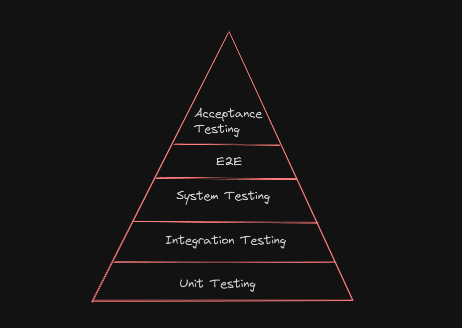

# Table of Contents

- [Internet](#internet)
- [QA Basics](#qa-basics)
   - [Tasks: Intro](#tasks-intro)
   - [Tasks: Learning Write Test Cases](#tasks-learning-write-test-cases)
   - [Examples of Test Case and Scenarios](#examples-of-test-case-and-scenarios)
- [Static Testing vs Dynamic Testing](#static-testing-vs-dynamic-testing)
- [Testing Techniques and analysis](#testing-techniques-and-analysis)
   - [Tasks: Equivalence Partitioning](#tasks-equivalence-partitioning)
   - [Tasks: Boundary Value Analysis](#tasks-boundary-value-analysis)
- [Test Levels and Test Types](#test-levels-and-test-types)
   - [Tasks: Integration Testing](#test-integration-testing)
   - [Tasks: Acceptance Testing](#tasks-acceptance-testing)
   - [Tasks: Compatibility Testing](#compatibility-testing)
   - [Tasks: Accessibility Testing](#accessibility-testing)
- [Project Managment](#project-managment)
   - [Tasks: Backlog Grooming](#tasks-backlog-grooming)
- [Software Testing Life Cycle](#software-testing-life-cycle)
   - [Tasks: Test Case Report](tasks-test-case-report)
   - [Tasks: Bug Report](#tasks-bug-report)
   - [Tasks: Test Summary Report](#tasks-test-summary-report)

# Internet

**Resources:**

- [Dosc: What is Internet?](../internet/README.md)

# QA Basics

- [What is Quality Assurance?](#what-is-quality-assurance)
- [Testing Principles](#testing-principles)
- [Test Case Design](#test-case-design)

## What is Quality Assurance?

- [What is Quality?](#what-is-quality)
- [What is Assurance?](#what-is-assurance)
- [Quality Assurance in Software Testing](#quality-assurance-in-software-testing)

### What is Quality?

**Explanation:**

Quality refers to the degree of excellence or superiority of a product or service. These factors include reliability, performance, security, usability, and the ability to meet customer expectations effectively.

**Key Concepts:**

- **Fitness for Purpose**: A product or service should effectively serve its intended purpose. This means that it should meet the specific needs and requirements

- **Conformance to Requirements**: Ultimately, quality is about satisfying customer needs and expectations.  

- **Customer Satisfaction**: The product satisfies customer needs and expectations.

- **Continuous Improvement**: Quality is not a one-time achievement but an ongoing commitment.

### What is Assurance?

**Explanation:**

It involves activities aimed at building confidence that a product or service will meet its quality objectives.

**Key Concepts:**

- **Preventive Activities**: Assurance includes a range of preventive activities that are designed to stop defects from occurring in the first place. 

- **Process Adherence**: Ensuring that processes are followed consistently.

- **Standardization**: Implementing best practices and standards.

- **Early Detection**: Identifying and addressing issues early in the development lifecycle.

### Quality Assurance in Software Testing

**Explanation:**

Quality Assurance (QA): ensure software products meet specified quality standards.

**Key Concepts:**

- **Process Improvement**: QA involves the continuous identification and implementation of improvements in the testing process.

- **Standardization**: Establishing testing standards and guidelines.

- **Test Planning**: These plans outline the testing objectives, strategies, and schedules, ensuring that testing efforts align with project goals.

- **Metrics and Measurement**: Key performance indicators (KPIs).


**Resources:**

- [Article: What is Quality Assurance(QA)?](https://www.guru99.com/all-about-quality-assurance.html)
- [Article: Why Is ISTQB Certification Important for QA Professionals?](https://www.testdevlab.com/blog/why-is-istqb-certification-important-for-qa-professionals)
- [Article: What is QA?](https://www.investopedia.com/terms/l/lean-six-sigma.asp)

### Tasks: Intro

- [Tasks: Intro](./tasks/qaBasics/intro.md)

## Testing Principles

**Explanation:**

Testing principles in Quality Assurance (QA) are fundamental guidelines and best practices that help ensure the effectiveness and efficiency of the testing process. These principles guide testing activities to identify and address issues in software, ultimately contributing to the development of high-quality products. 

**Key Concepts:**

1. **Early Testing:**
   - **Explanation:** Testing activities should commence as early as possible in the software development life cycle (SDLC). This principle emphasizes the importance of detecting and addressing defects early to reduce the cost of fixing issues later in the development process.
   - **Key Concepts:** Shift-left testing, unit testing, and integration testing.

2. **Testing is Context Dependent:**
   - **Explanation:** Testing strategies and approaches should be tailored to the specific context of the project. The unique requirements, constraints, and goals of each project should guide testing activities.
   - **Key Concepts:** Customized testing approaches, risk-based testing, and project-specific considerations.

3. **Exhaustive Testing is Impossible:**
   - **Explanation:** It's impractical to test every possible combination of inputs and scenarios. Rather than aiming for exhaustive testing, the focus should be on risk-based testing, prioritizing areas with higher risks of defects.
   - **Key Concepts:** Risk analysis, test prioritization, and test coverage.

4. **Defect Clustering:**
   - **Explanation:** A small number of modules or functionalities typically contain the majority of defects. Identifying and targeting these areas for testing can significantly improve the effectiveness of the testing process.
   - **Key Concepts:** Pareto principle, focusing on high-risk areas, and code hotspot analysis.

5. **Pesticide Paradox:**
   - **Explanation:** If the same set of tests is repeated over and over, the effectiveness of those tests decreases as the system evolves. Regularly review and update test cases to ensure they remain effective.
   - **Key Concepts:** Test maintenance, test case review, and periodic test suite updates.

6. **Testing is a Risk-Based Activity:**
   - **Explanation:** Testing should be prioritized based on the level of risk associated with different aspects of the software. High-risk areas should receive more testing focus than low-risk areas.
   - **Key Concepts:** Risk assessment, risk management, and prioritized testing.

7. **Continuous Improvement:**
   - **Explanation:** The testing process should be continuously evaluated and improved. Lessons learned from previous testing cycles should be applied to enhance future testing efforts.
   - **Key Concepts:** Retrospectives, feedback loops, and process improvement initiatives.

## Test Case Design

- [Types of Test Cases](#types-of-test-cases)
- [Test Case Format](#test-case-format)
- [Test Case Types](#test-case-types)
- [Test Scenarios vs Test Case](#test-scenarios-vs-test-case)
- [Test Case Requirements](#test-case-requirements)
- [Common Mistakes](#common-mistakes) 

**Explanation:**

We will explore the fundamentals of test case design, including the types, format, and requirements of test cases.

**Key Concepts:**

- Test case types (positive, negative, destructive)

- Test case format (ID, summary, preconditions, steps, post conditions, expected results, actual results, status)

- Test case requirements (comprehensiveness, repeatability, reusability)

### Types of Test Cases

**Explanation:**

The two types of test cases: positive, negative.

**Key Concepts:**

- Positive test cases (using valid inputs)

- Negative test cases (using invalid inputs)

**Example:**

- Positive test cases are used to validate that software behaves correctly with valid inputs, such as logging in with correct credentials. 

- Negative test cases, on the other hand, aim to ensure the software handles invalid inputs appropriately, like incorrect login credentials. 

### Test Case Format

**Explanation:**

We will break down the format of a test case, including its eight essential elements. Understanding this format is crucial for creating effective test cases.

**Key Concepts:**

- Test case elements (ID, summary, preconditions, steps, expected results, actual results, status)

**Example:**

Eight elements that make up a test case format: 

1. These elements include ID (unique identifier)

2. Summary (brief description)

3. Preconditions (actions needed before the test)

4. Steps (actions for verification)

5. Expected results

6. Actual results

7. Status

### Test Case Types

**Explanation:**

It discusses the flexibility in naming and structuring test cases.

**Key Concepts:**

- Different test case formats

- Variability in naming and section terminology

**Example:**

- That test cases can vary in format and structure. For instance, some may use a shorter format with only a few key elements like summary, priority, steps, and expected results. 

- The terminology used in different sections may also vary, with "inputs" used instead of "steps" or "outputs" instead of "results."

### Test Scenarios vs Test Case

**Test scenarios**

**Explanation:**

Test scenarios are high-level descriptions of the end-to-end functionality of a system or a specific feature.

- **Scope:** They cover broad functionalities and are often written in plain language, providing a general overview of what needs to be tested.

- **Level of Detail:** Test scenarios are less detailed compared to test cases. They focus on the "what" rather than the "how."

- **Use Case:** Test scenarios are often used in the early stages of test planning to outline the major paths or workflows that need to be tested.

- **Example:**

  - *Scenario:* Verify the login functionality.

  - *Scenario:* Test the checkout process for an e-commerce website.

**Test Cases**

**Explanation:**

Test cases are detailed step-by-step instructions that specify how to execute a test scenario. They are more granular and provide specific inputs, actions, and expected outcomes.

- **Scope:** Test cases break down the test scenarios into smaller, manageable units. They are the building blocks for test execution.

- **Level of Detail:** Test cases are highly detailed and include specific conditions, data, and steps required to validate a particular aspect of the system.

- **Use Case:** Test cases are used during the execution phase of testing. Testers follow these detailed instructions to validate the functionality.

- **Example:**

  - *Test Case:* Enter valid username and password and click the "Login" button. Verify that the user is successfully logged in.'

  - *Test Case:* Add a product to the cart, proceed to checkout, and confirm that the order is placed.

**Key Concepts:**

1. **Abstraction Level:**

   - **Test Scenarios:** Higher abstraction level, focusing on overall functionalities.

   - **Test Cases:** Lower abstraction level, providing detailed steps for execution.

2. **Scope:**

   - **Test Scenarios:** Cover broader functionalities or workflows.

   - **Test Cases:** Break down scenarios into smaller, specific units for detailed testing.

3. **Usage in Test Planning:**

   - **Test Scenarios:** Often used in the initial stages of test planning to outline testing scope.
   - **Test Cases:** Used during the execution phase to validate specific conditions and behaviors.

4. **Detail Level:**

   - **Test Scenarios:** Less detailed, providing a general overview.

   - **Test Cases:** Highly detailed, specifying inputs, actions, and expected outcomes.

5. **Execution Focus:**

   - **Test Scenarios:** Focus on "what" needs to be tested.

   - **Test Cases:** Focus on "how" to test a specific aspect of the scenario.

6. **Relationship:**

   - **Test Scenarios:** Act as a blueprint for testing, guiding the creation of detailed test cases.

   - **Test Cases:** Implement the details outlined in test scenarios.

### Examples of Test Case and Scenarios

- [Examples of Test Case and Scenarios](./assets/examples/qaBasics/testCaseAndScenarios/README.md)

### Test Case Requirements

**Explanation:**

Discusses the need for accuracy, clarity, and repeatability in test case documentation.

**Key Concepts:**

- including or dealing with all or nearly all aspects of test cases

- Clear and accurate descriptions

- Repeatability and ease of understanding

**Example:**

- Test cases should be comprehensive and not depend on other cases

- They should provide clear and accurate descriptions of steps and expected results to ensure repeatability.

### Common Mistakes

**Explanation:**

Highlights common mistakes made by QA engineers when writing test cases.

**Key Concepts:**

- Avoiding abstract summaries

- Ensuring clickable links

- Balancing detail in descriptions

**Example:**

- Avoiding overly abstract summaries, advocating for specific and clear descriptions like `"check adding a product to the wishlist"` instead of a generalized `"check wishlist functionality."` 

## Tasks: Learning Write Test Cases

- [Tasks: Learning Write Test Cases](./tasks/qaBasics/testCaseDesignTask.md)

# Static Testing vs Dynamic Testing

- [Static Testing](#static-testing)
- [Dynamic Testing](#dynamic-testing)

## Static Testing

**Explanation:**

Static Testing refers to the process of evaluating a software application or component without executing code. It involves examining the code, design, and documentation to identify errors, ensure compliance with coding standards, and improve the overall quality of the software. This type of testing is performed during the early stages of the software development life cycle (SDLC) and is typically non-execution-based.

```
   +-------------------+
   |  Software Testing |
   +---------+---------+
             |
   +---------v---------+
   | Static Testing    |
   |                   |
   | - Reviews         |
   | - Inspections     |
   | - Walkthroughs    |
   | - Static Analysis |
   +-------------------+
```

  - **Reviews:** A process where team members examine code, design, or documentation to identify issues.
  
  - **Inspections:** A formal process of reviewing work products to find defects early in the development process.
  
  - **Walkthroughs:** An informal, yet structured, process of reviewing documents with the goal of finding defects.
  
  - **Static Analysis:** The examination of code or other software artifacts without executing them, often using automated tools to find issues.

**Key Concepts:**

1. **Types of Static Testing:**
   - **Code Reviews:** Peer review of source code to identify defects and ensure coding standards.
   - **Static Analysis:** Using tools to analyze code, design, or documentation without executing the program.

2. **Benefits of Static Testing:**
   - **Early Defect Detection:** Identifying issues in the early stages of development reduces the cost of fixing defects.
   - **Improved Code Quality:** Ensures adherence to coding standards and best practices.
   - **Knowledge Sharing:** Facilitates knowledge transfer among team members during code reviews.

3. **Examples of Static Testing Activities:**
   - **Code Inspections:** In-depth examination of source code by a group of developers.
   - **Walkthroughs:** Step-by-step review of requirements, design, or code with team members.

4. **Objective:**
   - **Defect Prevention:** Focuses on finding and fixing defects before the code is executed.

## Dynamic Testing

**Explanation:**

Dynamic Testing involves the execution of the software to validate its behavior and functionality. It is performed during runtime and includes various testing techniques to ensure that the software meets specified requirements. Dynamic testing helps identify defects related to the system's actual execution and is typically conducted in later stages of the SDLC.

```plaintext
   +-------------------+
   |  Software Testing |
   +---------+---------+
             |
   +---------v---------+
   | Dynamic Testing   |
   |                   |
   | - Unit Testing    |
   | - Integration     |
   |   Testing         |
   | - System Testing  |
   | - Acceptance      |
   |   Testing         |
   |   - End-to-End    |
   +-------------------+
```

- **Software Testing:** The broader concept of ensuring the quality and correctness of software.

- **Dynamic Testing:** A phase of testing that involves the execution of the software.

  - **Unit Testing:** Testing individual units or components of the software in isolation.
  
  - **Integration Testing:** Testing the combination of units or systems to ensure they work together.
  
  - **System Testing:** Testing the entire system as a whole to verify that it meets the specified requirements.
  
  - **Acceptance Testing:** Verifying that the software meets the acceptance criteria and is ready for deployment.

    - **End-to-End Testing:** Testing the entire application workflow, including all components and dependencies, to ensure the system works as intended from start to finish.

**Key Concepts:**

1. **Types of Dynamic Testing:**
   - **Unit Testing:** Testing individual units or components of the software in isolation.
   - **Integration Testing:** Testing the combination of units or systems to ensure they work together.
   - **System Testing:** Evaluating the entire system's functionality in a complete, integrated environment.

2. **Benefits of Dynamic Testing:**
   - **Verification of Functionality:** Ensures that the software functions as intended.
   - **Identification of Runtime Defects:** Detects defects that may only become apparent during execution.
   - **Performance Testing:** Evaluates how the system performs under various conditions.

3. **Examples of Dynamic Testing Activities:**
   - **Functional Testing:** Verifies that the software functions according to specified requirements.
   - **Regression Testing:** Ensures that new changes do not negatively impact existing functionality.

4. **Objective:**
   - **Defect Detection:** Focuses on finding defects during or after the execution of the software.

# Testing Techniques and analysis

- [Black-Box Test Techniques](#black-box-test-techniques)
- [White-Box Test Techniques](#white-box-test-techniques)
- [Experience-based Test Techniques](#experience-based-test-techniques)
- [Collaboration-based Test Approaches](#collaboration-based-test-approaches)

## Black-Box Test Techniques

- [Equivalence Partitioning](#equivalence-partitioning)
- [Boundary Value Analysis](#boundary-value-analysis)
- [Decision Table Testing](#decision-table-testing)
- [State Transition Testing](#state-transition-testing)

**Explanation:**

Black-box testing is a software testing technique that focuses on assessing the functionality of a software application without examining its internal code or structure. Testers, in this approach, treat the software as a "black box," and their main concern is to verify if the inputs produce the expected outputs without knowledge of the internal workings of the system. Various test techniques are employed to ensure thorough testing of different aspects of the software.

**Key Concepts:**

1. **No Knowledge of Internal Code:**
   - Black-box testers do not have access to the internal code, architecture, or design of the software under test. They focus solely on inputs and outputs.

2. **Functional Testing:**
   - Black-box testing primarily involves functional testing, where the software's functions are tested by providing inputs and examining the corresponding outputs.

3. **Test Cases Based on Requirements:**
   - Test cases are designed based on the software requirements and specifications. The goal is to verify that the software meets its specified functionality.

4. **Test Design Techniques:**
   - Various test design techniques are used to create effective test cases. Examples include equivalence partitioning, boundary value analysis, state transition testing, and decision table testing.

5. **Equivalence Partitioning:**
   - Inputs are divided into groups or partitions, and test cases are designed to represent each partition. This helps ensure that the software behaves consistently across different input ranges.

6. **Boundary Value Analysis:**
   - Test cases are designed to evaluate how the software behaves at the boundaries of input ranges. This is important as defects often occur at the edges of input domains.

7. **State Transition Testing:**
   - Applicable for systems with distinct states. Test cases are designed to verify the transitions between different states and the correct behavior in each state.

8. **Decision Table Testing:**
   - A systematic method for testing combinations of inputs by creating a table that represents all possible combinations of input conditions and corresponding actions.

### Equivalence Partitioning

**Explanation:**

Equivalence Partitioning is a black-box testing technique that divides the input domain of a software application into classes of equivalent inputs. The goal is to reduce the number of test cases while ensuring that the selected test cases effectively represent different scenarios. The underlying concept is that if a system behaves correctly for one input within an equivalence class, it should behave correctly for all inputs within that class.

**Key Concepts:**

1. **Equivalence Class:**
   - An equivalence class is a set of input values that are treated the same way by the system. Testers identify these classes to reduce the number of test cases.

2. **Partitioning:**
   - The input domain is divided into different partitions or classes. Each partition represents a set of inputs that should exhibit similar behavior.

3. **Representative Test Cases:**
   - Test cases are selected from each equivalence class to represent the entire class. If a test case from a specific class works correctly, it is assumed that other values in the same class will also work.

4. **Invalid Equivalence Classes:**
   - In addition to valid equivalence classes (inputs that should be accepted), testers also identify invalid equivalence classes (inputs that should be rejected or produce errors).

7. **Efficiency:**
   - Equivalence partitioning is an efficient testing technique as it helps reduce the number of test cases needed to cover a broad range of scenarios.

8. **Applicability:**
   - This technique is particularly applicable when there is a large set of possible input values, and testing all combinations is not feasible.

9. **Requirements-Based:**
   - Equivalence partitioning is closely tied to the software requirements. The identified equivalence classes align with the expected behavior outlined in the requirements.

10. **Error Detection:**
    - The technique is effective at detecting errors related to the handling of different types of inputs and their respective classes.

**Example:**

- [Example: Equivalence Partitioning](./assets/examples/testingTechniquesAndAnalysis/equivalencePartitioning.md)

### Tasks: Equivalence Partitioning

- [Tasks: Equivalence Partitioning](./tasks/testingTechniquesandAnalysis/equivalencePartitioning.md)

### Boundary Value Analysis

**Explanation:**

Boundary Value Analysis (BVA) is a black-box testing technique that focuses on testing values at the boundaries of input domains. The objective is to identify errors that may occur at the extremes of the input range, where the behavior of the system is likely to change. By testing values at these boundaries, testers aim to ensure the robustness and reliability of the software, as defects often manifest near the limits of acceptable input values.

**Key Concepts:**

1. **Boundary Values:**
   - Test cases are designed to evaluate the behavior of the system at the boundaries of valid input ranges. These boundaries include the minimum, maximum, and points immediately before and after these limits.

2. **Input Domain:**
   - BVA is applied to the input domain of a function or feature. This could include numerical ranges, date ranges, character lengths, and other parameter constraints.

3. **Three-Partition Rule:**
   - The input domain is divided into three partitions: values below the lower bound, values within the valid range, and values above the upper bound. Test cases are then designed for each of these partitions.

7. **Focus on Invalid Inputs:**
   - While BVA primarily focuses on valid input boundaries, it also considers values immediately outside the valid range to test the system's response to invalid inputs.

**Example:**

- [Example: Boundary Value Analysis](./assets/examples/testingTechniquesAndAnalysis/boundryValueAnalysis.md)

### Tasks: Boundary Value Analysis

- [Tasks: Boundary Value Analysis](./tasks/testingTechniquesandAnalysis/boundaryValueAnalysis.md)

### Decision Table Testing

**Explanation:**

Decision Table Testing is a black-box testing technique used to design test cases that cover different combinations of input conditions and their corresponding actions or outcomes. It is particularly useful when a system's behavior is influenced by multiple conditions or rules, and the interactions between these conditions need to be thoroughly tested. Decision tables provide a structured way to represent complex business rules and ensure comprehensive test coverage.

**Key Concepts:**

1. **Decision Table Components:**
   - **Conditions (Inputs):** Represent the various factors or input conditions that influence the system's behavior.
   - **Actions (Outputs):** Indicate the expected outcomes or actions based on combinations of input conditions.

2. **Rules:**
   - Each row in the decision table represents a unique combination of input conditions and their corresponding outcomes. These combinations are often referred to as rules.

3. **Columns:**
   - The decision table consists of columns for each condition and action. It provides a visual representation of the relationships between conditions and actions.

4. **Condition States:**
   - Conditions can have different states, typically denoted as "true," "false," or "don't care" (indicating that the condition's state does not matter for a specific rule).

7. **Boundary Conditions:**
   - Decision tables can include boundary conditions to test the system's behavior at the edges of acceptable input ranges.

**Example:**

- [Example: Decision Table Testing](./assets/examples/testingTechniquesAndAnalysis/decisionTableTesting.md)

### Tasks: Decision Table Testing

### State Transition Testing

**Explanation:**

State Transition Testing is a black-box testing technique that focuses on testing the behavior of a system as it transitions between different states. This technique is particularly applicable to systems with distinct states, where the behavior and functionality can change based on specific events or conditions. The primary goal of state transition testing is to ensure that the system transitions correctly between states and behaves as expected in each state.

**Key Concepts:**

1. **States:**
   - A state represents a condition or situation in which a system exists at a specific point in time. The system's behavior and functionality may vary depending on its current state.

2. **Events:**
   - Events trigger state transitions. An event is an occurrence that causes the system to move from one state to another. Events can be internal or external.

3. **Transitions:**
   - Transitions describe the movement of the system from one state to another in response to an event. The transitions are governed by specific rules or conditions.

4. **State Diagram:**
   - A state transition diagram is often used to visually represent the different states, events, and transitions within a system. It provides a clear and concise view of the system's behavior.

5. **Actions:**
   - Actions are the activities or operations that the system performs when it transitions from one state to another. Each transition may be associated with specific actions.

6. **Conditions:**
   - Conditions define the criteria that must be met for a particular state transition to occur. These conditions may be based on the current state, event, or external factors.

7. **Test Cases:**
   - Test cases for state transition testing are designed to cover different combinations of events and current states, ensuring that the system transitions correctly and performs the expected actions.

**Example:**

- [Example: State Transition Testing](./assets/examples/testingTechniquesAndAnalysis/stateTransitionTesting.md)

### Tasks: State Transition Testing

## White-Box Test Techniques

## Experience-based Test Techniques

- [Exploratory Testing](#exploratory-testing)

### Exploratory Testing

### Tasks: Exploratory Testing

- [Tasks: Exploratory Testing](./tasks/testingTechniquesandAnalysis/equivalencePartitioning.md)

## Collaboration-based Test Approaches

- [Collaborative User Story Writing](#collaborative-user-story-writing)
- [Acceptance Criteria](#acceptance-criteria)

### Collaborative User Story Writing

### Acceptance Criteria

# Test Levels and Test Types

- [Test Levels](#test-levels)
- [Test Types](#test-types)

## Test Levels

**Explanation:**

In software testing, test levels represent different stages of testing that occur at various points in the software development life cycle (SDLC). Each test level has specific objectives, focuses on different aspects of the software, and involves different testing activities. These levels are organized hierarchically, with each subsequent level building on the results of the previous ones.



**Key Concepts:**

1. **Unit Testing:**
   - **Explanation:** Unit testing involves testing individual units or components of the software in isolation to ensure that each unit functions as intended.
   - **Key Concepts:** Focus on the smallest parts of the system, typically automated, and defects are addressed before higher-level testing.

2. **Integration Testing:**
   - **Explanation:** Integration testing involves testing combined units or components to ensure they work together as intended. It focuses on identifying interactions and interface issues.
   - **Key Concepts:** Different integration strategies, such as top-down and bottom-up testing, to verify the flow of data and control between integrated components.

### 3. **System Testing:**
   - **Explanation:** System testing assesses the entire system as a whole, verifying that all components, when integrated, meet specified requirements and ensuring the system functions correctly.
   - **Key Concepts:** Comprehensive functional and non-functional testing, test cases based on system requirements, and various testing techniques.

### 4. **End-to-End (E2E) Testing:**
   - **Explanation:** End-to-End (E2E) testing evaluates the entire workflow of a software application from start to finish, ensuring that all integrated components work together seamlessly.
   - **Key Concepts:** Real-world scenarios, integration of all components, user interface testing, cross-browser and cross-device testing, data flow and transactions testing, and validation of business processes.

### 5. **Acceptance Testing:**
   - **Explanation:** Acceptance testing is the final test level, determining if the software is ready for release. It validates that the software satisfies business requirements and is accepted by stakeholders.
   - **Key Concepts:** User Acceptance Testing (UAT) involving end-users, Alpha/Beta Testing involving external users, and a focus on overall system functionality and business objectives.

## Test Types

  - [Functional testing](#functional-testing)
  - [Non-functional testing](#non-functional-testing)

**Explanation:**

In software testing, test types represent different aspects or dimensions of testing that focus on specific characteristics or objectives. Each test type is designed to address specific testing goals and contribute to the overall assessment of the software's quality. Test types are chosen based on the nature of the software, project requirements, and the testing objectives. Here are some common test types:

**Key Concepts:**

1. **Functional Testing:**
   - **Explanation:** Functional testing evaluates the software's functionality against specified requirements. It ensures that the application performs its intended functions correctly.
   - **Key Concepts:** Test cases are designed based on functional specifications, and the focus is on input-output relationships and business processes.

2. **Non-Functional Testing:**
   - **Explanation:** Non-functional testing assesses aspects of the software other than its functionality, including performance, reliability, usability, and security.
   - **Key Concepts:** Test cases are designed to measure and evaluate non-functional attributes like response time, scalability, user experience, and security vulnerabilities.

3. **Manual Testing:**
   - **Explanation:** Manual testing involves human testers executing test cases without the use of automation tools. Testers simulate user interactions and assess software behavior.
   - **Key Concepts:** Exploratory testing, ad-hoc testing, and scripted testing performed manually by testers.

### Functional testing

- [Unit Testing](#unit-testing)
- [Integration Testing](#integration-testing)
- [System Testing](#system-testing)
- [End to End Testing(E2E)](#end-to-end-testing-e2e)
- [Acceptance Testing](#acceptance-testing)
- [Smoke Testing and Sanity Testing](#smoke-testing-and-sanity-testing)
- [Regression Testing](#regression-testing)

**Explanation:**

Functional testing is a software testing type that focuses on verifying that the software functions as per the specified requirements. The goal is to ensure that the application behaves correctly and meets the functional expectations of users. Functional testing assesses the software's features, user interfaces, APIs, databases, and other components to validate that they operate according to the defined functional specifications.

**Key Concepts:**

1. **Requirements-Based Testing:**
   - Functional testing is closely tied to the software requirements. Test cases are designed based on the functional specifications to verify that the software aligns with the specified behavior.

2. **Black-Box Testing:**
   - Functional testing is often conducted as black-box testing, meaning testers focus on the inputs and outputs of the software without having knowledge of its internal code or structure.

3. **Test Cases and Test Scenarios:**
   - Test cases and test scenarios are created to cover different aspects of the software's functionality. Test scenarios are broader, describing end-to-end processes, while test cases focus on specific functionalities.

4. **Input-Output Verification:**
   - Testers validate the output produced by the software against expected results based on given inputs. This ensures that the software processes inputs correctly and generates the expected outputs.

5. **Functional Modules:**
   - Functional testing is often organized around functional modules or components of the software. Testers assess each module's behavior independently to ensure that individual features work as intended.

6. **User Interface Testing:**
   - For applications with user interfaces, functional testing includes assessing the usability and functionality of the UI elements. This involves verifying that buttons, forms, navigation, and other UI components work correctly.

7. **Data Validations:**
   - Functional testing includes validating data input, processing, and output. This ensures that the software handles data appropriately and produces accurate results.

8. **Boundary Value Analysis:**
   - Test cases are often designed based on boundary values to verify that the software behaves correctly at the edges of input domains. This is crucial for detecting issues related to input validation.

9. **Integration Testing:**
   - Functional testing often includes integration testing to ensure that different components of the software work seamlessly together, and data flows correctly between integrated modules.

10. **System Testing:**
    - As part of the overall testing strategy, functional testing is integrated into system testing to evaluate the entire system's functionality.

11. **Acceptance Testing:**
    - Functional testing contributes to acceptance testing, where the focus is on verifying that the software meets user requirements and is ready for release.

### Unit Testing 

**Explanation:**

Unit testing is a software testing technique where individual units or components of a software application are tested in isolation to ensure that they work as intended. A unit is the smallest testable part of the software, often a function, method, or procedure. The primary goal of unit testing is to validate that each unit of the software performs its functions correctly according to the design specifications.

**Key Concepts:**

1. **Isolation:**
   - Unit testing focuses on isolating individual units or components from the rest of the application. This is achieved by testing each unit independently without considering the interactions with other units.

2. **White-Box Testing:**
   - Unit testing is a form of white-box testing, meaning that testers have knowledge of the internal structure, logic, and code of the units being tested.

3. **Test Cases:**
   - Test cases for unit testing are designed to cover different scenarios for a specific unit. Test cases often include input values, expected outputs, and conditions under which the unit is expected to function correctly.

4. **Automated Testing:**
   - Unit testing is highly conducive to automation. Automated testing frameworks and tools are commonly used to execute unit tests, allowing for quick and efficient testing of individual units.

5. **Regression Testing:**
   - Unit tests serve as a foundation for regression testing. Whenever changes are made to the codebase, unit tests are executed to ensure that existing functionality remains unaffected.

6. **Red-Green-Refactor Cycle:**
   - The red-green-refactor cycle is a fundamental concept in unit testing. It involves writing a failing test (red), making the test pass (green), and then refactoring the code while ensuring that the test still passes.

7. **Continuous Integration:**
    - Unit testing plays a crucial role in continuous integration processes, where automated tests, including unit tests, are executed whenever changes are pushed to the version control system.

8. **Defect Localization:**
    - If a unit test fails, it helps in quickly identifying the specific unit or component that is not functioning correctly, aiding in efficient defect localization.

### Integration Testing 

- [APIs Testing in Integration Testing](#apis-testing-in-integration-testing)

**Explanation:**

Integration testing is a software testing technique that focuses on verifying the interactions between different components or units of a software application when integrated together. The goal of integration testing is to ensure that these integrated components work as intended and that the data and control flow between them is correct. This testing phase comes after unit testing and precedes system testing, aiming to identify and address issues related to component interactions.

**Key Concepts:**

1. **Component Integration:**
   - Integration testing involves testing the integration points between different components, such as modules, classes, functions, or services. The focus is on validating that these components interact correctly.

4. **Functional and Non-Functional Testing:**
   - Integration testing encompasses both functional and non-functional testing aspects. Functional testing verifies that integrated components perform their intended functions, while non-functional testing addresses aspects like performance, reliability, and scalability.

7. **Continuous Integration:**
   - Integration testing is closely aligned with continuous integration practices. Automated integration tests are often executed as part of the continuous integration pipeline to ensure that integration issues are identified early.

8. **Concurrency and Parallelism:**
   - Integration testing assesses how components handle concurrent and parallel processing. It verifies that multiple components can run concurrently without interfering with each other.

9. **Data Flow and Interface Testing:**
   - Testing the flow of data between integrated components is a crucial aspect of integration testing. Interface testing ensures that data is exchanged correctly and that input from one component produces the expected output in another. 

### APIs Testing in Integration Testing

**Explanation:**

API (Application Programming Interface) testing in integration testing focuses on validating the interactions and communication between different software components through their APIs. APIs define the methods and protocols used for communication between software systems. API testing ensures that these interfaces function correctly, handle data appropriately, and maintain the expected behavior when integrated into the larger system.

**Key Concepts:**

1. **API Endpoints:**
   - API testing involves verifying the functionality and behavior of various API endpoints. These endpoints represent specific functionalities or services exposed by the API.

2. **Request and Response Validation:**
   - Testing the requests sent to the API and the responses received is fundamental. This includes validating data formats, parameter values, and the correctness of the returned data.

3. **HTTP Methods:**
   - APIs typically use HTTP methods (GET, POST, PUT, DELETE, etc.) to perform operations. API testing ensures that these methods are implemented correctly, and each method produces the expected outcomes.

4. **Data Formats:**
   - APIs often use specific data formats, such as JSON or XML, for data exchange. API testing includes verifying that data is serialized and deserialized correctly, ensuring compatibility between systems.

5. **Authentication and Authorization:**
   - Testing authentication mechanisms and authorization processes is crucial for API security. API testing ensures that only authorized users can access specific functionalities.

6. **Error Handling:**
   - API testing includes testing how well the API handles errors. This involves sending incorrect requests and verifying that the API responds appropriately with error codes and messages.

7. **Rate Limiting and Throttling:**
   - Some APIs implement rate limiting or throttling to control the number of requests a client can make within a given time frame. API testing verifies that these limitations are enforced correctly.

8. **Security:**
   - Security is a key aspect of API testing. This includes testing for vulnerabilities, such as SQL injection or cross-site scripting (XSS), and ensuring that sensitive data is handled securely.

9. **Dependencies and Third-Party Integrations:**
   - APIs often rely on external services or third-party integrations. API testing ensures that these dependencies are properly integrated and that the API behaves as expected when interacting with external systems.

10. **Scalability:**
    - API testing assesses the scalability of the API by testing how it performs under different loads, ensuring that it can handle an increased number of requests without degrading performance.

11. **Documentation Verification:**
    - API documentation provides details on how to use the API. API testing involves verifying that the actual behavior aligns with the documented specifications.

12. **Webhooks and Callbacks:**
    - Some APIs use webhooks or callbacks for asynchronous communication. API testing includes verifying that these mechanisms work as intended and trigger the expected actions.

### Tasks: Integration Testing

### System Testing

**Explanation:**

System testing is a comprehensive software testing phase that assesses the entire integrated software system to ensure it functions according to specified requirements. It involves testing the system as a whole, including its components, interfaces, and external dependencies. The primary goal of system testing is to validate that the software meets its intended objectives and functions correctly in the operational environment.

**Key Concepts:**

1. **End-to-End Testing:**
   - System testing involves end-to-end testing of the entire software application, evaluating its behavior from the user's perspective. This includes testing all features and functionalities.

2. **Functional and Non-Functional Testing:**
   - Both functional and non-functional aspects are covered in system testing. Functional testing verifies that the software performs its intended functions, while non-functional testing addresses aspects like performance, usability, and security.

3. **Test Cases Based on Requirements:**
   - Test cases for system testing are derived from the software requirements specifications. The testing team designs test scenarios to cover all aspects of the system's functionality.

4. **Compatibility Testing:**
   - System testing includes compatibility testing to ensure that the software functions correctly across different environments, devices, browsers, and operating systems.

5. **Performance Testing:**
   - Performance testing within system testing assesses the software's responsiveness, stability, and scalability under various conditions, such as normal and peak loads.

6. **Usability Testing:**
   - Usability testing evaluates the user interface and overall user experience to ensure that the software is user-friendly and meets user expectations.

7. **Security Testing:**
   - Security testing is an integral part of system testing, assessing the software for vulnerabilities, ensuring secure data transmission, and validating access controls.

9. **Regression Testing:**
   - System testing often involves regression testing to ensure that new changes or fixes have not negatively impacted existing functionalities.

10. **User Acceptance Testing (UAT):**
    - While user acceptance testing is a separate test level, it is often integrated into system testing to validate that the software meets user expectations before release.

### End to End Testing(E2E)

**Explanation:**

End-to-End (E2E) testing is a software testing methodology that evaluates the entire workflow of an application from start to finish. The goal of E2E testing is to ensure that all components of a system work together as expected and that the application behaves as intended in a real-world scenario. This type of testing simulates user interactions with the software, covering multiple integrated components and validating the system's functionality and performance.

**Key Concepts:**

1. **Real-World Scenarios:**
   - E2E testing involves creating test scenarios that replicate real-world user interactions. These scenarios encompass various functionalities and workflows within the application.

2. **User Perspective:**
   - The testing process is designed to mimic user actions, providing a perspective similar to that of an actual end-user. This includes interactions with the user interface, data input, and navigation.

3. **Business Processes:**
   - E2E testing validates entire business processes within the application, ensuring that data flows seamlessly between different components and that the expected outcomes are achieved.

4. **Test Environment:**
   - E2E testing is typically conducted in an environment that closely resembles the production environment. This ensures that the testing conditions mirror the conditions under which the software will operate.

5. **Automated Testing:**
   - Automation is commonly employed for E2E testing due to the complexity and the need to execute a series of actions across multiple components. Automated scripts simulate user interactions and validate the application's responses.

6. **Data Integrity:**
   - E2E testing includes verifying the integrity of data as it moves through the entire system. This involves checking data consistency, accuracy, and correctness at different stages of the workflow.

7. **User Interface Testing:**
   - Validation of the user interface is a critical aspect of E2E testing. This includes checking the layout, design, and functionality of the UI components to ensure a seamless user experience.

8. **Integration Points:**
   - E2E testing covers the integration points between different modules, services, or components of the application. It ensures that data is exchanged correctly and that integrated features work harmoniously.

9. **Cross-Browser and Cross-Device Testing:**
   - E2E testing verifies that the application functions consistently across different web browsers and devices. This is crucial for ensuring a broad user reach.

### Acceptance Testing

**Explanation:**

Acceptance testing is a software testing phase that assesses whether a system meets the specified acceptance criteria and is ready for release. It involves validating the software against business requirements, user expectations, and overall stakeholder satisfaction. Acceptance testing is typically the final phase of testing before the software is deployed into the production environment.

**Key Concepts:**

1. **User-Centric Evaluation:**
   - Acceptance testing is focused on evaluating the software from the user's perspective. It ensures that the software aligns with user needs and expectations.

2. **Acceptance Criteria:**
   - The testing process is guided by acceptance criteria, which are predefined conditions that must be met for the software to be considered acceptable. These criteria are often derived from business requirements.

3. **Types of Acceptance Testing:**
   - Acceptance testing can be categorized into different types, including User Acceptance Testing (UAT), Business Acceptance Testing (BAT), and Operational Acceptance Testing (OAT). UAT involves end-users executing test cases, BAT involves business stakeholders validating business processes, and OAT involves validating operational aspects such as backups and disaster recovery.

4. **Validation of Business Processes:**
   - Acceptance testing validates that the implemented software supports and enhances critical business processes. It ensures that the software contributes positively to the overall business objectives.

5. **Alpha and Beta Testing:**
   - Alpha testing involves testing the software in a controlled environment by the development team, while beta testing involves testing the software in a real-world environment by a selected group of end-users. Both alpha and beta testing fall under the umbrella of acceptance testing.

6. **Stakeholder Involvement:**
   - Stakeholders, including end-users, business analysts, and other relevant parties, actively participate in the acceptance testing process. Their feedback and validation are crucial for determining the software's readiness for deployment.

8. **Regression Testing:**
   - Regression testing may be performed during acceptance testing to ensure that new changes or fixes do not adversely affect existing functionalities.

9. **Documentation Verification:**
    - The testing process involves verifying that documentation, such as user manuals and training materials, accurately reflects the functionality of the software.

### Tasks: Acceptance Testing

### Smoke Testing and Sanity Testing

**Explanation:**

*Smoke Testing:*

- **Performed By:** Typically carried out by dedicated testing teams.
- **Objective:** Quickly assess the overall stability of the software build.
- **Scope:** Covers major functionalities and critical components.
- **Automation:** May involve automated tests for efficiency.
- **Decision-Making:** Influences the decision to proceed to comprehensive testing or address critical issues.

*Sanity Testing:*

- **Performed By:** Generally performed by testers, but developers may be involved.
- **Objective:** Focuses on specific functionalities or areas impacted by recent changes.
- **Collaboration:** Can involve collaboration between developers and testers.
- **Regression Aspect:** Includes regression testing to ensure existing functionalities are not negatively affected.
- **Quick Assessment:** Designed for a quick assessment of the build's stability after specific changes.

*Collaboration:*

- **Development-Testing Collaboration:**
  - Collaboration is crucial for effective testing.
  - Developers may assist in defining test cases and provide insights into recent changes.
  - Clear communication ensures that both smoke and sanity testing cover critical areas.

- **Responsibilities:**
  - Smoke testing is primarily the responsibility of testing teams.
  - Sanity testing may involve testers and developers, especially for verifying bug fixes or changes made by the development team.

**Key Concepts:**

- **Early Detection:**
  - Both tests contribute to early defect detection, preventing issues from progressing to later stages.

- **Decision Support:**
  - Results from smoke and sanity testing aid in decision-making regarding further testing or addressing critical issues.

- **Resource Efficiency:**
  - The quick and focused nature of these tests optimizes testing resources and time.

- **Stability Assessment:**
  - Smoke testing assesses the overall stability, while sanity testing verifies specific areas after changes.

### Regression Testing

**Explanation:**

Regression testing is a software testing practice that involves re-executing previously executed test cases on a modified version of the software to ensure that existing functionalities still work as intended after changes or enhancements. The primary goal of regression testing is to detect and prevent the introduction of new defects or unintended side effects resulting from code changes, bug fixes, or new feature implementations.

**Key Concepts:**

1. **Test Suite:**
   - Regression testing is conducted using a test suite, which is a collection of test cases that cover various aspects of the software's functionality.

2. **Automated and Manual Testing:**
   - Regression testing can be performed manually or automated, depending on the size and complexity of the software. Automated regression testing is particularly useful for repetitive and time-consuming tasks.

3. **Baseline Comparison:**
   - A baseline, representing the stable version of the software, is established. After each code change, the modified version is compared to the baseline to identify any deviations.

4. **Continuous Integration:**
   - In continuous integration and continuous deployment (CI/CD) environments, regression testing is often integrated into the development workflow. Automated tests are triggered automatically whenever new code is committed.

5. **Impact Analysis:**
   - Before conducting regression testing, a careful impact analysis is performed to identify the areas of the application that might be affected by the code changes. This helps in selecting relevant test cases.

6. **Selective Testing:**
   - Instead of executing the entire test suite, selective testing focuses on the test cases related to the modified code or areas impacted by the changes. This ensures efficiency in testing.

7. **Defect Detection:**
   - Regression testing helps in detecting defects introduced by recent changes, ensuring that the software remains stable and reliable.

### Non-functional testing

- [Compatibility Testing](#compatibility-testing)
- [Accessibility Testing](#accessibility-testing)
- [Performance Testing](#performance-testing)
- [Security Testing](#security-testing)

**Explanation:**

Non-functional testing is a type of software testing that evaluates the aspects of a system that are not related to specific behaviors or functions. Instead, it focuses on the performance, reliability, usability, and other non-functional attributes of the software. The goal of non-functional testing is to ensure that the software not only meets functional requirements but also exhibits high standards in terms of its overall quality and user experience.

**Key Concepts:**

1. **Performance Testing:**
   - **Objective:** Assess the responsiveness, speed, scalability, and overall performance of the software under various conditions.
   - **Types:** Includes load testing, stress testing, scalability testing, and endurance testing.

2. **Compatibility Testing:**
   - **Objective:** Verify that the software functions correctly across different environments, devices, browsers, and operating systems.
   - **Key Concepts:** Cross-browser testing, cross-device testing, and ensuring compatibility with various configurations.

3. **Usability Testing:**
   - **Objective:** Evaluate the user interface, user experience, and overall usability of the software.
   - **Key Concepts:** User-centric design, accessibility, and ease of interaction.

4. **Reliability and Availability Testing:**
   - **Objective:** Assess the reliability, availability, and fault tolerance of the software in real-world scenarios.
   - **Key Concepts:** Recovery testing, fault tolerance testing, and ensuring system availability.

5. **Security Testing:**
   - **Objective:** Identify vulnerabilities and weaknesses in the software to ensure data confidentiality, integrity, and system security.
   - **Key Concepts:** Penetration testing, vulnerability assessments, and ensuring secure data transmission.

6. **Scalability Testing:**
   - **Objective:** Evaluate the software's ability to handle increased load and scalability as user numbers or data volumes grow.
   - **Key Concepts:** Horizontal and vertical scaling, performance under increased load.

7. **Load Testing:**
   - **Objective:** Assess the software's performance under expected load conditions.
   - **Key Concepts:** Simulating realistic user loads, measuring response times, and identifying performance bottlenecks.

8. **Stress Testing:**
   - **Objective:** Determine the software's stability and behavior under extreme conditions or beyond its designed capacity.
   - **Key Concepts:** Assessing the breaking point and evaluating how the system recovers from stress.

9. **Maintainability Testing:**
   - **Objective:** Evaluate how easily the software can be maintained, updated, or modified.
   - **Key Concepts:** Code maintainability, ease of updates, and minimizing technical debt.

10. **Portability Testing:**
    - **Objective:** Ensure that the software can be easily ported or adapted to different environments and platforms.
    - **Key Concepts:** Assessing compatibility with various operating systems, databases, and hardware configurations.

11. **Backup and Recovery Testing:**
    - **Objective:** Verify the effectiveness of backup and recovery procedures, ensuring data integrity and system resilience.
    - **Key Concepts:** Testing data recovery, backup processes, and system restore capabilities.

12. **Documentation Testing:**
    - **Objective:** Assess the accuracy and completeness of documentation related to the software.
    - **Key Concepts:** User manuals, system documentation, and alignment with actual system behavior.

### Compatibility Testing

**Explanation:**

Compatibility testing is a type of non-functional testing that assesses the software's compatibility with different environments, devices, browsers, and operating systems. The goal is to ensure that the software functions correctly and consistently across a diverse range of configurations, providing a seamless user experience regardless of the user's choice of technology or platform.

**Key Concepts:**

1. **Cross-Browser Testing:**
   - **Objective:** Verify that the software performs consistently across various web browsers such as Chrome, Firefox, Safari, and Internet Explorer.
   - **Key Concepts:** Testing on different browsers to identify and address browser-specific issues.

2. **Cross-Device Testing:**
   - **Objective:** Assess the software's functionality on different devices, including desktops, laptops, tablets, and mobile phones.
   - **Key Concepts:** Ensuring responsive design, adapting to different screen sizes, and validating touch interactions on mobile devices.

3. **Operating System Compatibility:**
   - **Objective:** Validate that the software works seamlessly on different operating systems such as Windows, macOS, Linux, Android, and iOS.
   - **Key Concepts:** Testing on various platforms to identify and resolve OS-specific issues.

4. **Hardware Compatibility:**
   - **Objective:** Ensure that the software is compatible with different hardware configurations, including variations in processors, memory, and graphics cards.
   - **Key Concepts:** Verifying performance and functionality on a range of hardware specifications.

5. **Browser Version Compatibility:**
   - **Objective:** Test the software on different versions of the same browser to ensure backward and forward compatibility.
   - **Key Concepts:** Identifying and addressing issues that may arise due to browser version differences.

6. **Database Compatibility:**
   - **Objective:** Validate that the software works seamlessly with various database management systems (DBMS) and versions.
   - **Key Concepts:** Testing database interactions and ensuring compatibility with different SQL or NoSQL databases.

7. **Network Compatibility:**
   - **Objective:** Assess the software's performance under different network conditions, including various internet speeds and connectivity scenarios.
   - **Key Concepts:** Simulating slow network connections and testing application responsiveness.

8. **Resolution and Screen Size Compatibility:**
   - **Objective:** Ensure that the software adapts to different screen resolutions and sizes.
   - **Key Concepts:** Verifying responsive design principles and validating layout consistency.

9. **Plug-in and Extension Compatibility:**
   - **Objective:** Confirm that the software works seamlessly with various plug-ins, extensions, or third-party integrations.
   - **Key Concepts:** Identifying conflicts or compatibility issues with additional software components.

### Tasks: Compatibility Testing

### Accessibility Testing

**Explanation:**

Accessibility testing is a type of non-functional testing that evaluates whether a software application is accessible and usable by people with disabilities. The goal is to ensure that individuals with diverse abilities can interact with and benefit from the software, providing an inclusive and equitable user experience.

**Key Concepts:**

1. **Inclusive Design:**
   - **Objective:** Ensure that the design of the software is inclusive and accessible to individuals with various disabilities.
   - **Key Concepts:** Designing interfaces that consider diverse needs, including those with visual, auditory, motor, and cognitive impairments.

2. **WCAG Guidelines:**
   - **Objective:** Adherence to the Web Content Accessibility Guidelines (WCAG) to ensure compliance with recognized accessibility standards.
   - **Key Concepts:** Following WCAG principles, including perceivability, operability, understandability, and robustness.

3. **Screen Reader Compatibility:**
   - **Objective:** Verify that the software is compatible with screen readers, enabling users with visual impairments to access content.
   - **Key Concepts:** Testing for proper reading of screen reader-friendly content and providing alternative text for images.

4. **Keyboard Accessibility:**
   - **Objective:** Ensure that all functionalities are accessible and navigable using only a keyboard, catering to users with motor impairments.
   - **Key Concepts:** Testing tab navigation, keyboard shortcuts, and focus management.

5. **Color Contrast and Visibility:**
   - **Objective:** Assess the color contrast of text and background elements to enhance visibility for users with visual impairments.
   - **Key Concepts:** Ensuring sufficient color contrast and avoiding reliance on color alone to convey information.

6. **Alternative Text for Images:**
   - **Objective:** Provide descriptive alternative text for images to convey their meaning to users who cannot see them.
   - **Key Concepts:** Including meaningful alternative text that enhances comprehension for screen reader users.

7. **Captioning and Transcripts:**
   - **Objective:** Ensure the availability of captions for audio content and transcripts for video content, benefiting users with hearing impairments.
   - **Key Concepts:** Verifying accurate captions and transcripts that convey the essential information.

8. **Focus Indicators:**
   - **Objective:** Provide clear visual indicators of focus for users navigating through the software using a keyboard.
   - **Key Concepts:** Testing focus styles, ensuring they are visible and distinctive.

9. **Readable Font and Text Size:**
   - **Objective:** Ensure that text is readable, and font sizes can be adjusted for users with visual impairments.
   - **Key Concepts:** Providing options to adjust font sizes and choosing fonts with good readability.

10. **Form and Input Accessibility:**
    - **Objective:** Ensure that forms and input fields are accessible, accommodating users who may rely on assistive technologies.
    - **Key Concepts:** Validating accessible form labels, input descriptions, and error messages.

11. **Responsive Design:**
    - **Objective:** Ensure that the software's design is responsive, providing a consistent and accessible experience across different devices.
    - **Key Concepts:** Testing on various screen sizes and ensuring responsive layouts.

### Tasks: Accessibility Testing

### Performance Testing

**Explanation:**

Performance testing is a type of non-functional testing that evaluates the responsiveness, speed, scalability, stability, and overall performance of a software application under various conditions. The goal is to identify performance bottlenecks, measure the system's behavior under different loads, and ensure that it meets performance expectations in real-world scenarios.

**Key Concepts:**

1. **Load Testing:**
   - **Objective:** Assess the software's performance under expected load conditions, simulating realistic user activity.
   - **Key Concepts:** Determining the maximum load the system can handle without performance degradation.

2. **Stress Testing:**
   - **Objective:** Evaluate the software's stability and behavior under extreme conditions or beyond its designed capacity.
   - **Key Concepts:** Assessing the breaking point, understanding failure conditions, and evaluating recovery.

3. **Scalability Testing:**
   - **Objective:** Determine the software's ability to handle increased load and scalability as user numbers or data volumes grow.
   - **Key Concepts:** Horizontal and vertical scaling, performance under increased load.

4. **Endurance Testing:**
   - **Objective:** Assess the software's performance over an extended period to identify issues related to prolonged usage.
   - **Key Concepts:** Identifying memory leaks, resource exhaustion, and system degradation over time.

5. **Response Time Analysis:**
   - **Objective:** Measure the time taken by the software to respond to user actions under normal and peak loads.
   - **Key Concepts:** Analyzing response times for critical functions and transactions.

6. **Throughput Measurement:**
   - **Objective:** Measure the number of transactions or operations that the system can handle per unit of time.
   - **Key Concepts:** Assessing the system's efficiency in processing a high volume of transactions.

7. **Concurrency Testing:**
   - **Objective:** Evaluate the software's ability to handle multiple simultaneous users or transactions.
   - **Key Concepts:** Identifying contention issues, deadlock situations, and resource conflicts.

8. **Network Latency Testing:**
   - **Objective:** Assess the impact of network delays on the software's performance.
   - **Key Concepts:** Simulating different network conditions and measuring the effect on response times.

9. **Resource Utilization Monitoring:**
   - **Objective:** Monitor and analyze the utilization of system resources such as CPU, memory, and disk space during testing.
   - **Key Concepts:** Identifying resource bottlenecks and optimizing resource usage.

10. **Load Balancing Testing:**
    - **Objective:** Verify the effectiveness of load balancing mechanisms in distributing traffic across servers.
    - **Key Concepts:** Ensuring even distribution of load and preventing server overloads.

11. **Failover and Recovery Testing:**
    - **Objective:** Assess the software's ability to recover from failures and continue functioning.
    - **Key Concepts:** Testing failover mechanisms, backup systems, and recovery procedures.

12. **Benchmark Testing:**
    - **Objective:** Establish a performance baseline for the software under normal operating conditions.
    - **Key Concepts:** Creating benchmarks to measure performance improvements or regressions.

### Security Testing

**Explanation:**

Security testing is a type of non-functional testing that focuses on identifying vulnerabilities, weaknesses, and potential security risks in a software application. The goal is to ensure that the software protects sensitive data, user privacy, and system integrity, safeguarding against potential security threats and attacks.

**Key Concepts:**

1. **Vulnerability Assessment:**
   - **Objective:** Identify and assess potential vulnerabilities in the software that could be exploited by attackers.
   - **Key Concepts:** Conducting code reviews, static analysis, and vulnerability scanning.

2. **Penetration Testing:**
   - **Objective:** Simulate real-world attacks to identify and exploit vulnerabilities, providing insights into the effectiveness of security measures.
   - **Key Concepts:** Ethical hacking, exploiting known vulnerabilities, and identifying potential attack vectors.

3. **Authentication Testing:**
   - **Objective:** Verify the effectiveness of user authentication mechanisms and ensure secure access controls.
   - **Key Concepts:** Testing password policies, multi-factor authentication, and session management.

4. **Authorization Testing:**
   - **Objective:** Assess the software's authorization mechanisms to ensure that users have appropriate access levels and permissions.
   - **Key Concepts:** Testing role-based access control, least privilege principles, and access restrictions.

5. **Data Security Testing:**
   - **Objective:** Ensure the confidentiality, integrity, and availability of sensitive data throughout its lifecycle.
   - **Key Concepts:** Encryption, secure data transmission, and protection against data leaks.

6. **Input Validation Testing:**
   - **Objective:** Validate that the software properly validates and sanitizes user inputs to prevent common security vulnerabilities.
   - **Key Concepts:** Testing for SQL injection, cross-site scripting (XSS), and other injection attacks.

7. **Security Configuration Testing:**
   - **Objective:** Verify that security configurations are appropriately set to minimize security risks.
   - **Key Concepts:** Reviewing server configurations, ensuring secure defaults, and addressing unnecessary exposures.

8. **Session Management Testing:**
   - **Objective:** Assess the security of user sessions, ensuring that session tokens are securely managed.
   - **Key Concepts:** Testing for session fixation, session hijacking, and session timeout controls.

9. **Cryptography Testing:**
   - **Objective:** Evaluate the effectiveness of cryptographic mechanisms used for data protection.
   - **Key Concepts:** Testing encryption algorithms, key management, and secure storage of cryptographic keys.

10. **Security Logging and Monitoring:**
    - **Objective:** Ensure that the software logs security-related events and activities and has monitoring mechanisms in place.
    - **Key Concepts:** Reviewing logs, setting up alerts for suspicious activities, and monitoring for security incidents.

11. **Secure File Handling:**
    - **Objective:** Verify that the software handles files securely, preventing unauthorized access or execution.
    - **Key Concepts:** Checking for file upload vulnerabilities, file permissions, and secure file storage.

12. **Security Patching:**
    - **Objective:** Ensure that the software is regularly updated with security patches to address known vulnerabilities.
    - **Key Concepts:** Keeping software dependencies up-to-date, monitoring security advisories, and applying patches promptly.

# Project Managment

**Resources:**

- [Docs: Project Managment](../project-managment/README.md)

## Tasks: Backlog Grooming

- [Tasks: Backlog Grooming](./tasks/projectManagment/backlogGrooming.md)

# Software Testing Life Cycle

- [Requirement Analysis](#requirement-analysis)
- [Test Planning](#test-planning)
- [Defect Reporting and Tracking](#defect-reporting-and-tracking)
- [Test Closure](#test-closure)

**Explanation:**

The Software Testing Life Cycle is a structured approach that encompasses various phases from the inception of a software project to its completion and release. It ensures that the software meets its intended requirements, is free of defects, and aligns with quality standards.

**Key Concepts:**

- **Requirement Analysis**: This initial phase involves understanding and documenting all project requirements, including functional and non-functional aspects. It sets the foundation for the entire testing process.

- **Test Planning**: Test planning is crucial for outlining the scope of testing, identifying necessary resources, creating schedules, defining deliverables, and estimating efforts. It helps in organizing and managing the testing process effectively.

- **Test Case Design**: In this phase, test cases are designed based on the identified requirements. Test scenarios and cases are created to cover various aspects of the software's functionality, ensuring comprehensive testing.

- **Test Execution**: Test execution involves setting up the testing environment, running test cases, and documenting the results. Testers execute the test cases as per the test plan and report any defects they encounter.

- **Defect Reporting and Tracking**: During test execution, defects or issues are identified and reported to the development team. A defect tracking system is used to manage and monitor the status of these reported defects until they are resolved.

- **Test Closure**: Test closure marks the end of the testing phase. It involves evaluating whether all functionalities have been tested, no new defects are found, testing schedules are met, and there are no project risks related to testing.

## Requirement Analysis

## Test Planning

- [Purpose and Content of a Test Plan](#purpose-and-content-of-a-test-plan)
- [Tester's Contribution to Iteration and Release Planning](#testers-contribution-to-iteration-and-release-planning)
- [Entry Criteria and Exit Criteria](#entry-criteria-and-exit-criteria)
- [Estimation Techniques](#estimation-techniques)
- [Test Case Prioritization](#test-case-prioritization)

### Purpose and Content of a Test Plan

### Tester's Contribution to Iteration and Release Planning

### Entry Criteria and Exit Criteria

### Estimation Techniques

### Test Case Prioritization

## Defect Reporting and Tracking

- [Test Case Report](#test-case-report)
   - [Test Case vs Test Case Report](#test-case-vs-test-case-report)
- [Test Summary Report](#test-summary-report)
- [Defect Report (Bug Report)](#defect-report-bug-report)

### Test Case Report

**Explanation:**

A Test Case Report, also known as a Test Execution Report, provides an overview of the status and results of executed test cases.

**Example:**

- [Test Case Report](./assets/manualTesting/testCaseReport.md)

## Test Case vs Test Case Report

1. **Test Case:**

- **Purpose:** A test case is a detailed document that outlines the specific steps to be followed, the conditions to be met, and the expected outcomes to verify a particular aspect of a software application.

- **Content:** Test cases include information such as test case ID, test steps, input data, expected results, preconditions, and postconditions. They are used by testers to execute tests systematically.

- **Focus:** Test cases are focused on the specific actions to be taken during testing and the expected results, helping testers ensure that the software functions correctly.

2. **Test Case Report (or Test Execution Report):**

- **Purpose**: A Test Case Report, often referred to as a Test Execution Report, provides an overview of the status and results of executed test cases for a specific testing phase or cycle.

- **Content**: Test Case Reports typically include project details, test phase information, test execution dates, the total number of test cases executed, the number of test cases passed and failed, details about the test environment, an overall summary of the testing effort (example overall status, comments), and a list of individual test cases with their execution statuses and any specific comments.

- **Focus**: Test Case Reports focus on summarizing the outcomes of testing efforts and providing stakeholders with a high-level view of the testing progress and results. They help project managers, stakeholders, and team members assess the quality and readiness of the software.

### Tasks: Test Case Report

- [Task: Test Case Report](../QA/tasks/TestCaseReports.md)

## Defect Report (Bug Report)

**Explanation:**

Defect Reports are separate documents used to document and track issues or defects identified during testing. You do not typically write Defect Reports (Bug Reports) within individual test cases.

- Defect Reports document issues found during testing, which may result from executing test cases. These reports are used to communicate the problems to developers or the relevant team responsible for fixing the defects.

**Example:**

- [Example: Defect Report (Bug Report)](./assets/manualTesting/bugReport.md)

### Tasks: Bug Report

- [Task: Defect Report (Bug Report)](../QA/tasks/bugReport.md)

## Test Summary Report

**Explanation:**

A Test Summary Report is a comprehensive document that provides a consolidated overview of the testing activities conducted during a specific phase of a software development life cycle. It serves as a formal record of the testing process, presenting key findings, outcomes, and metrics to stakeholders involved in the project. The primary purpose of the Test Summary Report is to communicate the quality and readiness of the software being tested.

**Key Concepts:**

1. **Consolidation of Testing Information:**
   - The Test Summary Report consolidates information from various testing activities, including test case execution, defect tracking, and other relevant testing processes.

2. **Communication Tool:**
   - It serves as a communication tool between different stakeholders, such as project managers, developers, quality assurance teams, and business analysts, providing them with a snapshot of the testing results.

3. **Project Overview:**
   - The report typically includes details about the project, such as the project name, test phase, and dates of testing. This contextual information helps readers understand the scope of the report.

4. **Test Execution Details:**
   - It provides details about the execution of test cases, including the total number of test cases, the number of test cases passed, and the number of test cases failed. This information indicates the level of test coverage and the overall success of the testing effort.

5. **Defect Summary:**
   - A Test Summary Report includes a summary of defects found during testing, highlighting their severity levels and current status. This section aids in assessing the impact of identified issues on the software.

6. **Test Environment Information:**
   - Details about the test environment, including the operating systems, browsers, and other relevant configurations, are often included. This information helps in understanding the conditions under which the testing was conducted.

7. **Overall Test Status:**
   - The report concludes with an overall test status, indicating whether the testing goals were achieved. The status is typically expressed as Pass or Fail, providing a clear indication of the software's readiness for the next phase.

8. **Recommendations and Next Steps:**
   - In some cases, the Test Summary Report may include recommendations for improvements or actions to be taken based on the testing outcomes. This guides future development and testing efforts.

9. **Approval and Sign-off:**
   - The report may include a section for approval and sign-off by relevant stakeholders, indicating their acceptance of the testing results and readiness to proceed with the next phase of the project.

**Example:**

- [Test Summary Report](./assets/examples/softwareTestingLifeCycle/testSummaryReport.md)

### Tasks: Test Summary Report

- [Task: Test Summary Report](../QA/tasks/testSummaryReport.md)


