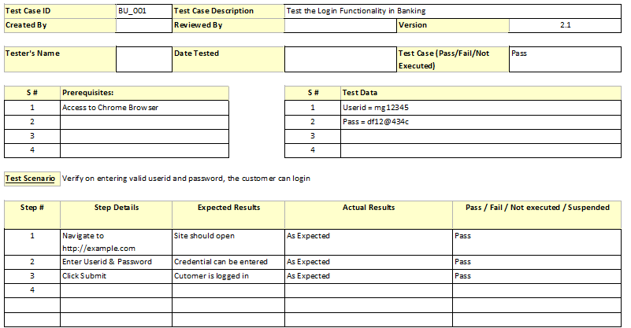

# Sheet 1: Test Scenarios and Test Cases

| Scenario ID | Scenario Description                                | Preconditions                 | Expected Outcome                 |
|-------------|-----------------------------------------------------|-------------------------------|----------------------------------|
| TS001       | Verify login functionality                          | User account exists           | Successful login                 |
| TS002       | Test checkout process for an e-commerce website     | User has items in the cart    | Order is successfully placed     |

| Test Case ID | Scenario ID | Test Case Description                                          | Test Steps                                                                                         | Test Data                           | Expected Result                |
|--------------|-------------|----------------------------------------------------------------|----------------------------------------------------------------------------------------------------|-------------------------------------|--------------------------------|
| TC001        | TS001       | Enter valid username and password and click the "Login" button | 1. Navigate to the login page 2. Enter valid username and password 3. Click "Login" button         | Valid username and password         | User is successfully logged in |
| TC002        | TS001       | Attempt login with an invalid password                         | 1. Navigate to the login page 2. Enter valid username and invalid password 3. Click "Login" button | Valid username and invalid password | User receives an error message |

# Sheet 2: Test Cases

