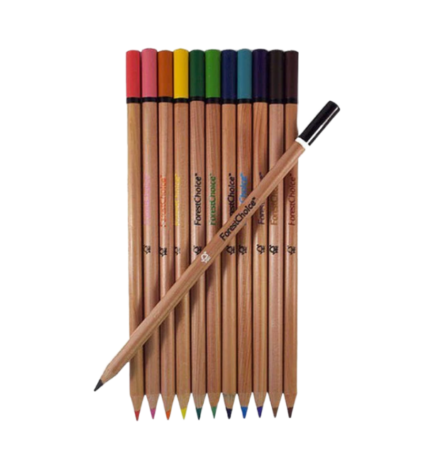

1. In this task, we will be evaluating the performance and quality of a product similar to a pencil. The objective is to ensure that the product meets minimum requirements for usability, safety, and environmental responsibility.

**Description:**

The product under evaluation is a simple, everyday item comparable to a pencil. It is made for general use and is expected to fulfill basic functions. The focus of this testing task is to assess its material composition, packaging, and overall quality.

