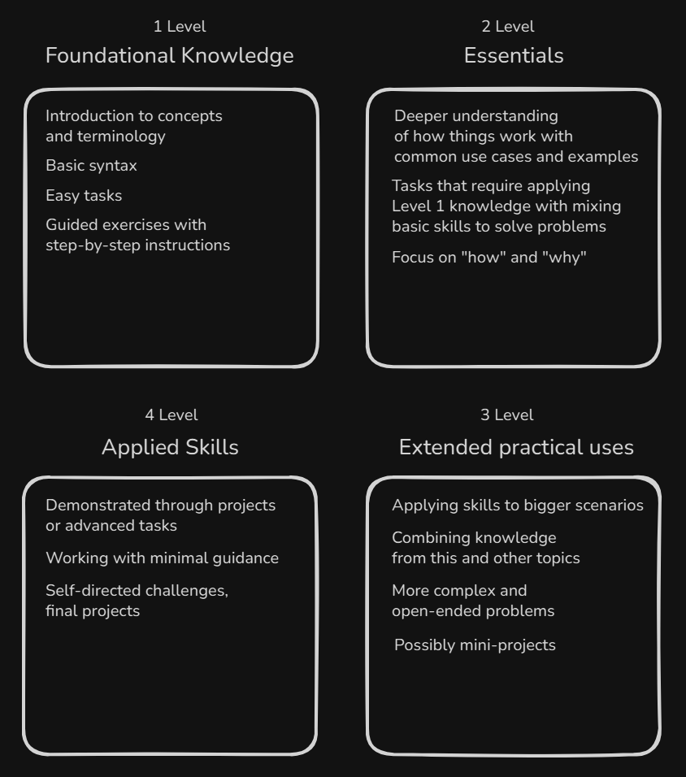

# Introduction

In this course, we’ll follow a clear, step-by-step path designed to help you learn Python by building your skills gradually - like leveling up in a game.

Each topic is split into 4 levels, starting from the basics and moving toward real-world projects and advanced thinking. You’ll go from “What is this?” to “I can apply this.”

We focus on understanding, not just copying code - so you’ll practice, reflect, and test yourself along the way.

Every topic is broken into 4 levels that build on each other.

Each topic includes:

- **Overview:** A quick look at what this topic is about.

- **Assignments:** Tasks to practice what you've learned.

- **Open Questions:** Help you think and explain things in your own words (*What matters is how you think and explain your ideas)*.

- **Quiz:** A short review to check your knowledge.

- **Summary:** Key takeaways and concepts from each level.

Now that you have a clear understanding of the course structure and what to expect, let’s dive into Python itself.

Python is a high-level programming language, which means it abstracts away most of the complex details of the computer's hardware without managing low-level operations like **memory allocation** (*process by which a computer reserves space in its memory to store data*).

This abstraction makes Python **versatile:**

- **software development** (*web development, desktop applications, command line applications, games*);
- **data science and math** (*data analysis, scientific computing, machine learning*);
- **automation and scripting** (*task automation, web scraping*);
- **build embedded systems** (*hardware programming, robotics*).

One of Python’s defining traits is that it is both **interpreted** (*executed step-by-step cooking instructions*) and **interactive** (*Real-time conversation with a friend*) and also benefits from **extensive libraries** and **strong community support**.

Before you start coding, it's essential to have Python installed on your system.

1. **Download the Installer:**  Visit [python.org](https://www.python.org/downloads/) and download the installer for your operating system if Python is not already installed.

2. **Run the Installer:** Execute the downloaded installer and follow the on-screen instructions. Be sure to check the option to add Python to your system `PATH` when prompted.

3. **Locate the Python Executable:** After installation, the Python executable will typically be found in `/usr/bin/` on Linux or in a folder like `C:\python313` on Windows.
