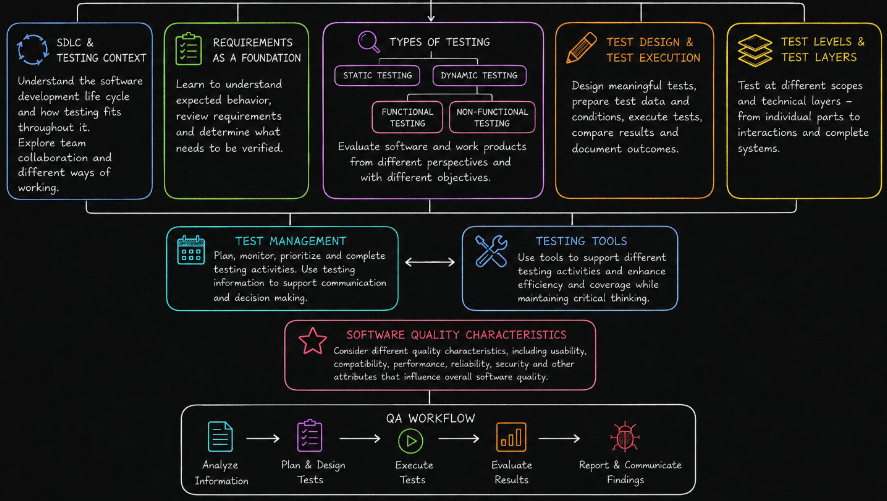

# QA Module Overview

This module introduces the main areas of **software quality assurance and testing** and builds an understanding of how testing supports software development and product quality.

The curriculum is organized in a way that reflects how different QA topics are best learned. Some topics develop progressively, while others are better understood as separate but connected areas of the same subject.

Some topics are organized through **levels**. Each level extends the previous one and develops a deeper understanding of the broader subject. This structure is used when knowledge should grow progressively from fundamental concepts toward more detailed or advanced areas.

```text
topic/
┣ 1_level/
┃ ┗ 1_topic.md
┣ 2_level/
┃ ┗ 2_topic.md
┣ 3_level/
┃ ┗ 3_topic.md
┣ overview.md
┗ summary.md
```

Other topics are organized through **subtopics**. This structure is used when a broader subject contains several distinct areas that should be explored individually while remaining connected to the same overall topic.

```text
topic/
┣ subtopic/
┣ subtopic/
┣ subtopic/
┣ subtopic/
┣ overview.md
┗ summary.md
```

Each topic begins with an **overview** that introduces the learning direction and provides the context needed before starting. The main content is then divided into levels or subtopics depending on the subject. A **summary** brings the material together after completion and provides a compact view of the important concepts and relationships.



The course begins by establishing a foundation in **software testing and quality**. You will develop an understanding of the purpose of testing, how it contributes to software development and how testing activities support confidence in a product.

You will explore the **Software Development Life Cycle (SDLC)** and the environment in which testing takes place. You will understand how software moves through different stages of development, where testing contributes throughout this lifecycle and how teams collaborate across different project contexts and ways of working.

The module introduces **requirements as a foundation for testing**. You will learn how to understand expected software behavior, review the information available to testers and use that information to determine what should be verified.

You will explore **different types of testing** and understand how software and related work products can be evaluated from different perspectives. This includes **static and dynamic testing**, with dynamic testing covering both **functional and non-functional testing** depending on the testing objective.

You will develop a structured approach to **test design and test execution**. This includes preparing testing activities, creating appropriate tests, executing them, comparing expected and actual results and documenting testing outcomes.

You will explore **test levels and test layers** to understand the different scopes and technical points from which software can be tested. This develops an understanding of how testing can focus on individual parts, interactions between parts, complete systems and different layers of an application.

The course also introduces **test management** and the organization of testing work. You will learn how testing activities are planned, monitored, prioritized and completed, and how testing information supports communication and decision making throughout software development.

You will work with **testing tools** and develop an understanding of how tools can support different testing activities. The focus is on recognizing where tools provide value and how they complement the testing process rather than replacing tester analysis and judgment.

The module broadens the understanding of quality beyond whether functionality simply works. You will consider **different software quality characteristics**, including the experience of using software, its behavior across environments and its exposure to potential security risks.

Throughout the course, these areas are connected into a practical **QA workflow**. You will learn how requirements and other product information are analyzed, transformed into testing activities, verified through execution, supported by appropriate tools and communicated through testing results and discovered problems.

The overall goal is to develop a **systematic QA mindset** and a practical foundation for understanding software quality, analyzing requirements, working with different types of testing, designing and executing tests, working across test levels and layers, using testing tools and participating in the management of testing activities.
