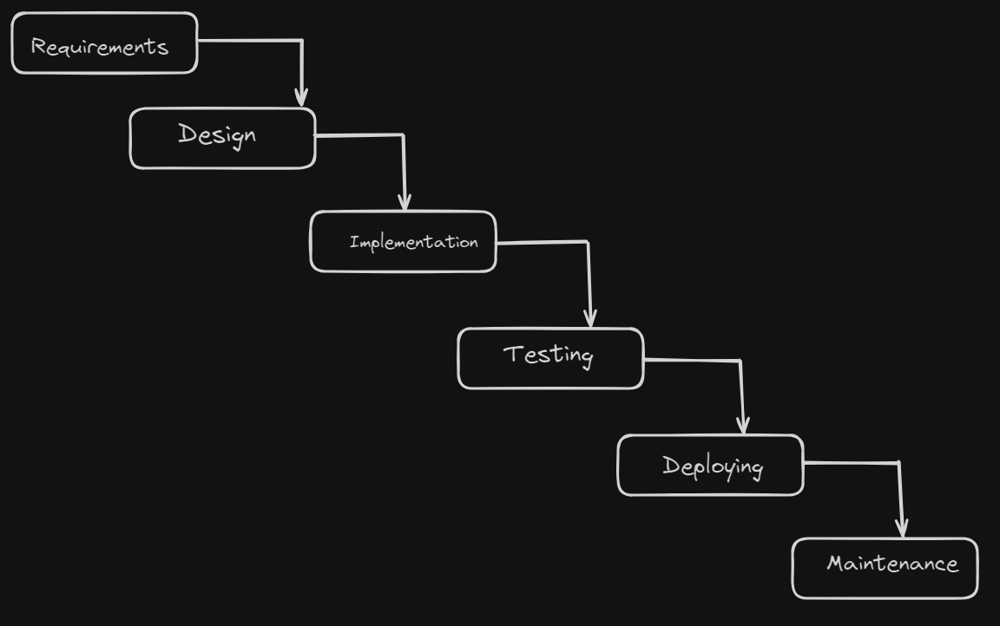
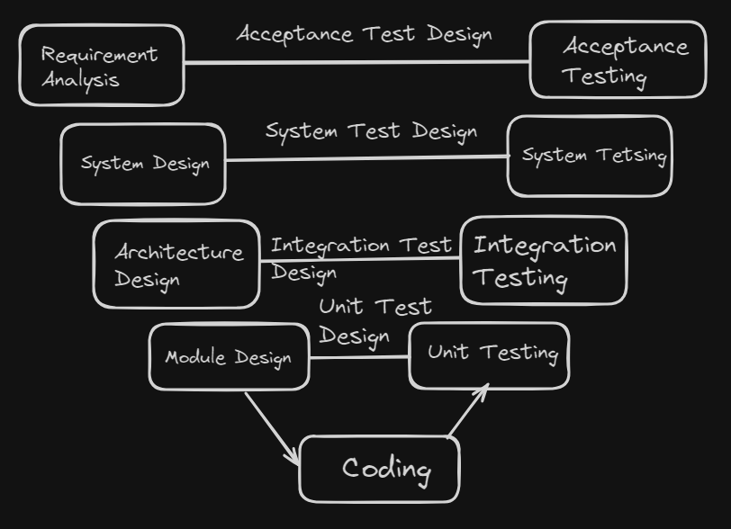

# Content of SDLC Level 1

- [What is SDLC](#what-is-sdlc)
- [Why SDLC exists](#why-sdlc-exists)
- [Main phases of SDLC](#main-phases-of-sdlc)
- [What role testing has in SDLC](#what-role-testing-has-in-sdlc)
- [Waterfall model](#waterfall-model)
- [V-Model](#v-model)
- [Comparing Waterfall and V-Model](#comparing-waterfall-and-v-model)

Software systems are built through a series of activities that take an idea from concept to a working product. These activities include understanding requirements, designing solutions, writing code, and verifying that the system behaves correctly. As projects grow in size and complexity, managing these steps becomes increasingly difficult without a clear structure.

Without a defined approach, teams may face unclear requirements, inconsistent results, and increased risk of defects. To address this, software development follows organized processes that guide how work is performed from start to finish.

These processes define how different stages are connected, how responsibilities are distributed, and how quality is maintained throughout development. This structured approach is known as the Software Development Life Cycle (SDLC).

To understand how software development is organized, it is important to first define what SDLC is and how it structures the entire process.

## What is SDLC

The **Software Development Life Cycle (SDLC)** is a structured process used to plan, develop, test, and deliver software.

Instead of building software in an unorganized way, SDLC defines a sequence of stages that guide the entire development process. Each stage has a specific purpose and contributes to transforming an idea into a working product.

These stages typically include activities such as **understanding requirements**, **designing the system**, **implementing functionality**, **testing the solution** and **delivering and maintaining the product**.

By organizing development into defined steps, SDLC helps teams work in a consistent and predictable way. It ensures that requirements are clearly understood, changes are controlled, and quality is verified throughout the process.

SDLC does not represent a single fixed method. Instead, it is a general concept that can be implemented using different models. These models define how the stages are arranged, how teams move between them, and how testing is integrated into the process.

To better understand why this structured approach is necessary, the next step is to look at **why SDLC exists** and what problems it solves.

## Why SDLC exists

Developing software without a structured approach often leads to unclear requirements, inconsistent results, and increased risk of defects. As systems grow in complexity, it becomes difficult to manage changes, coordinate work between team members, and ensure that the final product meets expectations.

SDLC exists to provide a clear and organized way to manage the entire development process. It defines how work progresses from one stage to another, how responsibilities are structured, and how quality is maintained throughout development.

By following a defined lifecycle, teams can reduce risks, improve communication, and detect issues earlier in the process. This leads to more predictable outcomes and better alignment between what is built and what is needed.

To understand how this structure is applied in practice, the next step is to look at the **main phases of SDLC**.

## Main phases of SDLC

The Software Development Life Cycle is organized into a set of phases that represent how software is created from an initial idea to a working product. Each phase focuses on a specific type of activity and builds on the results of the previous one.

The main phases typically include **requirements analysis**, **system design**, **implementation**, **testing**, **deployment**, and **maintenance**.

During **requirements analysis**, the goal is to understand what needs to be built and define clear expectations. In the **design phase**, the system structure and solution approach are planned. The **implementation phase** focuses on writing the code that brings the design to life.

Once the functionality is developed, the **testing phase** verifies that the system behaves correctly and meets the defined requirements. After testing, the product moves to **deployment**, where it is released to users. Finally, in the **maintenance phase**, the system is updated, improved, and fixed as needed over time.

These phases provide a structured flow for development, but the way they are organized can differ depending on the chosen SDLC model. Understanding these phases is important because testing activities are closely connected to each of them.

## What role testing has in SDLC

Testing is not a single isolated activity that happens only at the end of development. Instead, it is an integral part of the Software Development Life Cycle and is connected to multiple phases throughout the process.

During **requirements analysis**, testing helps ensure that requirements are clear, complete, and testable. In the **design phase**, testing focuses on reviewing the system structure and identifying potential issues before implementation begins. During **implementation**, testing verifies that individual components function correctly.

As development progresses, testing expands to ensure that components work together correctly and that the system as a whole behaves as expected. After deployment, testing continues through maintenance activities to confirm that updates and changes do not introduce new defects.

The role of testing is to provide continuous feedback about the quality of the product. It helps detect defects early, reduce risks, and ensure that the final system meets the defined requirements.

How and when testing is performed depends on the chosen SDLC model. In some models, testing occurs later as a separate phase, while in others it is integrated throughout the entire development process. Understanding this difference becomes clearer when looking at specific models such as the **Waterfall model** and the **V-Model**.

## Waterfall model

The **Waterfall model** is a sequential approach to software development where each phase is completed before the next one begins. The process flows in a linear direction, moving step by step from requirements to design, implementation, testing, and deployment.

In this model, development follows a strict order. The team first completes **requirements analysis**, where all expectations are defined and documented. Once this is finished, the process moves to **design**, where the system structure and solution are planned. After the design is approved, the team proceeds to **implementation**, where the actual code is written.

Only after the implementation phase is completed does the process move to **testing**, where the system is verified against the original requirements. If issues are found, they are fixed, but returning to earlier phases is limited and often costly. Once testing is completed, the system is **deployed**, and finally enters **maintenance**, where updates and fixes are applied over time.

In this model, progress is structured and predictable because each stage has clearly defined outputs. Once a phase is finished, the team moves forward and does not usually return to earlier stages. This makes the process easy to understand and manage, especially when requirements are stable.

Testing in the Waterfall model is performed after the implementation phase is completed. This means that defects are often discovered later in the process, which can make them more difficult and costly to fix.

The Waterfall model works best when requirements are well-defined and unlikely to change. However, its rigid structure makes it less flexible in situations where changes are expected during development.

To better understand how testing can be integrated earlier into the development process, the next step is to look at the **V-Model**.

## V-Model

The **V-Model** is a sequential development approach that extends the Waterfall model by directly linking each development phase with a corresponding testing activity. Instead of treating testing as a separate phase at the end, it is planned alongside development from the beginning.

In this model, the process is structured in the shape of the letter **V**, where the left side represents development activities and the right side represents testing activities.

The left side of the V focuses on **verification**, which means checking that each stage of development is built correctly according to specifications. This includes reviewing requirements, designs, and code before moving forward.

The right side of the V focuses on **validation**, which means checking that the final system behaves correctly and meets user needs through testing.

The process begins with **requirements analysis**, where system expectations are defined. At the same time, **acceptance test design** is prepared to verify those requirements later. As the process moves to **system design**, corresponding **system tests** are planned. During **architecture and module design**, **integration tests** and **unit tests** are defined.

At the bottom of the model is **implementation**, where the actual code is developed. After coding is completed, the process moves upward on the right side of the V, where testing is executed in levels.

Testing starts with **unit testing**, verifying individual components. Then **integration testing** ensures that components work together correctly. Next, **system testing** validates the complete system against the design. Finally, **acceptance testing** confirms that the system meets the original requirements and user expectations.

The key idea of the V-Model is that testing is not delayed until the end. Instead, it is prepared early and aligned with each development stage. This helps detect defects earlier and improves overall quality.

Compared to the Waterfall model, the V-Model provides a more structured approach to testing. However, it still follows a sequential process and is less flexible when requirements change.

## Comparing Waterfall and V-Model

Both the **Waterfall model** and the **V-Model** follow a sequential approach, where development progresses through a fixed set of stages. In both models, each phase is completed before moving to the next, which makes the process structured and predictable.

The main difference lies in how testing is handled. In the Waterfall model, testing is performed after the implementation phase is completed. This means that defects are often discovered late in the process, making them more difficult and costly to fix.

In contrast, the V-Model integrates testing activities alongside development from the beginning. For each development phase, a corresponding testing activity is planned. This allows issues to be identified earlier and improves overall quality.

Another difference is how clearly testing is structured. The Waterfall model treats testing as a separate phase, while the V-Model connects development and testing through **verification** and **validation**, ensuring that both the system is built correctly and that it meets user needs.

Both models work best when requirements are stable and well-defined. However, the V-Model provides better visibility of testing activities and earlier feedback compared to the Waterfall model.

Understanding these differences helps explain why modern development approaches often move toward earlier and more continuous testing practices.