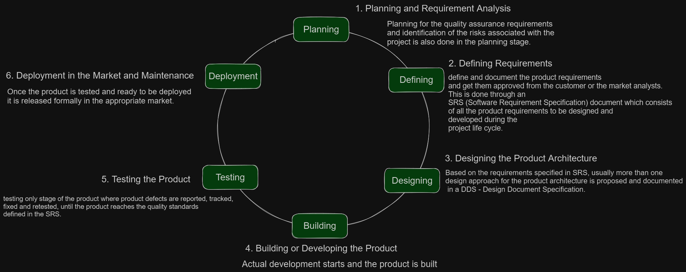

# Table of Contents: SDLC Level 1

- [What is SDLC](#what-is-sdlc)
- [Why SDLC exists](#why-sdlc-exists)
- [Main phases of SDLC](#main-phases-of-sdlc)
- [Phase outputs and completion criteria](#phase-outputs-and-completion-criteria)
- [What role testing has in SDLC](#what-role-testing-has-in-sdlc)
- [Waterfall model](#waterfall-model)
- [V-Model](#v-model)
- [Comparing Waterfall and V-Model](#comparing-waterfall-and-v-model)

This **SDLC Level 1** introduces the foundations of the **Software Development Life Cycle (SDLC)** and explains how software development can be organized into a structured lifecycle.

The focus begins with the purpose and main phases of SDLC, including the outputs produced during development and the role of testing throughout the lifecycle.

The level then introduces two **sequential SDLC models**, the **Waterfall model** and the **V-Model**, and examines how each model organizes development and testing activities.

## What is SDLC

The **Software Development Life Cycle (SDLC)** is a structured process used to guide software from an initial idea through development, delivery and ongoing maintenance.

SDLC organizes development into defined phases, with each phase serving a specific purpose. This structure helps teams coordinate their work and understand how different development activities relate to one another.

SDLC is not a single development model. It is a general lifecycle concept that can be implemented through different **SDLC models**. A model defines how the phases are arranged, how teams progress through them, and how development and testing activities are connected.

## Why SDLC exists

Software projects involve different people, activities and decisions that must work together. Without a structured approach, teams may face unclear requirements, communication problems, uncontrolled changes and an increased risk of defects.

SDLC provides a framework for managing this work. It helps teams define responsibilities, track progress, manage risks and establish when work is ready to move forward.

Finding problems early is also important because the effort required to correct a defect can increase as development progresses. For example, an unclear requirement discovered during a requirements review may require only a document change. If the same problem is discovered after design, implementation and testing, the team may need to update documents, modify code, revise tests and retest affected functionality.

Early reviews and test planning can therefore reduce unnecessary rework by identifying problems before they affect later development activities.

## Main phases of SDLC

Although the exact lifecycle can vary between projects and SDLC models, software development commonly includes six main phases.

During **requirements analysis**, the team identifies what the system must do and defines expectations and constraints.

During **system design**, the team determines how the solution will be structured and how the requirements will be implemented.

During **implementation**, developers create the software according to the design.

During **testing**, the software is evaluated to determine whether it behaves as expected and satisfies the relevant requirements.

During **deployment**, the software is released into its intended environment and made available to users or customers.

During **maintenance**, the system is corrected, adapted and improved over time. Testing remains important during maintenance because changes can affect existing behavior.

These phases describe the main types of work performed throughout the software lifecycle. Different SDLC models organize and connect them in different ways.

## Phase outputs and completion criteria

An SDLC phase normally produces one or more **deliverables**. A deliverable is an output created during a phase and used as evidence of completed work or as input to later activities.

For example, requirements analysis may produce a requirements specification, while system design may produce architecture or detailed design documents.

Implementation produces software components or builds. Testing may produce test cases, test results and defect reports. Deployment may produce a released version and deployment records.

Teams also use criteria to determine whether work is ready to begin or whether a phase or activity is complete. **Entry criteria** describe conditions that should be satisfied before an activity starts, while **exit criteria** describe conditions that should be satisfied before it is considered complete.

For example, testing might require an approved build and agreed requirements before execution begins. Its exit criteria might require that planned tests have been executed and that remaining defects meet agreed acceptance conditions.

The exact deliverables and criteria vary between organizations and SDLC models, but the underlying idea is important. A phase should not be considered complete simply because time has passed. Completion should be based on defined outputs and agreed conditions.

## What role testing has in SDLC

Testing is not limited to executing software after coding is complete. Quality-related testing activities can begin before executable software exists and can continue throughout the lifecycle.

Two useful concepts are **static testing** and **dynamic testing**.

**Static testing** evaluates work products without executing the software. Examples include reviewing requirements and design documents to identify ambiguity, inconsistency, missing information, or other defects before they reach implementation.

**Dynamic testing** evaluates software by executing it and comparing its actual behavior with expected behavior. Unit, integration, system, and acceptance testing are examples of testing levels that use executable software.

During **requirements analysis**, static testing can help determine whether requirements are clear, consistent, complete, and testable. During **design**, reviews can identify design problems before implementation begins.

Once executable software is available, dynamic testing can verify individual components, interactions between components and the behavior of the complete system. During maintenance, testing is also used to check changes and to confirm that existing functionality has not been unintentionally affected.

Testing therefore provides information about product quality and project risk throughout the lifecycle. Early testing activities are especially valuable because defects found before they propagate into later work usually require less rework to correct.

How testing is organized depends on the selected SDLC model. The Waterfall model and V-Model demonstrate two sequential approaches with important differences in when testing is planned and how it relates to development activities.

## Waterfall model

The **Waterfall model** is a sequential SDLC model in which development progresses through defined phases in order. A phase is normally completed before the project moves to the next phase.

The process begins with **requirements analysis**, where expectations are identified and documented. It then moves to **design**, where the system structure and solution are planned. After design, the team proceeds to **implementation**, where the software is developed.

In a traditional Waterfall flow, system testing is performed after implementation. While test planning may occur earlier in practice, testing as a formal phase traditionally follows implementation. The implemented system is checked against its requirements, defects are corrected, and the product can then proceed toward deployment and maintenance.

Because the model is sequential, returning to earlier phases after later work has begun can require significant rework. A requirement problem discovered during testing, for example, may require changes to requirements, design, code and test cases.

The Waterfall model is straightforward to understand because phases, deliverables and progression are clearly defined. It is most suitable when requirements are stable, well understood and unlikely to change significantly during development.

Its main limitation is reduced flexibility. When requirements change or important problems are discovered late, revisiting completed phases can be difficult and costly.

## V-Model

The **V-Model**, also known as the **Verification and Validation (V&V) model**, is a sequential SDLC model that extends the Waterfall approach by explicitly relating development activities to corresponding test levels. Test planning begins alongside development rather than being postponed until implementation is complete.

The model is commonly represented as the letter **V**. The left side contains specification and design activities, **implementation** appears at the bottom and the right side contains corresponding levels of dynamic testing.

The left side emphasizes **verification** through static activities. Verification checks whether work products are being produced correctly according to specified requirements and standards. Requirements, system specifications, architecture, and component or module designs can be reviewed before implementation begins.

The right side emphasizes **validation** through execution-based testing. Validation checks whether the implemented system satisfies its intended use and stakeholder needs.

A key feature of the V-Model is the relationship between development work products and the tests that will later evaluate the implemented software.

- During **requirements analysis**, acceptance testing is planned against user or business requirements.
- During **system design** (sometimes called system specification), system testing is planned against system requirements.
- During **architecture design**, integration testing is planned to verify interactions between components or subsystems.
- During **module or component design**, unit testing is planned for individual components.

At the bottom of the V is **implementation**, where the software is coded.

After implementation, dynamic testing is executed upward through the corresponding test levels. **Unit testing** checks individual components. **Integration testing** checks interactions between components or systems. **System testing** checks the behavior of the complete system against system requirements. **Acceptance testing** evaluates whether the system satisfies acceptance needs and is suitable for its intended use.

The important idea is not that executable tests run before code exists. Instead, test conditions, test cases and other test activities can be designed early using requirements and design work products. This creates traceability between what is specified and what is later tested.

Early verification and test planning can expose problems before they propagate into implementation. This can reduce rework and provide a clearer relationship between development deliverables and testing activities.

Like Waterfall, however, the V-Model remains sequential and is less flexible when requirements change frequently.

## Comparing Waterfall and V-Model

Both the **Waterfall model** and the **V-Model** are sequential SDLC models. They organize development into defined stages and are easiest to apply when requirements are stable and well understood.

The main difference is the relationship between development and testing. In a traditional Waterfall approach, system testing follows implementation as a distinct later phase. As a result, some requirement or design defects may remain undiscovered until executable software is available.

The V-Model makes the relationship between development work products and testing explicit. Testing is planned alongside the corresponding specification and design activities, while static verification can identify defects in documents before implementation.

The V-Model also provides clear traceability between development stages and test levels. Architecture design relates to integration testing, component or module design relates to unit testing, system specifications relate to system testing, and requirements relate to acceptance testing.

A team may therefore prefer the V-Model when requirements are stable but **quality assurance, traceability, formal verification or clearly defined test evidence is especially important**. Waterfall may be sufficient when a simpler sequential process is appropriate and the project does not require the same explicit development-to-testing mapping.

Both models have limited flexibility compared with approaches designed for frequent change. Later levels introduce other SDLC models and explain how they organize development and testing differently.
