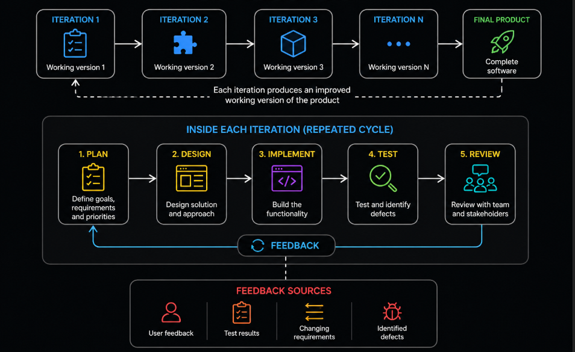
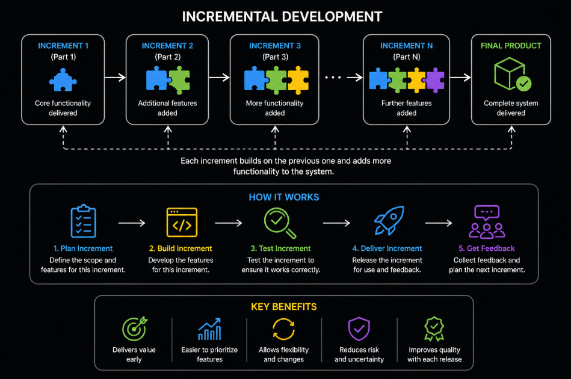

# Content of SDLC Level 2

- [Sequential and iterative ways of building software](#sequential-and-iterative-ways-of-building-software)
- [Iterative development](#iterative-development)
- [Incremental development](#incremental-development)
- [Iterative and Incremental model](#iterative-and-incremental-model)
- [Introduction to Agile](#introduction-to-agile)
- [Agile values in simple form](#agile-values-in-simple-form)
- [Whole team approach to quality](#whole-team-approach-to-quality)
- [Comparing sequential and iterative models](#comparing-sequential-and-iterative-models)

Software development does not follow a single fixed approach. In the previous level, structured models such as the **Waterfall model** and the **V-Model** were introduced. These models follow a sequential process, where development progresses step by step and each phase is completed before moving to the next.

While this approach provides clarity and control, it also introduces limitations. Changes are difficult to accommodate, and feedback is often received late in the process. As a result, these models are most effective when requirements are stable and well-defined.

To address these challenges, alternative approaches were introduced that allow development to be more flexible and adaptive. Instead of delivering the entire system at once, software can be built in smaller parts, refined over time, and continuously improved based on feedback.

Understanding this shift is important because it changes how development is organized and how testing is performed throughout the lifecycle.

To explore this further, it is necessary to understand the difference between **sequential** and **iterative** ways of building software.

## Sequential and iterative ways of building software

Software can be developed using different approaches depending on how work is organized and how changes are handled during the process. Two fundamental ways of building software are **sequential** and **iterative** development.

In a **sequential approach**, development follows a fixed order of phases. Each phase is completed before the next one begins, and progress moves in a single direction. This creates a structured and predictable process, but it also makes adapting to changes more difficult once development has started.

In an **iterative approach**, development is performed in repeated cycles. Instead of building the entire system at once, the product is developed step by step, with each iteration adding new functionality or improving existing features. This allows teams to receive feedback earlier and make adjustments throughout the process.

The key difference between these approaches lies in flexibility and feedback. Sequential development emphasizes planning and stability, while iterative development emphasizes adaptability and continuous improvement.

Understanding this difference is important because it directly affects how testing is performed, when feedback is received, and how quickly issues can be identified and resolved.

To better understand how iterative development works in practice, the next step is to look at **iterative development** in more detail.

## Iterative development

**Iterative development** is an approach where software is built through repeated cycles, known as iterations. Instead of delivering the entire system at once, development is divided into smaller steps, and each step produces a working version of the product.

In each iteration, the team goes through activities such as planning, designing, implementing, and testing. The result is a partial but functional version of the system that can be reviewed and improved in the next iteration.

This approach allows feedback to be collected early and continuously. Based on this feedback, changes can be made in later iterations without restarting the entire development process.

Iterative development focuses on gradually refining the product. Each cycle builds on the previous one, improving quality, adding functionality, and reducing uncertainty over time.

Because development happens in smaller steps, testing is also performed repeatedly. This allows defects to be identified earlier and reduces the risk of major issues appearing late in the process.

To understand how functionality is delivered in parts, it is important to also look at **incremental development**.

## Incremental development

**Incremental development** is an approach where software is built and delivered in smaller parts called increments. Each increment represents a portion of the final system and provides specific functionality that can be used and tested independently.

Instead of waiting for the entire system to be completed, the product is released step by step. Each new increment adds additional features or enhances existing ones, gradually building toward the full system.

This approach allows teams to deliver value earlier, since usable functionality becomes available after each increment. It also makes it easier to prioritize features and adjust development based on feedback.

Testing in incremental development is performed for each delivered part. This ensures that every increment works correctly on its own and integrates properly with previously delivered functionality.

Incremental development focuses on dividing the system into smaller pieces, while iterative development focuses on refining and improving those pieces over time. In practice, these approaches are often combined.

To understand how these two ideas work together, the next step is to look at the **Iterative and Incremental model**.

## Iterative and Incremental model

The **Iterative and Incremental model** combines the ideas of both iterative and incremental development. Instead of building the entire system at once, the product is developed in small parts and refined over multiple cycles.

In this model, development is divided into **increments**, where each increment delivers a portion of the system with specific functionality. At the same time, each increment is built through **iterations**, where the functionality is gradually improved and refined.

This means that software is not only delivered step by step, but each step can also be revisited and enhanced based on feedback. Early versions of the system may be simple, but they become more complete and stable over time as new iterations are performed.

This approach allows teams to deliver working software early while continuously improving it. It also reduces risk, because issues can be identified and addressed in smaller parts instead of at the end of the entire development process.

Testing in this model is continuous. Each increment is tested individually, and improvements are verified during each iteration. This ensures that both new functionality and existing features continue to work correctly as the system evolves.

The Iterative and Incremental model provides a flexible and adaptive way of building software, which forms the foundation for modern development approaches such as Agile.

To understand how this flexible way of building software is applied in real projects, the next step is to look at **introduction to Agile**.

## Introduction to Agile

**Agile** is an approach to software development that builds on iterative and incremental principles, focusing on flexibility, collaboration, and continuous improvement. Instead of following a fixed plan from start to finish, Agile encourages teams to adapt based on feedback and changing requirements.

In Agile development, work is organized into small cycles called iterations, where each cycle delivers a working part of the product. These iterations allow teams to regularly review progress, gather feedback, and make adjustments.

Agile places strong emphasis on communication and teamwork. Developers, testers, and other stakeholders work closely together throughout the process, ensuring that quality is maintained at every stage.

Testing in Agile is integrated into the development process and happens continuously. Rather than being a separate phase, testing is performed alongside development to provide fast feedback and detect issues early.

The goal of Agile is to deliver value quickly, respond to change effectively, and continuously improve both the product and the development process.

To better understand the principles behind this approach, the next step is to look at **Agile values in simple form**.

## Agile values in simple form

Agile development is guided by a set of core values that define how teams approach building software. These values focus on flexibility, collaboration, and delivering working solutions rather than strictly following rigid processes.

The key ideas behind Agile can be summarized as **prioritizing individuals and interactions over processes and tools**, which means communication between people is more important than strictly following rules, **focusing on working software instead of extensive documentation**, which means delivering a working product is more valuable than writing large amounts of documentation, **collaborating with customers rather than relying only on contracts**, which means working closely with customers helps ensure the product meets real needs, and **responding to change instead of strictly following a fixed plan**, which means being able to adapt to changes is more important than following a plan from the start.

These values encourage teams to communicate openly, adapt to new information, and continuously improve both the product and the way they work. The emphasis is on delivering real value to users while remaining flexible to changing needs.

Understanding these values helps explain why Agile development looks different from traditional approaches and why testing is integrated throughout the process.

To see how these ideas affect team responsibilities, the next step is to look at the **whole team approach to quality**.

## Whole team approach to quality

In Agile development, quality is not the responsibility of a single role. Instead, it is a shared responsibility across the entire team. This concept is known as the **whole team approach to quality**.

Developers, testers, and other stakeholders work together to ensure that the product meets requirements and maintains high quality. Testing is not performed only by dedicated testers, but is integrated into the work of the entire team.

This means that developers write and run tests, testers contribute to defining requirements and test scenarios, and all team members participate in identifying and preventing defects. Collaboration and communication are essential, as quality is built into the product from the beginning rather than checked only at the end.

By sharing responsibility, teams can detect issues earlier, respond faster to changes, and continuously improve both the product and the development process.

This approach reflects a shift from traditional models, where roles were more separated, to a more collaborative way of working where quality is everyone’s responsibility.

To understand how these approaches differ from earlier models, the next step is to look at **comparing sequential and iterative models**.

## Comparing sequential and iterative models

Sequential and iterative approaches represent two different ways of organizing software development, and they differ mainly in how work is structured, how feedback is handled, and how changes are managed.

In a **sequential approach**, development follows a fixed order of phases. Each phase is completed before moving to the next, and testing is typically performed after implementation is finished. This makes the process structured and predictable, but limits flexibility and delays feedback.

In an **iterative approach**, development is performed in repeated cycles, where each cycle produces a working version of the product. Testing is integrated into each iteration, allowing issues to be identified earlier and improvements to be made continuously.

The main difference between these approaches lies in adaptability. Sequential models focus on planning and stability, while iterative models focus on flexibility and continuous improvement.

Because iterative development delivers software in smaller parts and allows feedback throughout the process, it reduces the risk of discovering major issues late in development. This also changes how testing is performed, making it a continuous activity rather than a final step.

Understanding this difference is important because it explains why modern development practices, such as Agile, are based on iterative and incremental principles.