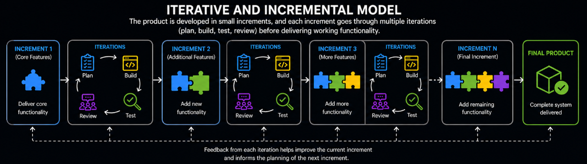
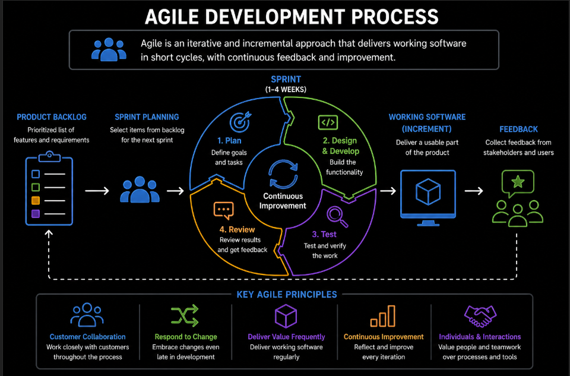

# Content of SDLC Level 2

- [Iterative and Incremental model](#iterative-and-incremental-model)
- [Introduction to Agile](#introduction-to-agile)
- [Comparing sequential and iterative models](#comparing-sequential-and-iterative-models)

In the previous level, structured SDLC models such as the **Waterfall model** and the **V-Model** were introduced. These models follow a sequential approach, where development progresses step by step through defined phases.

At this level, the focus shifts to a different way of building software. Instead of following a single linear flow, development can be organized into smaller cycles that allow continuous improvement and adaptation.

This approach is based on two key ideas. **Iterative development** focuses on improving the product through repeated cycles, while **incremental development** focuses on building the product in smaller parts that are delivered step by step.

These ideas are often used together in practice.

## Iterative and Incremental model

The **Iterative and Incremental model** is an approach where software is built in small parts and continuously improved over time.

Instead of delivering the entire system at once, development is divided into **increments**, where each increment provides a portion of functionality that can be used and tested. At the same time, development happens through **iterations**, where the product is repeatedly refined and enhanced based on feedback.

Each cycle includes activities such as planning, designing, implementing and testing. The result of every cycle is a working version of the system that becomes more complete and stable over time.

This approach allows teams to deliver value early, since usable functionality is available after each increment. It also allows continuous improvement, as each iteration builds on previous results and incorporates feedback.

By combining gradual delivery with continuous refinement, this model reduces risk and improves flexibility compared to sequential approaches.

This way of building software forms the foundation for modern development practices such as Agile.

To understand how this flexible way of building software is applied in real projects, the next step is to look at **introduction to Agile**.

## Introduction to Agile

**Agile** is a way of working that builds on iterative and incremental development, but focuses on how teams collaborate, make decisions and respond to change.

While iterative and incremental models describe how software is built in cycles and parts, Agile focuses on how teams organize their work around those cycles.

In Agile, work is organized into short cycles where small parts of the product are developed and reviewed. Instead of following a fixed plan, teams adapt their work based on feedback and changing requirements.

The key difference is that Agile emphasizes **flexibility, collaboration, and continuous improvement**. Teams work closely together, communicate frequently and adjust their direction as they learn more about the product.

Agile development is guided by a set of core values that define how work is approached. These include **prioritizing individuals and interactions over processes and tools**, which means communication between people is more important than strictly following rules, **focusing on working software instead of extensive documentation**, which means delivering a working product is more valuable than writing large amounts of documentation, **collaborating with customers rather than relying only on contracts**, which means working closely with customers helps ensure the product meets real needs, and **responding to change instead of strictly following a fixed plan**, which means being able to adapt to changes is more important than following a plan from the start.

These values shape how teams make decisions and organize their work. Instead of separating responsibilities strictly, Agile encourages a shared responsibility for the outcome.

This is known as the **whole team approach**, where developers, testers, and other stakeholders work together throughout development rather than working in isolated phases.

By combining flexible development cycles with collaborative teamwork, Agile enables teams to adapt quickly and continuously improve both the product and the process.

To better understand how these approaches differ from earlier structured models, it is useful to compare **sequential** and **iterative** ways of building software.

## Comparing sequential and iterative models

Sequential and iterative approaches represent two different ways of organizing software development.

In a **sequential approach**, development follows progresses through a fixed series of phases, where each stage is completed before moving to the next. This creates a structured and predictable process, but makes it difficult to adapt once development has started.

In an **iterative approach**, development is organized into repeated cycles, where the product is gradually built and improved over time. Each cycle produces a working version that can be reviewed and refined in the next iteration.

The main difference lies in how change and feedback are handled. Sequential models rely on upfront planning and assume stability, while iterative models allow continuous adjustment as new information becomes available.

Because of this, iterative approaches reduce the risk of late surprises and support a more flexible way of building software.

Understanding this difference explains why modern approaches, including Agile, are based on iterative and incremental principles.
