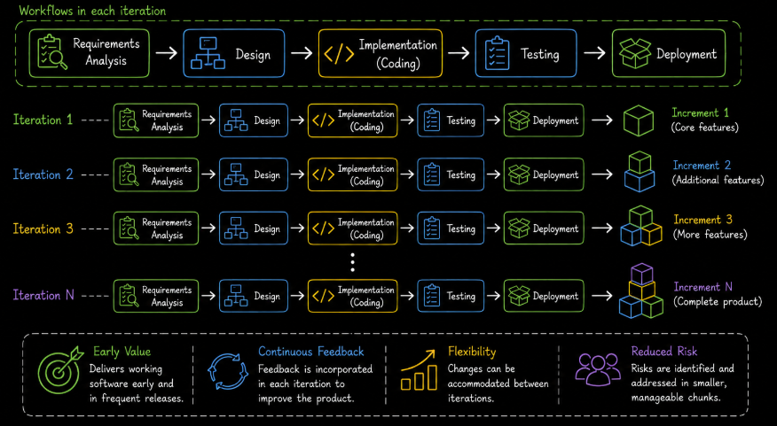
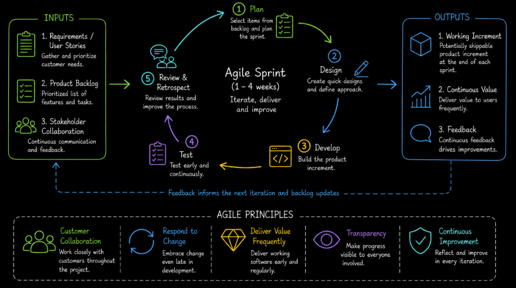

# Table of Contents: SDLC Level 2

- [Iterative and Incremental model](#iterative-and-incremental-model)
- [Introduction to Agile](#introduction-to-agile)
- [Comparing sequential and iterative models](#comparing-sequential-and-iterative-models)

In the previous level, structured SDLC models such as the **Waterfall model** and the **V-Model** were introduced. These models follow a sequential approach, where development progresses step by step through defined phases.

At this level, the focus shifts to a different way of building software. Instead of following a single linear flow, development can be organized into smaller cycles that support feedback, refinement and adaptation.

This approach is based on two key ideas. **Iterative development** focuses on improving the product through repeated cycles, while **incremental development** focuses on building the product in smaller parts that are added step by step.

These ideas are often combined in practice, but they describe different aspects of development.

## Iterative and Incremental model

The **Iterative and Incremental model** is an approach in which software is developed in smaller parts and refined through repeated cycles.

Instead of delivering the entire system at once, development is divided into **increments**. Each increment adds a portion of functionality to the product. Development also happens through **iterations**, where existing or newly added functionality can be reviewed, tested and improved based on feedback.

Each development cycle can include activities such as planning, designing, implementing and testing. Testing therefore occurs throughout the cycles rather than being treated only as a final activity after all functionality has been implemented.

The result of a cycle is a version of the system that is more complete or more refined than before. If an increment is suitable for release, it can provide a potentially usable portion of functionality before the entire product is complete.

For example, an online store could first deliver account registration and login functionality. A later increment could add a product catalog, followed by a shopping cart and then payment functionality. Within these increments, the team may perform several iterations to improve behavior, usability or quality based on testing and feedback.

This approach can help teams receive feedback earlier, identify problems sooner and adapt the product as more information becomes available. It can also reduce the risk of discovering major problems only near the end of development.

However, iterative and incremental development also requires effective planning and coordination. Frequent changes can make scope harder to control, and repeated refinement can create additional work if priorities are unclear or feedback is not managed effectively.

Iterative and incremental principles form an important foundation for modern development approaches such as Agile.

## Introduction to Agile

**Agile** is an approach to software development that commonly uses iterative and incremental development while emphasizing collaboration, feedback and the ability to respond to change.

Iterative and incremental development describes how a product can be built through cycles and smaller additions. Agile adds principles and values that influence how teams collaborate, make decisions and organize their work during those cycles.

In Agile development, work is commonly organized into short cycles or continuous flows in which smaller parts of the product are developed, tested and reviewed. Teams use feedback to adjust priorities and refine the product instead of assuming that every detail can be fixed at the beginning of development.

Compared with sequential approaches, Agile places greater emphasis on **flexibility, collaboration and continuous improvement**. Team members communicate frequently, stakeholders provide feedback and plans can be adjusted as the team learns more about the product and its users.

Agile development is guided by the four values of the **Agile Manifesto**, published in 2001.

- **Individuals and interactions over processes and tools**, effective communication and collaboration are valued more than rigidly following processes or relying on tools.
- **Working software over comprehensive documentation**, delivering software that works is valued more than producing excessive documentation, although useful documentation still has value.
- **Customer collaboration over contract negotiation**, ongoing collaboration with customers and stakeholders is valued more than relying only on agreements established at the beginning.
- **Responding to change over following a plan**, teams value the ability to adapt when needs or circumstances change rather than following an original plan regardless of new information.

The wording "over" does not mean that the items on the right have no value. It means that Agile places greater value on the items on the left when decisions and trade-offs must be made.

Agile also encourages collaboration across different roles. This is often described as the **whole team approach**, where developers, testers and other relevant team members work together throughout development rather than treating quality as the responsibility of one isolated role or phase.

Testing is therefore closely integrated with Agile development. Testers can contribute to requirements discussions, test functionality as it is developed, provide rapid feedback and support repeated testing when the product changes. This helps teams identify quality problems within an iteration or development flow instead of waiting until the entire product has been implemented.

Agile is not a single prescribed development method. It is an umbrella term for approaches based on Agile values and principles. **Scrum**, **Kanban** and **Extreme Programming (XP)** are examples of commonly recognized approaches associated with Agile development. Their specific practices are beyond the scope of this introductory level.

Agile also involves trade-offs. It depends on regular communication, clear prioritization and active stakeholder involvement. Frequent change can lead to uncontrolled scope growth if priorities are not managed, and teams must balance the preference for working software with the need to maintain sufficient documentation for their context.

## Comparing sequential and iterative models

Sequential and iterative approaches represent different ways of organizing software development.

In a **sequential approach**, development progresses through a defined series of phases, where one phase is normally completed before moving to the next. This can make planning, responsibilities and major deliverables easier to define in advance, particularly when requirements are stable.

In an **iterative approach**, development is organized into repeated cycles in which the product is reviewed and refined over time. When iterative development is combined with incremental development, new portions of functionality can also be added gradually.

The main difference lies in how feedback and change are handled. Sequential models rely more heavily on upfront planning and are easier to manage when requirements remain stable. Iterative approaches allow teams to use feedback throughout development and adjust the product as new information becomes available.

Testing is also organized differently. In a traditional sequential model such as Waterfall, formal testing occurs as a later phase after implementation. In iterative development, testing can occur during every cycle, providing feedback while the product is still evolving.

Iterative approaches can reduce the risk of late surprises and make adaptation easier, but this flexibility introduces trade-offs. Scope and long-term schedules may be less predictable when requirements change frequently, and effective iterative development requires regular communication, prioritization and stakeholder feedback.

For this reason, neither sequential nor iterative development is universally better. The appropriate approach depends on factors such as requirement stability, project risk, the need for feedback, stakeholder availability and the amount of change expected during development.

Understanding these differences provides a foundation for later levels, where testing practices and development approaches can be examined in greater detail.
