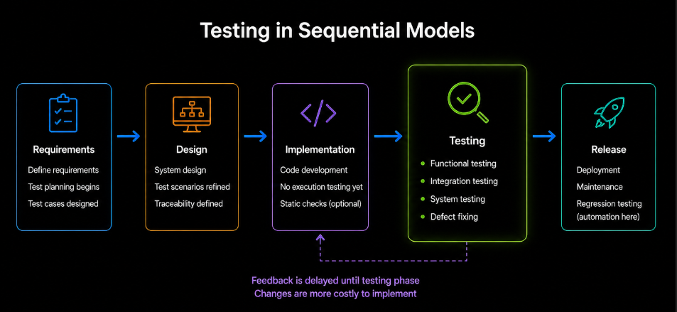
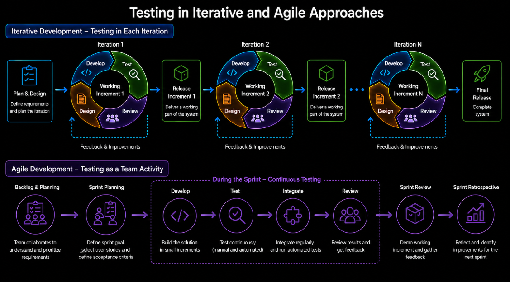
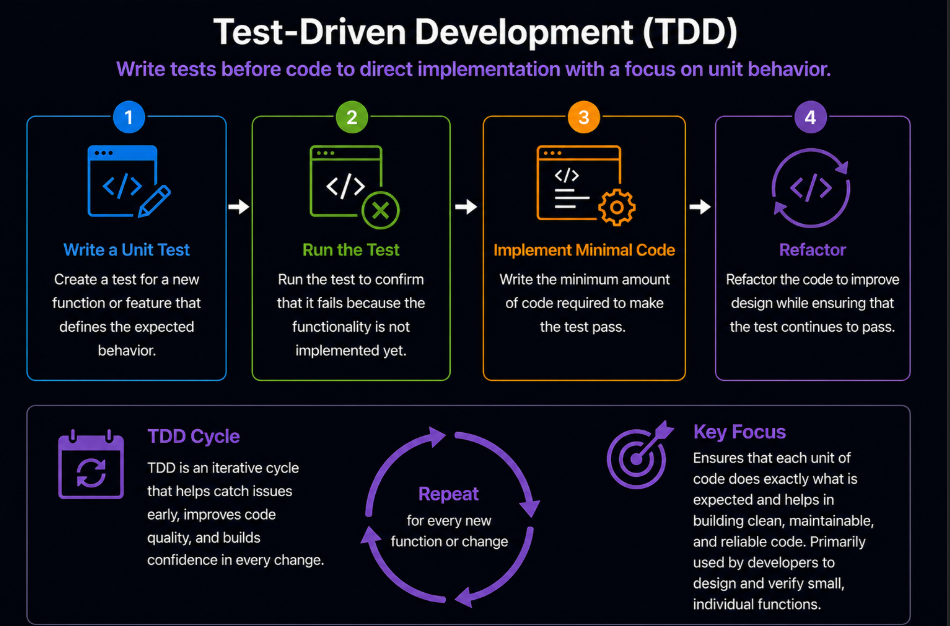
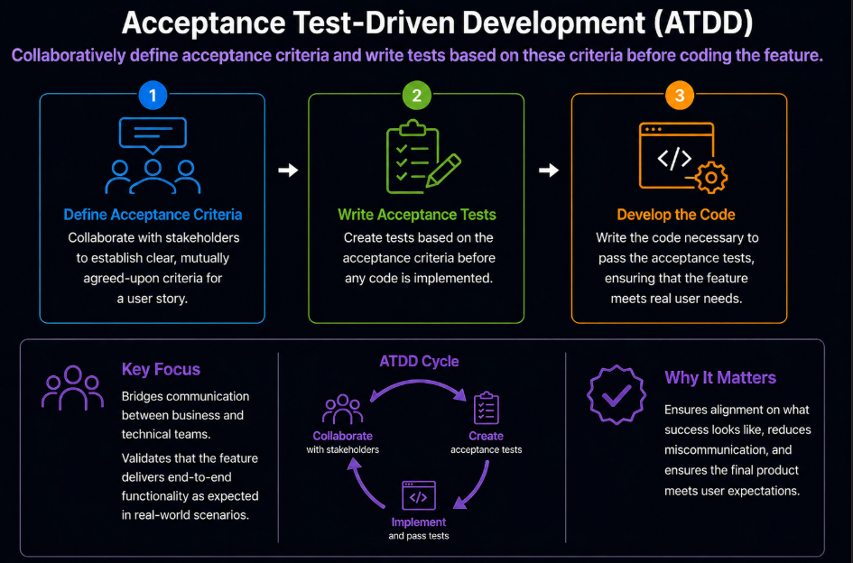
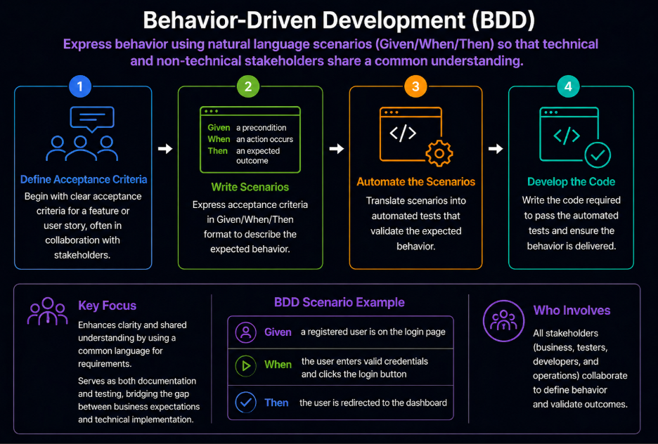

# Content of SDLC Level 3

- [Testing in sequential models](#testing-in-sequential-models)
- [Testing in iterative and agile approaches](#testing-in-iterative-and-agile-approaches)
- [Choosing a suitable SDLC model for a project](#choosing-a-suitable-sdlc-model-for-a-project)
- [Testing approaches in software development](#testing-approaches-in-software-development)

In the previous level, different ways of building software were explored, including structured sequential approaches and iterative and incremental development, where software is created and improved in cycles.

It was also shown how Agile builds on these ideas by introducing a collaborative and adaptive way of working.

At this level, the focus shifts from how software is built to how **testing is performed within these approaches**.

The chosen development approach directly affects when testing takes place, how frequently it is performed and how quickly feedback is obtained.

In more structured approaches, testing is typically performed in later stages. In more flexible approaches, testing becomes continuous and integrated into development.

Understanding these differences is essential for applying appropriate testing practices in each context.

## Testing in sequential models

In sequential approaches, testing is organized as a distinct stage that follows development activities.

Testing typically begins after implementation is completed. This means that the system is verified only once most of the functionality has already been built.

Because of this structure, feedback is delayed. Defects are often identified at a later stage, which can make them more difficult and costly to fix.

Testing activities are usually **planned in detail upfront**, with clearly defined test plans, test cases and traceability to requirements. This provides strong structure and control, but makes adapting to changes more difficult.

Automation is typically **introduced later in the process**, mainly to support regression testing once the system is stable. Its importance increases further after release, during maintenance, where repeated validation of changes becomes necessary. Because testing is not performed continuously during development, the overall impact of automation is more limited compared to more iterative approaches.

Overall, testing in sequential models is structured and well-defined, but less flexible and slower to respond to changes.

## Testing in iterative and Agile approaches

In iterative approaches, testing is performed continuously as part of the development process rather than as a separate phase.

Because the system is developed in smaller parts, testing begins earlier and is repeated frequently. Each cycle produces a working version of the system, which is verified before further development continues.

Testing focuses on both validating new functionality and ensuring that existing features continue to work correctly as the system evolves.

Test documentation is more flexible and evolves over time, adapting to changes and feedback from each cycle rather than being fully defined upfront.

Automation plays an important role in supporting repeated testing. As development progresses, automated tests are expanded to improve efficiency and ensure consistent validation across iterations.

Agile builds on these iterative principles by introducing a more collaborative way of working.

In Agile, testing is a shared responsibility. Developers, testers and other stakeholders work together throughout development, contributing to defining requirements, designing tests and ensuring quality.

Communication becomes more important than formal processes and feedback is gathered continuously to guide development.

As a result, testing remains continuous, but becomes more closely integrated into everyday work and team collaboration, enabling faster feedback and more adaptive quality practices.

These differences in how development and testing are organized highlight that no single approach fits every situation. Each SDLC model provides different advantages depending on project needs, team structure and the level of flexibility required.

To understand how to select the most appropriate approach, the next step is to look at **choosing a suitable SDLC model for a project**.

## Choosing a suitable SDLC model for a project

Selecting an appropriate SDLC model determines how development is structured, how changes are handled and how feedback is obtained throughout the process.

Projects with well-defined and stable requirements are better suited to sequential models, where work follows a clear and predictable structure.

When requirements are uncertain or expected to change, iterative and incremental approaches provide more flexibility by allowing development to evolve through smaller cycles and continuous refinement.

Agile builds on these approaches by emphasizing collaboration, fast feedback and the ability to adapt quickly to changing priorities.

In addition to requirements, factors such as project size, team experience, risk level and regulatory constraints also influence the choice of model.

Choosing the right SDLC model ensures that the development approach matches the project context, allowing teams to balance structure, flexibility and quality effectively.

Once a model is selected, different development practices can further influence how testing is integrated into daily work.

These practices define how tests are created and how closely they are integrated with development activities.

## Testing approaches in software development

While SDLC models define how software development is structured, testing approaches define how testing is designed and integrated into that process.

Different approaches determine when tests are created, how they are written and how they guide development work.

This allows testing to be more closely aligned with coding and design, ensuring that quality is built into the product rather than verified only at the end.

One of the most common ways to achieve this is by using development practices where tests guide implementation from the start.

**Test-Driven Development (TDD)** is an approach where tests are written before the code to guide implementation and verify unit-level behavior.

In this approach, tests are written before coding and focus on unit-level functionality. The criteria are defined as developer-written unit tests, and the approach is mainly used by developers. The process involves writing a unit test, running the test to confirm it fails, implementing minimal code to pass the test, and then refining the code while ensuring the test continues to pass. The key focus is on ensuring that each unit behaves as expected and supports clean and maintainable code design.

**Acceptance Test-Driven Development (ATDD)** is an approach where acceptance criteria are defined collaboratively and tests are created before development begins.

In this approach, tests are written before coding based on user stories and focus on end-to-end functional acceptance. The criteria can be defined in flexible formats such as checklists, tables, or descriptive scenarios, and the approach involves collaboration between customers, testers, and developers. The process includes defining acceptance criteria, creating acceptance tests, and developing the code required to satisfy those tests. The key focus is on ensuring that features meet real user needs and improving communication between business and technical teams.

**Behavior-Driven Development (BDD)** is an approach where system behavior is described using structured scenarios so that both technical and non-technical stakeholders share a common understanding.

In this approach, tests are written before coding using scenario-based descriptions. The primary focus is on behavior and user experience, and the criteria are expressed using structured scenarios such as Given, When, and Then. The approach involves collaboration between all stakeholders. The process includes defining acceptance criteria, writing scenarios, translating them into automated tests, and developing the code to satisfy those tests. The key focus is on improving clarity, shared understanding, and ensuring that the system behaves as expected from the user perspective.
