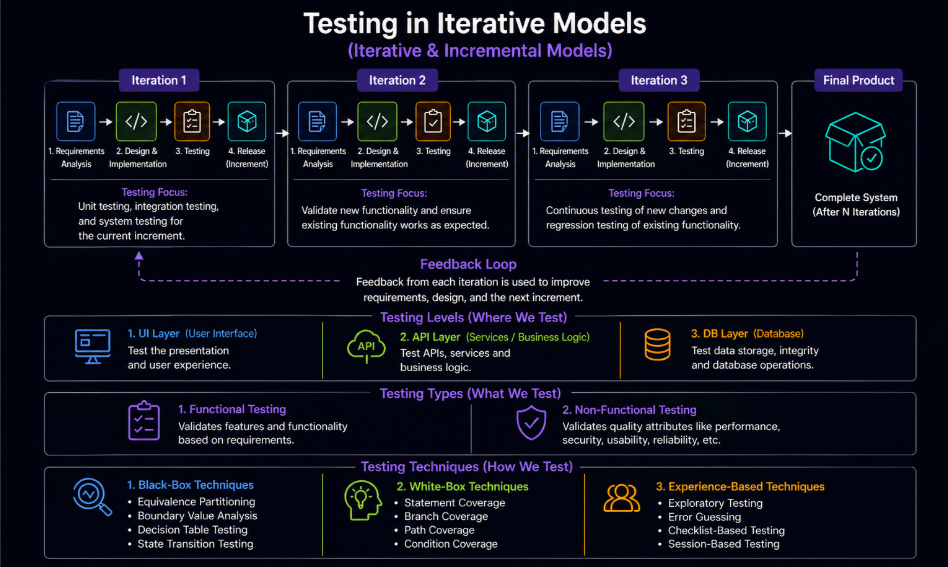
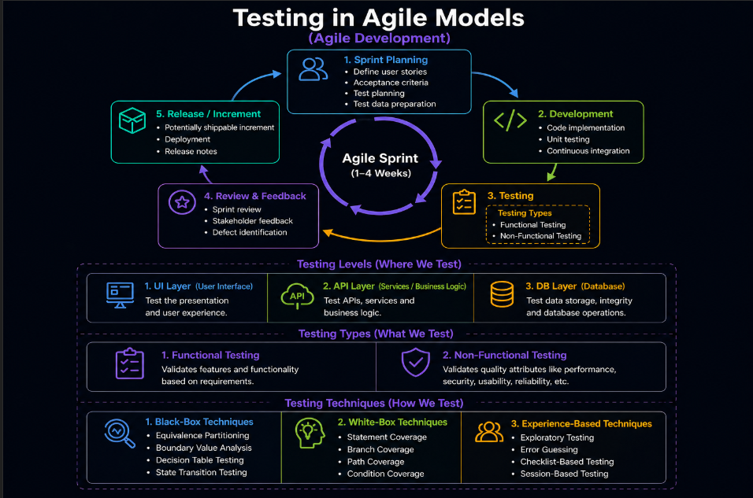
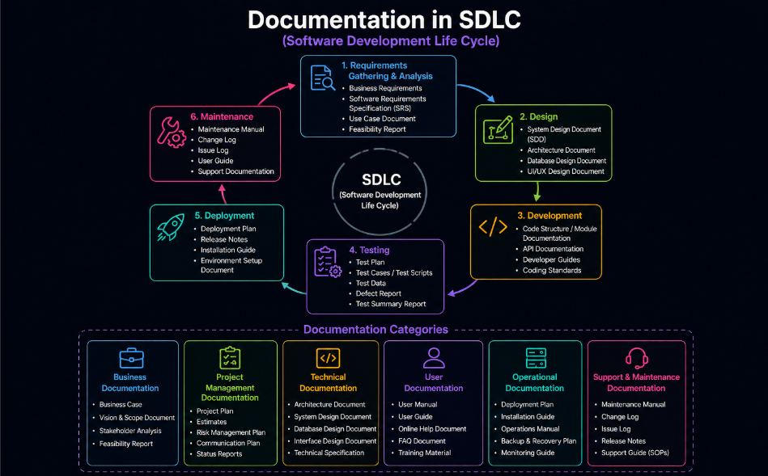
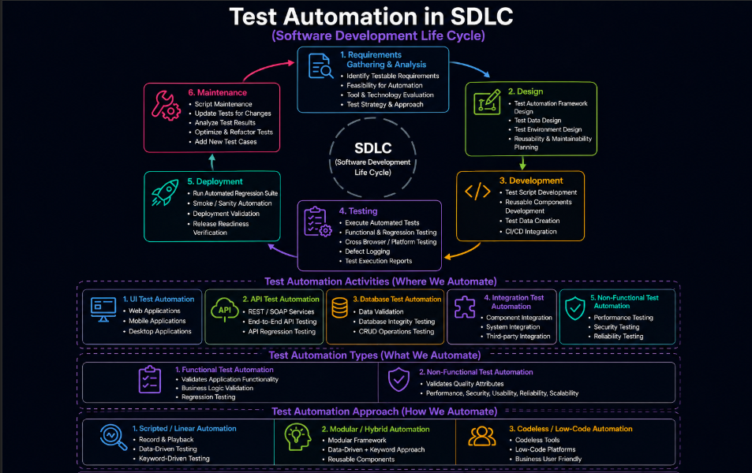

# Content of SDLC Level 3

- [Testing in sequential models](#testing-in-sequential-models)
- [Testing in iterative and incremental models](#testing-in-iterative-and-incremental-models)
- [Testing in Agile development](#testing-in-agile-development)
- [Documentation differences across SDLC models](#documentation-differences-across-sdlc-models)
- [Test automation across SDLC models](#test-automation-across-sdlc-models)
- [Choosing a suitable SDLC model for a project](#choosing-a-suitable-sdlc-model-for-a-project)
- [Testing approaches in software development](#testing-approaches-in-software-development)

In the previous level, different approaches to software development were explored, including sequential, iterative, and Agile models. These approaches define how software is built, how work is organized, and how changes are managed throughout the development process.

However, the way software is developed also directly affects how testing is performed. The structure of the development process influences when testing begins, how often it is performed, what types of testing are needed, and how quickly feedback is received.

In some models, testing is performed later as a separate phase, while in others it is integrated continuously throughout development. These differences impact how defects are identified, how quality is ensured, and how teams collaborate.

To understand these relationships, it is important to examine how the Software Development Life Cycle shapes testing activities and overall quality practices.

## Testing in sequential models

In sequential models such as the **Waterfall model** and the **V-Model**, development follows a fixed order of phases, where each stage is completed before moving to the next. This structure directly affects how testing is planned and performed.

In the Waterfall model, testing is typically performed after the implementation phase is completed. This makes the process simple and structured, with clearly defined stages and deliverables. However, because testing happens later, defects are often discovered at a late stage, which can increase the cost and effort required to fix them.

In contrast, the V-Model introduces a structured relationship between development and testing activities. Each development phase is associated with a corresponding testing activity, allowing testing to be planned earlier and aligned with the development process. This improves defect detection by identifying issues during earlier stages such as requirements and design.

Both models provide a clear and well-documented approach to development and testing. At the same time, they share limitations, particularly in terms of flexibility. Because development progresses in a strict sequence, adapting to changes is difficult once a phase is completed, and both models assume that requirements are stable from the beginning.

Understanding how testing is structured in sequential models highlights these limitations, especially in terms of delayed feedback and limited adaptability. To overcome these challenges, testing is performed differently in more flexible development approaches.

## Testing in iterative and incremental models

In iterative and incremental models, testing is performed continuously as part of the development process rather than as a separate phase. Each iteration produces a working version of the system, and testing activities are integrated into every cycle.

Because the system is developed in smaller parts, testing begins earlier and is repeated frequently. Each iteration requires verification of new functionality as well as rechecking existing features to ensure that previously working behavior is not affected by recent changes.

Testing in these models covers multiple levels and types of activities within each iteration, including both static and dynamic testing. This allows issues to be identified not only during execution but also during earlier stages such as design and review.

The level of test documentation is more flexible compared to sequential models. Instead of being fully defined upfront, it can evolve based on feedback from each iteration, allowing teams to adjust their approach as the system develops.

Testing techniques and approaches are also more adaptable. Teams can select and refine methods based on the current state of the product, focusing on the most relevant risks and areas of change.

Automation plays an important role in supporting repeated testing. As the system evolves, automated tests can be gradually introduced and expanded to improve efficiency and ensure consistent validation across iterations.

Testers are involved throughout the entire development process, working closely with developers and other team members. This continuous involvement supports faster feedback, better communication, and improved overall quality.

Compared to sequential models, testing in iterative and incremental approaches is more flexible and adaptive, supporting ongoing changes and continuous improvement of the product.

These ideas are further extended in Agile development, where testing is fully integrated into the development process and performed continuously as part of everyday work.

## Testing in Agile development

In Agile development, testing is fully integrated into the development process and is performed continuously alongside development activities. Instead of being treated as a separate phase, testing becomes part of everyday work within each iteration.

Because development is organized into short cycles, testing is performed frequently and focuses on providing fast feedback. New functionality is verified as it is developed, while existing functionality is continuously rechecked to ensure that changes do not introduce defects.

Testing in Agile emphasizes collaboration between team members. Developers, testers, and other stakeholders work together to define requirements, create test scenarios, and ensure that quality is maintained throughout the process. This shared responsibility supports early defect detection and improves overall communication.

Test activities in Agile include both manual and automated approaches. Automation is commonly used to support repeated testing and ensure consistent validation across iterations, while exploratory and experience-based testing help identify unexpected issues.

Because feedback is collected continuously, testing in Agile supports rapid adaptation to changes. This allows teams to respond quickly to new requirements and maintain a high level of product quality as the system evolves.

Compared to iterative and incremental models, Agile further strengthens the integration of testing within development, making quality a shared and continuous responsibility across the entire team.

Testing activities across the lifecycle are supported by documentation that defines what needs to be tested, how testing is performed, and how results are recorded. The structure and level of this documentation can vary depending on the development approach being used.

## Documentation differences across SDLC models

Documentation plays an important role in supporting testing activities by defining what needs to be tested, how testing is performed, and how results are recorded. The structure, level of detail, and purpose of documentation can vary depending on the SDLC model used.

In sequential models such as the Waterfall model and the V-Model, documentation is typically detailed and created early in the process. Test plans, test cases, and requirements specifications are defined upfront, providing a clear and structured reference for testing activities. This approach supports traceability and consistency, but it can be less flexible when changes occur.

In iterative and incremental models, documentation is more adaptive and evolves over time. Instead of being fully defined at the beginning, it is updated across iterations based on feedback and changes in the system. This allows teams to adjust their testing approach as the product develops, while still maintaining sufficient documentation to support testing activities.

In Agile development, documentation is often lightweight and focused on essential information. Rather than producing extensive formal documents, teams rely on user stories, acceptance criteria, and direct communication to guide testing. The emphasis is on maintaining just enough documentation to support development and testing without slowing down the process.

The differences in documentation reflect how each SDLC model approaches development and testing. More structured models prioritize detailed planning and traceability, while more adaptive models prioritize flexibility, collaboration, and continuous updates.

Understanding how documentation varies across SDLC models helps explain how testing practices are supported in different development environments. The next step is to examine **test automation across SDLC models**.

## Test automation across SDLC models

Test automation plays an important role in supporting testing activities by improving efficiency, consistency, and repeatability. The extent to which automation is used depends on the SDLC model and how development and testing are organized.

In sequential models such as the Waterfall model and the V-Model, automation is typically more limited. Since testing is performed later in the process, automation is often applied after implementation, mainly to support regression testing and repetitive validation tasks. The structured nature of these models allows for well-defined test cases, but slower feedback can reduce the overall impact of automation.

In iterative and incremental models, automation becomes more important because testing is performed repeatedly across iterations. Automated tests help ensure that existing functionality continues to work correctly as new changes are introduced. This supports faster feedback and reduces the effort required for repeated testing.

In Agile development, automation is a key part of the testing process. Because development cycles are short and frequent, automated tests are used extensively to validate functionality quickly and consistently. Automation supports continuous testing, enabling teams to detect defects early and maintain product quality as the system evolves.

The role of automation reflects how each SDLC model approaches development and testing. More structured models use automation in a limited and controlled way, while more adaptive models rely on automation to support continuous and fast feedback.

Understanding how automation is applied across different SDLC models helps explain how teams maintain quality at scale. The next step is to examine **choosing a suitable SDLC model for a project**.

## Choosing a suitable SDLC model for a project

Selecting an appropriate SDLC model is an important decision that directly affects how development and testing activities are organized. Different models provide different levels of structure, flexibility, and feedback, and the choice depends on the specific needs of the project.

Projects with well-defined and stable requirements are often suited to sequential models such as the Waterfall model or the V-Model. These approaches provide clear structure, detailed documentation, and predictable workflows, which can be beneficial in environments where changes are limited and strict processes are required.

When requirements are expected to evolve or are not fully known at the beginning, iterative and incremental models provide more flexibility. These approaches allow development and testing to occur in smaller cycles, making it easier to adapt to changes and incorporate feedback throughout the process.

Agile development is well suited for projects that require rapid delivery, continuous feedback, and close collaboration between team members. It supports frequent releases and ongoing improvements, making it effective in dynamic environments where priorities may change over time.

Other factors such as project size, team experience, risk level, and regulatory requirements also influence the choice of an SDLC model. For example, larger or more complex systems may benefit from structured approaches, while smaller or rapidly changing projects may require more adaptive models.

Choosing the right SDLC model helps ensure that both development and testing activities are aligned with project goals, allowing teams to manage complexity, respond to change, and maintain product quality effectively.

Once a suitable model is selected, the way testing is performed within that model can vary based on different development practices that integrate testing more closely with coding and design activities.

## Testing approaches in software development

Once testing is integrated into the development process, different approaches can be used to define how and when tests are created. These approaches help teams align development and testing activities more closely, ensuring that quality is built into the product from the beginning rather than verified only at the end.

**Test-Driven Development (TDD)** is an approach where tests are written before the code to guide implementation and verify unit-level behavior.

In this approach, tests are written before coding and focus on unit-level functionality. The criteria are defined as developer-written unit tests, and the approach is mainly used by developers. The process involves writing a unit test, running the test to confirm it fails, implementing minimal code to pass the test, and then refining the code while ensuring the test continues to pass. The key focus is on ensuring that each unit behaves as expected and supports clean and maintainable code design.

**Acceptance Test-Driven Development (ATDD)** is an approach where acceptance criteria are defined collaboratively and tests are created before development begins.

In this approach, tests are written before coding based on user stories and focus on end-to-end functional acceptance. The criteria can be defined in flexible formats such as checklists, tables, or descriptive scenarios, and the approach involves collaboration between customers, testers, and developers. The process includes defining acceptance criteria, creating acceptance tests, and developing the code required to satisfy those tests. The key focus is on ensuring that features meet real user needs and improving communication between business and technical teams.

**Behavior-Driven Development (BDD)** is an approach where system behavior is described using structured scenarios so that both technical and non-technical stakeholders share a common understanding.

In this approach, tests are written before coding using scenario-based descriptions. The primary focus is on behavior and user experience, and the criteria are expressed using structured scenarios such as Given, When, and Then. The approach involves collaboration between all stakeholders. The process includes defining acceptance criteria, writing scenarios, translating them into automated tests, and developing the code to satisfy those tests. The key focus is on improving clarity, shared understanding, and ensuring that the system behaves as expected from the user perspective.
