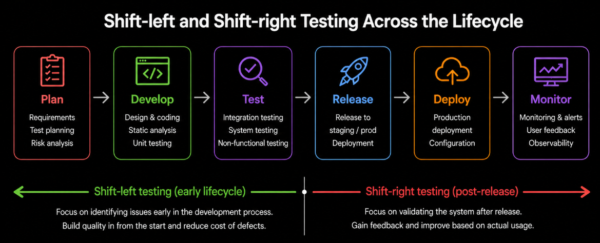

# Content of SDLC Level 4

- [Planning and collaboration](#planning-and-collaboration)
- [Continuous improvement](#continuous-improvement)
- [Testing strategies across the lifecycle](#testing-strategies-across-the-lifecycle)
- [Continuous testing and delivery](#continuous-testing-and-delivery)
- [Risk and lifecycle coverage](#risk-and-lifecycle-coverage)

In the previous level, testing was examined across different development approaches, focusing on how it is integrated and performed within the lifecycle.

At this level, the focus shifts from understanding testing behavior to how teams **apply these practices in development environments**. This includes how work is planned, how responsibilities are shared and how quality is maintained throughout the entire lifecycle.

These activities require coordination, communication and clear alignment between team members, especially in modern Agile environments where work is performed continuously and collaboratively.

To understand how teams organize their work and ensure alignment from the beginning, the next step is to look at **planning and collaboration**.

## Planning and collaboration

Planning and collaboration define how teams organize work, align responsibilities and ensure that **quality is considered from the beginning of development**.

**Release and iteration planning** help structure the work across different timeframes. During **release planning**, the overall scope of work is defined, including key features, priorities and risks. The product backlog is refined so that work items are clear, understandable and ready for development. For example, a large feature such as "user authentication" may be broken down into smaller items like login, registration and password reset.

**Iteration planning** focuses on shorter cycles, where a specific set of work items is selected for implementation. The team breaks these items down into smaller tasks, including development and testing activities, ensuring that work can be completed within the iteration. For example, a user story like "login functionality" may be split into tasks such as UI implementation, API integration and test case creation.

**Testers** play an active role in these planning activities. They contribute by helping define clear and testable requirements, identifying potential risks, estimating testing effort and ensuring that testing is considered as part of the overall plan rather than a separate activity. For example, a tester may identify a risk related to invalid input handling and suggest additional validation scenarios during planning.

To ensure shared understanding of quality, teams define **acceptance criteria** for each work item. These criteria describe the expected behavior of the system and provide a clear basis for validation. For example, an acceptance criterion for login could be "the user is able to log in with valid credentials and receives an error message for invalid ones".

In addition, teams use a **Definition of Done**, which specifies the conditions that must be met for work to be considered complete. This typically includes development, testing and quality-related activities, ensuring that every increment meets a consistent standard before it is delivered. For example, a task may be considered done only when code is implemented, tests are executed, defects are fixed and the feature is reviewed.

Through planning and collaboration, teams align development and testing activities, improve communication and ensure that **quality is built into the process from the start**.

However, planning alone is not enough. Teams also need to regularly evaluate how they work, identify areas for improvement and adapt their processes over time.

To support this ongoing refinement, the next step is to look at **continuous improvement**.

## Continuous improvement

Continuous improvement focuses on how teams regularly evaluate their work and refine their processes to improve **quality and efficiency over time**.

One of the main practices supporting this is the **retrospective**, which takes place at the end of an iteration, release or project. During a retrospective, team members review what happened and identify ways to improve both development and testing activities.

These discussions typically focus on three key questions: **what worked well**, **what did not work** and **what actions should be taken next**. For example, a team may identify that automated tests helped reduce regression issues, while unclear requirements caused delays, leading to actions such as improving test coverage and refining acceptance criteria earlier.

Retrospectives involve the entire team, including developers, testers and other stakeholders. This ensures that different perspectives are considered and that improvements address the overall process rather than a single role.

The outcomes of these meetings are recorded and translated into **actionable improvements**. For example, the team may decide to introduce additional code reviews, improve test data preparation or adjust their testing approach in future iterations.

Continuous improvement leads to more effective testing, better collaboration and higher quality results over time. However, its success depends on whether identified improvements are actually implemented and followed up in future work.

By regularly reviewing and adapting their process, teams ensure that both development and testing evolve together and **continuously improve**.

As teams improve the way they work, they also refine how testing is distributed across the entire lifecycle, from early development stages to usage after release.

To understand how testing can be applied at different points in the lifecycle, the next step is to look at **testing strategies across the lifecycle**.

## Testing strategies across the lifecycle

Testing strategies across the lifecycle define how testing is distributed throughout development and after release to ensure continuous quality.

Two important approaches used in modern development are **shift-left** and **shift-right testing**.

**Shift-left testing** focuses on moving testing activities earlier in the development process. Instead of waiting until implementation is complete, testing begins during requirements, design and early development stages. This helps identify issues before they become more complex and costly to fix.

For example, testers may participate in requirement reviews to identify ambiguities, define acceptance criteria before development starts or create test cases alongside design activities. Static analysis and early non-functional testing, such as security or performance checks at component level, can also be introduced at this stage.

By detecting defects early, shift-left testing reduces rework, improves code quality and increases confidence before the system reaches later stages.

In contrast, **shift-right testing** extends testing into later stages of the lifecycle, including deployment and production environments. The goal is to validate how the system behaves under real-world conditions.

For example, teams may monitor application performance in production, collect user feedback or run tests in production-like environments to verify scalability, reliability and user experience. Observability tools can help detect issues that were not visible during earlier testing stages.

Shift-right testing ensures that the system continues to meet quality expectations after release and provides valuable feedback for further improvements.

Together, shift-left and shift-right approaches create a balanced testing strategy. Testing is not limited to a single phase but is performed continuously across the entire lifecycle, from early development to real-world usage.

To support this continuous flow of development and testing, teams rely on engineering and delivery practices that automate and streamline how software is built, tested and released.

## Continuous testing and delivery

Continuous testing and delivery focus on how testing is integrated into the development workflow to provide fast and consistent feedback.

One of the key practices is **Continuous Integration (CI)**, where developers frequently integrate their changes into a shared codebase. Each change triggers automated builds and tests, allowing teams to detect issues early. For example, when a developer commits code, automated tests run immediately to confirm that existing functionality still works.

Building on this, **Continuous Delivery (CD)** ensures that validated changes are always ready to be released. Testing is not delayed until the end but is performed continuously as part of the delivery process. For example, once a feature passes all automated tests, it can be deployed to a staging environment for further verification.

These practices rely on automation to support continuous testing. Tests are executed repeatedly as changes are introduced, helping detect defects quickly and ensuring that existing functionality remains stable.

By integrating testing into the development and delivery process, teams receive faster feedback, reduce risks and maintain consistent quality throughout the lifecycle.

However, ensuring quality is not only about when testing happens, but also about **what to focus on and how risks are managed across different stages of the lifecycle**.

To understand how teams prioritize testing efforts and maintain quality from development to post-release, the next step is to look at **risk and lifecycle coverage**.

## Risk and lifecycle coverage

Risk and lifecycle coverage focus on how teams ensure that quality is maintained across all stages of the software lifecycle, from development to post-release operation.

Instead of treating testing as a single activity, teams consider how risks evolve over time and adjust their testing accordingly. Early in development, risks may be related to unclear requirements or design decisions. Later, risks shift toward integration issues, performance limitations or user experience in real-world conditions.

To manage this, teams apply **risk-based thinking** continuously, not only during test planning but throughout the entire lifecycle. This means focusing attention on the most critical areas at each stage and adapting testing as the system evolves. For example, early testing may focus on validating requirements, while later stages may prioritize system behavior under real usage conditions.

After release, risk management continues through **maintenance and post-release activities**. Changes, updates and fixes can introduce new risks, making it necessary to verify that existing functionality remains stable. In addition, monitoring and user feedback help identify issues that were not visible during earlier testing.

By considering how risks change across the lifecycle, teams ensure that testing remains relevant, targeted and effective, supporting both short-term delivery and long-term system quality.
