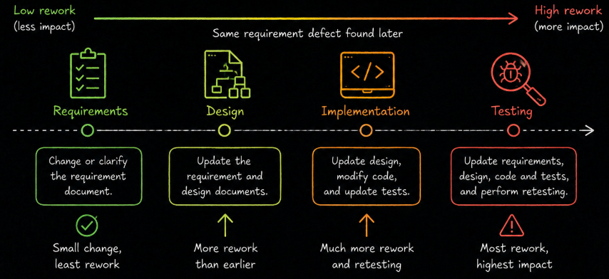
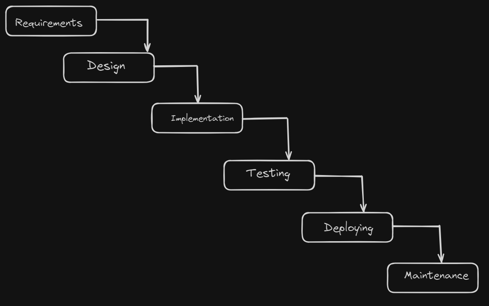
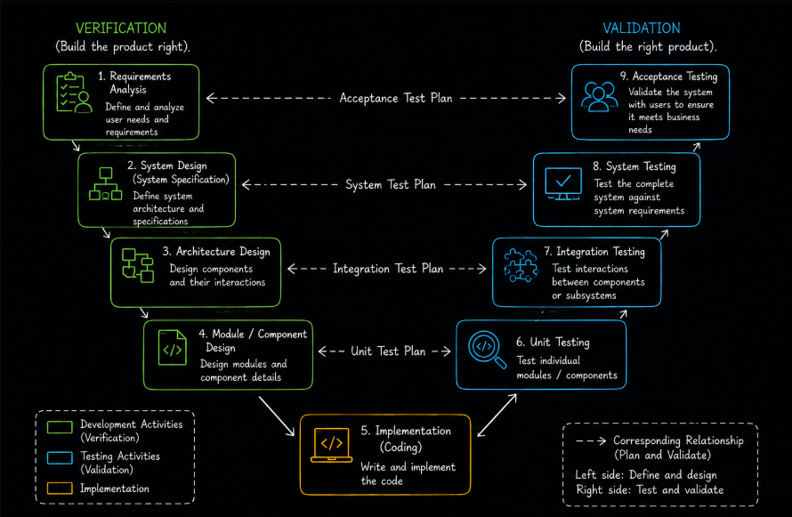

# Table of Contents: SDLC Summary

- [SDLC Level 1](#sdlc-level-1)
- [SDLC Level 2](#sdlc-level-2)

This summary brings together the most important concepts from the **Software Development Life Cycle (SDLC)** module. It is designed as a quick reference for revision and preparation for questions where the main lifecycle concepts, model differences and relationships between development and testing need to be explained clearly.

## SDLC Level 1

Level 1 establishes the foundations of the **Software Development Life Cycle (SDLC)**. The main goal is to understand what SDLC is, why a structured lifecycle is useful, how development is organized into phases and how testing relates to development in sequential SDLC models.

The **Software Development Life Cycle (SDLC)** is a structured process used to guide software from an initial idea through development, delivery and ongoing maintenance. SDLC organizes development into defined phases so that teams can coordinate activities and understand how different types of work relate to one another.

SDLC is not a single development model. It is a general lifecycle concept implemented through different **SDLC models**. A model defines how lifecycle phases are arranged, how teams progress through them and how development and testing activities are connected.

A structured lifecycle helps teams manage responsibilities, track progress, control changes and reduce project risks. Finding problems early is particularly valuable because the effort required to correct a defect can increase as development progresses. A requirement problem found early may require only a document change, while the same problem found later may require changes to requirements, designs, code and tests, followed by retesting.

Software development commonly includes **requirements analysis**, **system design**, **implementation**, **testing**, **deployment** and **maintenance**.

During **requirements analysis**, the team identifies what the system must do and defines expectations and constraints. During **system design**, the team determines how the solution will be structured. During **implementation**, developers create the software. During **testing**, the software is evaluated against expected behavior and requirements. During **deployment**, the software is released into its intended environment. During **maintenance**, the system is corrected, adapted and improved over time.

SDLC phases produce **deliverables**, such as requirements specifications, design documents, software builds, test cases and test results. **Entry criteria** describe conditions that should be satisfied before an activity begins, while **exit criteria** describe conditions that should be satisfied before the activity is considered complete.

Testing can contribute throughout the lifecycle. **Static testing** evaluates work products without executing software and can include reviews of requirements and designs. **Dynamic testing** evaluates executable software by running it and comparing actual behavior with expected behavior.

The **Waterfall model** is a sequential SDLC model in which development progresses through defined phases in order. A phase is normally completed before the next phase begins. Formal testing traditionally follows implementation, although test planning may occur earlier in practice.

Waterfall provides clearly defined phases and deliverables and is most suitable when requirements are stable and well understood. Its sequential structure can make later changes more difficult because completed work may need to be revisited.

The **V-Model**, also known as the **Verification and Validation (V&V) model**, is another sequential SDLC model. It extends Waterfall by explicitly relating development activities to corresponding test levels and by encouraging test planning alongside development.

The left side of the V represents specification and design activities and emphasizes **verification** through static activities. **Implementation** appears at the bottom. The right side represents execution-based testing and emphasizes **validation**.

The V-Model creates explicit relationships between development work products and testing. **Requirements analysis** relates to **acceptance testing**, **system design** relates to **system testing**, **architecture design** relates to **integration testing**, and **module or component design** relates to **unit testing**.

Executable tests do not run before code exists. Instead, test conditions, test cases and other testing activities can be designed earlier using requirements and design work products. This supports traceability and can expose problems before they propagate into implementation.

Both Waterfall and the V-Model are **sequential models** and are most suitable when requirements are relatively stable. Waterfall provides a simpler sequential structure, while the V-Model makes the relationship between development and testing more explicit.

After reviewing **SDLC Level 1**, you should be able to explain **what SDLC is and why it is used**, describe the **main SDLC phases**, explain **deliverables, entry criteria and exit criteria**, distinguish **static and dynamic testing**, describe the **Waterfall model and V-Model**, explain the V-Model's **development-to-testing mappings** and compare the two sequential models.

## SDLC Level 2

**SDLC Level 2** builds on the sequential models introduced in **SDLC Level 1** and focuses on approaches that organize development into **smaller cycles and increments**. The main goal is to understand iterative and incremental development, the foundations of Agile and the differences and trade-offs between sequential and iterative approaches.

**Iterative development** focuses on improving a product through repeated cycles. **Incremental development** focuses on building a product through smaller additions of functionality. These concepts describe different aspects of development but are often combined.

In the **Iterative and Incremental model**, development is divided into increments while the product is refined through iterations. Each development cycle can include activities such as requirements analysis, design, implementation, testing and deployment.

Testing occurs throughout these cycles rather than being treated only as a final activity after all functionality has been implemented. This allows teams to receive feedback earlier, identify problems sooner and refine the product while development continues.

An increment can provide a potentially usable portion of functionality if it is suitable for release. For example, an online store might first provide account registration and login, then add a product catalog, followed by a shopping cart and payment functionality.

Iterative and incremental development can support earlier value, feedback and adaptation, but it also requires effective planning and coordination. Frequent changes can make scope harder to control, and repeated refinement can create additional work when priorities or feedback are not managed effectively.

**Agile** commonly builds on iterative and incremental development while placing greater emphasis on **collaboration, feedback, flexibility and responsiveness to change**.

Agile development is guided by the four values of the **Agile Manifesto**.

- **Individuals and interactions over processes and tools** emphasizes effective communication and collaboration.
- **Working software over comprehensive documentation** emphasizes delivering functioning software while recognizing that useful documentation still has value.
- **Customer collaboration over contract negotiation** emphasizes ongoing collaboration with customers and stakeholders.
- **Responding to change over following a plan** emphasizes adapting when needs or circumstances change.

The word **over** does not mean that the items on the right have no value. It means that Agile places greater value on the items on the left when decisions and trade-offs are required.

Agile also supports the **whole team approach**, where developers, testers and other relevant team members collaborate throughout development and share responsibility for quality. Testing can contribute to requirements discussions, provide feedback as functionality is developed and support repeated testing as the product changes.

Agile is an umbrella term rather than one prescribed development method. **Scrum**, **Kanban** and **Extreme Programming (XP)** are examples of commonly recognized approaches associated with Agile development.

Agile and iterative development also involve trade-offs. They depend on regular communication, clear prioritization and appropriate stakeholder involvement. Frequent change can lead to uncontrolled scope growth, and long-term schedules or scope may be less predictable when requirements change frequently.

The main difference between **sequential and iterative approaches** is how development, feedback and change are organized. Sequential models rely more heavily on upfront planning and are easier to manage when requirements remain stable. Iterative approaches use repeated cycles and allow feedback to influence the product while development continues.

Testing is also organized differently. In a traditional sequential model such as Waterfall, formal testing occurs as a later phase after implementation. In iterative development, testing can occur during each cycle and provide feedback while the product is still evolving.

Neither approach is universally better. The appropriate development approach depends on factors such as **requirement stability, project risk, stakeholder availability, the need for feedback and the amount of expected change**.

After reviewing Level 2, you should be able to distinguish **iterative development from incremental development**, explain how they can be combined, describe how **testing and feedback** fit into iterative development, explain the main ideas and values of **Agile**, describe the **whole team approach**, recognize Agile as an umbrella for approaches such as **Scrum, Kanban and XP**, and compare the **strengths and trade-offs of sequential and iterative development**.
