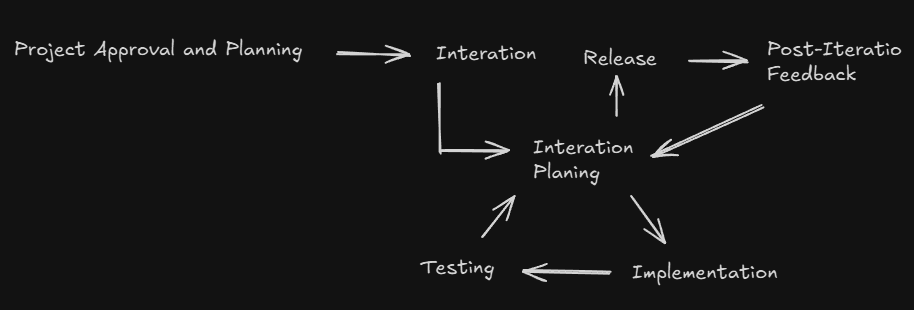
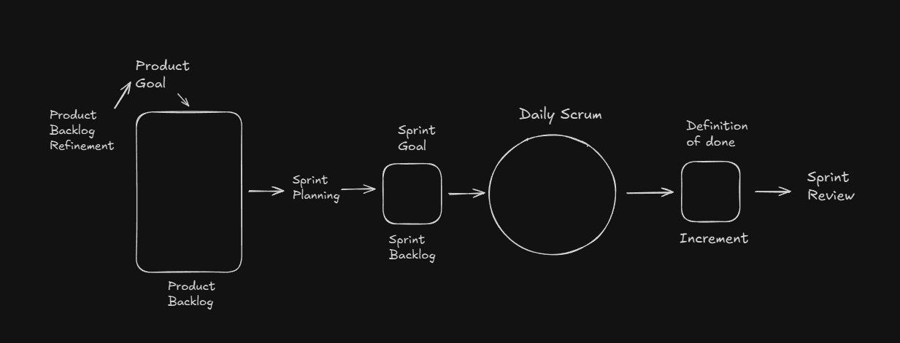
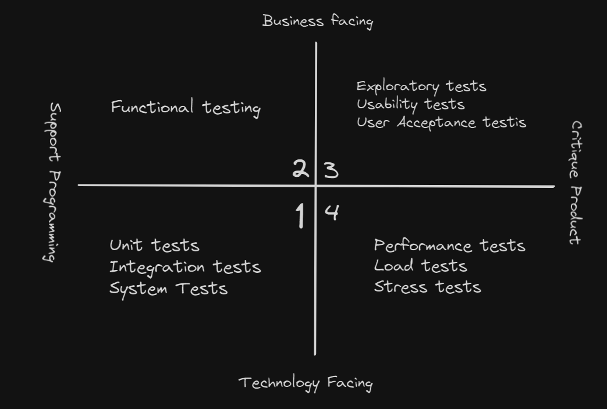

<!-- markdownlint-disable MD033 -->
# Content of Table Testing Throughout the Software Development Lifecycle

- [Software Development Life Cycle (SDLC) Models](#software-development-life-cycle-sdlc-models)
- [Role of Testing in DevOps](#role-of-testing-in-devops)
- [Testing Approaches in Software Development](#testing-approaches-in-software-development)
- [Software Testing Life Cycle (STLC)](#software-testing-life-cycle-stlc)
- [STLC Implementation in Different Development Models](#stlc-implementation-in-different-development-models)
- [Good Practices of Testing](#good-practices-of-testing)

## Software Development Life Cycle (SDLC) Models

**Explanation:**

Software Development Life Cycle (SDLC) models are methodologies that guide the process of developing software.

    
Overview:

1. **Process-oriented:** This approach focuses on the process of developing software, with an emphasis on planning, time schedules, target dates, budgets, and implementation of an entire system at one time.

2. **Sequential SDLC Model:** This is a type of SDLC model where development is seen as flowing steadily downwards through several phases.

    

       
Overview:

    1. **Waterfall Model:** Waterfall Model, is a linear approach to software development.

        

        

           
Overview:

        1. **Advantages of the Waterfall Model:**
            - **Simplicity:** The linear and sequential nature of the Waterfall Model makes it easy to understand and manage.
            - **Structured Approach:** Each phase has specific deliverables and a review process, ensuring thorough documentation and clear milestones.
            - **Early Detection of Issues:** Problems can be identified and addressed early in the development process during the requirements and design phases.

        2. **Disadvantages of the Waterfall Model:**
            - **Inflexibility:** The rigid structure of the Waterfall Model makes it difficult to accommodate changes once a phase is completed.
            - **Late Testing:** Testing is performed late in the development process, which can lead to the discovery of critical issues at a later stage.
            - **Assumes Stable Requirements:** The model assumes that requirements are well-understood and stable from the beginning, which may not always be the case.

        

    2. **V-Shaped Model:** Every single phase in the development cycle, there is a directly associated testing phase.

        

        

           
Overview:

        1. **Verification:** Regularly evaluate intermediary work products during the software development lifecycle to ensure that you're on the right track. This could involve code reviews, design reviews, or reviewing other documentation.

            - **Requirements Analysis:**
                - **Verification Activity:** Requirements Review
                - **Description:** Ensure that the requirements are complete, consistent, and testable.

            - **System Design:**
                - **Verification Activity:** Design Review
                - **Description:** Evaluate the system architecture and design to ensure it meets the requirements.

            - **High-Level Design (HLD):**
                - **Verification Activity:** HLD Review
                - **Description:** Review the high-level design to ensure it covers all system components and their interactions.

            - **Low-Level Design (LLD):**
                - **Verification Activity:** LLD Review
                - **Description:** Review the detailed design of individual components to ensure they meet the design specifications.

            - **Implementation (Coding):**
                - **Verification Activity:** Code Review
                - **Description:** Review the source code to ensure it adheres to coding standards and design specifications.

        2. **Validation:** Once the final product is ready, compare it to the user’s requirements to ensure that it meets the specified requirements. This could involve user acceptance testing or beta testing.

            - **Unit Testing:**
                - **Validation Activity:** Testing individual components or units.
                - **Description:** Ensure that each unit functions correctly in isolation.

            - **Integration Testing:**
                - **Validation Activity:** Testing the interaction between integrated units.
                - **Description:** Ensure that integrated components work together as expected.

            - **System Testing:**
                - **Validation Activity:** Testing the complete system.
                - **Description:** Ensure that the system meets the specified requirements.

            - **User Acceptance Testing (UAT):**
                - **Validation Activity:** Testing the system in a real-world environment.
                - **Description:** Ensure that the system meets the user's needs and expectations.

        3. **Advantages of the V-Shaped Model:**
            - **Early Detection of Defects:** Verification activities at each stage help identify defects early in the development process.
            - **Structured Approach:** The model provides a clear and structured approach to development and testing.
            - **Parallel Testing:** Testing activities are planned in parallel with development, ensuring thorough validation.

        4. **Disadvantages of the V-Shaped Model:**
            - **Inflexibility:** Similar to the Waterfall Model, the V-Shaped Model is rigid and does not easily accommodate changes once a phase is completed.
            - **Late Testing of System:** System testing and user acceptance testing occur late in the process, which may delay the detection of certain issues.
            - **Assumes Stable Requirements:** The model assumes that requirements are well-understood and stable from the beginning, which may not always be the case.

        

    3. **Impact on Testing:**

        - **Scope and Timing of Test Activities:** In Sequential models, testing happens later in the cycle.

        - **Level of Detail in Test Documentation:** Sequential models often have detailed documentation.

        - **Choice of Test Techniques and Approaches:** The SDLC model affects the choice of test techniques and approaches.

        - **Extent of Test Automation:** Traditional models may have limited automation.

        - **Role and Responsibility of Testers:** In traditional models, testers are limited to testing activities.

    4. **When to Use:**

        - **Well-Defined Requirements:** When requirements are clear, well-documented, and unlikely to change.

        - **Short-Term Projects:** For projects with a short duration where the scope is well-understood.

        - **Regulated Industries:** In industries where strict adherence to documentation and process is required, such as healthcare or aerospace.

    

3. **Iterative and Incremental SDLC Model:** This is a type of SDLC model where the software is developed incrementally and the development process is repeated in small iterations.

    

    

       
Overview:

    - **Iterative Development:** Iterative development involves repeating the development cycle multiple times, with each iteration adding new features or refining existing ones. Each iteration builds upon the previous one, incorporating feedback and changes to improve the software.

    - **Incremental development:** Incremental development involves delivering the software in small, incremental releases. Each release includes a subset of the final features, allowing the software to be tested and used by stakeholders early in the development process.

    - **Impact on Testing:**

        - **Scope and Timing of Test Activities:** Each iteration delivers a working prototype, allowing both static and dynamic testing at all levels.

        - **Level of Detail in Test Documentation:** Documentation can be adjusted based on feedback from each iteration.

        - **Choice of Test Techniques and Approaches:** Iterative and incremental models allow for flexible testing techniques.

        - **Extent of Test Automation:** Automation can be incrementally added and improved with each iteration.

        - **Role and Responsibility of Testers:** Testers are involved throughout the iterations, providing continuous feedback.

    

4. **Agile Model:** In Agile methodologies, testing is integrated throughout the development process rather than being a separate phase.

    

    

       
Overview:

    1. **Agile Manifesto:**

        - **Individuals and Interactions over Processes and Tools:** People and teamwork are more important than strict rules and tools.
        - **Working Software over Comprehensive Documentation:** Deliver software that works instead of writing lots of documents.
        - **Customer Collaboration over Contract Negotiation:** Work with customers to get things right instead of just following contracts.
        - **Responding to Change over Following a Plan:** Be ready to change plans when needed instead of sticking to a fixed plan.

    2. **Whole Team Approach:** In Agile, the whole team is responsible for quality and testing. This means that everyone, from developers to business analysts, is involved in testing activities.

    3. **Scrum Framework:** Scrum is an Agile framework used to manage product development.

        

    4. **Release and Iteration Planning:** Release and iteration planning are essential components of the Agile methodology, ensuring that the project progresses smoothly and efficiently. These planning activities help in defining the scope of work, identifying risks, and determining the test approach for each release and iteration.

        

           
Overview:

        - **Release Planning:** Defining and refining the product backlog. It involves breaking down larger user stories into smaller, manageable ones. The primary goal is to identify the set of items to be worked on during the release and build a product backlog. The product owner (PO) is responsible for refining the backlog periodically. Testers contribute to release planning by participating in writing testable user stories and acceptance criteria, analyzing project and product risks, estimating test effort, and determining the test approach for the release.

        - **Sprint Planning:** Sprint planning occurs at the beginning of each Sprint, focusing on selecting items from the product backlog to be implemented during the Sprint. Testers role in Sprint planning by reviewing work products, performing detailed risk analysis of user stories, determining the testability of user stories, breaking down user stories into testing tasks, estimating test effort, and identifying functional and non-functional aspects of the test object. The key difference between release planning and Sprint planning is the scope: release planning focuses on the entire release, while Sprint planning targets specific user stories for the Sprint.

        

    5. **Retrospective and Process Improvement:** Retrospectives are meetings held at the end of a project, iteration, or release to reflect on the process and identify areas for improvement. The timing and organization of retrospectives depend on the specific SDLC model being followed.

        

           
Overview:

        - **Regular Meetings:** Retrospectives should be held regularly, such as at the end of each sprint, release, or project. This ensures continuous feedback and improvement.

        - **Inclusive Participation:** Participants should include all relevant stakeholders, such as testers, developers, architects, product owners, and business analysts. This diverse participation ensures that all perspectives are considered.

        - **Three Key Questions:**
            - **What was successful and should be retained?:** Identifying and continuing practices that worked well.
            - **What was not successful and can be improved?:** Recognizing areas that need improvement.
            - **How to incorporate improvements and retain successes in the future?:** Developing actionable plans to implement improvements and maintain successful practices.

        - **Outcome of Retrospectives:**
            - **Document Results**: The results of retrospectives should be documented and included in the test completion report. This documentation serves as a reference for future projects and helps in tracking the implementation of improvements.
            - **Continuous Improvement**: Retrospectives are critical for the successful implementation of continuous improvement. It is important that the recommendations and improvements are followed up and integrated into the process.

        - **Timing and Organization:**
            - **End of Project, Iteration, or Release**: Retrospectives can be held at the end of a project, iteration, or release milestone. The timing and organization of retrospectives depend on the specific SDLC model being followed.
            - **Flexible Scheduling**: Depending on the needs of the project, retrospectives can be scheduled more frequently, such as weekly, to address issues promptly and continuously improve the process.

        - **Benefits:**
            - **Increased Test Effectiveness and Efficiency**: Implementing suggestions from retrospectives improves the overall testing process, making it more effective and efficient.
            - **Improved Quality of Testware**: Jointly reviewing test processes and artifacts enhances the quality of testware, leading to better testing outcomes.
            - **Team Bonding and Learning**: Retrospectives provide an opportunity for team members to raise issues and propose improvements, better collaboration and continuous learning.

        - **Challenges:**
            - **Follow-Up**: It is important to follow up on the recommendations and improvements identified during retrospectives to ensure they are implemented. Without follow-up, the benefits of retrospectives may not be fully realized.
            - **Documentation**: Recording the outcomes of retrospectives and incorporating them into the test completion report ensures that improvements are tracked and applied in future projects. Proper documentation helps in maintaining a record of what was discussed and agreed upon, facilitating accountability and continuous improvement.

        

    6. **Impact on Testing:**

        - **Scope and Timing of Test Activities:** In Agile, testing activities begin parallelly with development activities.

        - **Level of Detail in Test Documentation:** Agile models often have brief documentation, favoring lightweight documentation.

        - **Choice of Test Techniques and Approaches:** Agile may restrict some techniques due to high-level requirements and time constraints.

        - **Extent of Test Automation:** Agile models favor extensive test automation due to time constraints. Manual testing often uses experience-based techniques.

        - **Role and Responsibility of Testers:** In Agile, testers may have cross-functional responsibilities and participate in planning meetings.

    

## Role of Testing in DevOps

**Explanation:**

In DevOps, a methodology that integrates software development (Dev) and IT operations (Ops), testing is not a separate phase but is integrated into every part of the development and deployment process. This integration ensures continuous quality and faster delivery.

    
Overview:

1. **Integration of Testing:** DevOps includes embedded testing as part of the development process, eliminating the need for a separate testing phase between development and operations.

2. **Continuous Integration and Continuous Delivery (CI/CD):**
    - **Continuous Integration (CI):** Every time new code is checked in, automated tests are triggered to verify the build and perform regression testing.
    - **Continuous Delivery (CD):** Ensures that code changes are automatically prepared for a release to production.

3. **Continuous Testing:** Testing is conducted continuously throughout the development process. Every code change triggers automated tests to ensure that new code integrates well with the existing codebase.

4. **Shift Left Testing:** This approach involves conducting testing as early as possible in the development process (shifting it "left" in the timeline). By identifying and fixing defects early, the overall cost and time to fix issues are reduced.

5. **Infrastructure as Code (IaC):** Is a practice in which infrastructure is provisioned and managed using code and automation, rather than through manual processes. This approach allows for the consistent and repeatable deployment of infrastructure resources, such as servers, networks, and storage, by defining them in configuration files.

6. **Monitoring and Logging:** Continuous monitoring and logging are used in DevOps to track the application's performance and catch issues in real-time. This helps in quickly identifying and resolving problems before they impact end-users.

7. **Integrated Toolchains:** DevOps promotes the use of integrated toolchains that support continuous integration and continuous delivery (CI/CD). These toolchains automate the build, test, and deployment processes, ensuring a smooth and efficient workflow.

8. **Collaboration:** Collaboration between development, testing, and operations teams. This collaboration ensures that everyone is aligned with the common goal of delivering high-quality software quickly and efficiently.

9. **Benefits of DevOps:**
    - **Fast Feedback:** Provides quick feedback on code quality and whether changes adversely affect existing code.
    - **Shift-Left Approach:** Encourages developers to submit high-quality code accompanied by component tests and static analysis.
    - **Automated Processes:** Facilitates establishing stable test environments and increases the view on non-functional code quality characteristics.
    - **Reduced Manual Testing:** Automation through a delivery pipeline reduces the need for repetitive manual testing.
    - **Minimized Regression Risk:** Frequent automated regression tests reduce the risk of regression failures.

10. **Challenges of DevOps**
    - **Establishing the Pipeline:** Defining and establishing the DevOps delivery pipeline requires expertise and knowledge.
    - **Tool Maintenance:** CI/CD tools must be introduced and maintained, adding complexity to the process.
    - **Resource Requirements:** Test automation requires additional resources and may be difficult to establish and maintain.

## Testing Approaches in Software Development

**Explanation:**

Testing approaches in software development are strategies used to ensure the functionality of software works.

    
Overview:

1. **Shift Left and Right Approach:** This approach involves conducting testing early and often in the development process (shift left), and continuing testing into the deployment and maintenance stages (shift right). The "left" side could be seen as the planning and documentation stages, and the "right" side as the coding, deployment, and maintenance stages.

    - **Shift Left Approach:** The Shift Left Approach involves moving test activities to the earlier stages of the development process, such as during requirement gathering and design phases, and encouraging cooperation between QA teams, development teams, and other stakeholders like Business Analysts and Project Managers. It also includes integrating automated tests into the **Continuous Integration (CI)** pipeline for fast feedback on code changes and performing static analysis of the source code before dynamic testing to identify code quality issues early.

    - **Shift Right Approach:** **Continuous Delivery (CD)** extending testing into the deployment and maintenance stages to ensure that the software continues to function correctly in production environments. This includes implementing monitoring and observability practices to detect issues in real-time and gather feedback from production usage. Additionally, it involves collecting and analyzing user feedback to identify areas for improvement and ensure that the software meets user expectations. Post-deployment testing, such as **performance testing**, **security testing**, and user **acceptance testing (UAT)**, is also conducted to validate the software in its live environment.

    

2. **Test-Driven Development (TDD):** This is a development methodology where tests are written before the actual code.

    - **Overview**: TDD directs coding through test cases instead of extensive software design. Tests are written first, then code is written to satisfy the tests, and finally, both tests and code are refactored.
    - **Process**: Unit test cases are written prior to the unit code. Developers write code to make these tests pass, reducing the time spent on defect reporting and tracking.
    - **How it's work:**
        1. Write a unit test for a new function.
        2. Run the test and see it fail (since the function is not yet implemented).
        3. Write the minimum code required to pass the test.
        4. Refactor the code while ensuring the test still passes.

    

3. **Behavior-Driven Development (BDD):** Focuses on the behavior of the application, using natural language to describe test cases.

    - **Overview**: BDD expresses the desired behavior of an application with test cases written in natural language, making them easy to understand by any stakeholder.
    - **Process**: Tests are written using the "Given-When-Then" format, which is derived from acceptance criteria. These scenarios are then translated into automated tests.
    - **How it's work:**
        1. Define acceptance criteria for a feature or user story.
        2. Write scenarios in a Given-When-Then format.
        3. Translate these scenarios into automated tests.
        4. Develop the code to pass these tests.

4. **Acceptance Test-Driven Development (ATDD):** BDD focuses on the behavior of the application, using natural language to describe test cases.

    - **How it's work:**
        1. Define acceptance criteria for a user story.
        2. Write acceptance tests based on these criteria.
        3. Develop the code to pass these tests.

5. **Testing Quadrants:** This is a model that helps teams identify what type of testing is needed, when it should be done, and who should do it. It divides testing into four quadrants based on whether the tests are business or technology-facing and whether they support the team or critique the product.

    - **Quadrant Q1: Technology-Facing Tests that Support the Team**
        - **Purpose:** Ensure code quality and correctness.
        - **Types of Tests:** Unit Tests, Integration Tests, System Tests.
        - **Characteristics:** Automated, run frequently.
        - **Example:** Writing unit tests for individual functions.

    - **Quadrant Q2: Business-Facing Tests that Support the Team**
        - **Purpose:** Validate business requirements and user scenarios.
        - **Types of Tests:** Functional Tests, Story Tests, Prototypes, Simulations.
            - **Functional tests** are designed to verify that the software performs its intended functions correctly. These tests focus on the functionality of the software and ensure that it meets the specified requirements.
            - **Story tests** are acceptance tests that are derived from user stories. They are used to validate that the software meets the acceptance criteria defined for each user story.
            - **Prototypes** are early models or versions of a product used to visualize and test design concepts. They help in understanding how the final product will look and function.
            - **Simulations** are tools or software that mimic the behavior of real systems or environments. They are used to create a virtual environment for testing purposes.
        - **Characteristics:** Can be automated or manual.
        - **Example:** Creating functional tests for user purchase flows.

    - **Quadrant Q3: Business-Facing Tests that Critique the Product**
        - **Purpose:** Find defects and improve user experience.
        - **Types of Tests:** Exploratory Testing, Usability Testing, User Acceptance Testing (UAT), Alpha/Beta Testing.
        - **Characteristics:** Often manual.
        - **Example:** Conducting usability testing for mobile app navigation.

    - **Quadrant Q4: Technology-Facing Tests that Critique the Product**
        - **Purpose:** Assess non-functional aspects like performance and security.
        - **Types of Tests:** Performance Testing, Load Testing, Security Testing.
        - **Characteristics:** Can be automated or manual.
        - **Example:** Performing testing for web application scalability.

        

## Software Testing Life Cycle (STLC)

**Explanation:**

The Software Testing Life Cycle (STLC) is a sequence of specific activities conducted during the testing process to ensure software quality.

    
Overview:

1. **Requirement Analysis:** To understand the testing requirements based on the requirements document by identifying testable requirements, defining test objectives, and preparing the Requirement Traceability Matrix (RTM), resulting in a clear understanding of what needs to be tested.

2. **Test Planning:** To define the scope, approach, resources, and schedule for testing activities by developing the test plan document, identifying test objectives and criteria, estimating test effort and resources, defining test environment requirements, and identifying risks and mitigation plans, resulting in the creation of the test plan document, test effort estimation, and risk management plan.

3. **Test Design:** To design test cases and test scripts based on the requirements by creating detailed test cases, developing test data, identifying test scenarios, and reviewing and baselining test cases, resulting in the creation of test cases, test scripts, test data, and test scenarios.

4. **Test Environment Setup:** To prepare the test environment where testing will be conducted by setting up hardware and software requirements, configuring the test environment, installing necessary tools and applications, and verifying the test environment setup, resulting in the test environment being ready for execution.

5. **Test Implementation:** To develop and prioritize test cases and scripts by implementing test cases and scripts, creating test suites, and mapping test cases to requirements, resulting in test cases and scripts ready for execution and the creation of test suites.

6. **Test Execution:** To execute the test cases and report defects by executing test cases, logging defects and tracking their status, performing retesting and regression testing, and updating test cases based on feedback, resulting in test execution reports, defect logs, and updated test cases.

7. **Test Closure:** To conclude testing activities and evaluate the testing process by ensuring all test cases are executed, documenting test results and metrics, conducting a test closure meeting, archiving test artifacts, resulting in a test summary report, test metrics, archived test artifacts, and documented.

8. **Impact Analysis:** The purpose of impact analysis is to identify the areas of the application that will be impacted by a change and reduce the effort required for regression testing by focusing on the affected areas.

9. **Maintenance Testing:** Maintenance testing is performed on a live application that is already in use by end users. It involves testing enhancements, bug fixes, and other changes to ensure they do not adversely affect the existing system. Maintenance testing is essentially regression testing conducted whenever changes are made to an existing application.

    1. **There are different types of maintenance:**

        - **Corrective:** Fixing known bugs or issues.

        - **Adaptive:** Adapting the software to changes in the environment or improving performance.

        - **Perfective:** Enhancing existing features or adding new features.

    2. **Maintenance testing can be triggered by planned or unplanned releases:**

        - **Planned Releases:** Changes that were scheduled and known in advance, such as feature enhancements or updates.

        - **Unplanned Releases:** Changes that arise unexpectedly, such as hot fixes for critical issues reported by users.

    3. **Triggers for maintenance testing include:**

        - **Modifications:** Updates or enhancements to existing features.

        - **Upgrades:** Introducing new features or significant changes to the software.

        - **Migrations:** Moving the application from one platform to another.

        - **Retirement:** Final versions of the application before it is retired, ensuring data archiving and retrieval procedures are in place.

## STLC Implementation in Different Development Models

**Explanation:**

The Software Testing Life Cycle (STLC) phases are adapted to fit into various development models, ensuring that testing activities are aligned with the specific processes and practices of each model.

    
Overview:

1. **Waterfall Model:** Test activities are performed in a linear sequence, with each phase completed before the next one begins. Testing is concentrated towards the end of the development cycle.

    | **STLC Phase**             | **Waterfall Model Implementation**                                                                                                 |
    |----------------------------|------------------------------------------------------------------------------------------------------------------------------------|
    | **Requirement Analysis**   | Conducted once at the beginning of the project.                                                                                    |
    | **Test Planning**          | Detailed test plan created at the beginning of the project.                                                                        |
    | **Test Design**            | Test cases and scenarios are designed after the requirements and design phases are completed.                                      |
    | **Test Environment Setup** | Test environment is set up once before the test execution phase.                                                                   |
    | **Test Implementation**    | Test cases and scripts are implemented after the design phase and before the test execution phase.                                 |
    | **Test Execution**         | Test execution is performed after the implementation phase.                                                                        |
    | **Test Closure**           | Test closure activities are performed once after all testing is completed.                                                         |
    | **Impact Analysis**        | Impact analysis is conducted when changes are made, typically during the maintenance phase.                                        |
    | **Maintenance Testing**    | Maintenance testing is performed after the product is deployed and during the maintenance phase.                                   |

2. **Iterative and Incremental Model:** Test activities are performed iteratively within each iteration. Testing is done incrementally as new features are developed, allowing for continuous feedback and improvement.

    | **STLC Phase**             | **Iterative and Incremental Model Implementation**                                                                                 |
    |----------------------------|------------------------------------------------------------------------------------------------------------------------------------|
    | **Requirement Analysis**   | Conducted at the beginning of each iteration for the features being developed.                                                     |
    | **Test Planning**          | Test planning is done for each iteration, focusing on the features in that iteration.                                              |
    | **Test Design**            | Test cases and scenarios are designed within each iteration for the features being developed.                                      |
    | **Test Environment Setup** | Test environment is set up and configured for each iteration as needed.                                                            |
    | **Test Implementation**    | Test cases and scripts are implemented within each iteration for the features being developed.                                     |
    | **Test Execution**         | Test execution is performed within each iteration, with continuous integration and testing.                                        |
    | **Test Closure**           | Test closure activities are performed at the end of each iteration.                                                                |
    | **Impact Analysis**        | Impact analysis is conducted continuously as changes are made in each iteration.                                                   |
    | **Maintenance Testing**    | Maintenance testing is performed continuously as enhancements and bug fixes are made in each iteration.                            |

3. **Agile Model:** Test activities are performed iteratively within each sprint. Testing is integrated into the development process, allowing for continuous feedback and improvement.

    | **STLC Phase**             | **Agile Model Implementation**                                                                                                     |
    |----------------------------|------------------------------------------------------------------------------------------------------------------------------------|
    | **Requirement Analysis**   | Conducted at the beginning of each sprint for the user stories being developed.                                                    |
    | **Test Planning**          | Test planning is done for each sprint, focusing on the user stories in that sprint.                                                |
    | **Test Design**            | Test cases and scenarios are designed within each sprint for the user stories being developed.                                     |
    | **Test Environment Setup** | Test environment is set up and configured for each sprint as needed.                                                               |
    | **Test Implementation**    | Test cases and scripts are implemented within each sprint for the user stories being developed.                                    |
    | **Test Execution**         | Test execution is performed within each sprint, with continuous integration and testing.                                           |
    | **Test Closure**           | Test closure activities are performed at the end of each sprint.                                                                   |
    | **Impact Analysis**        | Impact analysis is conducted continuously as changes are made in each sprint.                                                      |
    | **Maintenance Testing**    | Maintenance testing is performed continuously as enhancements and bug fixes are made in each sprint.                               |

4. **DevOps:** Test activities are integrated throughout the development and deployment process, with a strong emphasis on automation and continuous testing within the CI/CD pipeline.

    | **STLC Phase**             | **DevOps Implementation**                                                                                                          |
    |----------------------------|------------------------------------------------------------------------------------------------------------------------------------|
    | **Requirement Analysis**   | Conducted continuously as part of the ongoing collaboration between development, operations, and business teams.                   |
    | **Test Planning**          | Test planning is integrated into the CI/CD pipeline, with continuous updates based on feedback and changes.                        |
    | **Test Design**            | Test cases and scenarios are designed continuously, with a focus on automation and integration into the CI/CD pipeline.            |
    | **Test Environment Setup** | Test environments are provisioned automatically using infrastructure as code (IaC) and configured as part of the CI/CD pipeline.   |
    | **Test Implementation**    | Test cases and scripts are implemented continuously, with a strong emphasis on automation and integration into the CI/CD pipeline. |
    | **Test Execution**         | Test execution is automated and integrated into the CI/CD pipeline, with tests running continuously on each code commit.           |
    | **Test Closure**           | Test closure activities are performed continuously, with results documented and metrics collected automatically.                   |
    | **Impact Analysis**        | Impact analysis is conducted continuously using automated tools to identify affected areas and plan regression tests.              |
    | **Maintenance Testing**    | Maintenance testing is performed continuously as part of the CI/CD pipeline, with automated regression tests for each change.      |

## Good Practices of Testing

**Explanation:**

Good testing practices should be followed in any development model. These practices ensure that all development activities are subjected to quality control and that testing is comprehensive and effective.

    
Overview:

1. **Corresponding Testing Activity:** For every development activity, there should be a corresponding testing activity. This ensures that all development activities are subjected to quality control.

2. **Specific Test Objectives:** Different test levels should have specific and different test objectives to avoid redundancy and ensure comprehensive testing.

3. **Early Test Analysis and Design:** Test analysis and design for a given test level should begin during the corresponding development phase to adhere to the principles of early testing.

4. **Early Involvement of Testers:** Testers should be involved in reviewing work products as soon as drafts are available. This supports early testing and defect detection, aligning with the shift-left strategy.

