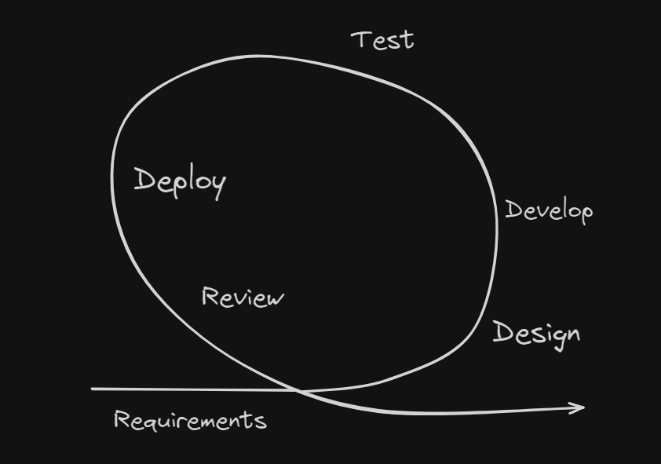

<!-- markdownlint-disable MD033 -->
# Content of Table

- [Testing Throughout the Software Development Lifecycle](#testing-throughout-the-software-development-lifecycle)
  - [Testing Approaches in Software Development](#testing-approaches-in-software-development)
  - [Software Development Life Cycle (SDLC) Models](#software-development-life-cycle-sdlc-models)
  - [Software Testing Life Cycle (STLC)](#software-testing-life-cycle-stlc)
  - [Role of Testing in DevOps](#role-of-testing-in-devops)

## Testing Throughout the Software Development Lifecycle

**Explanation:**

Testing is an integral part of the software development lifecycle, ensuring that the software meets standards and functions correctly working.

### Testing Approaches in Software Development

**Explanation:**

Testing approaches in software development are strategies used to ensure the functionality of software works.

    
Key Concepts:

1. **Shift Left and Right Approach:** This approach involves conducting testing early and often in the development process (shift left), and continuing testing into the deployment and maintenance stages (shift right). The "left" side could be seen as the planning and documentation stages, and the "right" side as the coding, deployment, and maintenance stages

    - **Early Testing:** The essence of shift left testing is moving all test activities to earlier stages in the development process, gathering requirements and test planning stage.

    - **Collaborative Approach:** Cooperation not only between the QA team and development team, but also other stakeholders, such as the Business Analyst or Project Managers.

    - **Continuous Integration And Continuous Delivery (CI/CD):** Continuous Integration (CI) and Continuous Delivery (CD) are the combined practices and tools to automate the process of building, testing, and deploying software changes.

    

2. **Test-Driven Development (TDD):** This is a development methodology where tests are written before the actual code. The code is then written to pass these tests. The Test-First Approach is a part of TDD where the tests are written first and the code is developed based on these tests.

    

3. **Behavior-Driven Development (BDD):** This is a development methodology where behavior specifications are written before the actual code. These specifications are then converted into tests and the code is written to pass these tests.

4. **Acceptance Test-Driven Development (ATDD):** This is a collaborative approach where users, testers, and developers define acceptance tests before coding begins.

5. **Pair Programming:** This is a technique where two programmers work together at one workstation. One writes the code, while the other reviews each line of code as it's written. This can help catch issues early.

6. **AI and Machine Learning in Testing:** AI and ML are used to improve the efficiency and effectiveness of testing processes. They can help automate test case writing, predict where bugs might occur, and optimize testing efforts.

7. **Testing Quadrants:** This is a model that helps teams identify what type of testing is needed, when it should be done, and who should do it. It divides testing into four quadrants based on whether the tests are business or technology-facing and whether they support the team or critique the product.

    - **Quadrant 1** - Technology-Facing Tests that Support the Team: This quadrant includes tests that are technology-driven and are used to guide development. These are often automated tests. Examples include Unit Tests, Component Tests, and API Tests.

    - **Quadrant 2** - Business-Facing Tests that Support the Team: This quadrant includes tests that are business-driven and are used to describe and validate what the system should do. These tests are often automated and include tests like Functional Tests.

    - **Quadrant 3** - Business-Facing Tests that Critique the Product: This quadrant includes tests that are business-driven and are used to provide feedback. These tests are often manual and exploratory in nature. Examples include Exploratory Testing, Usability Testing, User Acceptance Testing, and Alpha/Beta Testing.

    - **Quadrant 4** - Technology-Facing Tests that Critique the Product: This quadrant includes tests that are technology-driven and are used to critique the product from a non-functional requirement perspective. These tests are often automated and include Performance Testing, Security Testing, Load Testing, and Stress Testing.

    

## Software Development Life Cycle (SDLC) Models

**Explanation:**

Software Development Life Cycle (SDLC) models are methodologies that guide the process of developing software.

    
Key Concepts:

1. **Process-oriented:** This approach focuses on the process of developing software, with an emphasis on planning, time schedules, target dates, budgets, and implementation of an entire system at one time.

2. **Sequential SDLC Model:** This is a type of SDLC model where development is seen as flowing steadily downwards through several phases.

    - **Waterfall Model:**

      **Explanation:**

      Waterfall Model, is a linear approach to software development.

      

    - **V-Shaped Model:**

      **Explanation:**

      Every single phase in the development cycle, there is a directly associated testing phase.

      

      **Key Concepts:**

      - **Verification:** Regularly evaluate intermediary work products during the software development lifecycle to ensure that you're on the right track. This could involve code reviews, design reviews, or reviewing other documentation.

      - **Validation:** Once the final product is ready, compare it to the user’s requirements to ensure that it meets the specified requirements. This could involve user acceptance testing or beta testing.

3. **Iterative and Incremental SDLC Model:** This is a type of SDLC model where the software is developed incrementally and the development process is repeated in small iterations.

    - **Agile Model:**

      **Explanation:**

      In Agile methodologies, testing is integrated throughout the development process rather than being a separate phase.

      **Key Concepts:**

      1. **Agile Manifesto:** The Agile Manifesto is a document that outlines the key values and principles of Agile development. It emphasizes individuals and interactions, working software, customer collaboration, and responding to change.

      2. **Whole Team Approach:** In Agile, the whole team is responsible for quality and testing. This means that everyone, from developers to business analysts, is involved in testing activities.

      3. **Iteration Planning and Execution in Agile:** Testing is included in every iteration (or sprint) of the Agile development process. At the start of each iteration, the team plans the work to be done, including testing activities. During the iteration, tests are continuously designed, executed, and reviewed.

      

4. **Roles in Software Development:** These are the different roles involved in the software development process, each with specific responsibilities and tasks. They can include roles like project manager, software developer, quality assurance tester.

## Software Testing Life Cycle (STLC)

**Explanation:**

It's a part of the overall Software Development Life Cycle (SDLC), but focuses specifically on testing objectives, strategies, and deliverables.

    
Key Concepts:

1. **Concepts of Software Testing Life Cycle:** The STLC includes several phases, each with its own goals and deliverables. These phases typically include requirements analysis, test planning, test case development, environment setup, test execution, and test cycle closure.

2. **Roles in Software Testing:** Various roles are involved in the STLC, each with specific responsibilities. These can include test manager (oversees the testing process), test lead (plans and organizes testing), test analyst (designs test cases), test engineer (executes tests).

## Role of Testing in DevOps

**Explanation:**

In DevOps, a methodology that integrates software development (Dev) and IT operations (Ops). It's not a separate phase but is integrated into every part of the development and deployment process.

    
Key Concepts:

1. **Continuous Testing:** In DevOps, testing is conducted continuously throughout the development process.

2. **Shift Left Testing:** This approach involves conducting testing as early as possible in the development process (shifting it "left" in the timeline).

3. **Automation:** Automated testing tools are heavily used in DevOps to speed up the testing process and make it more efficient.

4. **Infrastructure as Code (IaC):** In DevOps, the infrastructure is often managed using code, which means it can be tested just like application code.

5. **Monitoring and Logging:** Continuous monitoring and logging are used in DevOps to track the application's performance and catch issues.

