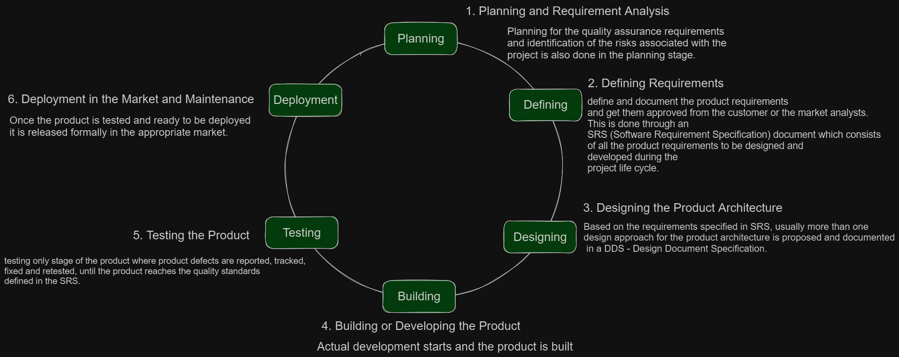
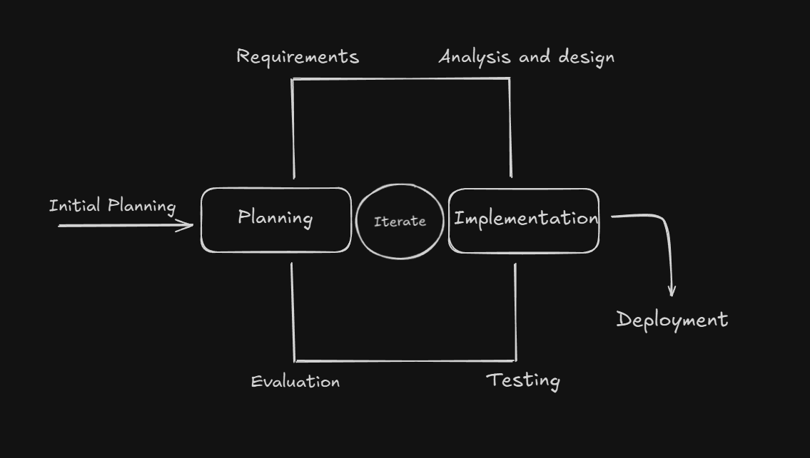
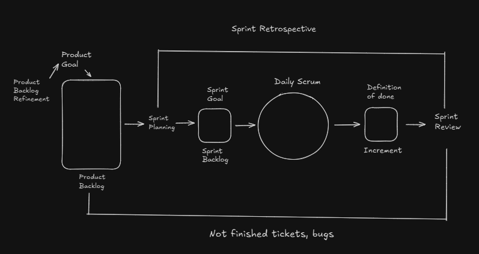
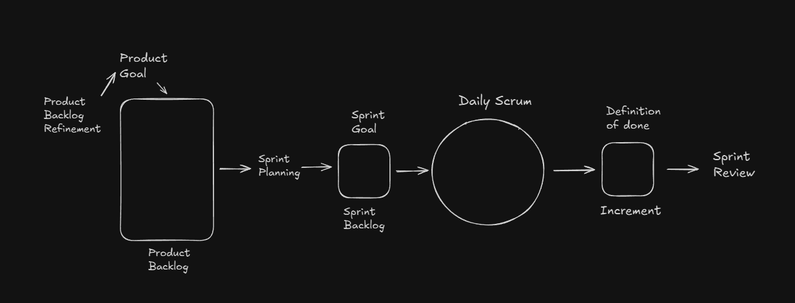
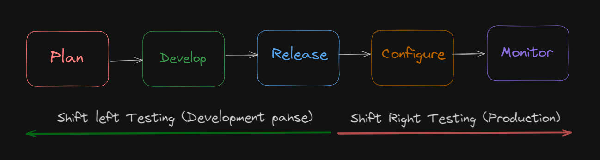
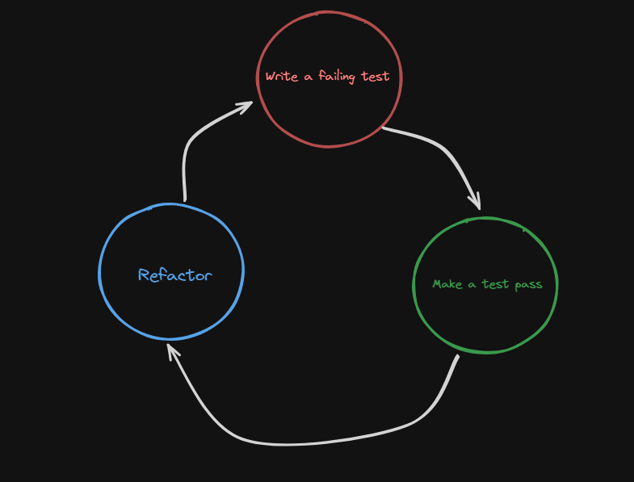

<!-- markdownlint-disable MD033 -->
# Content of Table Testing Throughout the Software Development Lifecycle

- [Software Development Life Cycle (SDLC) Models](#software-development-life-cycle-sdlc-models)
- [Software Testing Life Cycle (STLC)](#software-testing-life-cycle-stlc)
- [Testing Approaches in Software Development](#testing-approaches-in-software-development)

## Software Development Life Cycle (SDLC) Models

**Explanation:**

Software Development Life Cycle (SDLC) models are methodologies that guide the process of developing software.

    
Overview:

1. **Process-oriented:** This approach focuses on the process of developing software, with an emphasis on planning, time schedules, target dates, budgets, and implementation of an entire system at one time.

2. **Sequential SDLC Model:** This is a type of SDLC model where development is seen as flowing steadily downwards through several phases.

    

       
Overview:

    1. **Waterfall Model:** Waterfall Model, is a linear approach to software development.

        

        

           
Overview:

        1. **Advantages of the Waterfall Model:**
            - **Simplicity:** The linear and sequential nature of the Waterfall Model makes it easy to understand and manage.
            - **Structured Approach:** Each phase has specific deliverables and a review process, ensuring thorough documentation and clear milestones.
            - **Early Detection of Issues:** Problems can be identified and addressed early in the development process during the requirements and design phases.

        2. **Disadvantages of the Waterfall Model:**
            - **Inflexibility:** The rigid structure of the Waterfall Model makes it difficult to accommodate changes once a phase is completed.
            - **Late Testing:** Testing is performed late in the development process, which can lead to the discovery of critical issues at a later stage.
            - **Assumes Stable Requirements:** The model assumes that requirements are well-understood and stable from the beginning, which may not always be the case.

        

    2. **V-Shaped Model:** Every single phase in the development cycle, there is a directly associated testing phase.

        

        

           
Overview:

        1. **Verification:** Regularly evaluate intermediary work products during the software development lifecycle to ensure that you're on the right track. This could involve code reviews, design reviews, or reviewing other documentation.

            - **Requirements Analysis:**
                - **Verification Activity:** Requirements Review
                - **Description:** Ensure that the requirements are complete, consistent, and testable.

            - **System Design:**
                - **Verification Activity:** Design Review
                - **Description:** Evaluate the system architecture and design to ensure it meets the requirements.

            - **High-Level Design (HLD):**
                - **Verification Activity:** HLD Review
                - **Description:** Review the high-level design to ensure it covers all system components and their interactions.

            - **Low-Level Design (LLD):**
                - **Verification Activity:** LLD Review
                - **Description:** Review the detailed design of individual components to ensure they meet the design specifications.

            - **Implementation (Coding):**
                - **Verification Activity:** Code Review
                - **Description:** Review the source code to ensure it adheres to coding standards and design specifications.

        2. **Validation:** Once the final product is ready, compare it to the users requirements to ensure that it meets the specified requirements. This could involve user acceptance testing or beta testing.

            - **Unit Testing:**
                - **Validation Activity:** Testing individual components or units.
                - **Description:** Ensure that each unit functions correctly in isolation.

            - **Integration Testing:**
                - **Validation Activity:** Testing the interaction between integrated units.
                - **Description:** Ensure that integrated components work together as expected.

            - **System Testing:**
                - **Validation Activity:** Testing the complete system.
                - **Description:** Ensure that the system meets the specified requirements.

            - **User Acceptance Testing (UAT):**
                - **Validation Activity:** Testing the system in a real-world environment.
                - **Description:** Ensure that the system meets the user's needs and expectations.

        3. **Advantages of the V-Shaped Model:**
            - **Early Detection of Defects:** Verification activities at each stage help identify defects early in the development process.
            - **Structured Approach:** The model provides a clear and structured approach to development and testing.
            - **Parallel Testing:** Testing activities are planned in parallel with development, ensuring thorough validation.

        4. **Disadvantages of the V-Shaped Model:**
            - **Inflexibility:** Similar to the Waterfall Model, the V-Shaped Model is rigid and does not easily accommodate changes once a phase is completed.
            - **Late Testing of System:** System testing and user acceptance testing occur late in the process, which may delay the detection of certain issues.
            - **Assumes Stable Requirements:** The model assumes that requirements are well-understood and stable from the beginning, which may not always be the case.

        

    3. **Impact on Testing:**

        - **Scope and Timing of Test Activities:** In Sequential models, testing happens later in the cycle.

        - **Level of Detail in Test Documentation:** Sequential models often have detailed documentation.

        - **Choice of Test Techniques and Approaches:** The SDLC model affects the choice of test techniques and approaches.

        - **Extent of Test Automation:** Traditional models may have limited automation.

        - **Role and Responsibility of Testers:** In traditional models, testers are limited to testing activities.

    4. **When to Use:**

        - **Well-Defined Requirements:** When requirements are clear, well-documented, and unlikely to change.

        - **Short-Term Projects:** For projects with a short duration where the scope is well-understood.

        - **Regulated Industries:** In industries where strict adherence to documentation and process is required, such as healthcare or aerospace.

    

3. **Iterative and Incremental SDLC Model:** This is a type of SDLC model where the software is developed incrementally and the development process is repeated in small iterations.

    

    

       
Overview:

    - **Iterative Development:** Iterative development involves repeating the development cycle multiple times, with each iteration adding new features or refining existing ones. Each iteration builds upon the previous one, incorporating feedback and changes to improve the software.

    - **Incremental development:** Incremental development involves delivering the software in small, incremental releases. Each release includes a subset of the final features, allowing the software to be tested and used by stakeholders early in the development process.

    - **Impact on Testing:**

        - **Scope and Timing of Test Activities:** Each iteration delivers a working prototype, allowing both static and dynamic testing at all levels.

        - **Level of Detail in Test Documentation:** Documentation can be adjusted based on feedback from each iteration.

        - **Choice of Test Techniques and Approaches:** Iterative and incremental models allow for flexible testing techniques.

        - **Extent of Test Automation:** Automation can be incrementally added and improved with each iteration.

        - **Role and Responsibility of Testers:** Testers are involved throughout the iterations, providing continuous feedback.

    

4. **Agile Model:** In Agile methodologies, testing is integrated throughout the development process rather than being a separate phase.

    

    

       
Overview:

    1. **Agile Manifesto:**

        - **Individuals and Interactions over Processes and Tools:** People and teamwork are more important than strict rules and tools.
        - **Working Software over Comprehensive Documentation:** Deliver software that works instead of writing lots of documents.
        - **Customer Collaboration over Contract Negotiation:** Work with customers to get things right instead of just following contracts.
        - **Responding to Change over Following a Plan:** Be ready to change plans when needed instead of sticking to a fixed plan.

    2. **Whole Team Approach:** In Agile, the whole team is responsible for quality and testing. This means that everyone, from developers to business analysts, is involved in testing activities.

    3. **Scrum Framework:** Scrum is an Agile framework used to manage product development.

        

    4. **Release and Iteration Planning:** Release and iteration planning are essential components of the Agile methodology, ensuring that the project progresses smoothly and efficiently. These planning activities help in defining the scope of work, identifying risks, and determining the test approach for each release and iteration.

        

           
Overview:

        - **Release Planning:** Defining and refining the product backlog. It involves breaking down larger user stories into smaller, manageable ones. The primary goal is to identify the set of items to be worked on during the release and build a product backlog. The product owner (PO) is responsible for refining the backlog periodically. Testers contribute to release planning by participating in writing testable user stories and acceptance criteria, analyzing project and product risks, estimating test effort, and determining the test approach for the release.

        - **Sprint Planning:** Sprint planning occurs at the beginning of each Sprint, focusing on selecting items from the product backlog to be implemented during the Sprint. Testers role in Sprint planning by reviewing work products, performing detailed risk analysis of user stories, determining the testability of user stories, breaking down user stories into testing tasks, estimating test effort, and identifying functional and non-functional aspects of the test object. The key difference between release planning and Sprint planning.

            - **Scope:** Release planning focuses on the entire release, while Sprint planning targets specific user stories for the Sprint.

        

    5. **Retrospective and Process Improvement:** Retrospectives are meetings held at the end of a project, iteration (such as a sprint), or release. At these meetings, team members including testers, developers, architects, product owners, and business analysts review what happened during the project and discuss ways to improve. The goal is to learn from both successes and failures in order to make the testing and overall development process better over time.

        

           
Overview:

        - **Regular Meetings:** Invite all relevant stakeholders. This ensures different perspectives (from testing, development, design) are considered when discussing improvements.

        - **Inclusive Participation:** Participants should include all relevant stakeholders, such as testers, developers, architects, product owners, and business analysts. This diverse participation ensures that all perspectives are considered.

        - **Three Key Questions:**
            - **What worked well?:** Identify practices to continue.
            - **What did not work?:** Pinpoint issues and areas for improvement.
            - **What actions should we take?:** Develop a plan to implement improvements and keep the successful practices.

        - **Documenting Outcomes:** Record the discussion and agreed upon actions. Include these results in your test completion report so that the team can track improvements and refer back to them in future projects.

        - **Benefits:**
            - **Increased Test Effectiveness and Efficiency:** Adopting process improvements leads to better and faster testing.
            - **Improved Quality of Testware:** Regular reviews help enhance the quality of all testing outputs (test cases and data).
            - **Team Bonding and Continuous Learning:** Retrospectives offer a forum for open communication, strengthening team collaboration and driving personal and process growth.
            - **Enhanced Test Basis Quality:** Issues with requirements or limitations in the test basis can be identified and addressed.

        - **Challenges:**
            - **Follow-Up:** Ensure that the suggested improvements are actually implemented. Otherwise, the benefits will be lost.
            - **Documentation:** Properly record discussions and decisions so there is a clear record for future reference and accountability.

        

    6. **Impact on Testing:**

        - **Scope and Timing of Test Activities:** In Agile, testing activities begin parallelly with development activities.

        - **Level of Detail in Test Documentation:** Agile models often have brief documentation, favoring lightweight documentation.

        - **Choice of Test Techniques and Approaches:** Agile may restrict some techniques due to high-level requirements and time constraints.

        - **Extent of Test Automation:** Agile models favor extensive test automation due to time constraints. Manual testing often uses experience-based techniques.

        - **Role and Responsibility of Testers:** In Agile, testers may have cross-functional responsibilities and participate in planning meetings.

    

## Software Testing Life Cycle (STLC)

**Explanation:**

The Software Testing Life Cycle (STLC) is a sequence of specific activities conducted during the testing process to ensure software quality.

    
Overview:

1. **Requirement Analysis:**
    - **Objective:** Understand what needs to be tested.
    - **Activities:**
        - Review requirements documents.
        - Identify testable requirements.
        - Define test objectives.
        - Prepare a Requirement Traceability Matrix (RTM).
    - **Output:** Understand what needs to be tested.

2. **Test Planning:**
    - **Objective:** Define the overall testing strategy and roadmap.
    - **Activities:**
        - Develop the test plan document, outlining scope, approach, resources, and schedule.
        - Estimate test effort and resource requirements.
        - Identify required test environment and potential risks with mitigation plans.
    - **Output:** Test plan document, effort estimation, and risk management plan.

3. **Test Design:**
    - **Objective:** Create detailed test cases and scenarios.
    - **Activities:**
        - Design test cases and test scripts based on requirements.
        - Develop or identify test data.
        - Identify test scenarios and review/baseline test cases.
    - **Output:** Comprehensive test cases, scripts, test data, and defined test scenarios.

4. **Test Environment Setup:**
    - **Objective:** Prepare the environment where testing will occur.
    - **Activities:**
        - Set up hardware, software, and network configurations.
        - Install and configure necessary tools and applications.
        - Verify that the test environment is complete and functional.
    - **Output:** A stable, verified test environment ready for execution.

5. **Test Implementation:**
    - **Objective:** Make sure test artifacts are executable and organized.
    - **Activities:**
        - Finalize and prioritize test cases and scripts.
        - Create test suites and map test cases to requirements.
    - **Output:** Executable test cases/scripts and organized test suites.

6. **Test Execution:**
    - **Objective:** Run tests and identify defects.
    - **Activities:**
        - Execute test cases.
        - Log, track, and classify defects.
        - Perform retesting and regression testing as needed.
    - **Output:** Test execution reports, defect logs, and updated test cases.

7. **Test Closure:**
    - **Objective:** Conclude testing activities and capture overall learnings.
    - **Activities:**
        - Ensure all planned tests are executed.
        - Document results and metrics.
        - Hold a test closure meeting and archive all test artifacts.
    - **Output:** Final test summary report, historical test metrics, and archived documentation.

8. **Impact Analysis:**
    - **Objective:** Focus on regression testing efforts when changes occur.
    - **Activities:**
        - Identify parts of the application affected by changes.
        - Prioritize testing on affected areas to reduce overall regression effort.

9. **Maintenance Testing:** Maintenance testing is performed on a live application that is already in use by end users. It involves testing enhancements, bug fixes, and other changes to ensure they do not adversely affect the existing system. Maintenance testing is essentially regression testing conducted whenever changes are made to an existing application.

    1. **Types of maintenance:**
        - **Corrective:** Fixing known bugs or issues.
        - **Adaptive:** Adapting the software to changes in the environment or improving performance.
        - **Perfective:** Enhancing existing features or adding new features.

    2. **Planned or Unplanned releases:**
        - **Planned Releases:** Changes that were scheduled and known in advance, such as feature enhancements or updates.
        - **Unplanned Releases:** Changes that arise unexpectedly, such as hot fixes for critical issues reported by users.

    3. **Triggers:**
        - **Modifications:** Updates or enhancements to existing features.
        - **Upgrades:** Introducing new features or significant changes to the software.
        - **Migrations:** Moving the application from one platform to another.
        - **Retirement:** Final versions of the application before it is retired, ensuring data archiving and retrieval procedures are in place.

    4. **Output:** Stable software that continues to meet quality standards post-deployment.

## Testing Approaches in Software Development

**Explanation:**

Testing approaches in software development are strategies used to ensure the functionality of software works.

    
Overview:

1. **Shift Left and Right Approach:** Testing approaches are strategies that ensure software functions correctly and meets quality standards throughout its lifecycle. Two widely adopted approaches are the Shift-Left and Shift-Right strategies.

    - **Shift Left Approach:** This approach involves moving testing activities earlier in the Software Development Life Cycle (SDLC). The idea is to catch defects as early as possible during requirement analysis, design, and coding.

        - **Early Involvement:** Engage testers during requirement reviews and design discussions to identify potential issues (ambiguities, inconsistencies) from the start.

        - **Test Case Development:** Write test cases before the code is implemented. This can include defining acceptance criteria and even developing automated tests to run as part of a Continuous Integration (CI) pipeline.

        - **Static Analysis:** Perform static analysis of the source code early to detect code quality issues before dynamic testing.

        - **Non-Functional Testing:** Where feasible, begin non-functional tests (such as performance and security tests) at component level rather than waiting for a complete system.

        - **Benefits:** Early detection of issues can reduce rework, lower overall costs, and improve product quality in later stages.

    - **Shift Right Approach:** **Continuous Delivery (CD)** This approach extends testing into the later stages of the SDLC, including deployment and production. It ensures that the software continues to meet quality expectations in real-world environments.

        - **Continuous Delivery (CD):** Integrate testing into the deployment pipeline to provide fast feedback on released code.

        - **Production Monitoring:** Implement monitoring and observability practices to detect issues and gather real-time performance data in production.

        - **User Feedback:** Collect and analyze user feedback post-deployment, which can inform future test design and continuous improvement.

        - **Post-Deployment Testing:** Perform acceptance, performance, and security tests within the production or near-production environment.

        - **Benefits:** By testing in production-like scenarios, organizations can validate non-functional requirements and ensure the software meets user expectations in its operational environment.

    

2. **Test-Driven Development (TDD):** Write tests before code to direct implementation with a focus on unit behavior.

    

    

       
Overview:

    - **When Tests Are Written:** Before coding.

    - **Primary Focus:** Unit-level functionality.

    - **Format for Criteria:** Developer-written unit tests.

    - **Team Involvement:** Mainly developers.

    - **Process:**
        1. **Write a Unit Test:** Create a test for a new function.
        2. **Run the Test:** Confirm that the test fails, verifying that the function isn’t yet implemented.
        3. **Implement Minimal Code:** Write just enough code to pass the test.
        4. **Refactor:** Refine the code while ensuring the test continues to pass.

    - **Key Focus:**
        - Ensures that each unit of code does precisely what is expected.
        - Primarily used by developers to design and verify small, individual functions.

    

3. **Acceptance Test-Driven Development (ATDD):** Collaboratively define acceptance criteria and write tests based on these criteria before coding the feature.

    

       
Overview:

    - **When Tests Are Written:** Before coding based on user stories.

    - **Primary Focus:** End-to-end functional acceptance.

    - **Format for Criteria:** Flexible (can be checklists, tables, or narrative).

    - **Team Involvement:** Customers, testers, and developers collaboratively

    - **Process:**
        1. **Define Acceptance Criteria:** Collaborate with stakeholders to establish clear, mutually agreed-upon criteria for a user story.
        2. **Write Acceptance Tests:** Create tests based on these criteria before any code is implemented.
        3. **Develop Code:** Write the code necessary to pass the acceptance tests, ensuring that the feature meets real user needs.

    - **Key Focus:**
        - Bridges communication between business and technical teams.
        - Validates that the feature delivers end-to-end functionality as expected in real-world scenarios.

    

4. **Behavior-Driven Development (BDD):** Express behavior using natural language scenarios (Given/When/Then) so that technical and non-technical stakeholders share a common understanding.

    

       
Overview:

    - **When Tests Are Written:** Before coding, using scenarios.

    - **Primary Focus:** Desired behavior and user experience.

    - **Format for Criteria:** Given/When/Then scenarios.

    - **Team Involvement:** All stakeholders (technical and non-technical)

    - **Process:**
        1. **Define Acceptance Criteria:** Begin with clear acceptance criteria for a feature or user story, often in collaboration with stakeholders.
        2. **Write Scenarios:** Express these criteria in structured scenarios using the Given/When/Then format:
            - **Given:** The initial state or context.
            - **When:** An event or action occurs.
            - **Then:** The expected outcome follows.
        3. **Automate the Scenarios:** Translate these scenarios into automated tests.
        4. **Develop the Code:** Write the code required to pass these automated tests.

    - **Key Focus:**
        - Enhances clarity and shared understanding by using a common language for requirements.
        - Serves as both documentation and testing, bridging the gap between business expectations and technical implementation.

    

