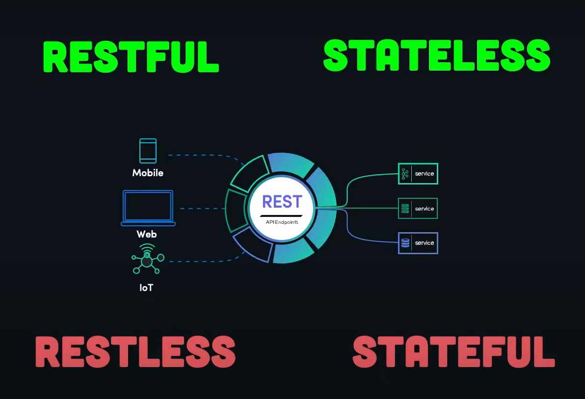
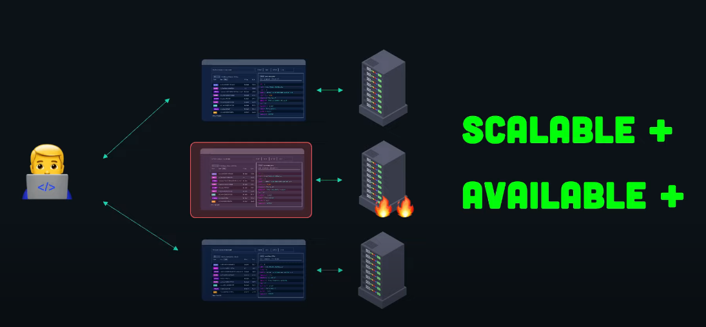
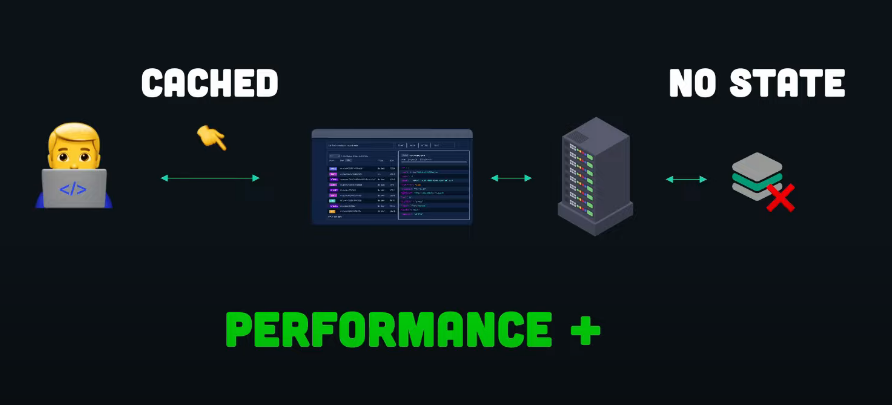
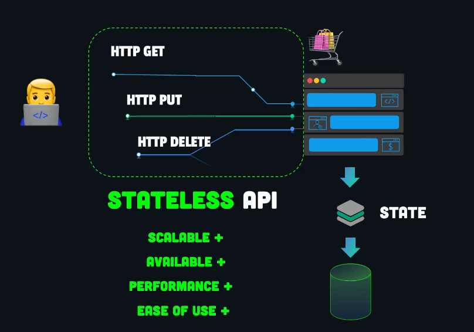
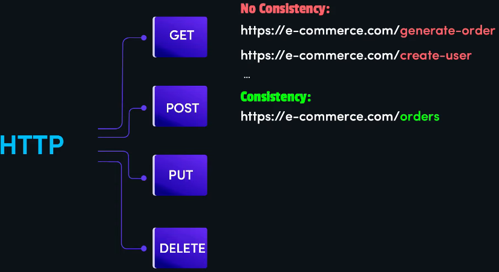
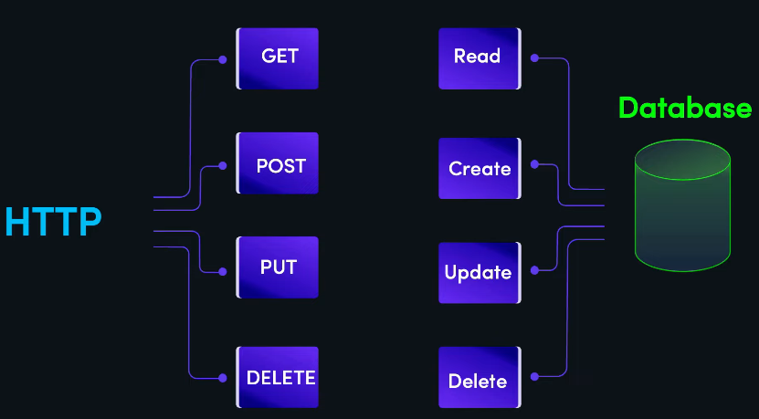

## Table of Contents

- [REST API](#rest-api)
    - [REST API Maturity Levels](#rest-api-maturity-levels)
    - [Stateless API](#stateless-api)
    - [Making Stateful Apps Stateless](#making-stateful-apps-stateless)
    - [Design for the APIs](#design-for-the-apis)
    - [Do Not Return Plain Text](#do-not-return-plain-text)
    - [WRONG!](#wrong)
    - [Handling Exceptions](#handling-exceptions)
    - [Worth to HATEOAS?](#worth-to-hateoas)

# REST API

**Introduction**

In the year 2000, Roy Fielding introduced the REST (Representational State Transfer) model, which has since become the industry standard for designing web services. RESTful web services are fundamental to building modern web applications and services.

Roy Fielding's REST model defines different levels of API maturity, ranging from Level 0 to Level 3. These levels reflect the extent to which an API adheres to the principles of REST. In practice, many published web APIs fall somewhere around Level 1 or 2, with Level 2 being a significant milestone to achieve. We will explore these levels and understand why Level 3, which corresponds to a truly RESTful API, is often challenging to attain in the real world.

**Others APIs:**

## REST API Maturity Levels

| Level | Description |
|-------|-------------|
| Level 0 | Initial level with no adherence to REST principles. |
| Level 1 | Basic adherence to REST principles, typically using HTTP methods for CRUD operations. |
| Level 2 | A significant step where APIs are designed with resources, resource URIs, and proper HTTP methods. |
| Level 3 | The ideal level where APIs are truly RESTful, including HATEOAS (Hypermedia as the Engine of Application State) principles. |

Reaching Level 2 takes practice, but it offers substantial benefits in terms of high-quality, reliable, and scalable REST APIs. However, achieving Level 3 is often challenging in real-world scenarios.

## Stateless API

**Key Concepts**

- **Stateless API**: In a distributed environment, a stateless API means that client requests are not bound to a specific server. Servers do not maintain any state with clients, ensuring clients can interact with any server in a load-balanced fashion.

**How it's working on multiple servers:**

**How it's working on single servers:**

**Syntax**

- **HTTP Methods**: Use HTTP methods (GET, POST, PUT, PATCH, DELETE) to handle actions on resources.

**Example**

- To create an order: `POST /orders`

## Making Stateful Apps Stateless

**Key Concepts**

- **External State**: Maintain application state externally, such as in a database or cache, rather than within the application.
- **Session ID**: Use unique identifiers (session ID or cookies) in client requests to identify and access the correct state.

**Syntax**

- **Parameterized URIs**: Use parameterized URIs to specify resource identities.
- **Query Parameters**: Use query parameters to filter, sort, or paginate resources.

**Example**

- To get customer orders sorted by price and limited to the first 10 results: `GET /customers/{customer_id}/orders?sort=price&limit=10`

## Design for the APIs

**Key Concepts**

- **Resource-Oriented Design**: Design APIs around resources (customers, orders) rather than actions (create order).

- **HTTP Verbs**: Use HTTP methods to perform actions on resources, maintaining consistency.

**Simple as Possible**

**HTTP Methods vs database Statement**

**Syntax**

- **Hierarchical Organization**: Organize resources hierarchically for better understanding and usability.

**Example**

- To create an order: `POST /customers/{customer_id}/orders`

## Do Not Return Plain Text

**Key Concepts**

- **Structured Media Types**: Use structured media types like JSON, XML, or YAML to represent and transmit data.
- **Content Type Header**: Allow clients to specify the content type in the request header.

**Syntax**

- Set Content Type: `Content-Type: application/json`

**Example**

- JSON response: `{ "order_id": 123, "product": "Product A" }`

## WRONG!

**Key Concepts**

- **API Versioning**: Avoid changing APIs after they've been adopted by clients.
- **Backward Compatibility**: Ensure that new features or changes don't break existing client code.

**Syntax**

- **API Versioning**: Use version numbers in URIs, query parameters, or headers.

**Example**

- Versioning in URI: `GET /v1/orders`

## Handling Exceptions

**Key Concepts**

- **Exception Handling**: Handle exceptions gracefully and provide clear error messages.

- **HTTP Status Codes**: Use appropriate HTTP status codes to indicate the type of error (4xx for client errors, 5xx for server errors).

**Syntax**

- **Error Response Format**: Provide a consistent error response format.

**Example**

- Client error (400 Bad Request): `{ "error": "Invalid user ID" }`
- Server error (500 Internal Server Error): `{ "error": "Server is currently unavailable" }`

**Resources:**

- [Docs: Status Codes](https://developer.mozilla.org/en-US/docs/Web/HTTP/Status)

## Worth to HATEOAS?

**Key Concepts**

- **HATEOAS**: Hypermedia as the Engine of Application State allows APIs to describe the state of the application and provide links to available actions.

- **Performance Concerns**: Adding hypermedia links can increase API response size.

**Syntax**

- **Hypermedia Links**: Include hypermedia links in resource representations.

**Example**

- HATEOAS example: `{ "order_id": 123, "links": [{ "rel": "self", "href": "/orders/123" }] }`
