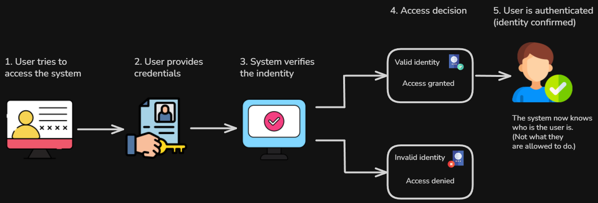
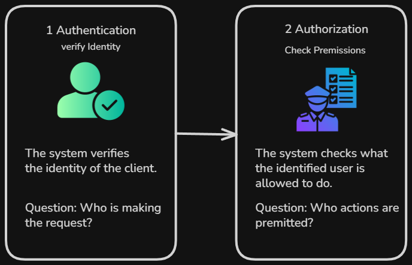
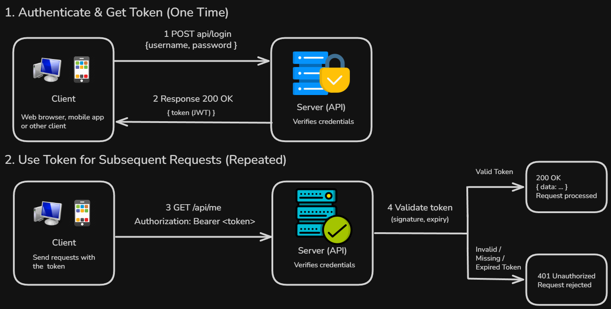
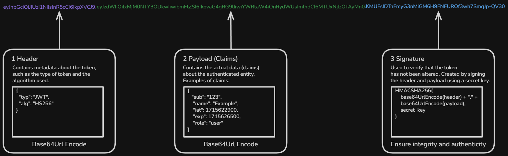
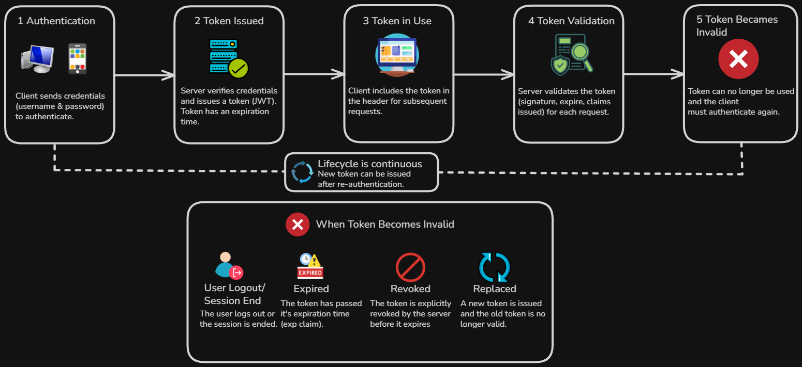

# Content of Authentication Methods

- [What is authentication and why it matters](#what-is-authentication-and-why-it-matters)
- [Authentication vs authorization](#authentication-vs-authorization)
- [Token-based authentication](#token-based-authentication)

Before working with protected APIs or implementing security mechanisms, it is important to understand how systems verify identity.

In many applications, not all data or functionality should be accessible to everyone. Systems often need a way to determine who is making a request and whether that entity should be allowed to access certain resources.

This is where authentication plays a central role.

Authentication provides a way to verify the identity of a user or system before allowing access to protected operations.

At this stage, the focus is not on specific implementations, but on understanding the core concepts behind how identity is verified and how authentication is handled in modern applications.

These concepts apply across different technologies and architectures, and they form the foundation for building secure systems.

To begin, it is important to understand what authentication is and why it matters.

## What is authentication and why it matters

Authentication is the process of verifying the **identity** of a *user or system*.

When a request is made to an application, the system needs a way to determine who is making that request. **Authentication** provides this mechanism.

It answers a simple question. **Who is trying to access the system**

In many applications, access to certain data or functionality is *restricted*. For example, a user may need to *log in* to view personal information, perform actions or access protected resources.

Without authentication, the system would not be able to distinguish between different users or ensure that only authorized entities can interact with *sensitive parts* of the application.

You can think of authentication as an *identification step*.

Before allowing access, the system checks the identity of the client and confirms that it matches a known user or trusted system.

This does not yet determine what the user is allowed to do.

It only verifies **who the user is**.

Authentication is essential for maintaining *security*, protecting data and ensuring that interactions with the system are properly controlled.

In the next section, we look at how authentication differs from `authorization` and why this distinction is important.

## Authentication vs authorization

**Authentication** and **authorization** are closely related concepts, but they serve different purposes.

**Authentication** is the process of verifying *identity*.

It answers the question. **Who is making the request**

**Authorization**, on the other hand, determines what that identified user or system is *allowed to do*.

It answers the question. **What actions are permitted**

You can think of these two steps as happening in sequence.

First, the system verifies the identity of the client through **authentication**. Once the identity is known, the system checks permissions through **authorization**.

For example, a user may successfully authenticate by *logging in*, but still be restricted from accessing certain data or performing specific actions if they do not have the required permissions.

So **Authentication confirms identity** and **Authorization controls access**

Both are essential for building *secure systems*, but they solve different problems.

There are multiple **authentication methods**, each with its own trade-offs and use cases. One of the most common approaches in modern systems is *token-based authentication*, which we explore next.

## Token-based authentication

**Token-based authentication** is one of the most common approaches used to verify *identity* in modern applications.

Instead of sending *credentials* such as a `username` and `password` with every request, the client authenticates once and receives a **token** in return.

This token acts as a form of *proof* that the client has already been verified.

The process follows a clear sequence.

The client first sends credentials to the system. The API verifies these credentials, and if they are valid, it generates a **token**.

This token represents the authenticated identity of the client and may include *encoded information* used for later verification.

The token is then returned to the client.

After this step, the client includes the token in subsequent requests when interacting with the API.

When a request is received, the system extracts the token and verifies it.

If the token is valid, the request is processed as an *authenticated request*. If the token is missing or invalid, the request is rejected.

This creates a continuous interaction cycle.

The client authenticates once, receives a token and then uses that token to access *protected resources*.

This approach provides a clear separation between verifying identity and using that verified identity in future interactions.

The client does not need to repeatedly send *sensitive credentials*, and the system can process requests more efficiently.

Token-based authentication is widely used in APIs because it supports *stateless communication*.

Each request contains all the information needed for verification, without relying on stored session data on the server.

In many implementations, tokens follow a structured format such as **JSON Web Tokens**, often referred to as `JWT`.

A **JWT** is composed of multiple parts that together define its content and ensure its *integrity*.

A typical JWT consists of three parts.

The first part is the **header**. The header contains *metadata* about the token. This usually includes the token type, often defined as `typ: JWT`, and the signing algorithm, such as `alg: HS256`, which indicates how the token is secured.

The second part is the **payload**. The payload contains *claims*, which are pieces of information about the authenticated entity. These may include fields such as a user identifier (`sub`), the time the token was issued (`iat`) or an expiration time (`exp`).

The third part is the **signature**. The signature is used to verify that the token has not been altered. It is created by encoding the header and payload and then applying a *signing algorithm* using a secret or key.

This ensures that the token can be trusted by the system that verifies it.

Once a token is issued, it becomes part of the ongoing communication between the client and the API.

Each request requires the token to be **validated**.

Validation ensures that the token is valid, has not been modified and was issued by a trusted source.

In many cases, additional checks are performed.

For example, tokens often include an *expiration time*. If the token has expired, it is no longer valid and the client must authenticate again.

Tokens also follow a **lifecycle**.

A token is created when the client authenticates, used in subsequent requests and eventually becomes invalid.

This lifecycle may end because the token expires, is revoked or is replaced by a new token.

Managing this lifecycle is important for maintaining *security*.

Short-lived tokens reduce the risk of misuse, while mechanisms such as renewal or re-authentication ensure continued access when needed.

At this level, it is enough to understand that token-based authentication combines a **verification process**, a **structured token format**, and a **lifecycle** that defines how tokens are used over time.
