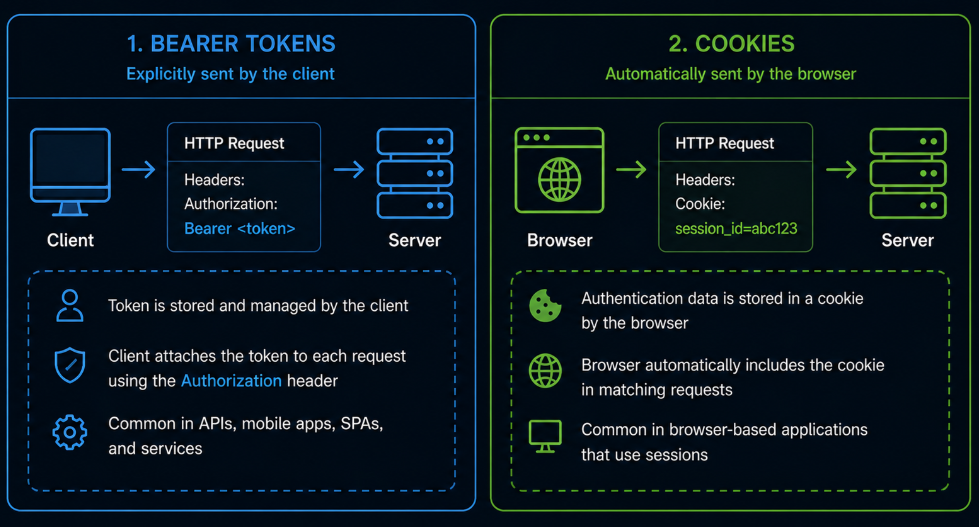
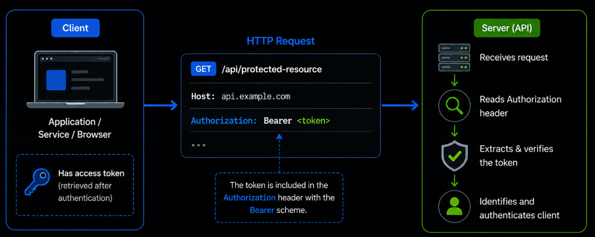
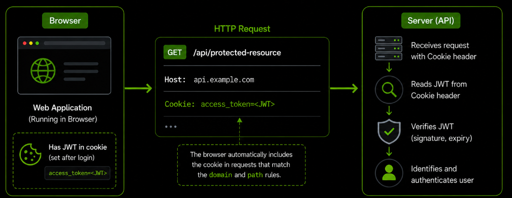

# Content of Authentication Transport

- [What is authentication transport](#what-is-authentication-transport)
- [Common ways to send authentication data](#common-ways-to-send-authentication-data)
- [Bearer tokens in Authorization headers](#bearer-tokens-in-authorization-headers)
- [Cookies as an authentication mechanism](#cookies-as-an-authentication-mechanism)

After understanding how authentication works and how identity is verified, the next step is to understand how that verified identity is actually communicated between the client and the server.

When a user or system is authenticated, it receives some form of *authentication data*, such as a token or session identifier. However, this data is only useful if it can be included in requests so that the system can recognize the client.

This introduces an important aspect of authentication. How authentication data is transmitted with each request. Different approaches exist for sending this data, and each approach defines how the client provides proof of identity when interacting with an API or application.

At this stage, the focus is not on how authentication is performed, but on how the result of authentication is carried across requests.

To begin, it is important to understand what authentication transport is and why it matters.

## What is authentication transport

Authentication transport refers to how *authentication data* is included in requests so that a system can recognize and verify the identity of a client.

After a user or system is authenticated, it receives some form of proof, such as a *token* or a *session identifier*. This proof must be sent with each request to access protected resources. Authentication transport defines how this proof is transmitted between the client and the server.

You can think of this as a communication layer. Authentication determines **who the client is**, while authentication transport determines **how that identity is presented with each request**.

Different systems use different approaches to send authentication data. Some include it explicitly in request headers, while others rely on mechanisms that automatically attach it to requests.

Even though the transport method may vary, the goal remains the same. The system must receive enough information with each request to verify the identity of the client.

At this level, it is enough to understand that authentication transport is about how verified identity is carried across requests.

In the next section, we look at the most common ways this data is sent in real applications.

## Common ways to send authentication data

Once a client has been authenticated, it must include *authentication data* with each request so that the system can verify its identity.

There are several common ways to send this data, depending on the type of application and the authentication method being used.

One approach is to include the authentication data directly in the request. This is often done using request headers, where the client explicitly attaches a token or credential to each request.

Another approach is to rely on mechanisms that automatically include authentication data. In browser-based applications, this is commonly handled using *cookies*, where the browser stores the data and sends it with matching requests.

These approaches differ in how the data is transmitted and managed. Some require the client to explicitly include authentication data in every request, while others rely on the browser or environment to handle it automatically.

Even though the implementation details may vary, the goal remains the same. The system must receive enough information with each request to identify and verify the client.

At this level, it is enough to understand that authentication data can be sent either explicitly or automatically, depending on the chosen approach.

In the next sections, we explore these approaches in more detail.

## Bearer tokens in Authorization headers

One of the most common ways to send authentication data is by including a *token* in the request headers.

This is typically done using the `Authorization` header with the **Bearer** scheme. For example, a request may include `Authorization: Bearer <token>`

In this approach, the client explicitly attaches the token to each request. The server reads the header, extracts the token and uses it to verify the identity of the client.

The term *Bearer* indicates that the client is presenting the token as proof of identity. Any party that possesses this token can use it to access the system, which is why it must be handled securely.

This method is widely used in APIs because it provides a clear and flexible way to include authentication data in requests. It is especially common in systems where clients such as mobile apps, web applications or services communicate directly with an API.

At this level, it is enough to understand that Bearer tokens are sent explicitly in request headers and are used by the server to identify and authenticate the client.

In the next section, we look at how authentication data can also be sent automatically using cookies.

## Cookies as an authentication mechanism

Another common way to send authentication data is by using *cookies*.

In this approach, authentication data is stored in a cookie by the browser. This data may be a *session identifier* used in **session-based authentication** or a *token* such as a JWT used in **token-based authentication**. Once the cookie is set, the browser automatically includes it in future requests that match the domain and path rules.

For example, a request may include `Cookie: access_token=<JWT>`

Unlike Bearer tokens, the client does not need to manually attach authentication data to each request. The browser handles this process automatically based on the cookie configuration.

This approach is commonly used in browser-based applications, where maintaining authenticated communication across multiple requests is required. The server reads the cookie from the request and uses its value to identify the client and verify authentication.

For a detailed explanation of how cookies work, how they are stored and what attributes they use, refer to the **Cookies** section in the Basic Web curriculum.

At this level, it is enough to understand that cookies provide an automatic way to include authentication data in requests, making them well-suited for web applications.
