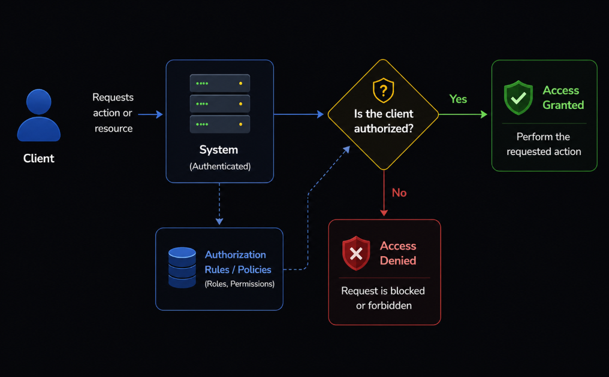
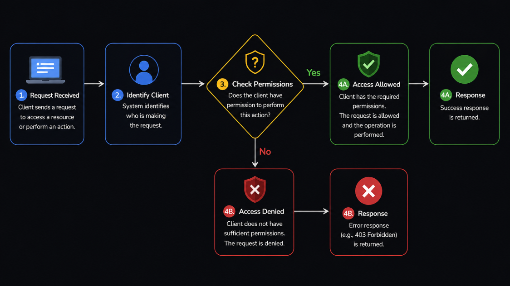
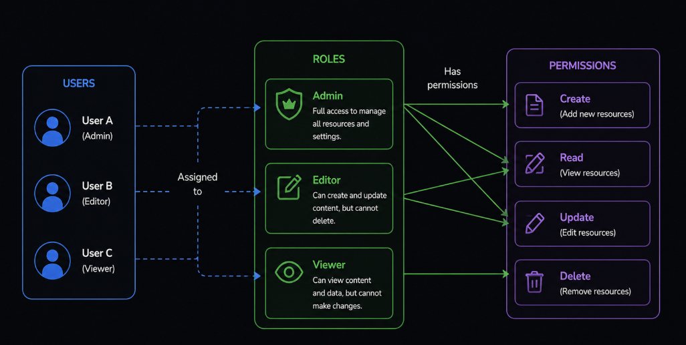
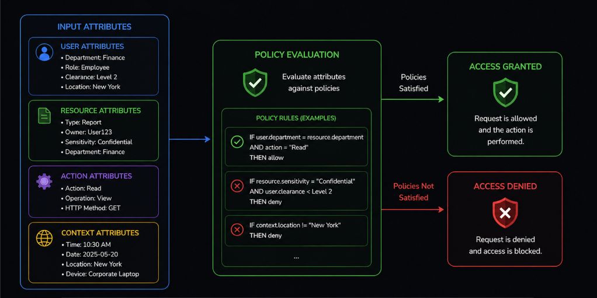
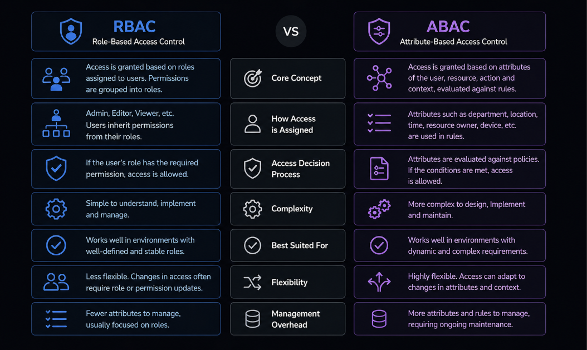
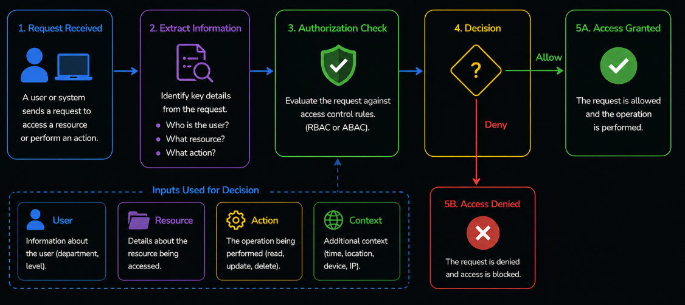

# Table of Contents: Authorization Methods

- [What is authorization and why it matters](#what-is-authorization-and-why-it-matters)
- [How authorization works in systems](#how-authorization-works-in-systems)
- [Role-based access control (RBAC)](#role-based-access-control-rbac)
- [Attribute-based access control (ABAC)](#attribute-based-access-control-abac)
- [Comparing RBAC and ABAC](#comparing-rbac-and-abac)
- [Designing access control in applications](#designing-access-control-in-applications)

After understanding how authentication works and how identity is verified, the next step is to determine what an authenticated user or system is allowed to do.

In real applications, verifying identity is only part of the process. Once a client is identified, the system must decide whether that client has permission to access specific resources or perform certain actions.

For example, a user may be authenticated and successfully logged in, but still be restricted from accessing certain data or modifying specific parts of the system.

This introduces another important concept, authorization.

While authentication answers the question of *who is making the request*, authorization answers the question of *what that entity is allowed to do*.

Understanding this distinction is essential for building secure and well-structured systems.

To begin, we look at what authorization is and why it plays a critical role in controlling access.

## What is authorization and why it matters

Authorization is the process of determining what an *authenticated user or system* is allowed to do.

After a client has been identified through authentication, the system must decide whether the requested action or resource should be accessible. Authorization answers a simple question about what actions are permitted.

For example, a user may be logged in and authenticated, but may only have permission to view certain data and not modify it. Another user may have additional permissions that allow them to create, update or delete resources.

You can think of authorization as a decision step where the system evaluates the identity of the client and checks whether it has the required permissions to perform a specific action.

If the client has the necessary permissions, the request is allowed and the operation is performed. If not, the request is denied.

This process ensures that access to resources is controlled and restricted based on defined rules.

Authorization is essential for protecting sensitive data, enforcing business rules and ensuring that different users or systems can only interact with the parts of the application they are allowed to access.

At this level, it is enough to understand that authorization controls access by defining what actions are allowed for an authenticated entity.

In the next section, we look at how this process works in systems.

## How authorization works in systems

After a client is authenticated, every request to access a resource or perform an action goes through an *authorization check*.

When the client sends a request, the system first identifies who is making that request and then evaluates whether the client has permission to proceed. This process typically involves comparing the requested action against a set of defined *rules* or *permissions*.

You can think of this as a decision flow where a request is received, the system determines the identity of the client and checks whether the required permissions are present.

If the client has the necessary permissions, the request is allowed and the operation is performed. If the permissions are missing or insufficient, the request is denied.

In many systems, this logic is applied consistently across all protected resources, with each request being independently evaluated to ensure that access is always controlled based on the most current rules.

Even though the internal implementation may vary, the overall process remains the same. A request is made, permissions are checked and a decision is returned.

At this level, it is enough to understand that authorization works as a decision step that controls access to resources based on defined rules.

In the next section, we explore common models used to define these rules, starting with role-based access control.

## Role-based access control (RBAC)

Role-based access control, often referred to as *RBAC*, is one of the most common ways to manage authorization in applications.

Instead of assigning permissions directly to each user, permissions are grouped into **roles**. Users are then assigned one or more roles, and each role defines what actions are allowed.

You can think of this as a layered structure where permissions define what actions can be performed, roles group these permissions together and users are assigned roles based on their responsibilities.

For example, an application may define roles such as *admin*, *editor* or *viewer*. An admin role may have permission to create, update and delete resources, an editor role may be able to create and update content but not delete it and a viewer role may only be allowed to read data.

When a request is made, the system checks the role assigned to the user and determines whether the required permission is included in that role.

This approach simplifies access control. Instead of managing permissions for each individual user, the system manages roles, and users inherit permissions through those roles.

RBAC is widely used because it is easy to understand, implement and maintain, especially in systems with well-defined user responsibilities. However, it may become less flexible in situations where access decisions depend on more dynamic conditions.

At this level, it is enough to understand that RBAC organizes authorization around roles, where permissions are assigned to roles and users inherit those permissions.

In the next section, we look at a more flexible model called attribute-based access control.

## Attribute-based access control (ABAC)

Attribute-based access control, often referred to as *ABAC*, is a more flexible approach to authorization that makes decisions based on a set of *attributes*.

Instead of relying only on roles, ABAC evaluates multiple pieces of information when determining whether access should be allowed. These attributes can describe the **user**, the **resource**, the **action** being performed or the **context** of the request.

You can think of ABAC as a rule-based system where access is granted or denied based on policies that define conditions using these attributes.

For example, a system may allow access only if the user belongs to a specific department, the requested resource is owned by that user and the request is made during a certain time.

In this case, the decision is not based on a predefined role, but on evaluating multiple conditions together.

This makes ABAC highly flexible. It can support complex access control scenarios where permissions depend on dynamic factors rather than fixed roles.

However, this flexibility comes with increased complexity. Defining and managing attribute-based rules can be more difficult compared to role-based systems.

At this level, it is enough to understand that ABAC uses attributes and rules to determine access, allowing more dynamic and fine-grained control.

In the next section, we compare RBAC and ABAC to understand their differences and trade-offs.

## Comparing RBAC and ABAC

Role-based access control (RBAC) and attribute-based access control (ABAC) are two common approaches used to manage authorization, but they differ in how access decisions are made.

RBAC organizes access around **roles**, where permissions are grouped into roles and users are assigned those roles. When a request is made, the system checks whether the user’s role includes the required permission.

ABAC, on the other hand, organizes access around **attributes and rules**. Instead of relying only on predefined roles, the system evaluates multiple attributes, such as user information, resource details and request context, to decide whether access should be allowed.

This leads to key differences in how the two models behave.

RBAC is simpler and easier to manage. It works well in systems where user responsibilities are clearly defined and do not change frequently.

ABAC is more flexible. It can handle complex scenarios where access decisions depend on dynamic conditions, but it requires more effort to design and maintain.

RBAC focuses on whether a role has permission to perform a specific action, while ABAC focuses on whether the current attributes and conditions allow that action.

Both approaches are widely used, and the choice between them depends on the complexity and requirements of the system.

At this level, it is enough to understand that RBAC prioritizes simplicity, while ABAC provides flexibility.

In the next section, we look at how access control can be designed and applied in real applications.

## Designing access control in applications

Designing access control in applications involves defining how authorization rules are applied to protect resources and control user actions.

After understanding how authorization works and the different models available, the next step is to decide how these concepts are used in real systems.

In practice, access control is not a single step, but a combination of decisions made throughout the application.

When a request is received, the system must determine who is making the request, what resource is being accessed and what action is being performed. Based on this information, it evaluates whether access should be allowed.

One important aspect of designing access control is deciding where these checks should happen.

In many applications, authorization is enforced at the server level, where each request is validated before the requested operation is executed. This ensures that all access to protected resources is consistently controlled.

Another consideration is how permissions are structured.

Some systems use simple role-based models, while others require more flexible approaches based on attributes and conditions. The choice depends on the complexity of the application and how dynamic the access rules need to be.

It is also important to ensure that access control logic is applied consistently.

All protected actions should go through the same validation process to avoid gaps where unauthorized access could occur.

In practice, designing access control requires balancing simplicity and flexibility.

A simpler model is easier to manage and understand, while a more flexible model can handle complex scenarios but may require additional effort to maintain.

At this level, it is enough to understand that designing access control involves deciding how authorization rules are structured, where they are enforced and how they are applied consistently across the system.