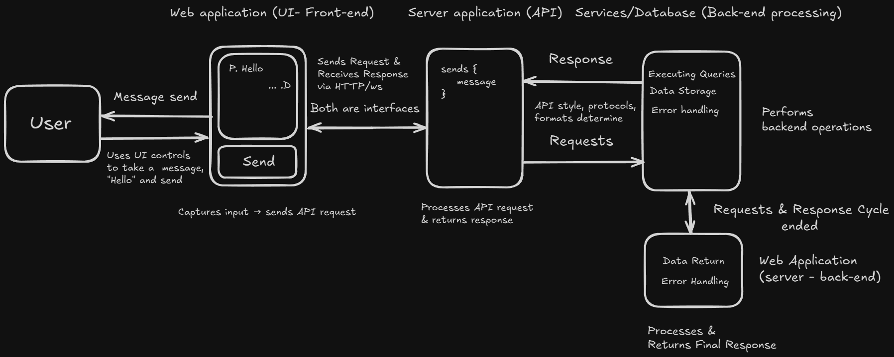
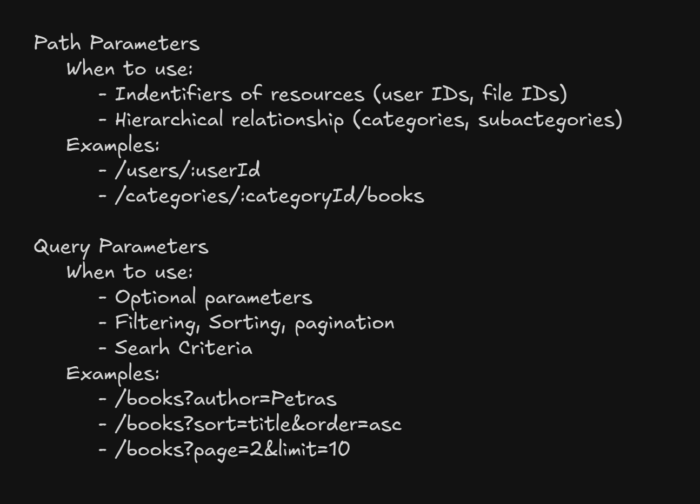
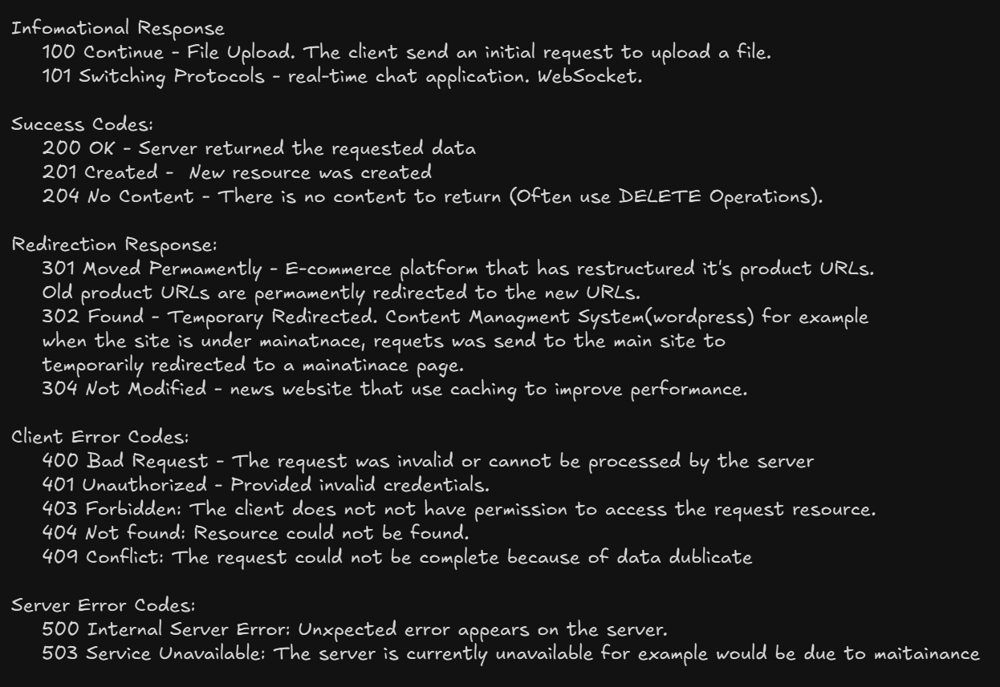

<!-- markdownlint-disable MD033 -->
# Table of Contents: API Basics

- [What are APIs?](what-are-apis)
- [DNS](#dns)
- [URL, Query, and Path Parameters](#url-query-and-path-parameters)
- [HTTP protocol](http-protocol)

## What are APIs?

**Explanation:**

APIs, or Application Programming Interfaces, are sets of rules and protocols that enable different software applications to communicate with each other. They allow developers to access certain features or data of an application, service, or system without needing to understand its internal workings.



<details>
    <summary>Overview:</summary>

- **Endpoints:** Specific URLs or addresses where API requests are sent.

- **API Styles & Protocols:**  
  - **API Styles:** Simple JSON, RESTful, SOAP, GraphQL, gRPC

  - **Protocols:** HTTP/HTTPS, WebSockets.

- **HTTP Methods (for RESTful APIs):** Actions such as GET (retrieve), POST (create), PUT/PATCH (update), and DELETE (remove).

- **Request and Response Format:** Data is typically exchanged in formats like JSON or XML, ensuring a structured response.

- **Authentication and Authorization:** Methods to securely control access to the API (API keys, OAuth, tokens).

- **Error Handling:** Defined responses for different error conditions (200, 404 or 500).

- **Documentation:** Detailed guides and specifications that explain how to use and integrate the API.

</details>

## DNS

**Explanation:**

DNS (Domain Name System) is a system that translates human-readable domain names (like "example.com") into IP addresses that computers use to identify each other on the network.


## URL, Query, and Path Parameters

**Explanation:**

A URL (Uniform Resource Locator) is the address used to access resources on the web. It can include several components that help in locating and filtering data.

```text
{protocol}://{domain/IP}:{port}/{resource}/{subresource}/{path_variable}?{query_key}={value}&{another_key}={value}
```

<details>
    <summary>Overview:</summary>

- **URL Components:**  
  - **Protocol:** Defines the method of communication (`http`, `https`).

  - **Domain/IP:** The server’s address (`example.com`) or an IP address (`192.168.1.1`).

  - **Port:** (Optional) Specifies the network port used by the server (`80` for HTTP, `443` for HTTPS).

  - **Path Components:**
    - **Resource:** Represents a collection or type of data (`users` or `products`).

    - **Subresource:** Further categorizes the resource if needed (`posts` within `users`).

    - **Path Variable:** A dynamic segment that uniquely identifies a specific item in the resource (`123` in `/users/123`).

  - **Query Parameters:**
    - Located after the `?` in the URL.

    - Consist of key-value pairs (e.g., `?query_key=value&another_key=value`) used to filter, sort, or modify the request.

- **Usage path and query parameters:**

    

</details>

## HTTP protocol

**Explanation:**

HTTP (Hypertext Transfer Protocol) is the foundational protocol for data communication on the Web. Each HTTP request from a client to a server is independent; the protocol does not require the server to retain session information between requests.

<details>
    <summary>Overview:</summary>

- **HTTP Versions:**
  - **HTTP/1.1:** This is the standard version. It allows multiple requests to be sent over the same connection (persistent connections), which helps reduce delays when communicating with the server.

  - **HTTP/2:** This version improves on HTTP/1.1 by allowing multiple requests to be sent at the same time (multiplexing). It also compresses headers to speed up the transfer of information, making the web faster.

  - **HTTP/3:** Built on a new protocol called QUIC, HTTP/3 aims to reduce delays even further and improve reliability. It is designed to work better over networks with high latency, ensuring a smoother connection.

- **HTTP Methods:**  
  - **GET:** Retrieve resources or data.

  - **POST:** Submit data to the server for processing (form submission).

  - **PUT/PATCH:** Update an existing resource.

  - **DELETE:** Remove a resource.

- **HTTP Status Codes:** Numeric codes returned by the server to indicate the result of an HTTP request.

    

- **HTTP Headers:** Key-value pairs that provide essential metadata for the request and response (Content-Type, Cache-Control, Authorization).

- **HTTP Caching:** Techniques to store copies of resources to reduce latency and network load, controlled via headers like Cache-Control, ETag (entity tag), and Expires.

</details>
