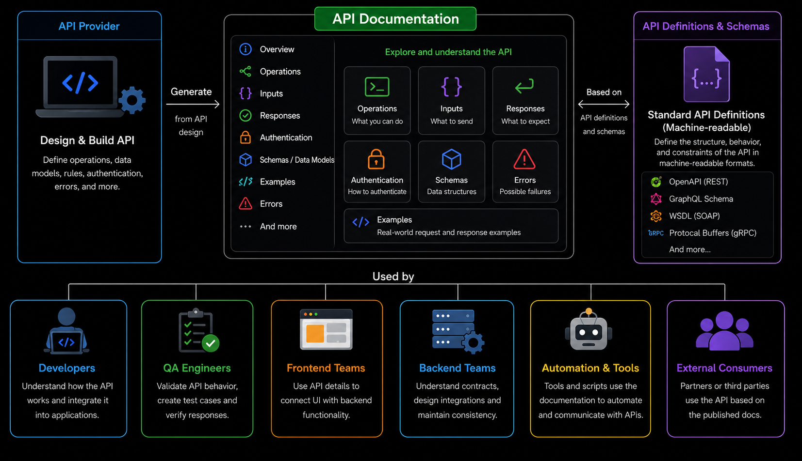
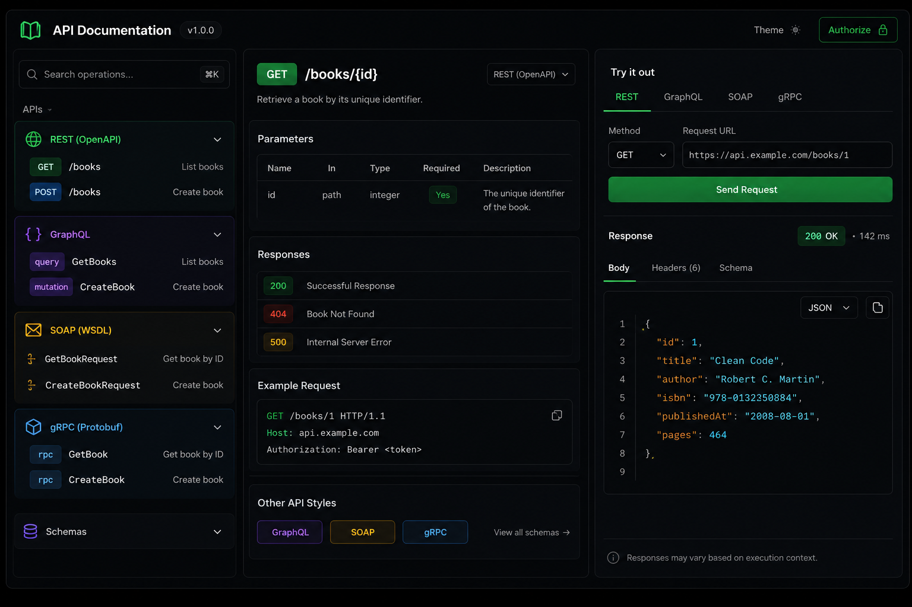
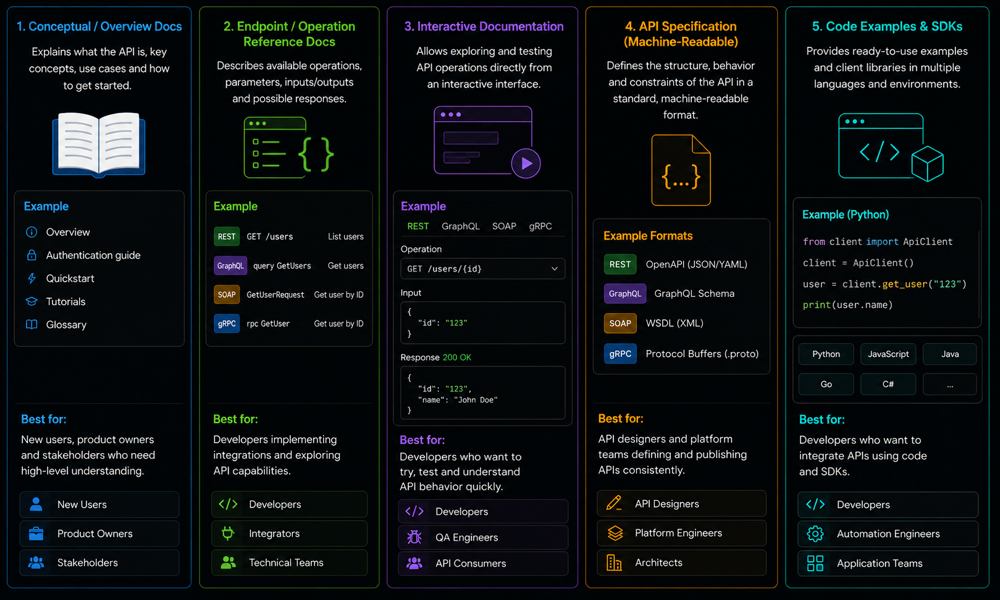

# Content of API Documentation

- [Why API documentation matters](#why-api-documentation-matters)
- [Describing API endpoints](#describing-api-endpoints)
- [Documenting parameters and input data](#documenting-parameters-and-input-data)
- [Documenting responses and errors](#documenting-responses-and-errors)
- [Interactive documentation and API specifications](#interactive-documentation-and-api-specifications)

After designing an API, the next step is describing how that API should be used.

API documentation explains what operations are available, what input data is expected and what responses clients or systems can receive from the API.

Without documentation, consumers of the API would need to inspect implementation details or experiment with requests to understand how the API behaves.

Documentation provides a structured reference for working with the API and helps keep interactions between systems and consumers consistent.

At this stage, the focus is not on specific tools yet, but on understanding what API documentation contains and how it describes API behavior.

To begin, it is first necessary to understand why API documentation matters.

## Why API documentation matters

APIs are designed to be used by applications, systems and people interacting with the API. Because of this, the behavior of the API needs to be clearly described.

API documentation explains what operations are available, what data can be sent to the API and what responses may be returned.



Without documentation, consumers of the API would need to inspect implementation details or rely on trial and error to understand how the API behaves.

Documentation provides a reference for understanding how operations, parameters and responses are organized within the API.

It also helps keep API usage consistent across different systems and integrations.

Clear documentation reduces ambiguity by describing how the API is expected to behave and what consumers should expect during interactions.

In the next section, we look at how interactive documentation and API specifications describe and expose API behavior to consumers.

## Interactive documentation and API specifications

Interactive API documentation allows consumers of the API to explore and test operations through a user interface.

These interfaces commonly display available operations, input data, response examples and controls for interacting with the API directly from the documentation itself.



In many systems, this documentation is generated automatically from an API specification or schema definition.

An API specification defines the structure and behavior of the API in a machine-readable format.

Different API styles use different specification formats. REST APIs commonly use OpenAPI, GraphQL APIs use GraphQL schemas, SOAP APIs commonly use WSDL and gRPC APIs use Protocol Buffer definitions.



Frameworks and tooling can use these specifications to generate interactive documentation, validation rules, client libraries and other development tooling automatically.

Because the documentation is generated from the API definition itself, the documentation and implementation remain more closely aligned.

The operations and structures exposed through interactive documentation come directly from the API definition itself.

## Describing API endpoints

One of the main responsibilities of API documentation is describing the operations available within the API.

Depending on the API style, these operations may be represented as endpoints, queries, mutations or remote procedure calls.

For each operation, the documentation should explain what functionality is available, what resource or service it interacts with and how the operation is expected to be used.

REST APIs commonly describe operations using HTTP methods and URI paths.

```text
GET /books
POST /books
GET /books/1
GET /users/1/orders
```

In these examples, /books represents a resource collection, /books/1 represents a specific resource and /users/1/orders represents a subresource related to a specific user.

GraphQL APIs commonly describe operations using queries and mutations.

```graphQL
query {
  books {
    title
  }
}
```

gRPC APIs commonly describe operations using remote procedure calls.

```proto
service BookService {
  rpc GetBook(GetBookRequest) returns (Book);
}
```

SOAP APIs commonly describe operations through service definitions and XML based messages.

```xml
<GetBookRequest>
  <id>1</id>
</GetBookRequest>
```

Documentation may also include additional details such as authentication requirements, expected behavior or important usage notes associated with the operation.

Clear operation descriptions help consumers of the API understand what functionality is available and how different parts of the API are organized.

In the next section, we look at how API documentation describes parameters and input data used by operations.

## Documenting parameters and input data

API documentation should describe what input data an operation expects.

Depending on the API style, input data may be represented in different ways, including parameters, request bodies, structured queries or typed input definitions.

REST APIs commonly use path parameters, query parameters and request bodies.

```text
GET /books/1
GET /books?limit=10&offset=20

{
  "title": "Clean Code",
  "author": "Robert C. Martin"
}
```

Different API styles may structure and send input data differently.

GraphQL APIs commonly define input data within queries or mutations.

```graphql
POST /graphql

query {
  book(id: 1) {
    title
    author
  }
}
```

Other API styles may use different message formats and communication structures for sending input data.

SOAP APIs commonly exchange XML request messages.

```xml
POST /BookService

<soap:Envelope>
  <soap:Body>
    <GetBookRequest>
      <id>1</id>
    </GetBookRequest>
  </soap:Body>
</soap:Envelope>
```

Other API styles may also use service-based communication models and typed message definitions for representing input data.

gRPC APIs commonly define input data using remote procedure calls and protocol buffer messages.

```proto
message GetBookRequest {
  int32 id = 1;
}
```

Documentation should explain what each input value represents, whether it is required and what type of data is expected.

It may also describe validation rules, allowed values or example requests associated with the operation.

In the next section, we look at how documentation describes responses, status information and API errors.

## Documenting responses and errors

API documentation should describe what responses may be returned after an operation is performed.

This includes successful responses, returned data and possible error responses associated with the operation.

Different API styles may represent responses and errors differently.

REST APIs commonly return structured response bodies.

```json
{
  "id": 1,
  "title": "Clean Code",
  "author": "Robert C. Martin"
}
```

Documentation should also describe response status information.

```text
200 OK
201 Created
404 Not Found
```

REST APIs may also return structured error responses.

```json
{
  "detail": "Book not found"
}
```

Other API styles may structure response and error information differently.

GraphQL APIs commonly return query results together with structured error information.

```json
{
  "data": {
    "book": {
      "title": "Clean Code"
    }
  },
  "errors": []
}
```

Other API styles may represent response data using different message formats and communication structures.

SOAP APIs commonly return XML response messages.

```xml
<soap:Envelope>
  <soap:Body>
    <GetBookResponse>
      <title>Clean Code</title>
    </GetBookResponse>
  </soap:Body>
</soap:Envelope>
```

Documentation may also describe SOAP fault responses associated with errors.

```xml
<soap:Fault>
  <faultstring>Book not found</faultstring>
</soap:Fault>
```

Other API styles may also use different communication models and typed message systems for representing responses.

gRPC APIs commonly return typed response messages.

```proto
message Book {
  int32 id = 1;
  string title = 2;
}
```

Documentation may also describe RPC status information associated with the operation.

```text
OK
NOT_FOUND
INTERNAL
```

Documentation should describe what responses may be returned, what they represent and under what conditions errors may occur.
