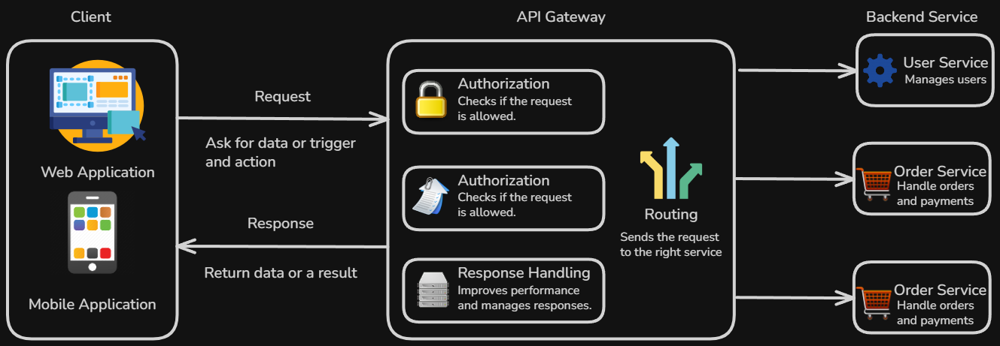

# Content of API Fundamentals

- [What are APIs and how they work](#what-are-apis-and-how-they-work)
- [How APIs fit into system communication](#how-apis-fit-into-system-communication)
- [API styles](#api-styles)

Before working with frameworks or writing API routes, it is important to understand what APIs are and why they are used.

At a fundamental level, APIs provide a structured way for different software systems to communicate with each other. They define how one system can request data or functionality from another system without needing direct access to its internal implementation.

At this stage, the focus is not on building APIs yet, but on understanding the core ideas behind them. This includes how APIs fit into system communication, how requests and responses are exchanged and how different API styles organize that interaction.

These concepts appear across many technologies and frameworks. Later, they will connect directly to how web APIs are designed and how tools such as FastAPI implement them in practice.

To begin, it is first necessary to understand what an API actually is.

## What are APIs and how they work

An **API (Application Programming Interface)** allows different software systems to communicate with each other.

Instead of directly accessing internal logic or databases, a client sends a request to an API. The API processes that request and returns a response. This creates a controlled and structured way to interact with a system.

In this interaction, the client does not need to know how the system is implemented internally. It only needs to know how to communicate with the API.

At a fundamental level, this communication follows a **request–response pattern**.

A client sends a request to the API, asking for data or triggering an action. The API processes that request and returns a response with the result, which may include data, confirmation of an action or information about an error.

This is the most common way APIs work, especially in web applications.

However, not all API communication follows exactly the same pattern. Some systems use persistent connections such as **WebSockets** for real-time updates, while others use event-driven approaches such as **webhooks**, where data is sent when a specific event occurs.

At this stage, it is enough to understand that request–response is the most common API interaction model. Other communication patterns are explored later.

To make this interaction possible, APIs expose defined access points.

These access points represent specific operations that the client can use to interact with the system. Each access point corresponds to a particular action or type of data.

Depending on the API design, these access points may be represented in different ways, such as multiple endpoints, a single entry point or other structured interfaces.

From the clients perspective, interacting with an API means choosing the appropriate access point, sending a request and receiving a response.

Even though the internal processing may involve multiple steps such as validation, business logic or communication with other systems, this complexity is hidden behind the API.

You can think of an API as a contract.

It defines how a client can interact with a system, what requests can be made and what responses can be expected.

Different approaches organize how communication happens between systems. These approaches are known as API styles and are explored later.

## How APIs fit into system communication

Modern applications are rarely built as a single isolated system.

Instead, they are composed of multiple parts that need to communicate with each other. A frontend application may need to retrieve data from a backend service. A backend service may depend on a database or communicate with other external services.

These interactions require a clear and controlled way for systems to exchange information.

This is where APIs play a central role.

An API acts as an interface between systems. It provides a structured way for systems to interact without exposing their internal implementation.

In more complex systems, the API may also act as a central entry point that manages how requests are routed to different services. This type of architecture is often referred to as an API Gateway.

It can handle additional responsibilities such as authorization, logging or response handling, while still providing a consistent interface to the client.

You can think of this as a separation of responsibilities.

The client is responsible for requesting data or triggering actions. The API defines how those requests are handled and where they are directed. The underlying services are responsible for processing the request and producing a result.

In practice, this communication often happens between a client and multiple backend systems.

A client, such as a web application or mobile app, interacts with the API, while the API coordinates communication with different services and data sources.

Even though the internal implementation of each system may be complex, the API provides a simplified and consistent way for them to interact.

To enable this interaction, APIs expose specific access points that clients use to communicate with the system.

## API styles

Even though all APIs follow the same request–response pattern, they can be organized in different ways.

These different approaches are known as API styles.

Each style defines how clients interact with the system, how access points are structured and how data is exchanged.

Some of the most common API styles include **REST**, **GraphQL**, **SOAP** and **gRPC**.

**REST** is one of the most widely used styles. It organizes APIs around resources and typically uses multiple access points to represent different parts of the system.

**GraphQL** takes a different approach. Instead of multiple access points, it usually provides a single entry point where the client specifies exactly what data it needs.

**SOAP** is a more structured protocol that relies on XML and follows strict rules for how messages are formatted and exchanged.

**gRPC** is designed for high performance communication between services and uses a compact binary format instead of text-based data.

Even though these styles differ in how they structure communication, they all follow the same underlying interaction model.

At this level, it is enough to understand that API styles define how an API is organized and how communication between systems is structured.