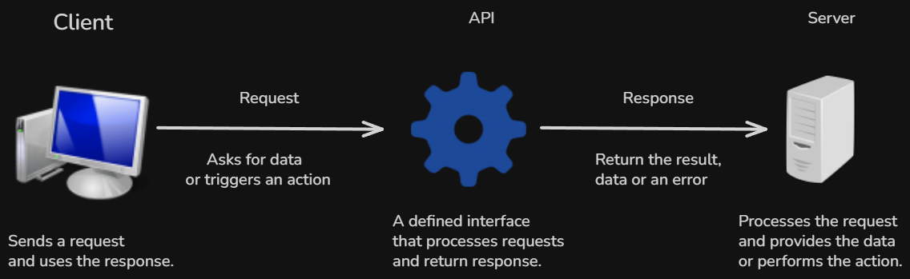

# Content of API Fundamentals

- [What are APIs](#what-are-apis)
- [How APIs fit into system communication](#how-apis-fit-into-system-communication)
- [How clients access APIs](#how-clients-access-apis)
- [Request/Response](#requestresponse)
- [API styles](#api-styles)

Before working with frameworks or writing API routes, it is important to understand what APIs are and why they are used.

At a fundamental level, APIs provide a structured way for different software systems to communicate with each other. They define how one system can request data or functionality from another system without needing direct access to its internal implementation.

At this stage, the focus is not on building APIs yet, but on understanding the core ideas behind them. This includes how APIs fit into system communication, how requests and responses are exchanged and how different API styles organize that interaction.

These concepts appear across many technologies and frameworks. Later, they will connect directly to how web APIs are designed and how tools such as FastAPI implement them in practice.

To begin, it is first necessary to understand what an API actually is.

## What are APIs

An **API (Application Programming Interface)** allows different software systems to communicate with each other.

Instead of directly accessing internal logic or databases, a client sends a request to an API. The API processes that request and returns a response. This creates a controlled and structured way to interact with a system.

In this interaction, the client does not need to know how the system is implemented internally. It only needs to know how to send a request and how to interpret the response.

An API acts as a boundary between systems. It defines what is accessible and how that access happens.

At a fundamental level, APIs are built around a **request–response cycle**, where data flows between a client and a server in a predictable way.

You can think of an API as a contract.

It defines what requests can be made, what data is expected and what responses will be returned.

To make this interaction possible, APIs expose specific access points where requests can be sent. These access points are known as **endpoints**.

However, APIs are not all designed in the same way.

Different approaches organize how communication happens between systems. These approaches are known as API styles and are explored later.

## How APIs fit into system communication

Modern applications are rarely built as a single isolated system.

Instead, they are composed of multiple parts that need to communicate with each other. A frontend application may need to retrieve data from a backend service. A backend service may depend on a database or communicate with other external services.

These interactions require a clear and controlled way for systems to exchange information.

This is where APIs play a central role.

An API acts as an interface between systems. It provides a structured way for systems to interact without exposing their internal implementation.

In more complex systems, the API may also act as a central entry point that manages how requests are routed to different services. This type of architecture is often referred to as an API Gateway.

It can handle additional responsibilities such as authorization, logging or response handling, while still providing a consistent interface to the client.

You can think of this as a separation of responsibilities.

The client is responsible for requesting data or triggering actions. The API defines how those requests are handled and where they are directed. The underlying services are responsible for processing the request and producing a result.

In practice, this communication often happens between a client and multiple backend systems.

A client, such as a web application or mobile app, interacts with the API, while the API coordinates communication with different services and data sources.

Even though the internal implementation of each system may be complex, the API provides a simplified and consistent way for them to interact.

To enable this interaction, APIs expose specific access points that clients use to communicate with the system.

## How clients access APIs

To interact with an API, a client must use one of its defined access points.

In many APIs, these access points are called endpoints.

An endpoint is a specific location in an API where a request is sent. It represents an entry point to a resource or functionality exposed by the system.

An endpoint is typically identified by a unique address or identifier that allows the API to determine how the request should be handled.

Depending on the API design, this may be represented as a URL, a single entry point or another form of structured access.

For example, an API may provide separate endpoints for retrieving data, creating new data or performing specific operations.

From the client’s perspective, these access points define where requests are sent and what kind of operations are available.

Even though different API styles organize access points in different ways, the core idea remains the same. The client interacts with the API through clearly defined entry points.

Once these access points are understood, the next step is to examine how communication happens through them. This follows a **request–response** pattern.

## Request/Response

Communication with an API follows a request–response interaction.

A request is sent by the client to an API access point and contains the information needed for the system to perform an action.

After receiving the request, the API processes it and produces a response.

The response contains the result of that operation. This may include returned data, confirmation that an action was completed or information about an error if the request could not be processed.

You can think of this interaction as a simple exchange.

The client asks for something, and the server returns the result.

Even though the internal processing may involve multiple steps such as validation, business logic or communication with other systems, this complexity is hidden behind the request–response interaction.

From the client’s perspective, the process remains consistent. A request is sent, and a response is returned.

Understanding this interaction is essential, because it defines how data flows between systems when using an API.

In the next section, we look at how different API styles organize this interaction in different ways.

## API styles

Even though all APIs follow the same request–response pattern, they can be organized in different ways.

These different approaches are known as API styles.

Each style defines how clients interact with the system, how access points are structured and how data is exchanged.

Some of the most common API styles include **REST**, **GraphQL**, **SOAP** and **gRPC**.

**REST** is one of the most widely used styles. It organizes APIs around resources and typically uses multiple access points to represent different parts of the system.

**GraphQL** takes a different approach. Instead of multiple access points, it usually provides a single entry point where the client specifies exactly what data it needs.

**SOAP** is a more structured protocol that relies on XML and follows strict rules for how messages are formatted and exchanged.

**gRPC** is designed for high performance communication between services and uses a compact binary format instead of text-based data.

Even though these styles differ in how they structure communication, they all follow the same underlying interaction model.

At this level, it is enough to understand that API styles define how an API is organized and how communication between systems is structured.
