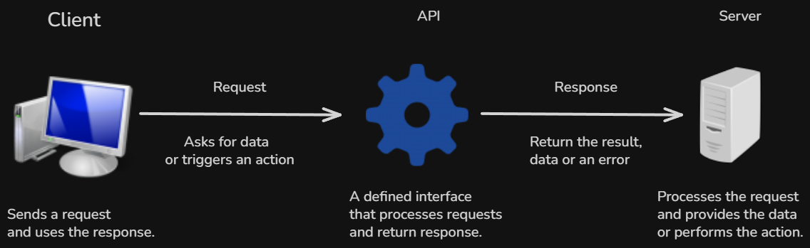
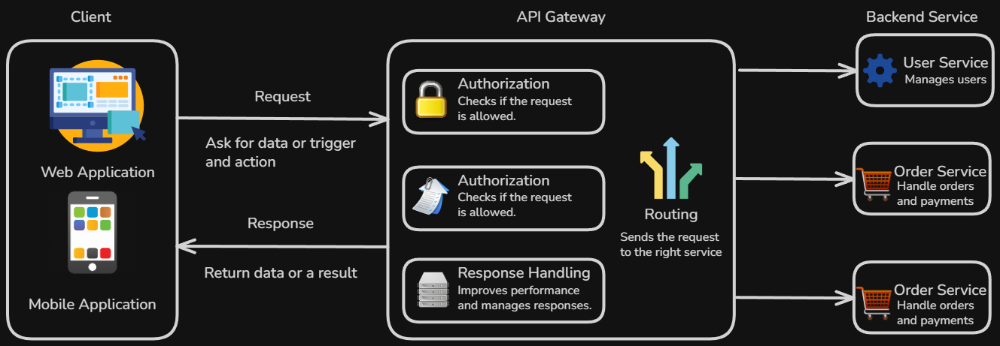

# Content of API Fundamentals

- [What are APIs and how they work](#what-are-apis-and-how-they-work)
- [How APIs fit into system communication](#how-apis-fit-into-system-communication)
- [API styles](#api-styles)

Before working with frameworks or writing API routes, it is important to understand what APIs are and why they are used.

At a fundamental level, APIs provide a structured way for different software systems to communicate with each other. They define how one system can request data or functionality from another system without needing direct access to its internal implementation.

At this stage, the focus is not on building APIs yet, but on understanding the core ideas behind them. This includes how APIs fit into system communication, how requests and responses are exchanged and how different API styles organize that interaction.

These concepts appear across many technologies and frameworks. Later, they will connect directly to how web APIs are designed and how tools such as FastAPI implement them in practice.

To begin, it is first necessary to understand what an API actually is.

## What are APIs and how they work

An **API (Application Programming Interface)** allows different software systems to communicate with each other. Instead of directly accessing internal logic or databases, a client sends a request to an API, the API processes that request and returns a response. This creates a controlled and structured way to interact with a system.

In this interaction, the client does not need to know how the system is implemented internally. It only needs to know how to communicate with the API. At a fundamental level, this communication follows a **request–response pattern**, where a client sends a request asking for data or triggering an action, and the API returns a response containing the result. This result may include returned data, confirmation that an operation was completed or information about an error.

This is the most common way APIs work, especially in web applications. However, not all API communication follows exactly the same interaction model. Some systems use persistent connections such as **WebSockets** for real-time communication, while others use event-driven approaches such as **webhooks**, where data is sent automatically when a specific event occurs. At this stage, it is enough to understand that request–response is the most common API interaction pattern.

To make this interaction possible, APIs expose defined access points that clients use to interact with the system. These access points represent specific operations or resources and may be organized differently depending on the API design. Some APIs expose many separate endpoints, while others use a single entry point or different structured interfaces.

From the client’s perspective, interacting with an API means selecting the appropriate access point, sending a request and receiving a response. Even though the internal processing may involve validation, business logic, databases or communication with other systems, this complexity remains hidden behind the API interface.

You can think of an API as a contract between systems. It defines how communication happens, what requests can be made and what responses can be expected. Different approaches organize this communication in different ways. These approaches are known as API styles and are explored later.

## How APIs fit into system communication

Modern applications are rarely built as a single isolated system. Instead, they are composed of multiple parts that need to communicate with each other. A frontend application may need to retrieve data from a backend service, while backend services themselves may depend on databases or communicate with external systems.

These interactions require a clear and controlled way for systems to exchange information. This is where APIs play a central role.

An API acts as an interface between systems. It provides a structured way for systems to interact without exposing their internal implementation. This allows different parts of an application, or even entirely separate systems, to communicate in a predictable and consistent way.

In more complex architectures, the API may also act as a central entry point that manages how requests are routed to different services. This approach is often referred to as an API Gateway. In addition to routing requests, it may handle responsibilities such as authorization, logging or response processing while still presenting a consistent interface to the client.

You can think of this as a separation of responsibilities. The client is responsible for requesting data or triggering actions, the API defines how communication happens and where requests are directed, and the underlying services are responsible for processing the request and producing a result.

In practice, this communication often happens between a client and multiple backend systems. A web application or mobile app interacts with the API, while the API coordinates communication with different services and data sources behind the scenes. Even though the internal implementation may involve many components, the API provides a simplified and structured way for systems to interact.

To make this communication possible, APIs expose defined access points that clients use to communicate with the system.

## API styles

Even though all APIs follow the same request–response interaction model, they can organize communication in different ways. These different approaches are known as API styles.

Each style defines how clients interact with the system, how access points are structured and how data is exchanged between systems. While the underlying goal remains the same, different API styles solve communication problems using different architectural approaches.

Some of the most common API styles include **REST**, **GraphQL**, **SOAP** and **gRPC**.

**REST** is one of the most widely used styles. It organizes APIs around resources and typically exposes multiple access points that represent different parts of the system.

**GraphQL** takes a different approach by usually exposing a single entry point where the client explicitly specifies what data should be returned.

**SOAP** is a more structured communication protocol that relies on XML and follows strict rules for how messages are formatted and exchanged between systems.

**gRPC** is designed for high performance communication between services and uses a compact binary format instead of traditional text-based data formats.

Even though these styles organize communication differently, they all exist to solve the same fundamental problem — allowing systems to exchange information in a structured and predictable way.

At this level, it is enough to understand that API styles define how APIs organize communication and interaction between systems.