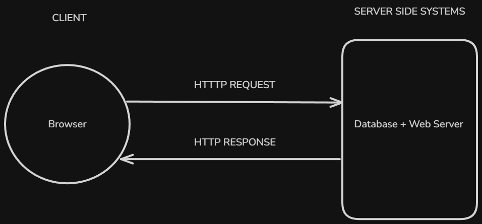

# Table of Contents: API fundamentals

- [What are APIs](#what-are-apis)
- [Endpoints](#endpoints)
- [Request/Response](#requestresponse)
- [API styles](#api-styles)

Before working with frameworks or writing API routes, it is important to understand how APIs behave at a conceptual level.

At this stage, the focus is not on implementation, but on how systems communicate with each other through defined interfaces. An API defines how a client interacts with a server, what kind of requests can be made, and how responses are returned.

This level introduces the basic ideas that appear in every API, regardless of the technology used. These ideas will later connect directly to how FastAPI handles routes, requests, and responses.

## What are APIs

APIs can be designed in different ways. These approaches define how endpoints are structured, how data is requested, and how responses are returned.

These approaches are known as API styles.

Even though all APIs follow the same request–response pattern, different styles organize that interaction differently. Each style has its own way of defining how clients communicate with the server.

Some common API styles include REST, GraphQL, SOAP, and gRPC.

REST is one of the most widely used styles. It organizes APIs around resources and uses standard HTTP methods to interact with them.

GraphQL takes a different approach. Instead of multiple endpoints, it allows the client to request exactly the data it needs through a single endpoint.

SOAP is a more structured and formal protocol that uses XML for communication and follows strict rules.

gRPC is designed for high performance communication between services and uses a binary format instead of text-based data.

At this level, it is enough to understand that API styles define how an API is organized and how clients interact with it.

The REST style is introduced in detail in the next section, since it is the most commonly used approach in modern web APIs.

**APIs** or **Application Programming Interfaces**, allow different software systems to communicate with each other.

Instead of directly accessing internal logic or databases, a client sends a request to an API. The API processes that request and returns a response. This creates a controlled and structured way to interact with a system.


In this interaction, the client does not need to know how the system is implemented internally. It only needs to know how to send a request and how to interpret the response.

An API acts as a boundary between systems. It defines what is accessible and how that access happens.

At this level, it is enough to understand that APIs are built around a **request–response cycle**, where data flows between a client and a server in a predictable way.

To make this interaction possible, APIs expose specific access points where requests can be sent. These access points are known as endpoints.

## Endpoints

An endpoint is a specific location in an API where a request is sent.

It represents an access point to a resource. When a client wants to interact with the API, it sends a request to one of these endpoints.

An endpoint is usually defined by a URL together with an HTTP method. The URL identifies the resource, and the method defines what kind of action is being performed.

For example, an API may expose endpoints like this.

```text
GET /books
GET /books/1
POST /books
```

Each endpoint represents a different way to interact with the same resource.

The path part of the endpoint describes what is being accessed. A collection such as `/books` refers to a group of resources, while a path like `/books/1` refers to a specific item.

At this level, it is important to understand that endpoints define where requests are sent and how the API is structured from the client’s point of view.

The exact rules for naming and organizing endpoints are introduced later when discussing API design.

Once an endpoint is defined, the next step is understanding how data is exchanged through it. This interaction follows a **request–response** pattern.

## Request/Response

API communication is based on a **request–response** interaction between a client and a server.



A request is sent by the client to an API endpoint. It contains the information needed for the server to understand what action should be performed.

A response is returned by the server after processing the request. It contains the result of that operation.

A request typically includes several parts. It specifies the endpoint being accessed and may include additional data depending on the operation. This data can be part of the URL or included in the request body.

A response contains the result of the request. This usually includes returned data together with information that indicates whether the request was successful or not.

At this level, it is enough to understand that the client initiates the interaction, and the server processes the request and returns a structured response.

The exact structure of request data and response data is explored later when working with JSON and HTTP.

While all APIs follow the same **request–response** pattern, they can be designed in different ways. These approaches are known as API styles.

## API styles

APIs can be designed in different ways. These approaches define how endpoints are structured, how data is requested, and how responses are returned.

These approaches are known as API styles.

Even though all APIs follow the same request–response pattern, different styles organize that interaction differently. Each style has its own way of defining how clients communicate with the server.

Some common API styles include **REST**, **GraphQL**, **SOAP** and **gRPC**.

**REST** is one of the most widely used styles. It organizes APIs around resources and uses standard **HTTP methods** to interact with them.

**GraphQL** takes a different approach. Instead of **multiple endpoints**, it allows the client to request exactly the data it needs through a single endpoint.

**SOAP** is a more structured and formal protocol that uses **XML** for communication and follows strict rules.

**gRPC** is designed for high performance communication between services and uses a **binary format** instead of **text-based data**.

At this level, it is enough to understand that API styles define how an API is organized and how clients interact with it.
