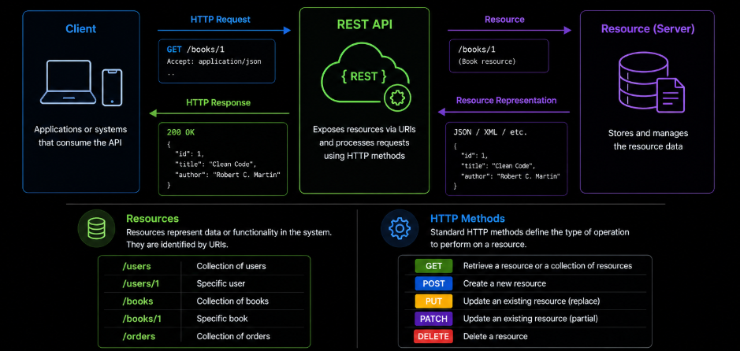
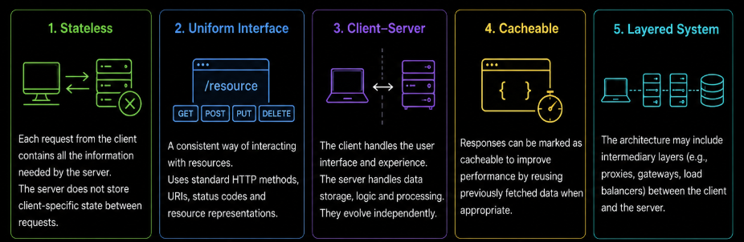

# Content of REST API design style

- [What REST is](#what-rest-is)
- [Resources in REST](#resources-in-rest)
- [CRUD operations](#crud-operations)
- [URI design](#uri-design)

In earlier sections, we explored how APIs enable communication between systems and how API design helps make those interactions clear and consistent.

However, APIs can organize communication in different ways depending on the architectural style being used.

One of the most widely used approaches in modern web development is REST.

REST provides a structured way to design APIs around resources and standard communication patterns. Instead of treating every interaction as a completely separate operation, REST organizes APIs using consistent rules for how clients access and manipulate data.

Because of its simplicity, scalability and compatibility with HTTP, REST has become one of the most common approaches for designing web APIs.

At this stage, the focus is not on implementation details, but on understanding the principles and design patterns that REST introduces for organizing API communication.

To begin, it is first necessary to understand what REST actually is and how it approaches API design.

## What REST is

REST, or Representational State Transfer, is an architectural style used for designing APIs and communication between systems.



Instead of treating every interaction as a completely separate operation, REST organizes APIs around resources and standardized communication patterns. A resource represents a piece of data or functionality within the system, such as users, products or orders.

In REST, clients interact with resources through clearly defined access points and standard HTTP methods.

REST builds on existing HTTP concepts such as methods, URIs and status responses rather than introducing completely new communication mechanisms.

REST is also built around several architectural principles that help APIs remain consistent, scalable and predictable.



One of the core principles in REST is stateless communication. Each request should contain all the information needed for the server to process it. The server does not store client-specific request state between interactions.

REST also promotes the use of a uniform interface. Similar resources should follow consistent interaction patterns so clients can predict how the API behaves.

Another important principle is the separation between clients and servers. Clients are responsible for presentation and user interaction, while servers are responsible for processing requests and managing data.

REST APIs may also support cacheable responses, allowing clients or intermediary systems to temporarily reuse responses when appropriate to improve performance and reduce unnecessary communication.

Together, these principles provide a structured and standardized approach for organizing API communication around resources and predictable interaction patterns.

In the next section, we look at how REST organizes APIs around resources and how those resources are represented within the system.

## Resources in REST

One of the central ideas in REST is organizing APIs around resources. A resource represents a piece of data or functionality within the system that clients can interact with.

Resources are typically nouns rather than actions. Examples of resources may include users, products, orders or books. Instead of designing APIs around operations directly, REST focuses on exposing these resources in a structured and predictable way.

Clients interact with resources through defined access points and standard HTTP methods. For example, a client may request a collection of books, retrieve a specific book or create a new book within the system.

```text
GET /books
GET /books/1
POST /books
```

In this structure, `/books` represents the resource collection, while `/books/1` represents a specific resource instance.

REST separates the concept of the resource itself from the operation being performed on it. The URI identifies the resource and the HTTP method defines the type of interaction.

This resource-oriented approach helps APIs remain consistent and easier to understand because similar resources tend to follow similar interaction patterns across the system.

Resources may also have relationships with other resources. For example, a user resource may contain related orders, or a book resource may belong to a category. REST APIs often represent these relationships through hierarchical or nested resource structures.

At a high level, resources provide the foundation for how REST APIs organize communication and expose functionality to clients.

In the next section, we look at how REST maps common operations such as creating, retrieving, updating and deleting resources.

## CRUD operations

REST APIs commonly organize interactions around four fundamental operations known as CRUD. CRUD stands for Create, Read, Update and Delete, which represent the most common ways clients interact with resources within a system.

These operations are typically mapped to standard HTTP methods so communication remains consistent and predictable across the API.

Create operations are used when a client wants to add a new resource to the system. In REST APIs, this is commonly performed using the `POST` method.

```text
POST /books
```

Read operations are used to retrieve existing resources or collections of resources. These operations are commonly performed using the `GET` method.

```text
GET /books
GET /books/1
```

Update operations modify existing resources. Depending on the type of update, REST APIs commonly use either `PUT` for replacing a resource or `PATCH` for partial modifications.

```py
PUT /books/1
PATCH /books/1
```

Delete operations remove resources from the system and are typically performed using the `DELETE` method.

```text
DELETE /books/1
```

This mapping between resource operations and HTTP methods is one of the defining characteristics of RESTful API design. Instead of creating separate access points for every possible action, REST reuses a consistent set of operations across different resources.

Because these interaction patterns remain predictable, clients can often understand how to work with new REST resources without learning completely new communication rules for each part of the API.

In the next section, we look at how URIs are designed in REST APIs and how they help organize resources and interactions clearly.

## URI design

In REST APIs, resources are identified using URIs, or Uniform Resource Identifiers. A URI defines the access path that clients use to interact with resources within the system.

Good URI design helps APIs remain clear, consistent and easy to understand. Since URIs are one of the main ways clients navigate an API, their structure plays an important role in the overall usability of the system.

REST APIs typically organize URIs around resources rather than actions. Instead of describing operations directly in the URI, the URI identifies the resource itself while the HTTP method defines the operation being performed.

```text
GET /books
POST /books
GET /books/1
DELETE /books/1
```

In this example, `/books` represents the resource collection and `/books/1` represents a specific resource instance.

REST APIs commonly use plural nouns for resource names because the URI usually represents a collection of resources rather than a single object.

```text
/books
/users
/orders
```

Resources may also be organized hierarchically when relationships exist between them.

```text
/users/1/orders
```

This structure communicates that the orders belong to a specific user.

Good URI design also emphasizes consistency. Similar resources should follow similar naming and structural patterns throughout the API so clients can predict how resources are organized.

REST APIs generally avoid placing verbs directly inside URIs because actions are already represented through HTTP methods.

```text
/users        OK
/getUsers     NOT
/createUser   NOT
```

At a high level, URI design focuses on creating resource paths that remain readable, predictable and easy for clients to understand as the API grows over time.
