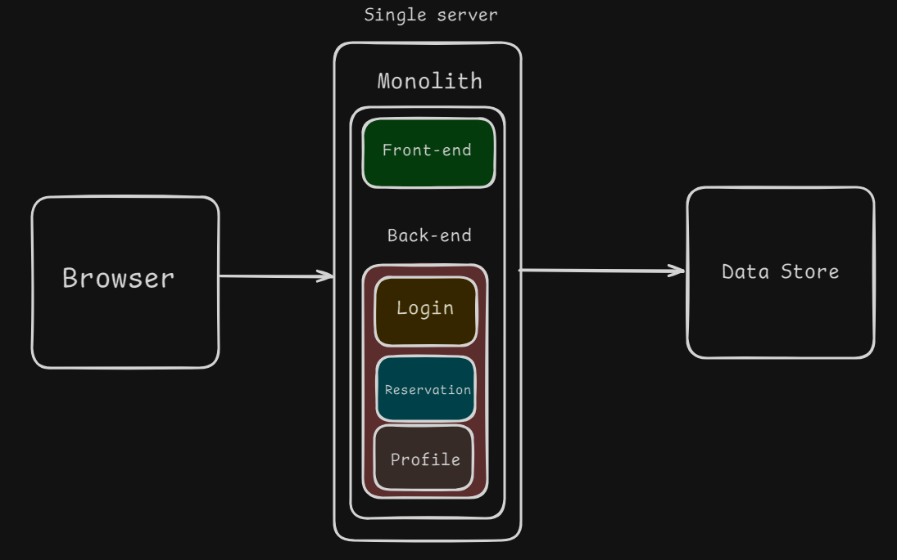

# Content of Software Monolithic Architecture

- [Monolithic Architecture](#monolithic-architecture)

Software architecture explains how an application is organized and how its parts work together.

Before learning different architecture styles, it helps to start with a simple idea from daily life. Imagine a small neighborhood restaurant. The kitchen, cashier, storage, and customer service are all inside one place and work as one complete unit. Everything is managed together. This makes the restaurant easier to run at the beginning, but if it becomes very large, the whole system can become harder to manage.

A software application can be built in a similar way. One common approach is called monolithic architecture.

## Monolithic Architecture

Monolithic architecture is a way of building software as one complete application. All main parts of the system exist inside the same codebase and are deployed together as a single unit.

This means that features such as user **management**, **logic**, **database access** and the **user interface** are all part of one application instead of being separated into smaller independent services.

This approach is often easier for beginners to understand because everything is kept in one place.

A developer can **run the application**, **test it** and **deploy it** as one unit. In small projects, this makes development faster and more straightforward.

The idea is similar to the restaurant example. When the business is small, having everything in one place is practical. The staff can communicate quickly, the work is easier to organize, and there is less complexity. In the same way, a monolithic application can work well when the project is still small or medium in size.

At the same time, this structure can become harder to manage as the application grows. Since all parts are connected, a change in one area can affect other parts of the system. **Updating**, **testing** or **deploying one feature** may require working with the whole application.

Because everything runs together, communication between parts is usually fast, because the application does not need to send requests over a network between internal components.

Monolithic architecture is therefore often a good starting point for smaller systems, learning projects and applications that need a simple **development** and **deployment** process. Its advantages are easier setup and centralized development, while its limitations become more visible as the system becomes larger.
