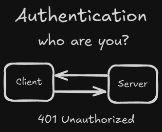
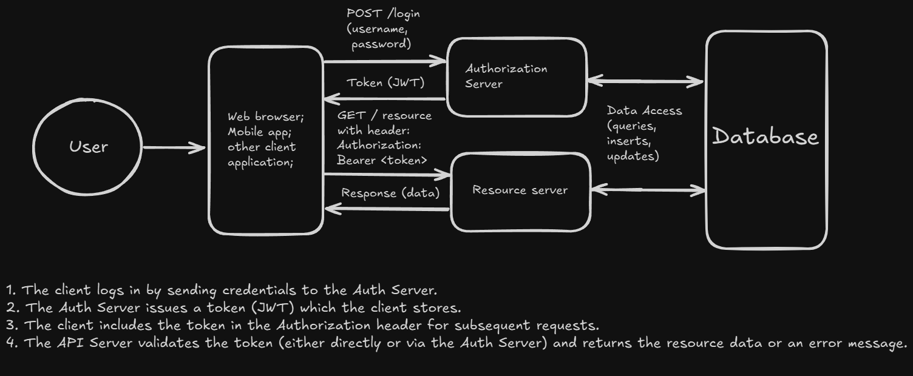

<!-- markdownlint-disable MD033 -->
# Table of Contents: Authentication Methods

- [Token Based Auth](#token-based-auth)

**Explanation:**

Authentication methods are techniques used to verify the identity of users or systems attempting to access protected resources.

## Token Based Auth

**Explanation:**

Token-based authentication is a method where the client authenticates by providing a token—typically a secure string such as a JSON Web Token (JWT) after initial verification of credentials. Subsequent requests include the token in the header, allowing the server to verify the client's identity without needing to resend credentials.

    
Overview:

- **How It Works:**
    

- **Common Token Types:**
  - **JSON Web Tokens (JWTs):** A self-contained token that includes encoded data (claims) about the user. It is signed using a secret or public/private key pair, making it possible to verify the token's authenticity.

    

       
Overview:

    1. **Header (Encoded):** Contains metadata about the token such as the algorithm (`alg`) used for signing and the token type (`typ`, typically "JWT").

    2. **Payload (Encoded):** Contains the claims, which are statements about an entity (typically, the user) and additional data.
        - This data is also encoded in Base64 and might include claims like user ID (`sub`), name, issued-at time (`iat`), expiration time (`exp`).

    3. **Signature:** The signature is created by taking the encoded header and payload, concatenating them with a dot, and then signing this string using a cryptographic algorithm.
        - **For symmetric algorithms (HS256):**
            - A **secret** (shared by the issuer and the verifier) is used for both signing and verifying the token.
            - **Example:** A secret like `"your-secret"` (often Base64-encoded) is used.
        - **For asymmetric algorithms (RS256):** **private key** is used to sign the token, and a corresponding **public key** is used to verify it.
            - **Private Key:** Kept secret by the token issuer; used to generate the signature.
            - **Public Key:** Distributed openly so that any party can verify the token's authenticity without access to the private key.

    4. **Claim Checking:** The server may also check claims (`exp` for expiration) to determine if the token is still valid.

    

