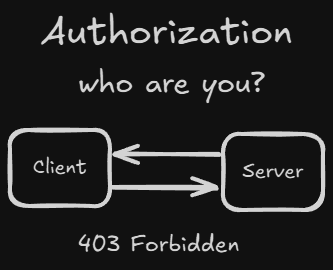

<!-- markdownlint-disable MD033 -->
# Table of Contents: Authorization Methods

- [Role Based Access Control (RBAC)](#role-based-access-control-rbac)
- [Attribute Based Access Control (ABAC)](#attribute-based-access-control-abac)

**Explanation:**

Authorization methods define the rules and policies that determine what actions an authenticated user is allowed to perform within a system. While authentication verifies a user's identity, authorization ensures that the user can only access resources or perform operations according to defined permissions.

## Role Based Access Control (RBAC)

**Explanation:**

RBAC is an authorization method where access rights are assigned to roles rather than directly to individual users. Users are then associated with one or more roles, which determine their permissions within the system.

    
Overview:

- **Role Definition:** Roles represent a set of permissions that correspond to specific job functions or responsibilities.
  - **Examples:** "Admin", "Editor", "Viewer".

- **User Assignment:** Users are assigned to one or more roles, inheriting the permissions associated with those roles.

- **Permission Allocation:** Roles determine what actions and resources users can access.

## Attribute Based Access Control (ABAC)

**Explanation:**

ABAC is a more dynamic authorization method where access decisions are made based on attributes (characteristics) of the user, resource, action, and environment. Instead of fixed roles, policies evaluate these attributes to determine if access should be granted.

    
Overview:

- **Attributes:** These can include user attributes (department, clearance level), resource metadata (type, owner), action types (read, write), and environmental conditions (time of day, location).

- **Policy-Based Control:** Access is granted or denied by evaluating policies that use these attributes.
  - **Examples:** A policy might allow access to sensitive files only if the user’s clearance level is "high" and the request is made during business hours.

