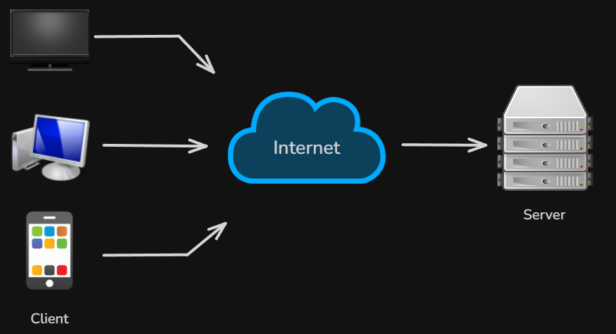
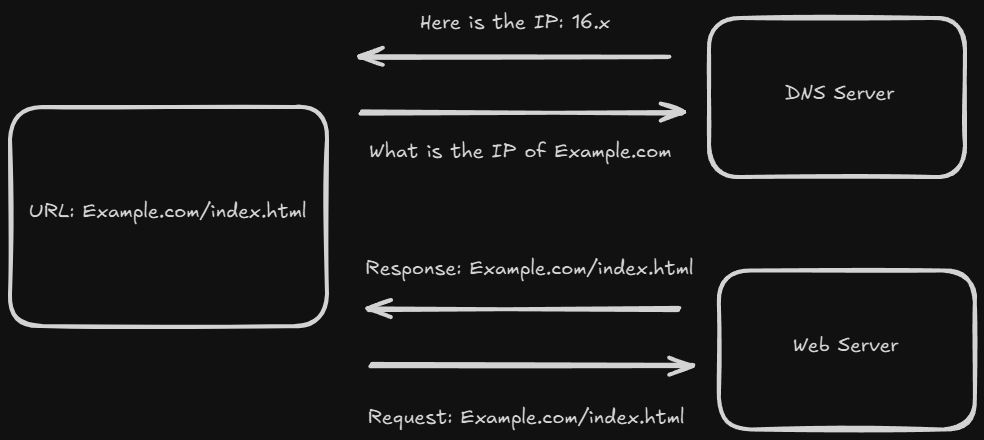
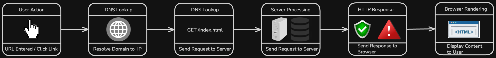
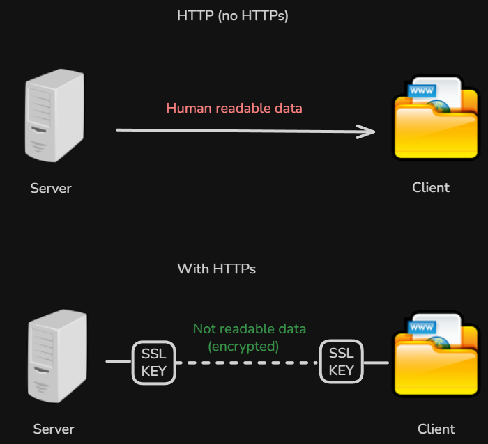

# Content of Basic Web

- [Client-Server model](#client-server-model)
- [DNS](#dns)
- [Request-Response lifecycle](#request-response-lifecycle)
- [URL structure (path and query parameters)](#url-structure-path-and-query-parameters)
- [HTTP protocol](#http-protocol)
- [HTTPS](#https)
- [Same-Origin concept](#same-origin-concept)

Web applications rely on communication between different systems.

When you open a website, your browser needs to request data and another system needs to respond with the requested information.

This interaction happens constantly, even for simple actions such as loading a page, submitting a form or clicking a button.

To understand how the web works, it is important to understand how these systems communicate with each other.

You can think of the web as a system where one side asks for information and another side provides it.

This communication follows a structured model that defines how requests are made and how responses are returned.

This model is called the **Client–Server model**.

## Client-Server model

The **Client–Server model** describes how communication happens between two main parts of a web application.

A **client** is the system that makes a request, most commonly a web browser used by the user. A **server** is the system that receives the request, processes it and returns a response.



When a user interacts with a website, the browser sends a request to the server asking for specific data or resources. The server processes that request and sends back a response, which the browser then displays to the user.

You can think of this interaction like ordering food in a restaurant. The client is the customer placing an order and the server is the kitchen preparing the food. The customer makes a request, the kitchen processes it and the result is returned.

This model is used for all web communication, such as loading a webpage, submitting a form or fetching data from an API. In each case, the client initiates a request and the server responds with the appropriate data.

It is important to understand that the client and server are separate systems. The client does not have direct access to the server’s internal data or logic. Instead, all communication happens through defined requests and responses.

This separation allows web applications to scale, maintain security and handle multiple users at the same time.

Now that we understand how clients and servers interact, the next step is to understand how the browser knows where to send a request.

To do this, we first look at how domain names are resolved into IP addresses using DNS.

## DNS

**DNS (Domain Name System)** is a system that translates human-readable domain names (like "example.com") into IP addresses that computers use to identify each other on the network.

When a user enters a URL in the browser, the browser cannot directly use the domain name to send a request. Instead, it must first find the corresponding IP address.

This process is called **DNS resolution**.

You can think of DNS like a phone book.

Instead of remembering phone numbers, you look up a name and get the number you need. In the same way, DNS allows users to work with easy to remember domain names while computers use IP addresses behind the scenes.



The DNS resolution process happens in several steps.

The browser first checks if the IP address is already known, either from cache or the operating system.

If not, it sends a request to a DNS server, which looks up the domain and returns the corresponding IP address.

Once the IP address is resolved, the browser can send the request to the correct server.

This process happens quickly and is usually invisible to the user.

Understanding DNS is important, because every request on the web depends on it before any communication with a server can begin.

Now that we know how domain names are resolved, we can look at how a request is sent and processed using the request–response lifecycle.

## Request-Response lifecycle

The **request–response lifecycle** describes the sequence of steps that happen when a user interacts with a website.

Every time you open a page, click a link or submit a form, this process takes place behind the scenes.



It begins when the user performs an action, such as entering a URL in the browser.

The browser first needs to determine where to send the request. It does this by resolving the domain name into an IP address using DNS.

Once the address is known, the browser sends an HTTP request to the server.

This request contains information about what the client is asking for, such as the resource path, method and headers.

The server receives the request, processes it and prepares a response.

This may involve retrieving data from a database, executing application logic or generating content.

After processing, the server sends back an HTTP response.

The response includes a status code, headers and often a body containing the requested data.

The browser receives the response and uses it to update the page.

For example, it may render HTML, apply styles and execute JavaScript to display the content to the user.

You can think of this process as a full cycle.

A request is sent, a response is returned and the result is shown to the user.

This cycle happens continuously as users interact with a web application.

Understanding this lifecycle is important, because all web communication is built on top of it.

Before a request is sent, the browser needs to define exactly what resource is being requested and how it should be handled.

This information is defined by the structure of the URL.

## URL structure (path and query parameters)

A **URL (Uniform Resource Locator)** is the address used to access resources on the web.

When the browser sends a request, the URL defines **where the request should go** and **what resource should be returned**.

A URL is made up of several components.

```text
{protocol}://{domain}:{port}/{path}?{query}
```

The protocol defines how the request is sent, such as `http` or `https`. The domain identifies the server and it is resolved into an IP address using DNS. The port is optional and specifies the communication endpoint, with default values used when it is not provided.

The path represents the resource being requested. It often reflects how data is structured on the server.

```text
/users/123/posts
```

In this example, users represents a collection of data, `123` identifies a specific item and `posts` refers to related data connected to that item. This structure allows the server to understand exactly which resource is being requested.

A URL can also include query parameters. These appear after the `?` and are used to modify how the request is processed.

While both path parameters and query parameters are part of the URL, they are used for different purposes.

The following examples show how these two types of parameters are used in practice.


You can think of the URL as a structured instruction. The path defines what resource is requested, while query parameters describe how the result should be adjusted.

Understanding URL structure is important, because it defines how requests are formed and how servers interpret them.

Now that we understand how a request is structured, we can look at how it is sent and handled using the HTTP protocol.

## HTTP protocol

**HTTP (Hypertext Transfer Protocol)** is the protocol used for communication between a client and a server on the web.

When a browser sends a request, it uses HTTP to define how that request is structured and how the server should respond.

HTTP follows the request–response model.

The client sends a request to the server and the server returns a response containing the result.

An important characteristic of HTTP is that it is **stateless**.

This means each request is independent and the server does not automatically remember previous interactions.

To perform different actions, HTTP uses methods.

A request can retrieve data, send new data, update existing data or remove resources depending on the method used.

For example, a request can ask for data using `GET`, send data using `POST`, update data using `PUT` or `PATCH` or remove data using `DELETE`.

When the server responds, it includes a **status code** that indicates the result of the request.

This tells the client whether the request was successful, failed or requires further action.

To better understand how these status codes are used, it helps to see how they are grouped and what they represent in real scenarios.

The following examples show common status codes and how they indicate different outcomes of a request.


HTTP messages also include **headers**, which provide additional information about the request or response.

Headers can describe the type of data being sent, how it should be handled or include metadata such as authentication or caching instructions.

Over time, HTTP has evolved to improve performance and efficiency.

Newer versions allow multiple requests to be handled more efficiently and reduce delays in communication.

Understanding HTTP is essential, because it defines how data is exchanged between the browser and the server in every web application.

Now that we understand how communication is structured, we can look at how it is secured using HTTPS.

## HTTPS

**HTTPS (Hypertext Transfer Protocol Secure)** is a secure version of HTTP.

It uses encryption to protect data that is sent between the client and the server.

When a request is made over HTTP, the data is sent in plain text. This means it can be intercepted or read by others on the network.

HTTPS prevents this by encrypting the communication.

This ensures that even if the data is intercepted, it cannot be easily understood.



You can think of this as sending a message.

With HTTP, the message is visible to anyone who can see it. With HTTPS, the message is locked, and only the intended receiver can read it.

HTTPS uses a protocol called **TLS (Transport Layer Security)** to provide this encryption.

TLS is responsible for securing the connection between the client and the server. It ensures that data is encrypted before being sent and decrypted only by the intended receiver.

You can think of TLS as a layer that sits between HTTP and the network, protecting the data while it is being transmitted.

TLS is the modern version of an older protocol called **SSL (Secure Sockets Layer)**, which is no longer used but is still commonly mentioned.

In addition to encryption, HTTPS also helps verify the identity of the server.

This means the client can be confident that it is communicating with the correct server and not an attacker.

You can recognize HTTPS by the `https` protocol in the URL and the lock icon in the browser.

Using HTTPS is essential for modern web applications, especially when handling sensitive data such as authentication, personal information, or payments.

Now that we understand how communication can be secured, we can look at how browsers apply rules when interacting with different origins.

## Same-Origin concept

The **Same-Origin concept** is a rule used by browsers to control how web pages interact with each other.

An **origin** represents where a resource comes from. It is defined by three parts the protocol, domain and port.

For two URLs to have the same origin, all three parts must match exactly.

For example, `https://example.com` and `https://example.com` share the same origin, while differences in protocol, domain, or port make them different.

This distinction is important, because browsers apply restrictions when a web application tries to interact with resources from a different origin.

You can think of origin as an identity.

Resources that share the same identity can interact freely, while resources from different identities are treated as separate.

These restrictions exist to protect users.

Without them, a malicious website could interact with another site on behalf of the user and potentially access sensitive data.

The Same-Origin concept forms the foundation of many browser security mechanisms.

It defines when interactions are considered safe and when additional checks are required.

One of the most important mechanisms built on top of this concept is CORS, which allows controlled access between different origins.

Now that we understand how browsers distinguish between origins, we can explore how these rules are applied and controlled using CORS.
