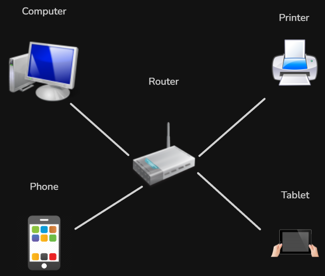
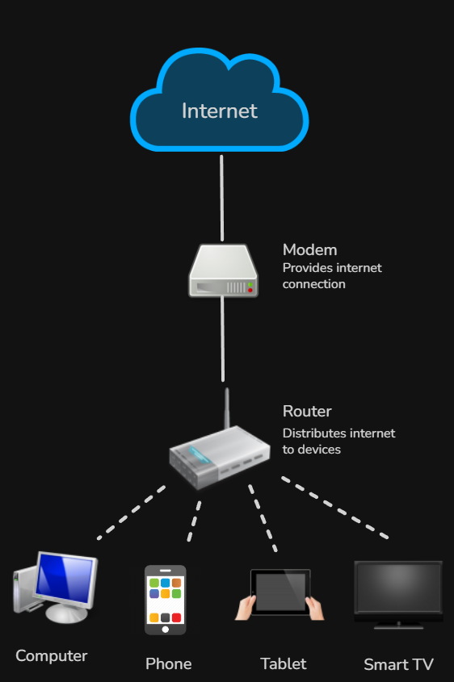
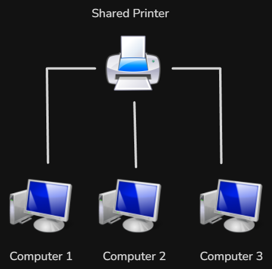
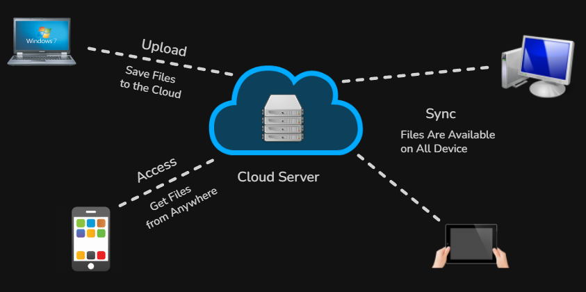
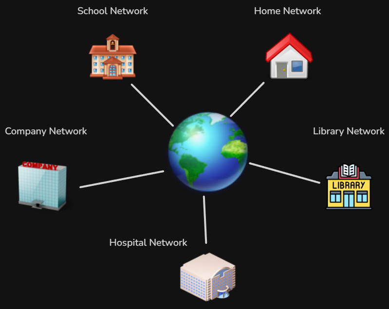
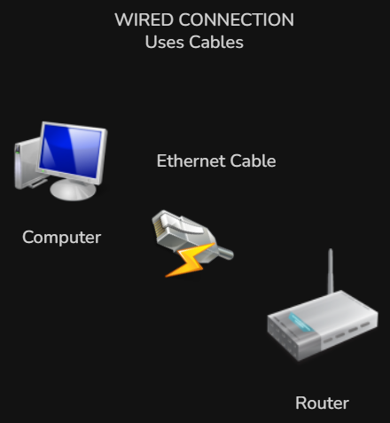
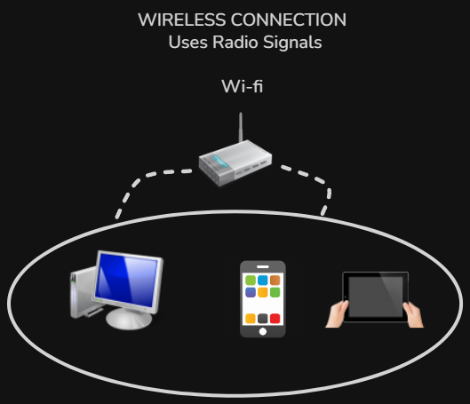
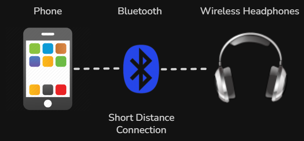

# Kompiuterių tinklai 1 lygis - turinys

- [Kas yra kompiuterių tinklas](#kas-yra-kompiuterių-tinklas)
- [Tinklo nauda ir paskirtis](#tinklo-nauda-ir-paskirtis)
- [Interneto sąvoka](#interneto-sąvoka)
- [Tinklų tipai (LAN ir WAN)](#tinklų-tipai-lan-ir-wan)
- [Kompiuterių jungimo būdai](#kompiuterių-jungimo-būdai)

Kompiuterių tinklai šiandien yra viena svarbiausių skaitmeninio pasaulio dalių. Nors dažnai tinklais naudojamės to net nepastebėdami, būtent jie leidžia įrenginiams bendrauti tarpusavyje, keistis duomenimis ir pasiekti įvairias interneto paslaugas.

Kai atidaromas interneto puslapis, išsiunčiama žinutė, žaidžiamas internetinis žaidimas ar prisijungiama prie bendro mokyklos tinklo, visais šiais atvejais veikia kompiuterių tinklai (*computer networks*).

Ši tema padeda suprasti ne tik tai, kas yra tinklas, bet ir kodėl jis reikalingas, kuo skiriasi skirtingi tinklų tipai, kaip įrenginiai jungiami tarpusavyje ir kaip visa tai susiję su internetu (*Internet*).

Pirmame lygyje svarbiausia susikurti tvirtą pagrindą. Pirmiausia reikia suprasti pačią tinklo sąvoką, nes nuo jos prasideda visos kitos temos. Kai tampa aišku, kas yra kompiuterių tinklas, daug lengviau suprasti, kaip veikia internetas, kuo skiriasi lokalūs ir išoriniai tinklai ir kokiais būdais įrenginiai gali būti sujungiami.

Todėl pirmasis žingsnis yra išsiaiškinti patį pagrindą.

## Kas yra kompiuterių tinklas

Kompiuterių tinklas tai tarpusavyje sujungtų įrenginių sistema, leidžianti jiems keistis duomenimis ir dalintis ištekliais.

Angliškai kompiuterių tinklas vadinamas *computer network*.

Paprasčiau tariant, tinklas atsiranda tada, kai du ar daugiau įrenginių yra sujungiami taip, kad gali perduoti informaciją vieni kitiems. Tokiais įrenginiais gali būti ne tik kompiuteriai, bet ir telefonai, planšetės, serveriai (*servers*), spausdintuvai, televizoriai ar net išmanieji įrenginiai.

Pagrindinė tinklo idėja yra labai paprasta. Vietoje to, kad kiekvienas įrenginys veiktų atskirai, jie gali būti sujungiami į bendrą sistemą, kurioje informacija juda iš vieno įrenginio į kitą.

Pavyzdžiui, jei kompiuteris yra prijungtas prie maršrutizatoriaus (*router*) ir per jį pasiekia internetą, jis jau yra tinklo dalis. Jeigu tame pačiame tinkle yra ir telefonas, spausdintuvas bei kitas kompiuteris, visi šie įrenginiai priklauso tam pačiam tinklui.

Svarbu suprasti, kad tinklas nėra tik fizinis sujungimas. Tinklas taip pat apima taisykles, pagal kurias įrenginiai bendrauja. Šios taisyklės vadinamos **protokolais** (*protocols*).

Tinklas leidžia ne tik perduoti failus ar žinutes, bet ir naudotis bendrais ištekliais. Pavyzdžiui, keli įrenginiai gali naudoti tą patį spausdintuvą arba tą patį interneto ryšį.

Kad būtų lengviau įsivaizduoti, kompiuterių tinklą galima palyginti su kelių sistema. Įrenginiai yra tarsi miestai, o duomenys juda tarp jų kaip transportas.

Kasdienybėje tinklus naudojame nuolat. Prisijungimas prie *Wi-Fi*, el. laiškų siuntimas, vaizdo įrašų žiūrėjimas ar žaidimai internete visi šie veiksmai vyksta naudojant tinklą.

Trumpai galima įsiminti taip **tinklas** tai sujungti įrenginiai jie **keičiasi duomenimis**  ir **dalinasi ištekliais**  

Kompiuterių tinklas yra pagrindas, leidžiantis visiems įrenginiams veikti kaip vienai sistemai.

Kai jau aiški tinklo sąvoka, galima geriau suprasti, kodėl tinklai yra tokie svarbūs praktikoje. Todėl toliau nagrinėjama tinklo nauda ir paskirtis.

## Tinklo nauda ir paskirtis

Kompiuterių tinklai yra sukurti tam, kad įrenginiai galėtų ne tik egzistuoti atskirai, bet ir bendradarbiauti tarpusavyje. Pagrindinė tinklo paskirtis yra užtikrinti efektyvų duomenų perdavimą ir bendrą išteklių naudojimą.

Angliškai tinklo nauda dažnai apibūdinama kaip *resource sharing* (išteklių dalijimasis) ir *communication* (bendravimas).

Vienas svarbiausių tinklų privalumų yra galimybė **dalintis informacija**. Įrenginiai gali siųsti ir gauti failus, dokumentus, nuotraukas ar kitus duomenis. Tai leidžia žmonėms bendradarbiauti realiu laiku, net jei jie yra skirtingose vietose.

Pavyzdžiui, mokiniai gali dirbti su tuo pačiu dokumentu naudodami debesų paslaugas (*cloud services*), o įmonėse darbuotojai gali greitai dalintis informacija per vidinius tinklus.

Kita svarbi paskirtis yra **bendrų įrenginių naudojimas**. Tinkle esantys įrenginiai gali naudotis tais pačiais resursais, tokiais kaip spausdintuvai, serveriai (*servers*) ar interneto ryšys.

Tinklai taip pat leidžia **bendrauti**. Per tinklus veikia el. paštas, žinučių siuntimo programos, vaizdo skambučiai ir socialiniai tinklai.

Dar viena svarbi paskirtis yra **prieiga prie informacijos**. Per tinklus galima pasiekti internetą (*Internet*), kuriame saugoma didelė informacijos dalis nuo mokymosi medžiagos iki pramogų turinio.

Tinklai taip pat naudojami **duomenų saugojimui ir valdymui**. Dažnai duomenys laikomi serveriuose (*servers*), todėl juos galima pasiekti iš skirtingų įrenginių.

Galima sakyti, kad tinklai leidžia įrenginiams veikti kaip vienai sistemai, o ne atskiriems vienetams. Dėl to darbas tampa greitesnis, patogesnis ir efektyvesnis.

Trumpai apibendrinant, pagrindinė tinklų nauda **leidžia keistis duomenimis**, **suteikia galimybę naudotis bendrais ištekliais**, **užtikrina bendravimą**, **suteikia prieigą prie interneto ir informacijos**.

Kai jau aišku, kokią naudą suteikia tinklai, natūraliai kyla klausimas, kaip visa tai susiję su internetu. Todėl toliau nagrinėjama interneto sąvoka.

## Interneto sąvoka

Internetas yra didžiausias pasaulyje kompiuterių tinklas, jungiantis milijonus mažesnių tinklų į vieną bendrą sistemą.

Angliškai internetas vadinamas *Internet*.

Svarbu suprasti, kad internetas nėra vienas konkretus įrenginys ar serveris. Tai daugybė tarpusavyje sujungtų tinklų, kurie bendrauja naudodami bendras taisykles, vadinamas **protokolais** (*protocols*).

Paprasčiau tariant, internetą galima įsivaizduoti kaip **tinklų tinklą** (*network of networks*). Kiekviena mokykla, įmonė ar namų tinklas yra mažesnė dalis, kuri prisijungia prie šios globalios sistemos.

Kai vartotojas atidaro interneto puslapį, jo įrenginys išsiunčia užklausą per tinklą. Ši užklausa pasiekia serverį (*server*), kuriame yra saugomas puslapis. Serveris atsako, o naršyklė (*browser*) atvaizduoja gautą informaciją.

Internetas leidžia naudotis įvairiomis paslaugomis. Galima naršyti svetaines (*web browsing*), siųsti el. laiškus (*email*), žiūrėti vaizdo įrašus (*streaming*), bendrauti realiu laiku (*messaging, video calls*).

Svarbu atskirti internetą nuo kompiuterių tinklo.

Kompiuterių tinklas (*network*) yra bet kokia sujungtų įrenginių sistema. Internetas (*Internet*) yra visų tinklų visuma pasauliniu mastu.

Internetas veikia todėl, kad visi įrenginiai laikosi tų pačių taisyklių. Viena svarbiausių yra **TCP IP protokolų rinkinys** (*TCP/IP protocol suite*), kuris nusako, kaip perduodami duomenys.

Kasdienybėje internetas naudojamas mokymuisi, darbui, pramogoms ir bendravimui. Dėl to jis tapo neatsiejama šiuolaikinio gyvenimo dalimi.

Trumpai galima įsiminti taip **internetas** yra tinklų tinklas jis jungia **daugybę tinklų** visame pasaulyje ir veikia naudojant **protokolus**  tai leidžia naudotis įvairiomis paslaugomis  

Kai jau aišku, kas yra internetas, galima pereiti prie tinklų tipų ir jų skirtumų.

## Tinklų tipai (LAN ir WAN)

Kompiuterių tinklai gali būti skirstomi pagal jų dydį ir veikimo teritoriją. Dažniausiai išskiriami du pagrindiniai tipai, tai **lokalieji tinklai** ir **išoriniai tinklai**.

Angliškai šie tinklai vadinami *LAN Local Area Network* ir *WAN Wide Area Network*.

**Lokalus tinklas LAN** yra tinklas, kuris veikia nedidelėje teritorijoje. Tai gali būti namai, mokykla, biuras ar vienas pastatas. Tokiuose tinkluose įrenginiai yra arti vienas kito ir dažniausiai sujungti per maršrutizatorių (*router*) arba komutatorių (*switch*).

Pavyzdžiui, kai namuose telefonas, kompiuteris ir televizorius yra prijungti prie to paties *Wi-Fi* tinklo, jie visi priklauso tam pačiam lokaliam tinklui.

**LAN** tinklai pasižymi **dideliu greičiu** ir **patikimumu**, nes duomenys keliauja trumpais atstumais ir tinklas yra valdomas vienoje vietoje.

**Išorinis tinklas WAN** apima daug didesnę teritoriją. Jis gali jungti miestus, šalis ar net visą pasaulį. WAN tinklai sujungia daug mažesnių tinklų į vieną didelę sistemą.

Geriausias WAN pavyzdys yra **internetas** (*Internet*). Jis jungia daugybę lokalių tinklų visame pasaulyje.

**WAN** tinkluose duomenys keliauja per **didelius atstumus**, todėl dažnai naudojami įvairūs ryšio kanalai, tokie kaip optiniai kabeliai, mobilusis ryšys ar palydovinis ryšys.

Pagrindinis skirtumas tarp **LAN** ir **WAN** yra jų **dydis** ir **veikimo teritorija**. LAN yra mažas ir lokalus, o WAN yra didelis ir globalus.

Taip pat skiriasi ir valdymas. **LAN** tinklą dažniausiai valdo viena organizacija ar žmogus, o **WAN** tinklai yra sudėtingesni ir dažnai priklauso kelioms organizacijoms.

Trumpai galima įsiminti taip

- **LAN** tai mažas vietinis tinklas skirtas ribotai teritorijai  
- **WAN** tai didelis tinklas jungiantis daug mažesnių tinklų

Kai jau aišku, kokie yra tinklų tipai, galima pereiti prie to, kaip įrenginiai yra sujungiami tarpusavyje ir kokiais būdais vyksta ryšys.

## Kompiuterių jungimo būdai

Kompiuteriai ir kiti įrenginiai tinkle gali būti sujungiami skirtingais būdais. Pagrindiniai jungimo būdai yra laidinis ryšys ir belaidis ryšys.

Angliškai tai vadinama *wired connection* ir *wireless connection*.

**Laidinis ryšys** (*wired connection*) reiškia, kad įrenginiai yra sujungiami naudojant fizinius kabelius. Dažniausiai naudojamas Ethernet kabelis (*Ethernet cable*), kuris jungia kompiuterį su maršrutizatoriumi (*router*) arba komutatoriumi (*switch*).

Laidinis ryšys pasižymi **didesniu greičiu** ir **stabilesniu veikimu**, nes duomenys perduodami tiesiogiai kabeliu ir yra mažiau trikdžių.

Pavyzdžiui, stacionarus kompiuteris prijungtas kabeliu prie maršrutizatoriaus dažniausiai turės patikimesnį interneto ryšį nei belaidis įrenginys.

**Belaidis ryšys** (*wireless connection*) leidžia įrenginiams jungtis prie tinklo be laidų. Dažniausiai naudojamos technologijos yra *Wi-Fi* ir *Bluetooth*.

*Wi-Fi* naudojamas prisijungti prie interneto ar lokalaus tinklo be kabelio. Tai labai patogu, nes leidžia judėti ir naudotis įrenginiais bet kurioje tinklo veikimo zonoje.

*Bluetooth* dažniausiai naudojamas trumpiems atstumams tarp įrenginių, pavyzdžiui, prijungti ausines, klaviatūrą ar kitus priedus.

Belaidis ryšys yra labai patogus, tačiau jis gali būti **lėtesnis** ir **mažiau stabilus** nei laidinis ryšys, nes signalą gali veikti įvairūs trikdžiai, tokie kaip sienos ar kiti elektroniniai įrenginiai.

Pagrindinis skirtumas tarp šių jungimo būdų yra tas, kad laidinis ryšys naudoja fizinį kabelį, o belaidis ryšys perduoda duomenis per orą naudojant radijo signalus.

Trumpai galima įsiminti taip

- **Laidinis ryšys** yra greitesnis ir stabilesnis  
- **Belaidis ryšys** yra patogesnis ir lankstesnis

Kai jau aišku, kaip įrenginiai sujungiami tarpusavyje, galima pereiti prie to, kokia įranga naudojama tinkluose ir kokias funkcijas ji atlieka.
