# Kompiuterių tinklai 2 lygis - turinys

- [Tinklo įranga](#tinklo-įranga)
- [Interneto prieiga](#interneto-prieiga)
- [TCP/IP protokolas](#tcpip-protokolas)
- [IP adresai](#ip-adresai)
- [IP adresų tipai](#ip-adresų-tipai)
- [MAC adresas](#mac-adresas)
- [NAT](#nat)

Pirmajame lygyje buvo aptarta, kas yra kompiuterių tinklai, kokia jų nauda, kuo skiriasi skirtingi tinklų tipai ir kaip įrenginiai gali būti sujungiami. Tai sudaro pagrindą suprasti bendrą tinklų veikimo idėją.

Tačiau vien suprasti sąvokas neužtenka. Kad tinklas realiai veiktų, reikalingi konkretūs įrenginiai, kurie užtikrina duomenų perdavimą, ryšį tarp įrenginių ir prieigą prie interneto.

Antrame lygyje dėmesys skiriamas tam, kaip tinklai veikia iš vidaus. Čia svarbu suprasti, kokie įrenginiai naudojami, kaip perduodami duomenys ir kaip kiekvienas įrenginys yra identifikuojamas tinkle.

Galima sakyti, kad šiame etape pereinama nuo bendro supratimo prie techninio veikimo principų.

Pirmasis žingsnis yra susipažinti su tinklo įranga, nes būtent ji leidžia įrenginiams susijungti ir komunikuoti tarpusavyje.

## Tinklo įranga

Kad kompiuterių tinklas galėtų veikti, neužtenka vien sujungti įrenginius laidais ar belaidžiu ryšiu. Reikalinga speciali įranga, kuri užtikrina duomenų perdavimą, valdo srautą ir leidžia įrenginiams rasti vienas kitą.

Angliškai tinklo įranga vadinama *network devices*.

Pagrindiniai tinklo įrenginiai yra **modemas**, **šakotuvas**, **komutatorius** ir **maršrutizatorius**.

**Modemas** (*modem*) yra įrenginys, kuris leidžia prisijungti prie interneto. Jis paverčia signalą iš interneto tiekėjo į tokį, kurį gali suprasti kompiuteriai ir kiti įrenginiai.

Be modemo namų tinklas negalėtų pasiekti interneto.

**Šakotuvas** (*hub*) yra paprastas įrenginys, kuris sujungia kelis įrenginius į vieną tinklą. Jis perduoda gautus duomenis visiems prijungtiems įrenginiams, nesvarbu, kuriam iš jų tie duomenys yra skirti.

Dėl to šakotuvas nėra labai efektyvus ir šiandien naudojamas retai.

**Komutatorius** (*switch*) taip pat sujungia įrenginius tinkle, tačiau veikia išmaniau. Jis siunčia duomenis tik tam įrenginiui, kuriam jie yra skirti.

Dėl to **switch** yra greitesnis ir efektyvesnis nei **hub**, todėl dažniausiai naudojamas šiuolaikiniuose tinkluose.

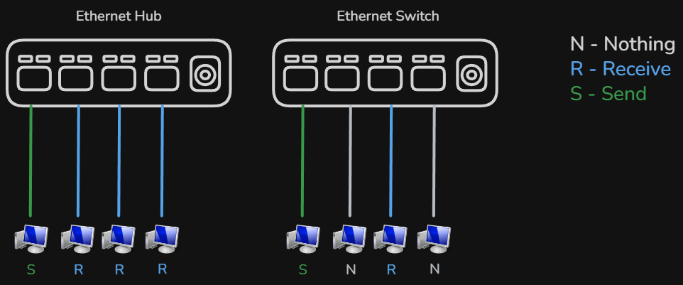

**Maršrutizatorius** (*router*) yra vienas svarbiausių tinklo įrenginių. Jis sujungia skirtingus tinklus ir nukreipia duomenis tarp jų.

Pavyzdžiui, namuose maršrutizatorius sujungia lokalų tinklą su internetu. Jis taip pat dažnai suteikia *Wi-Fi* ryšį, todėl leidžia įrenginiams jungtis be laidų.

Maršrutizatorius taip pat gali paskirstyti IP adresus įrenginiams ir valdyti tinklo srautą.

Pagrindinis skirtumas tarp šių įrenginių yra jų funkcijos

- **modemas** suteikia prieigą prie interneto  
- **hub** perduoda duomenis visiems įrenginiams  
- **switch** siunčia duomenis tik konkrečiam įrenginiui  
- **router** sujungia skirtingus tinklus ir nukreipia duomenis  

Šie įrenginiai kartu sudaro tinklo pagrindą ir leidžia visiems prijungtiems įrenginiams bendrauti tarpusavyje.

Kai jau aišku, kokia įranga naudojama tinkluose, galima pereiti prie to, kaip iš tikrųjų vyksta prisijungimas prie interneto ir kokie būdai tam naudojami.

## Interneto prieiga

Kad įrenginiai galėtų naudotis internetu, jie turi būti prijungti prie išorinio tinklo per specialias ryšio priemones. Šis procesas vadinamas interneto prieiga.

Angliškai tai vadinama *Internet access*.

Interneto prieiga vyksta per interneto tiekėją (*Internet Service Provider*, ISP), kuris suteikia ryšį tarp vartotojo tinklo ir pasaulinio interneto.

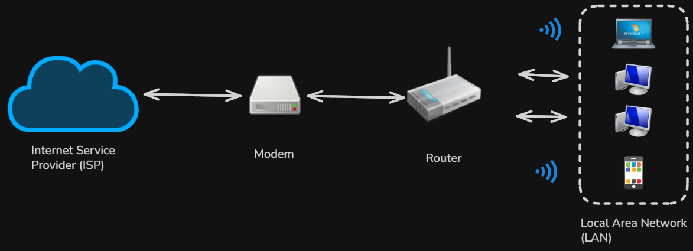

Namų ar mokyklos tinkle įrenginiai dažniausiai jungiasi prie maršrutizatoriaus (*router*), kuris paskirsto interneto ryšį visiems prijungtiems įrenginiams. Maršrutizatorius savo ruožtu yra prijungtas prie modemo (*modem*), kuris užtikrina ryšį su interneto tiekėju.

Yra keli pagrindiniai interneto prieigos būdai.

Laidinis internetas dažniausiai perduodamas per optinius kabelius arba varinius kabelius. Toks ryšys pasižymi dideliu greičiu ir stabilumu, todėl dažnai naudojamas namuose ir įmonėse.

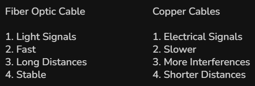

Belaidis internetas leidžia prisijungti prie tinklo be laidų. Dažniausiai naudojamas *Wi-Fi*, kuris leidžia įrenginiams jungtis prie maršrutizatoriaus per radijo signalus.

Taip pat egzistuoja mobilusis internetas (*mobile internet*), kuris veikia per mobiliojo ryšio tinklus. Jis naudojamas telefonuose ir kituose nešiojamuose įrenginiuose, kai nėra prieigos prie *Wi-Fi*.

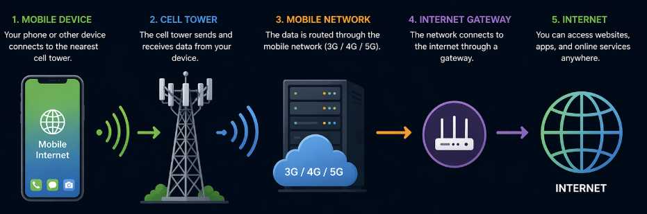

Kai kuriais atvejais naudojamas ir palydovinis internetas (*satellite internet*), ypač ten, kur nėra kitų ryšio galimybių.

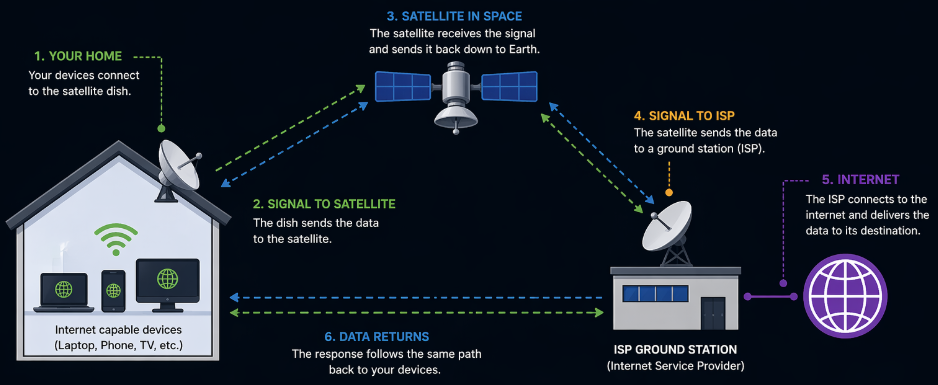

Pagrindinis skirtumas tarp šių būdų yra greitis, stabilumas ir prieinamumas. Laidinis ryšys dažniausiai yra greičiausias ir patikimiausias, o belaidis suteikia daugiau lankstumo.

Trumpai galima įsiminti taip

- interneto tiekėjas (*ISP*) suteikia prieigą prie interneto  
- modemas sujungia tinklą su tiekėju  
- maršrutizatorius paskirsto internetą įrenginiams  
- *Wi-Fi* leidžia jungtis be laidų  

Interneto prieiga yra būtina, kad tinklas galėtų pasiekti išorinius resursus ir naudotis interneto paslaugomis.

Kai jau aišku, kaip įrenginiai prisijungia prie interneto, galima pereiti prie to, kaip duomenys yra perduodami tinkle ir kokios taisyklės tai apibrėžia.

## TCP/IP protokolas

Kad įrenginiai tinkle galėtų bendrauti tarpusavyje, neužtenka vien fizinio sujungimo. Reikalingos taisyklės, kurios nusako, kaip duomenys turi būti siunčiami, priimami ir suprantami. Šios taisyklės vadinamos protokolais (*protocols*).

Vienas svarbiausių protokolų rinkinių yra **TCP IP** (*TCP/IP protocol suite*). Jis sudaro pagrindą visam interneto veikimui.

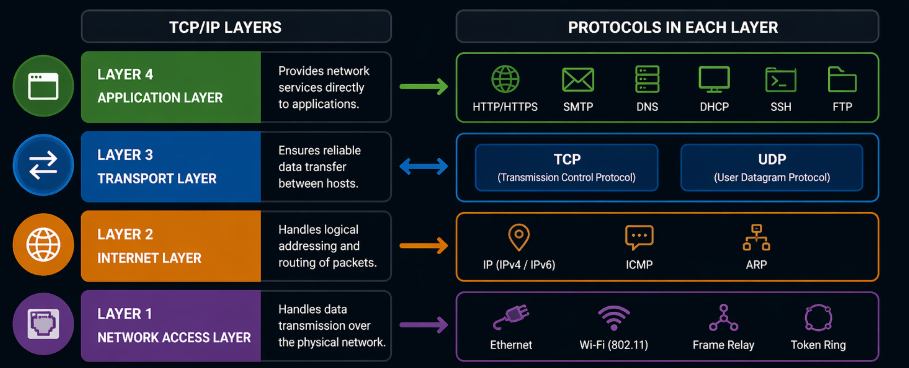

**Application layer (programų sluoksnis)** yra aukščiausias sluoksnis. Jis tiesiogiai bendrauja su vartotojo programomis. Čia veikia tokie protokolai kaip *HTTP/HTTPS*, *SMTP*, *DNS*, *FTP*, *SSH*. Šis sluoksnis leidžia naudotis interneto paslaugomis.

**Transport layer (transporto sluoksnis)** atsakingas už duomenų perdavimą tarp įrenginių. Jis užtikrina, kad duomenys būtų perduoti teisingai ir tinkama tvarka. Pagrindiniai protokolai yra **TCP** (*Transmission Control Protocol*) ir **UDP** (*User Datagram Protocol*).

**Internet layer (interneto sluoksnis)** atsakingas už duomenų nukreipimą tinkle. Jis nustato, kur duomenys turi būti siunčiami, naudodamas IP adresus. Čia veikia tokie protokolai kaip *IP (IPv4 / IPv6)*, *ICMP* ir *ARP*.

**Network access layer (tinklo prieigos sluoksnis)** atsakingas už fizinį duomenų perdavimą. Jis apima technologijas kaip *Ethernet* ir *Wi-Fi*, kurios leidžia perduoti duomenis per tinklą.

Pavadinimas TCP IP sudarytas iš dviejų pagrindinių dalių

**TCP** (*Transmission Control Protocol*) užtikrina patikimą duomenų perdavimą. Jis garantuoja, kad visi paketai bus gauti ir teisinga tvarka.

**IP** (*Internet Protocol*) nustato, kur duomenys turi būti siunčiami, naudodamas IP adresus.

Duomenys tinkle nėra siunčiami kaip vienas didelis failas. Jie suskaidomi į mažesnes dalis, vadinamas paketais (*packets*).

Kiekvienas paketas keliauja per tinklą atskirai. Skirtingi paketai gali keliauti skirtingais maršrutais, tačiau galutiniame taške jie vėl surenkami į vieną visumą.

Šį procesą galima palyginti su siuntiniu siuntimu. Didelis krovinys padalinamas į mažesnes dėžes, kurios siunčiamos atskirai, o gavėjas jas surenka į vieną.

**IP** rūpinasi, kad paketai pasiektų teisingą adresą, o **TCP** užtikrina, kad visi paketai būtų gauti ir sudėti teisinga tvarka.

Jeigu kuris nors paketas dingsta, TCP gali paprašyti jį išsiųsti dar kartą. Tai užtikrina patikimą duomenų perdavimą.

TCP IP veikia visuose interneto ryšiuose. Kai atidaromas puslapis, siunčiamas el. laiškas ar žiūrimas vaizdo įrašas, duomenys visada perduodami naudojant šį protokolų rinkinį.

Trumpai galima įsiminti taip

- **TCP** užtikrina patikimą duomenų perdavimą  
- **IP** nustato, kur duomenys turi būti siunčiami  
- duomenys perduodami paketais (*packets*)  

TCP IP leidžia skirtingiems įrenginiams suprasti vienas kitą ir sėkmingai keistis informacija.

Kai jau aišku, kaip duomenys keliauja tinkle, svarbu suprasti, kaip įrenginiai yra atpažįstami. Todėl toliau nagrinėjama IP adreso sąvoka.

## IP adresai

Kad įrenginiai tinkle galėtų rasti vienas kitą, kiekvienas jų turi turėti unikalų identifikatorių. Šis identifikatorius vadinamas IP adresu.

Angliškai tai vadinama *IP address*.

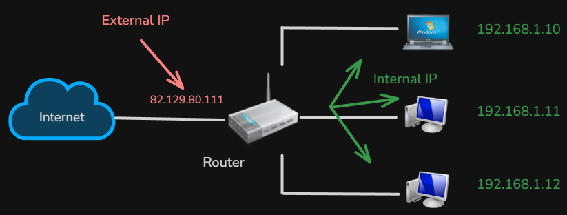

IP adresas yra skaičių rinkinys, kuris priskiriamas kiekvienam įrenginiui tinkle. Jis leidžia tiksliai nustatyti, iš kur siunčiami duomenys ir kur jie turi būti pristatyti.

Dažniausiai naudojamas `IPv4` adresas (*IPv4 address*), kuris sudarytas iš keturių skaičių, atskirtų taškais.

Pavyzdys `192.168.1.1`

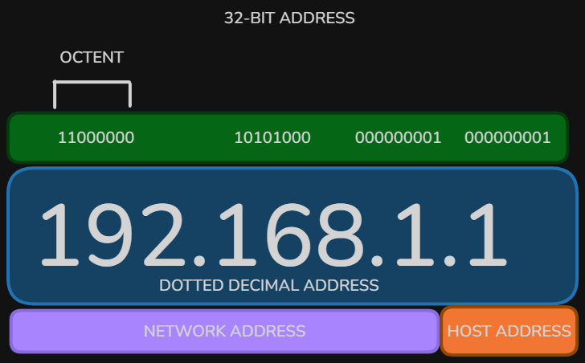

Šis adresas iš tikrųjų nėra tik paprasti skaičiai. Jis sudarytas iš **32 bitų** (*32-bit address*).

Bitas (*bit*) yra mažiausias informacijos vienetas, kuris gali turėti reikšmę `0` arba `1`.

Šie 32 bitai yra suskirstyti į 4 dalis po 8 bitus. Kiekviena tokia dalis vadinama **oktetu** (*octet*).

Kiekviena šio adreso dalis gali turėti reikšmę nuo `0` iki `255`.

Tai vadinama **dotted decimal format**.

Taip pat IP adresas dažnai yra padalintas į dvi dalis **network address** nurodo tinklą ir **host address** nurodo konkretų įrenginį tame tinkle

IP adresą galima palyginti su namų adresu. Kaip paštininkas naudoja adresą, kad pristatytų laišką, taip tinklas naudoja IP adresą, kad pristatytų duomenis tinkamam įrenginiui.

Kai įrenginys siunčia duomenis, prie kiekvieno paketo (*packet*) pridedamas siuntėjo ir gavėjo IP adresas. Tai leidžia tinklui nukreipti informaciją teisingu keliu.

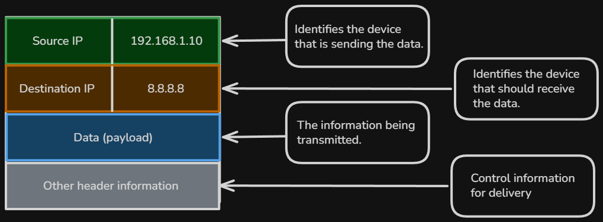

Taip pat egzistuoja naujesnė IP adresų versija, vadinama `IPv6` (*IPv6 address*).

Skirtingai nei IPv4, IPv6 adresas yra daug ilgesnis ir sudarytas iš skaičių bei raidžių, atskirtų dvitaškiais.

Pavyzdys  
`2001:0db8:85a3:0000:0000:8a2e:0370:7334`

IPv6 buvo sukurtas todėl, kad IPv4 adresų skaičius yra ribotas. Naujoji versija leidžia sukurti daug daugiau unikalių adresų.

Kasdienybėje vis dar dažniausiai naudojamas IPv4, tačiau IPv6 palaipsniui tampa vis svarbesnis.

IP adresai gali būti priskiriami automatiškai arba rankiniu būdu. Dažniausiai tai atlieka maršrutizatorius (*router*), naudodamas specialų mechanizmą, vadinamą *DHCP Dynamic Host Configuration Protocol*.

DHCP automatiškai paskirsto IP adresus visiems įrenginiams tinkle, todėl vartotojui nereikia jų nustatyti rankiniu būdu.

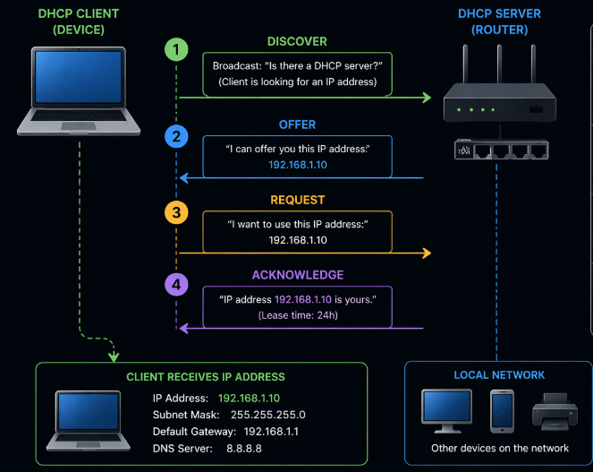

Svarbu suprasti, kad IP adresai gali būti skirtingų tipų, priklausomai nuo jų paskirties ir naudojimo būdo. Tai bus nagrinėjama kitoje temoje.

Trumpai galima įsiminti taip **IP adresas** yra unikalus įrenginio identifikatorius tinkle jis leidžia siųsti ir gauti duomenis ir dažniausiai naudojamas formatas yra *IPv4*, bei IP adresai gali būti priskiriami automatiškai naudojant *DHCP*  

IP adresai yra būtini visam tinklo veikimui, nes be jų įrenginiai negalėtų rasti vienas kito.

Kai jau aišku, kas yra IP adresas, galima pereiti prie skirtingų IP adresų tipų ir jų paskirties.

## IP adresų tipai

IP adresai gali būti skirstomi pagal skirtingus kriterijus. Dažniausiai jie skirstomi pagal jų matomumą tinkle ir pagal priskyrimo būdą.

Angliškai dažnai naudojami terminai *public IP*, *private IP*, *static IP* ir *dynamic IP*.

**Vidinis IP adresas** (*private IP*) yra naudojamas lokaliame tinkle. Tokie adresai priskiriami įrenginiams namuose, mokykloje ar biure ir nėra matomi internete.

Pavyzdžiui, adresas `192.168.1.1` yra vidinio tinklo adresas. Tokius adresus gali turėti daugybė skirtingų tinklų visame pasaulyje.

**Išorinis IP adresas** (*public IP*) yra matomas internete. Jis priskiriamas visam tinklui ir naudojamas bendraujant su kitais tinklais.

Kai prisijungiama prie interneto, būtent šis adresas naudojamas komunikacijai su serveriais (*servers*).

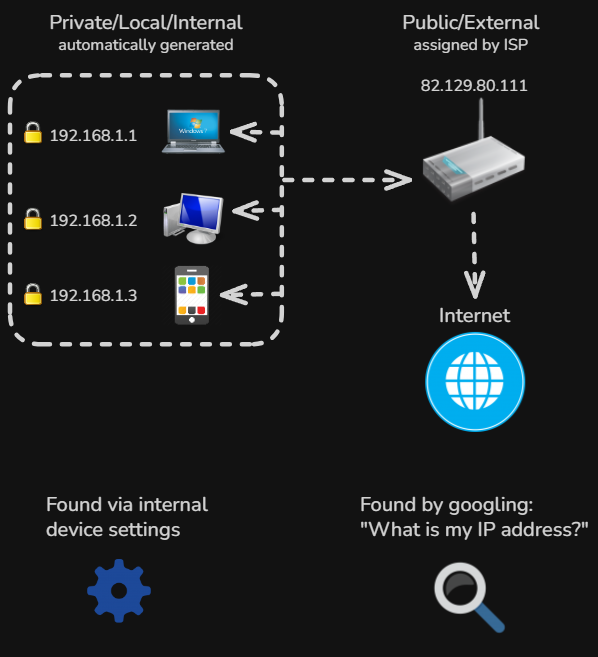

Kitas svarbus skirstymas yra pagal tai, kaip IP adresas yra priskiriamas.

**Statinis IP adresas** (*static IP*) yra nekintantis. Jis visada išlieka toks pats ir dažniausiai naudojamas serveriuose arba situacijose, kur reikalingas pastovus adresas.

**Dinaminis IP adresas** (*dynamic IP*) keičiasi laikui bėgant. Jį automatiškai priskiria *DHCP* (*Dynamic Host Configuration Protocol*).

Dinaminiai adresai leidžia efektyviau naudoti IP adresų skaičių, nes jie gali būti paskirstomi skirtingiems įrenginiams skirtingu metu.

Svarbu suprasti šiuos skirtumus

- **private IP** naudojamas vidiniame tinkle  
- **public IP** naudojamas internete  
- **static IP** yra pastovus  
- **dynamic IP** keičiasi automatiškai  

Šie tipai dažnai naudojami kartu. Pavyzdžiui, namų tinkle įrenginiai turi **private IP**, o visas tinklas turi vieną **public IP**, per kurį jungiasi prie interneto.

Papildomai verta žinoti, kad IP adresai dažnai skirstomi į tam tikrus intervalus. Vidiniai adresai dažniausiai priklauso tokiems intervalams kaip

- `192.168.x.x` iki `192.168.255.255`
- `10.x.x.x` iki `10.255.255.255`
- `172.16.x.x` iki `172.31.255.255`

Šie intervalai yra rezervuoti tik vidiniams tinklams ir nėra naudojami internete.

IP adresų tipai padeda efektyviai organizuoti tinklus ir užtikrina, kad įrenginiai galėtų tinkamai bendrauti tiek lokaliai, tiek globaliai.

Tačiau praktikoje dažnai susiduriama su situacija, kai daugybė įrenginių vidiniame tinkle turi savo IP adresus, bet į internetą jungiasi naudodami vieną bendrą išorinį adresą.

Tam, kad tai būtų įmanoma, naudojamas specialus mechanizmas, vadinamas NAT (*Network Address Translation*).

## NAT

Kadangi daug įrenginių viename tinkle naudoja vidinius IP adresus (*private IP*), tačiau į internetą jungiasi per vieną išorinį adresą, reikalingas mechanizmas, kuris tai leidžia padaryti. Šis mechanizmas vadinamas NAT (*Network Address Translation*).

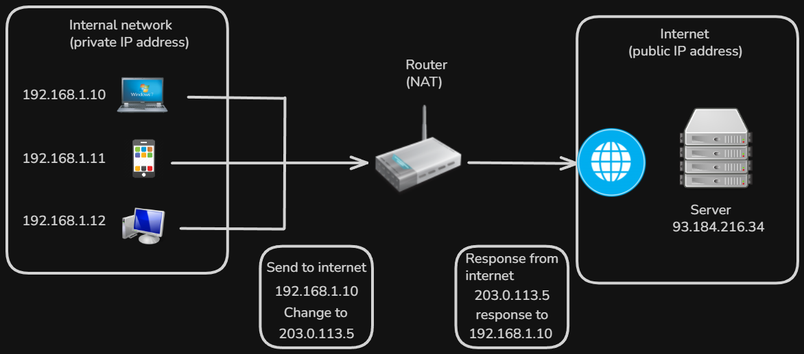

NAT yra funkcija, kurią atlieka maršrutizatorius (*router*). Jis pakeičia vidinį IP adresą į išorinį, kai duomenys siunčiami į internetą, ir atvirkščiai – grąžina atsakymą tinkamam įrenginiui.

Kai įrenginys siunčia duomenis į internetą, jis naudoja savo **private IP**. Maršrutizatorius šį adresą pakeičia į **public IP**, kuris yra matomas internete.

Kai serveris atsako, atsakymas grįžta į maršrutizatoriaus **public IP**, o maršrutizatorius žino, kuriam įrenginiui priklauso šis atsakymas, ir perduoda jį teisingam gavėjui.

NAT leidžia daugeliui įrenginių naudoti vieną bendrą išorinį adresą. Tai padeda taupyti IP adresus ir leidžia efektyviai naudoti tinklą.

Taip pat NAT padidina saugumą, nes vidiniai IP adresai nėra tiesiogiai matomi internete.

Trumpai galima įsiminti taip **NAT** pakeičia **private IP** į **public IP** ir leidžia įrenginiams pasiekti internetą naudojant vieną bendrą adresą  

NAT yra svarbi tinklo dalis, nes be jo dauguma tinklų negalėtų tinkamai veikti internete.

Kai jau aišku, kaip veikia NAT, galima pereiti prie to, kaip įrenginiai yra identifikuojami dar žemesniame lygyje naudojant MAC adresus.

## MAC adresas

Be IP adreso, kiekvienas tinklo įrenginys turi dar vieną unikalų identifikatorių, vadinamą MAC adresu.

Angliškai tai vadinama *MAC address* (*Media Access Control address*).

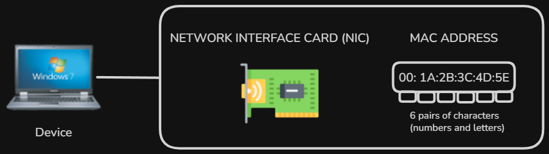

MAC adresas yra fizinis įrenginio adresas, kuris yra priskirtas tinklo plokštei (*network interface card*) gamykloje. Skirtingai nei IP adresas, jis paprastai nesikeičia.

MAC adresas sudarytas iš šešių porų simbolių, kurie gali būti skaičiai ir raidės.

Pavyzdys `00:1A:2B:3C:4D:5E`

Kiekvienas MAC adresas yra unikalus, todėl jis leidžia tiksliai identifikuoti konkretų įrenginį tinkle.

IP adresas naudojamas tam, kad duomenys pasiektų tinkamą tinklą, o MAC adresas naudojamas tam, kad duomenys pasiektų konkretų įrenginį tame tinkle.

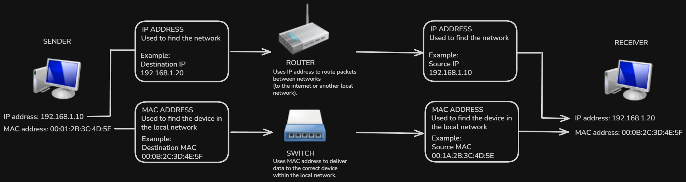

Kai duomenys pasiekia lokalų tinklą, maršrutizatorius ar komutatorius naudoja MAC adresus, kad perduotų informaciją tinkamam įrenginiui.

MAC adresai dažniausiai naudojami vidiniame tinkle ir nėra naudojami tiesiogiai internete.

Trumpai galima įsiminti taip **IP adresas** nurodo, kur siųsti duomenis tinkle, o **MAC adresas** nurodo, kuriam konkrečiam įrenginiui juos perduoti  

MAC adresas yra svarbi tinklo dalis, nes leidžia įrenginiams tiksliai atpažinti vienas kitą lokaliame tinkle.

Kai jau aišku, kaip įrenginiai identifikuojami tiek loginiu, tiek fiziniu lygiu, galima pereiti prie tinklo paslaugų ir protokolų, kurie leidžia naudotis internetu.
