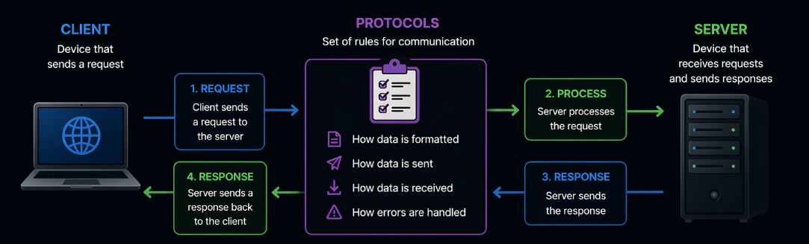
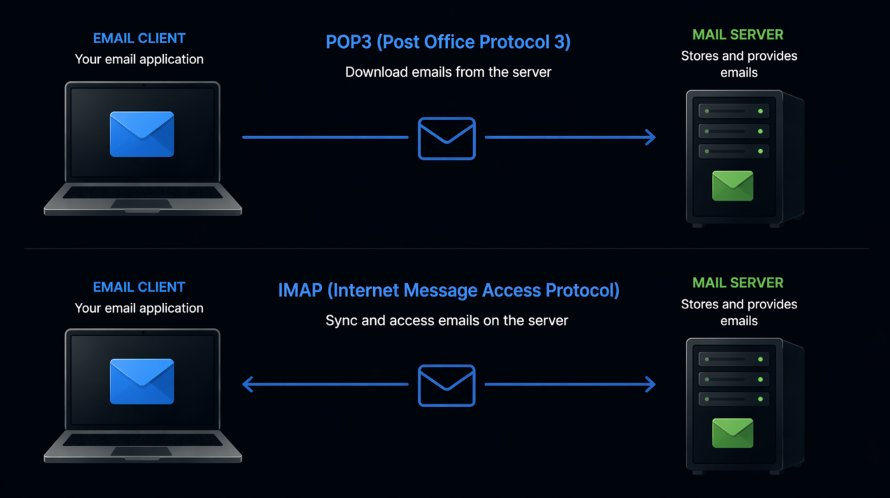
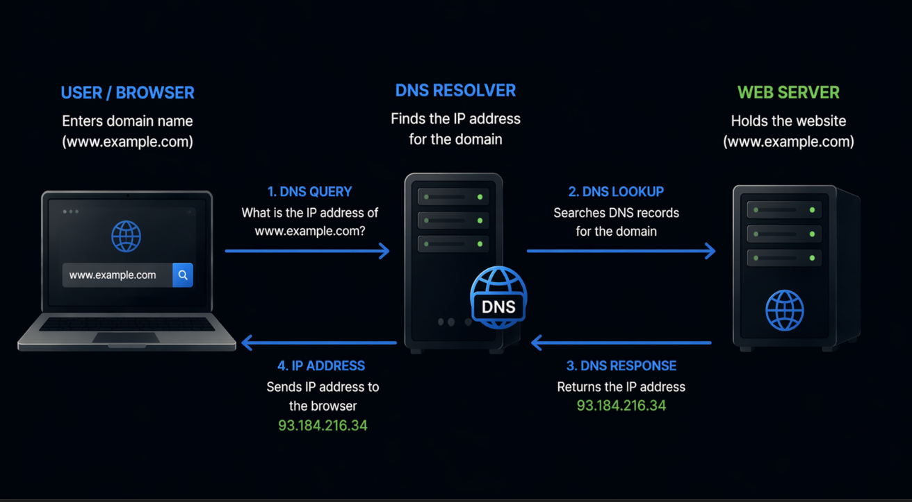
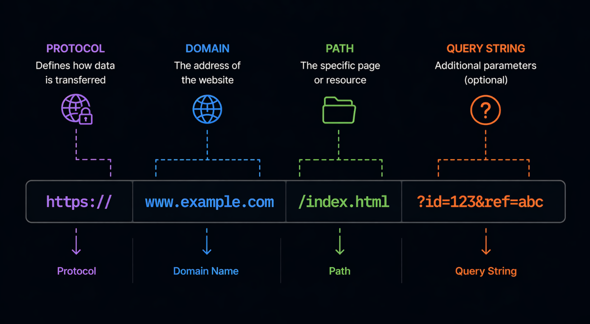
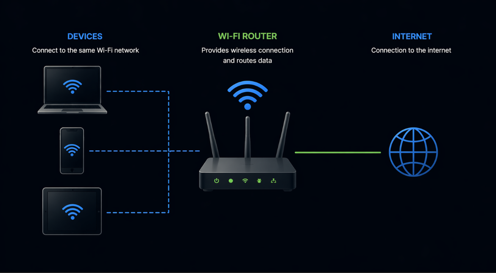
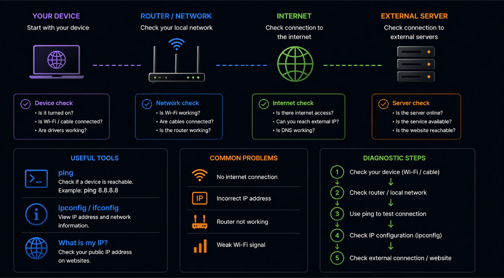

# Kompiuterių tinklai 3 lygis - turinys

- [Tinklo paslaugos ir protokolai](#tinklo-paslaugos-ir-protokolai)
- [Domenai ir URL](#domenai-ir-url)
- [Įrenginių sujungimas](#įrenginių-sujungimas)
- [Tinklo diagnostika](#tinklo-diagnostika)

Antrame lygyje buvo nagrinėjama, kaip tinklai veikia iš techninės pusės. Buvo aptarta tinklo įranga, interneto prieiga, TCP IP veikimo principai ir IP adresai. Tai leidžia suprasti, kaip įrenginiai susijungia ir kaip duomenys keliauja tinkle.

Tačiau vien suprasti duomenų perdavimą neužtenka. Svarbu suvokti, kokios paslaugos veikia tinkle ir kaip jos yra realizuojamos praktikoje.

Trečiame lygyje dėmesys skiriamas tam, kaip tinklai naudojami realiose situacijose. Čia nagrinėjama, kaip veikia interneto paslaugos, kaip susiejami domenai su adresais, kaip įrenginiai bendrauja tarpusavyje ir kaip galima diagnozuoti tinklo problemas.

Galima sakyti, kad šiame etape pereinama nuo techninio veikimo prie praktinio pritaikymo.

Pirmiausia svarbu suprasti tinklo paslaugas ir protokolus, nes būtent jie apibrėžia, kaip vyksta bendravimas tarp įrenginių ir kokios funkcijos yra prieinamos internete.

## Tinklo paslaugos ir protokolai

Kompiuterių tinklai naudojami ne tik duomenų perdavimui, bet ir įvairioms paslaugoms teikti. Šios paslaugos leidžia vartotojams naršyti internete, siųsti laiškus, atsisiųsti failus ar bendrauti realiu laiku.

Pavyzdžiui naršant svetaines (*WWW World Wide Web*) vartotojas pasiekia interneto puslapius kitas naudojant el. paštą galima siųsti ir gauti laiškus taip pat naudojant *FTP* galima siųsti ir atsisiųsti failus iš serverių.

Angliškai tinklo paslaugos vadinamos *network services*, o jų veikimą apibrėžia protokolai (*protocols*).

Protokolas yra taisyklių rinkinys, kuris nusako, kaip įrenginiai turi bendrauti tarpusavyje. Be protokolų skirtingi įrenginiai negalėtų suprasti vienas kito.



Kiekviena tinklo paslauga naudoja tam tikrą protokolą.

**HTTP** (*HyperText Transfer Protocol*) yra naudojamas naršyti interneto puslapius. Kai atidaromas puslapis naršyklėje (*browser*), duomenys siunčiami naudojant šį protokolą.

**HTTPS** (*HyperText Transfer Protocol Secure*) yra saugi HTTP versija. Ji užšifruoja duomenis, todėl informacija tampa apsaugota nuo pašalinių stebėjimo.


**FTP** (*File Transfer Protocol*) naudojamas failų siuntimui ir atsisiuntimui tarp kompiuterių.


**SMTP** (*Simple Mail Transfer Protocol*) naudojamas el. laiškų siuntimui.


**POP3** (*Post Office Protocol version 3*) ir **IMAP** (*Internet Message Access Protocol*) naudojami el. laiškų gavimui.



POP3 dažniausiai atsisiunčia laiškus į įrenginį, o IMAP leidžia juos peržiūrėti serveryje ir sinchronizuoti tarp kelių įrenginių.

Šie protokolai veikia kartu su TCP IP (*TCP/IP protocol suite*) ir užtikrina, kad skirtingos paslaugos galėtų veikti internete.

Svarbu suprasti, kad kiekvienas protokolas turi savo paskirtį ir naudojamas skirtingose situacijose.

Trumpai galima įsiminti taip

- **HTTP** ir **HTTPS** naudojami svetainėms  
- **FTP** naudojamas failams  
- **SMTP** naudojamas laiškų siuntimui  
- **POP3** ir **IMAP** naudojami laiškų gavimui  

Šie protokolai leidžia įgyvendinti įvairias tinklo paslaugas ir užtikrina sklandų informacijos perdavimą.

Kai jau aišku, kaip veikia tinklo paslaugos, svarbu suprasti, kaip vartotojai pasiekia konkrečius interneto puslapius. Todėl toliau nagrinėjama domenų ir URL sąvoka.

## Domenai ir URL

Kad vartotojai galėtų lengvai pasiekti interneto svetaines, naudojami domenai ir URL adresai. Jie leidžia surasti reikiamą informaciją internete nenaudojant sudėtingų IP adresų.

Angliškai domenas vadinamas *domain*, o URL adresas vadinamas *Uniform Resource Locator*.

**Domenas** yra žmogui suprantamas svetainės pavadinimas. Pavyzdžiui, `google.com` yra domenas.

Iš tikrųjų kiekviena svetainė turi IP adresą, tačiau jį įsiminti būtų sudėtinga. Todėl vietoje skaičių naudojami domenai.

Kai vartotojas įveda domeną naršyklėje (*browser*), vyksta procesas, kurio metu domenas paverčiamas į IP adresą. Tai atlieka sistema, vadinama *DNS Domain Name System*.

DNS veikia kaip „interneto telefonų knyga“. Ji suranda, koks IP adresas atitinka įvestą domeną, ir leidžia naršyklei susisiekti su serveriu (*server*).



Domenai taip pat turi savo struktūrą, kuri sudaryta iš kelių lygių.

Aukščiausio lygio domenas (*Top-Level Domain, TLD*) yra paskutinė domeno dalis, pavyzdžiui `.com`, `.org`, `.net`, `.lt`.

Antrojo lygio domenas yra pagrindinis domeno vardas, kurį pasirenka vartotojas, pavyzdžiui `google.com`, `example.lt`.

Trečiojo lygio domenas (subdomenas) yra papildoma dalis prieš domeną, pavyzdžiui `www.google.com` arba `mail.example.lt`.

Šie lygiai leidžia struktūruoti interneto adresus ir atskirti skirtingas svetainių dalis.

**URL adresas** (*URL*) yra pilnas kelias iki konkretaus resurso internete. Jis apima ne tik domeną, bet ir papildomą informaciją.

Pavyzdžiui, URL adresas gali atrodyti taip `https://www.example.com/index.html`



Šį adresą sudaro kelios dalys

- `https` tai protokolas (*protocol*), kuris nusako, kaip bus perduodami duomenys  
- `www.example.com` tai domenas  
- `/index.html` tai kelias iki konkretaus puslapio ar failo  

URL leidžia tiksliai nurodyti, kur yra konkretus turinys internete.

Svarbu suprasti skirtumą

- **domenas** yra svetainės pavadinimas  
- **URL** yra pilnas adresas iki konkretaus resurso  

Domenai ir URL leidžia patogiai naudotis internetu, nes vartotojui nereikia žinoti IP adresų.

Kai jau aišku, kaip pasiekiamos svetainės internete, galima pereiti prie to, kaip įrenginiai gali būti sujungiami ne tik per internetą, bet ir tiesiogiai tarpusavyje naudojant įvairias technologijas.

## Įrenginių sujungimas

Įrenginiai gali būti sujungiami ne tik per internetą, bet ir tiesiogiai tarpusavyje. Tai leidžia jiems keistis duomenimis, valdyti vienas kitą arba veikti kaip viena sistema.

Angliškai įrenginių sujungimas dažnai vadinamas *device connectivity*.

Vienas dažniausių būdų yra *Wi-Fi*, kuris leidžia įrenginiams prisijungti prie to paties tinklo ir bendrauti per maršrutizatorių (*router*).



Tačiau įrenginiai gali būti sujungiami ir tiesiogiai, be interneto.

**Bluetooth** yra technologija, leidžianti sujungti įrenginius trumpu atstumu. Ji dažnai naudojama prijungti ausines, klaviatūras, peles ar kitus priedus.


Bluetooth veikia nedideliu atstumu ir sunaudoja mažai energijos, todėl yra labai tinkamas nešiojamiems įrenginiams.

Kitas svarbus aspektas yra išmanieji įrenginiai, dar vadinami *IoT Internet of Things*. Tai įvairūs įrenginiai, kurie gali būti prijungti prie tinklo ir valdomi nuotoliniu būdu.


Pavyzdžiui, išmanūs televizoriai, lemputės ar apsaugos sistemos gali būti valdomos per telefoną ar kompiuterį.

Įrenginiai gali būti sujungiami keliais būdais

- per *Wi-Fi* naudojant bendrą tinklą  
- per *Bluetooth* tiesioginiam ryšiui  
- per internetą naudojant *IoT* sprendimus  

Svarbu suprasti, kad skirtingi sujungimo būdai naudojami skirtingose situacijose. Wi-Fi tinkamas platesniam ryšiui, Bluetooth trumpiems atstumams, o IoT leidžia valdyti įrenginius per internetą.

Įrenginių sujungimas leidžia kurti išmanias sistemas, kuriose įrenginiai veikia kartu ir automatizuoja kasdienes užduotis.

Kai jau aišku, kaip įrenginiai gali būti sujungiami, svarbu mokėti nustatyti ir spręsti tinklo problemas. Todėl toliau nagrinėjama tinklo diagnostika.

## Tinklo diagnostika

Net ir tinkamai sukonfigūruoti tinklai kartais susiduria su problemomis. Gali dingti interneto ryšys, sulėtėti duomenų perdavimas arba įrenginiai negali pasiekti vienas kito. Tokiais atvejais naudojama tinklo diagnostika.

Angliškai tai vadinama *network diagnostics*.



Tinklo diagnostika apima įvairius būdus ir įrankius, kurie padeda nustatyti problemos priežastį ir ją išspręsti.

Pirmiausia svarbu patikrinti pagrindinius dalykus. Ar įrenginys prijungtas prie tinklo, ar veikia *Wi-Fi*, ar tinkamai prijungti kabeliai. Dažnai problema būna labai paprasta.

Vienas dažniausiai naudojamų įrankių yra `ping`. Ši komanda leidžia patikrinti, ar įrenginys gali pasiekti kitą įrenginį tinkle.

Pavyzdžiui, naudojant komandą `ping 8.8.8.8` galima patikrinti, ar yra ryšys su išoriniu tinklu.

Šią komandą galima paleisti atsidarius `CMD` arba `PowerShell` ir įvedus

```powershell
ping 8.8.8.8
```

Komandos rezultatas

```powershell
Pinging google.com [142.251.38.110] with 32 bytes of data:
Reply from 142.251.38.110: bytes=32 time=75ms TTL=107
Reply from 142.251.38.110: bytes=32 time=80ms TTL=107
Reply from 142.251.38.110: bytes=32 time=85ms TTL=107
Reply from 142.251.38.110: bytes=32 time=101ms TTL=107

Ping statistics for 142.251.38.110:
    Packets: Sent = 4, Received = 4, Lost = 0 (0% loss),
Approximate round trip times in milli-seconds:
    Minimum = 75ms, Maximum = 101ms, Average = 85ms
```

Gauti rezultatai parodo, kaip vyksta ryšys su kitu įrenginiu. Kiekviena eilutė **Reply from reiškia**, kad paketas pasiekė tikslą ir buvo gautas atsakymas.

`bytes=32` nurodo siunčiamo paketo dydį, `time=108ms` parodo, per kiek laiko paketas nukeliavo iki serverio ir atgal, o `TTL=107` rodo, kiek dar paketui leidžiama keliauti tinkle prieš jam būnant sustabdytam.

Apačioje pateikiama papildoma informacija apie ryšį. **Sent** rodo, kiek paketų buvo išsiųsta, **Received** kiek jų buvo gauta, o **Lost** parodo, kiek paketų buvo prarasta. Jei praradimas yra `0%`, ryšys veikia stabiliai.

Paketai (*packet*) yra mažos duomenų dalys, kuriomis informacija siunčiama tinkle. Kiekvienas paketas turi siuntėjo ir gavėjo IP adresą, todėl gali būti nukreiptas į teisingą įrenginį.

**Minimum**, **Maximum** ir **Average** nurodo mažiausią, didžiausią ir vidutinį atsako laiką.

Jeigu rodomas atsakymas (`Reply from...`), tai reiškia, kad ryšys veikia.

Jeigu nerodomas atsakymas ir vietoje to pateikiamas **Request timed out**, tai reiškia, kad atsakymas nebuvo gautas ir gali būti ryšio problema.

Taip pat galima patikrinti domeną

```powershell
ping google.com
```

Jeigu ši komanda neveikia, gali būti DNS problema. Jeigu `ping 8.8.8.8` veikia, bet `ping google.com` neveikia, tai reiškia, kad yra DNS problema.

Jeigu atsakymas gaunamas, tai reiškia, kad ryšys veikia. Jei ne, gali būti ryšio problema.

Kitas naudingas įrankis yra `ipconfig`. Jis leidžia pamatyti įrenginio IP adresą ir kitą tinklo informaciją.

Šią informaciją galima peržiūrėti `CMD` aplinkoje įvedus

```cmd
ipconfig
```

Rezultatas

```cmd
Windows IP Configuration


Unknown adapter Local Area Connection:

   Media State . . . . . . . . . . . : Media disconnected
   Connection-specific DNS Suffix  . :

Ethernet adapter Ethernet:

   Media State . . . . . . . . . . . : Media disconnected
   Connection-specific DNS Suffix  . :

Ethernet adapter Ethernet 2:

   Media State . . . . . . . . . . . : Media disconnected
   Connection-specific DNS Suffix  . :

Ethernet adapter vEthernet (Default Switch):

   Connection-specific DNS Suffix  . :
   Link-local IPv6 Address . . . . . : fe80::xxxx:xxxx:xxxx:xxxx%38
   IPv4 Address. . . . . . . . . . . : 10.0.0.10
   Subnet Mask . . . . . . . . . . . : 255.255.240.0
   Default Gateway . . . . . . . . . :

Unknown adapter OpenVPN Connect DCO Adapter:

   Media State . . . . . . . . . . . : Media disconnected
   Connection-specific DNS Suffix  . :

Wireless LAN adapter Local Area Connection* 1:

   Media State . . . . . . . . . . . : Media disconnected
   Connection-specific DNS Suffix  . :

Wireless LAN adapter Local Area Connection* 2:

   Media State . . . . . . . . . . . : Media disconnected
   Connection-specific DNS Suffix  . :

Wireless LAN adapter Wi-Fi:

   Connection-specific DNS Suffix  . :
   Link-local IPv6 Address . . . . . : fe80::xxxx:xxxx:xxxx:xxxx%17
   IPv4 Address. . . . . . . . . . . : 192.168.1.10
   Subnet Mask . . . . . . . . . . . : 255.255.255.0
   Default Gateway . . . . . . . . . : 192.168.1.1
```

Rezultatas gali atrodyti skirtingai, tačiau informacija visada pateikiama pagal tinklo adapterius.

Kiekvienas blokas, pavyzdžiui **Ethernet adapter**, **Wireless LAN adapter Wi-Fi** ar **vEthernet**, nurodo skirtingą tinklo jungtį. Jei prie jos parašyta **Media disconnected**, tai reiškia, kad ta jungtis šiuo metu nenaudojama.

Svarbiausia informacija pateikiama prie aktyvaus adapterio, pavyzdžiui Wi-Fi. Aktyvus adapteris yra tas, kuris turi IP adresą ir nėra pažymėtas kaip **Media disconnected**.

Laukas **IPv4 Address** nurodo įrenginio adresą vietiniame tinkle, šiuo atveju `192.168.1.10`. Šis adresas leidžia kitiems įrenginiams tame pačiame tinkle rasti tavo kompiuterį.

**Subnet Mask** nurodo tinklo dydį ir padeda nustatyti, kurie įrenginiai priklauso tam pačiam tinklui.

**Default Gateway** nurodo maršrutizatorių, per kurį vyksta ryšys su internetu, šiuo atveju `192.168.1.1`.

Taip pat gali būti rodomas IPv6 adresas, kuris yra ilgesnis ir naudojamas naujesniuose tinkluose.

Ši informacija leidžia nustatyti, ar įrenginys turi teisingą IP adresą, ar yra prisijungęs prie tinklo ir ar gali pasiekti internetą.

arba `PowerShell` aplinkoje įvedus

```powershell
Get-NetIPAddress
```

Rezultatas

```powershell
IPAddress         : fe80::xxxx:xxxx:xxxx:xxxx%38
InterfaceIndex    : 38
InterfaceAlias    : vEthernet (Default Switch)
AddressFamily     : IPv6
Type              : Unicast
PrefixLength      : 64
PrefixOrigin      : WellKnown
SuffixOrigin      : Link
AddressState      : Preferred
ValidLifetime     :
PreferredLifetime :
SkipAsSource      : False
PolicyStore       : ActiveStore
```

Gauti rezultatai parodo įrenginio tinklo informaciją. Laukas **IPAddress** nurodo įrenginio adresą tinkle, šiuo atveju tai yra `IPv6` adresas. Šis adresas naudojamas tam, kad kiti įrenginiai galėtų rasti tavo kompiuterį tinkle.

**InterfaceAlias** parodo, per kurią tinklo sąsają vyksta ryšys, pavyzdžiui, per **Wi-Fi**, **Ethernet** ar **virtualų tinklą**. Tai leidžia suprasti, kuri jungtis šiuo metu naudojama.

**AddressFamily** nurodo, ar naudojamas `IPv4` ar `IPv6`. `IPv4` yra senesnis ir dažniausiai trumpesnis, o `IPv6` yra naujesnis ir ilgesnis adresų tipas.

Laukas **Type** parodo adreso tipą. `Unicast` reiškia, kad adresas priklauso vienam konkrečiam įrenginiui.

**PrefixLength=64** nurodo, kuri adreso dalis priklauso tinklui, o kuri konkrečiam įrenginiui. Tai padeda tinklui teisingai nukreipti duomenis.

**AddressState** parodo, ar adresas yra aktyvus ir gali būti naudojamas. `Preferred` reiškia, kad adresas yra galiojantis ir naudojamas ryšiui.

`192.168.x.x` yra privatus IP adresas, naudojamas vietiniame tinkle ir nėra matomas internete.

Ši informacija leidžia nustatyti, ar įrenginys turi galiojantį IP adresą ir ar yra tinkamai prijungtas prie tinklo.

Rezultatai gali skirtis, nes skirtingi įrankiai pateikia informaciją skirtingu formatu. `ipconfig` dažniausiai rodo paprastesnę informaciją apie aktyvų tinklo adapterį, o `PowerShell` komanda `Get-NetIPAddress` pateikia detalesnę informaciją, įskaitant visus adresus ir papildomus laukus.

Taip pat gali būti rodomi keli tinklo adapteriai, todėl vienoje vietoje gali būti matomas `IPv4` adresas, o kitoje `IPv6`. Tai yra normalu, nes įrenginys gali turėti kelis adresus skirtingiems tinklams ar jungtims.

Norint pamatyti, kaip duomenys keliauja iki serverio, galima naudoti komandą.

```powershell
tracert google.com
```

Komandos išvestis

```powershell
Tracing route to google.com [142.251.38.110]
over a maximum of 30 hops:

  1     4 ms     3 ms     4 ms  192.168.1.1
  2     *        *        *     Request timed out.
  3    67 ms    48 ms    62 ms  10.0.0.1
  4    40 ms    46 ms    54 ms  ISP router [203.0.113.10]
  5     *       39 ms    27 ms  203.0.113.11
  6   153 ms   101 ms   101 ms  203.0.113.12
  7     *       51 ms     *     ISP router [203.0.113.13]
  8    69 ms    51 ms    37 ms  ISP router [203.0.113.14]
  9    69 ms    65 ms    44 ms  ISP backbone [203.0.113.15]
 10    79 ms    65 ms    47 ms  ISP backbone [203.0.113.16]
 11    52 ms    48 ms    43 ms  ISP network [203.0.113.17]
 12    52 ms    57 ms    39 ms  ISP network [203.0.113.18]
 13    82 ms    44 ms    55 ms  ISP network [203.0.113.19]
 14    69 ms    40 ms    40 ms  ISP peer [203.0.113.20]
 15    62 ms   102 ms    63 ms  198.51.100.10
 16    93 ms    61 ms    58 ms  198.51.100.11
 17    62 ms    77 ms    65 ms  198.51.100.12
 18    75 ms    68 ms    68 ms  google.com [142.251.38.110]

Trace complete.
```

Gauti rezultatai parodo, kaip duomenys keliauja iki serverio. Kiekviena eilutė su numeriu rodo vieną tarpinių įrenginių etapą, per kurį keliauja duomenys. Tarpiniai įrenginiai yra **maršrutizatoriai**, kurie perduoda duomenis iš vieno tinklo į kitą, kol jie pasiekia galutinį serverį.

Kiekvienoje eilutėje pateikiami keli laikai, pavyzdžiui `4 ms`, `3 ms`, `4 ms`. Tai rodo, per kiek laiko signalas pasiekia tą įrenginį. Kuo šis laikas mažesnis, tuo ryšys greitesnis.

Pirmas įrašas dažniausiai yra tavo vietinis maršrutizatorius, pavyzdžiui `192.168.1.1`. Toliau rodomi interneto tiekėjo ir kitų tinklų įrenginiai, kol pasiekiamas galutinis serveris.

Jeigu vietoje laiko rodomas `*` ir pranešimas **Request timed out**, tai reiškia, kad tas įrenginys neatsakė. Tai nebūtinai yra klaida, nes kai kurie maršrutizatoriai neatsako į tokius užklausimus.

Paskutinė eilutė rodo galutinį serverį, šiuo atveju `google.com`, o užrašas **Trace complete** reiškia, kad kelias iki serverio buvo sėkmingai nustatytas.

Taip pat egzistuoja papildomi tinklo diagnostikos įrankiai, kurie leidžia dar detaliau analizuoti tinklo veikimą.

Vienas iš jų yra `ipconfig /all`. Ši komanda pateikia išsamią informaciją apie tinklo adapterius.

```cmd
ipconfig /all
```

Komandos rezultatas

```py
Windows IP Configuration

   Host Name . . . . . . . . . . . . : kompiuteris-01
   Primary Dns Suffix  . . . . . . . :
   Node Type . . . . . . . . . . . . : Hybrid
   IP Routing Enabled. . . . . . . . : No
   WINS Proxy Enabled. . . . . . . . : No

Unknown adapter Local Area Connection:

   Media State . . . . . . . . . . . : Media disconnected
   Connection-specific DNS Suffix  . :
   Description . . . . . . . . . . . : TAP-Windows Adapter V9 for OpenVPN Connect
   Physical Address. . . . . . . . . : XX-XX-XX-XX-XX-01
   DHCP Enabled. . . . . . . . . . . : No
   Autoconfiguration Enabled . . . . : Yes

Ethernet adapter Ethernet:

   Media State . . . . . . . . . . . : Media disconnected
   Connection-specific DNS Suffix  . :
   Description . . . . . . . . . . . : Realtek PCIe GbE Family Controller
   Physical Address. . . . . . . . . : XX-XX-XX-XX-XX-02
   DHCP Enabled. . . . . . . . . . . : Yes
   Autoconfiguration Enabled . . . . : Yes

Ethernet adapter vEthernet (Default Switch):

   Connection-specific DNS Suffix  . :
   Description . . . . . . . . . . . : Hyper-V Virtual Ethernet Adapter
   Physical Address. . . . . . . . . : XX-XX-XX-XX-XX-03
   DHCP Enabled. . . . . . . . . . . : No
   Autoconfiguration Enabled . . . . : Yes
   Link-local IPv6 Address . . . . . : fe80::xxxx:xxxx:xxxx:xxxx%38(Preferred)
   IPv4 Address. . . . . . . . . . . : 10.0.0.10(Preferred)
   Subnet Mask . . . . . . . . . . . : 255.255.240.0
   Default Gateway . . . . . . . . . :
   DHCPv6 IAID . . . . . . . . . . . : 000000000
   DHCPv6 Client DUID. . . . . . . . : XX-XX-XX-XX-XX-04
   NetBIOS over Tcpip. . . . . . . . : Enabled

Unknown adapter OpenVPN Connect DCO Adapter:

   Media State . . . . . . . . . . . : Media disconnected
   Connection-specific DNS Suffix  . :
   Description . . . . . . . . . . . : OpenVPN Data Channel Offload
   Physical Address. . . . . . . . . :
   DHCP Enabled. . . . . . . . . . . : Yes
   Autoconfiguration Enabled . . . . : Yes

Wireless LAN adapter Local Area Connection* 1:

   Media State . . . . . . . . . . . : Media disconnected
   Connection-specific DNS Suffix  . :
   Description . . . . . . . . . . . : Microsoft Wi-Fi Direct Virtual Adapter
   Physical Address. . . . . . . . . : XX-XX-XX-XX-XX-05
   DHCP Enabled. . . . . . . . . . . : Yes
   Autoconfiguration Enabled . . . . : Yes

Wireless LAN adapter Local Area Connection* 2:

   Media State . . . . . . . . . . . : Media disconnected
   Connection-specific DNS Suffix  . :
   Description . . . . . . . . . . . : Microsoft Wi-Fi Direct Virtual Adapter #2
   Physical Address. . . . . . . . . : XX-XX-XX-XX-XX-06
   DHCP Enabled. . . . . . . . . . . : No
   Autoconfiguration Enabled . . . . : Yes

Wireless LAN adapter Wi-Fi:

   Connection-specific DNS Suffix  . :
   Description . . . . . . . . . . . : MediaTek Wi-Fi 6 MT7921 Wireless LAN Card
   Physical Address. . . . . . . . . : XX-XX-XX-XX-XX-07
   DHCP Enabled. . . . . . . . . . . : Yes
   Autoconfiguration Enabled . . . . : Yes
   Link-local IPv6 Address . . . . . : fe80::xxxx:xxxx:xxxx:xxxx%17(Preferred)
   IPv4 Address. . . . . . . . . . . : 192.168.1.10(Preferred)
   Subnet Mask . . . . . . . . . . . : 255.255.255.0
   Lease Obtained. . . . . . . . . . : Monday, January 1, 2024 10:00:00 AM
   Lease Expires . . . . . . . . . . : Monday, January 1, 2024 12:00:00 PM
   Default Gateway . . . . . . . . . : 192.168.1.1
   DHCP Server . . . . . . . . . . . : 192.168.1.1
   DHCPv6 IAID . . . . . . . . . . . : 000000000
   DHCPv6 Client DUID. . . . . . . . : XX-XX-XX-XX-XX-04
   DNS Servers . . . . . . . . . . . : 192.168.1.1
   NetBIOS over Tcpip. . . . . . . . : Enabled
```

Gauti rezultatai parodo visą įrenginio tinklo konfigūraciją. Informacija pateikiama pagal tinklo adapterius, todėl kiekvienas blokas atitinka skirtingą tinklo jungtį.

Viršuje pateikiama bendroji informacija apie sistemą. **Host Name** nurodo kompiuterio pavadinimą, šiuo atveju `kompiuteris-01`. **IP Routing Enabled** parodo, ar kompiuteris veikia kaip maršrutizatorius, o **WINS Proxy Enabled** susijęs su senesnėmis tinklo technologijomis.

Toliau pateikiami skirtingi tinklo adapteriai. Dalis jų pažymėti kaip Media disconnected, tai reiškia, kad šiuo metu jie nenaudojami. Tai gali būti **Ethernet jungtis be prijungto kabelio**, **virtualūs adapteriai (OpenVPN, Hyper-V)**, **papildomi Wi-Fi adapteriai**

Svarbiausia informacija pateikiama prie aktyvaus adapterio, **šiuo atveju Wireless LAN adapter Wi-Fi**.

Laukas **IPv4 Address** nurodo įrenginio adresą vietiniame tinkle, šiuo atveju `192.168.1.10`. Tai yra privatus IP adresas, naudojamas komunikacijai lokaliame tinkle.

**Subnet Mask** (`255.255.255.0`) nustato tinklo dydį ir padeda suprasti, kurie įrenginiai priklauso tam pačiam tinklui.

**Default Gateway** (`192.168.1.1`) nurodo maršrutizatorių. Per šį įrenginį vyksta ryšys su internetu.

**DHCP Server** taip pat yra `192.168.1.1`, tai reiškia, kad maršrutizatorius automatiškai priskiria IP adresus įrenginiams tinkle.

**DNS Servers** (`192.168.1.1`) nurodo serverį, kuris verčia domenus (pvz., google.com) į IP adresus.

**Physical Address** yra MAC adresas (`XX-XX-XX-XX-XX-07`), kuris unikaliai identifikuoja tinklo plokštę.

Taip pat matomas **IPv6 Address**, kuris naudojamas naujesniuose tinkluose. Jis yra ilgesnis ir gali būti naudojamas kartu su IPv4.

Laukai **Lease Obtained** ir **Lease Expires** parodo, kada IP adresas buvo gautas ir kada jis baigs galioti. Tai susiję su DHCP veikimu.

Svarbu atkreipti dėmesį, kad sistemoje gali būti daug adapterių, tačiau tik vienas ar keli iš jų yra aktyvūs. Diagnostikos metu svarbiausia analizuoti tą adapterį, kuris turi IP adresą ir nėra pažymėtas kaip **Media disconnected**.

Kita naudinga komanda yra `getmac`, kuri parodo įrenginio MAC adresus.

```cmd
getmac /v
```

Komandos rezultatas

```cmd
Physical Address    Transport Name
=================== ==========================================================
XX-XX-XX-XX-XX-02   Media disconnected
XX-XX-XX-XX-XX-07   \Device\Tcpip_{00000000-0000-0000-0000-000000000000}
XX-XX-XX-XX-XX-01   Media disconnected
N/A                 Media disconnected
```

Gauti rezultatai parodo įrenginio tinklo adapterių MAC adresus ir jų būseną.

Kiekviena eilutė atitinka atskirą tinklo adapterį. **Physical Address** yra MAC adresas, kuris unikaliai identifikuoja tinklo plokštę, o **Transport Name** parodo adapterio būseną.

Eilutė `XX-XX-XX-XX-XX-02   Media disconnected` reiškia, kad tai yra laidinis (Ethernet) adapteris, tačiau jis šiuo metu neprijungtas prie tinklo, todėl nenaudojamas.

Eilutė `XX-XX-XX-XX-XX-07   \Device\Tcpip_{...}` rodo aktyvų adapterį. Tai yra Wi-Fi adapteris, kuris šiuo metu naudojamas tinklo ryšiui. Įrašas `\Device\Tcpip...` reiškia, kad adapteris turi IP adresą ir yra aktyvus.

Eilutė `XX-XX-XX-XX-XX-01   Media disconnected` nurodo kitą adapterį, greičiausiai virtualų (pvz., VPN), tačiau jis šiuo metu nenaudojamas.

Eilutė `N/A   Media disconnected` reiškia, kad tai yra neaktyvus arba sisteminis adapteris, kuris neturi MAC adreso ir nėra naudojamas.

Svarbu atkreipti dėmesį, kad aktyvus adapteris yra tas, kuris neturi žymos **Media disconnected** ir turi tinklo sąsają (`\Device\Tcpip...`). Šiuo atveju tai yra Wi-Fi adapteris su MAC adresu `XX-XX-XX-XX-XX-07`.

Ši informacija leidžia nustatyti, kuris adapteris naudojamas tinklo ryšiui ir koks yra jo MAC adresas.

Komanda `arp` leidžia pamatyti ryšį tarp IP adresų ir MAC adresų.

```cmd
arp -a
```

Komandos rezultatas

```cmd
Interface: 192.168.1.10 --- 0x11
  Internet Address      Physical Address      Type
  192.168.1.1           XX-XX-XX-XX-XX-10     dynamic
  192.168.1.20          XX-XX-XX-XX-XX-20     dynamic
  192.168.1.255         ff-ff-ff-ff-ff-ff     static
  224.0.0.22            01-00-5e-00-00-16     static
  224.0.0.251           01-00-5e-00-00-fb     static
  224.0.0.252           01-00-5e-00-00-fc     static
  239.255.255.250       01-00-5e-7f-ff-fa     static
  255.255.255.255       ff-ff-ff-ff-ff-ff     static

Interface: 10.0.0.10 --- 0x26
  Internet Address      Physical Address      Type
  10.0.15.255           ff-ff-ff-ff-ff-ff     static
  224.0.0.2             01-00-5e-00-00-02     static
  224.0.0.22            01-00-5e-00-00-16     static
  224.0.0.251           01-00-5e-00-00-fb     static
  224.0.0.252           01-00-5e-00-00-fc     static
  224.0.1.187           01-00-5e-00-01-bb     static
  239.192.152.143       01-00-5e-40-98-8f     static
  239.254.127.63        01-00-5e-7e-7f-3f     static
  239.255.255.100       01-00-5e-7f-ff-64     static
  239.255.255.250       01-00-5e-7f-ff-fa     static
  255.255.255.255       ff-ff-ff-ff-ff-ff     static
```

Gauti rezultatai parodo ARP lentelę, kurioje pateikiamas ryšys tarp IP adresų ir MAC adresų.

Kiekvienas blokas prasideda nuo **Interface**, kuris nurodo tinklo adapterį. Pavyzdžiui, `192.168.1.10` yra tavo Wi-Fi adapterio IP adresas, o `10.0.0.10` priklauso virtualiam adapteriui (Hyper-V).

Toliau pateikiama lentelė su trimis stulpeliais. **Internet Address** nurodo IP adresą, **Physical Address** parodo atitinkamą MAC adresą, o **Type** nurodo, ar įrašas yra dinaminis ar statinis.

Eilutė `192.168.1.1   XX-XX-XX-XX-XX-10   dynamic` reiškia, kad tavo maršrutizatorius turi šį MAC adresą. Žyma **dynamic** rodo, kad šis įrašas buvo automatiškai gautas per tinklo ryšį.

Eilutė `192.168.1.20   XX-XX-XX-XX-XX-20   dynamic` nurodo kitą įrenginį tame pačiame tinkle, pavyzdžiui telefoną ar kitą kompiuterį.

Eilutė `192.168.1.255   ff-ff-ff-ff-ff-ff   static` yra broadcast adresas, kuris naudojamas siųsti duomenis visiems tinklo įrenginiams.

IP adresai, tokie kaip `224.0.0.22`, `224.0.0.251`, `239.255.255.250`, yra multicast adresai. Jie naudojami specialiems tinklo pranešimams (įrenginių paieškai tinkle).

MAC adresai, prasidedantys `01-00-5e`, taip pat priklauso multicast grupėms.

Įrašas `255.255.255.255   ff-ff-ff-ff-ff-ff` yra globalus broadcast adresas, naudojamas siųsti duomenis visiems įrenginiams tinkle.

Antras blokas su `Interface: 10.0.0.10` priklauso virtualiam tinklui. Čia pateikiami tik multicast ir broadcast adresai, nes šis tinklas naudojamas vidinėms sistemoms (virtualizacijai).

Svarbu suprasti, kad ARP lentelė naudojama tam, kad tinklas galėtų susieti IP adresus su fiziniais MAC adresais. Kai įrenginys nori siųsti duomenis kitam įrenginiui lokaliame tinkle, jis naudoja būtent šią informaciją.

Komanda `netstat` leidžia pamatyti aktyvius tinklo ryšius.

```cmd
netstat -an
```

Komandos rezultatas

```cmd
Active Connections

  Proto  Local Address          Foreign Address        State
  TCP    0.0.0.0:135            0.0.0.0:0              LISTENING
  TCP    0.0.0.0:445            0.0.0.0:0              LISTENING
  TCP    0.0.0.0:2179           0.0.0.0:0              LISTENING
  TCP    0.0.0.0:5040           0.0.0.0:0              LISTENING
  TCP    0.0.0.0:5432           0.0.0.0:0              LISTENING
  TCP    127.0.0.1:53561        0.0.0.0:0              LISTENING
  TCP    127.0.0.1:54469        0.0.0.0:0              LISTENING
  TCP    10.0.0.10:139          0.0.0.0:0              LISTENING
  TCP    192.168.1.10:139       0.0.0.0:0              LISTENING
  TCP    192.168.1.10:49375     203.0.113.10:443       ESTABLISHED
  TCP    192.168.1.10:49401     203.0.113.11:443       ESTABLISHED
  TCP    192.168.1.10:49415     192.168.1.1:53         TIME_WAIT
  TCP    192.168.1.10:49873     203.0.113.12:443       ESTABLISHED
  TCP    192.168.1.10:49922     203.0.113.13:443       ESTABLISHED
  TCP    192.168.1.10:50593     192.168.1.1:53         TIME_WAIT
  TCP    192.168.1.10:55340     203.0.113.14:443       TIME_WAIT
  TCP    192.168.1.10:64579     203.0.113.15:80        ESTABLISHED
  TCP    [::]:135               [::]:0                 LISTENING
  TCP    [::]:445               [::]:0                 LISTENING
  TCP    [::1]:42050            [::]:0                 LISTENING
  UDP    0.0.0.0:53             *:*
  UDP    0.0.0.0:5050           *:*
  UDP    0.0.0.0:5353           *:*
  UDP    0.0.0.0:5355           *:*
  UDP    127.0.0.1:1900         *:*
  UDP    127.0.0.1:49664        127.0.0.1:49664
  UDP    10.0.0.10:67           *:*
  UDP    10.0.0.10:68           *:*
  UDP    10.0.0.10:137          *:*
  UDP    10.0.0.10:138          *:*
  UDP    192.168.1.10:137       *:*
  UDP    192.168.1.10:138       *:*
  UDP    192.168.1.10:1900      *:*
  UDP    [::]:5353              *:*
  UDP    [::1]:1900             *:*
  UDP    [fe80::xxxx:xxxx:xxxx:xxxx%38]:1900  *:*
  UDP    [fe80::xxxx:xxxx:xxxx:xxxx%17]:1900  *:*
```

Gauti rezultatai parodo visus aktyvius tinklo ryšius ir atidarytus prievadus (ports) kompiuteryje.

Kiekviena eilutė atitinka konkretų ryšį arba paslaugą. **Proto** nurodo protokolą (TCP arba UDP), **Local Address** yra tavo kompiuterio adresas ir prievadas, **Foreign Address** yra nuotolinis serveris, o **State** parodo ryšio būseną.

Eilutės su `0.0.0.0:... LISTENING` reiškia, kad kompiuteris laukia prisijungimų per tam tikrą prievadą. Pavyzdžiui, `0.0.0.0:135` ar `0.0.0.0:445` yra sisteminiai Windows prievadai, naudojami tinklo paslaugoms.

Eilutės su `127.0.0.1` nurodo vidinius (localhost) ryšius. Tai reiškia, kad programa bendrauja su pačia sistema, o ne su išoriniu tinklu.

Eilutės su tavo IP adresu `192.168.1.10` rodo realius ryšius su kitais serveriais internete.

Pavyzdžiui, `192.168.1.10:49375   203.0.113.10:443   ESTABLISHED` reiškia, kad tavo kompiuteris turi aktyvų ryšį su serveriu per HTTPS (443 prievadas).

Būsena **ESTABLISHED** reiškia aktyvų ryšį, kuriuo šiuo metu siunčiami duomenys.

Būsena **TIME_WAIT** reiškia, kad ryšys jau baigtas, tačiau sistema dar laukia, kol visi paketai bus galutinai apdoroti.

Portas `443` dažniausiai naudojamas HTTPS ryšiui (saugiam naršymui), o portas `80` naudojamas HTTP.

Eilutės su `192.168.1.1:53` rodo DNS užklausas į tavo maršrutizatorių. Tai reiškia, kad sistema verčia domenus į IP adresus.

Dalis ryšių eina į skirtingus serverius (pvz., Microsoft, Google ar kitas paslaugas), todėl jų IP adresai skiriasi.

Eilutės su `[::]` arba `[::1]` yra IPv6 adresai. Jie atlieka tą pačią funkciją kaip IPv4, tik naudojami naujesniuose tinkluose.

UDP dalyje nėra **State** stulpelio, nes UDP yra bejungtis protokolas. Tai reiškia, kad ryšiai nėra palaikomi nuolat, o duomenys siunčiami be patvirtinimo.

UDP įrašai, tokie kaip `0.0.0.0:53`, rodo, kad sistema gali priimti DNS užklausas, o kiti įrašai rodo komunikaciją su įvairiais serveriais.

Komanda `nslookup` naudojama DNS veikimui tikrinti.

```cmd
nslookup google.com
```

Komandos rezultatas

```cmd
Server:  UnKnown
Address:  192.168.1.1

Non-authoritative answer:
Name:    google.com
Addresses:  2a00:1450:400f:806::200e
          142.251.38.110
```

Gauti rezultatai parodo, kaip domenas yra paverčiamas į IP adresą naudojant DNS.

Pirmoje eilutėje pateikiamas DNS serveris, kuris buvo naudojamas užklausai. `Address: 192.168.1.1` reiškia, kad užklausa buvo siunčiama į tavo maršrutizatorių, kuris veikia kaip DNS serveris.

Užrašas **Server: UnKnown** reiškia, kad DNS serveris neturi nustatyto pavadinimo, tačiau tai nėra klaida ir neturi įtakos veikimui.

Toliau pateikiamas rezultatas. Eilutė **Name: google.com** rodo domeną, kurio IP adresas buvo ieškomas.

Laukas **Addresses** parodo visus IP adresus, susijusius su šiuo domenu. Šiuo atveju pateikiami du adresai **IPv4 adresas** ir **IPv6 adresas**

Tai reiškia, kad google.com gali būti pasiekiamas tiek per IPv4, tiek per IPv6.

Užrašas **Non-authoritative answer** reiškia, kad atsakymas gautas ne tiesiogiai iš pagrindinio (autoritetinio) serverio, o iš tarpinio DNS serverio (cache). Tai yra normalu ir leidžia greičiau gauti atsakymą.

Ši komanda leidžia patikrinti, ar DNS veikia teisingai. Jei domenas paverčiamas į IP adresą, tai reiškia, kad DNS sistema veikia.

Jeigu atsakymas nepateikiamas arba rodomos klaidos, gali būti DNS problema.

Tinklo problemos gali būti įvairios.

- nėra interneto ryšio  
- neteisingas IP adresas  
- neveikia maršrutizatorius (*router*)  
- silpnas *Wi-Fi* signalas  
- neveikia DNS  
- aktyvūs ryšiai rodo neaiškius arba netikėtus prisijungimus  

Diagnostikos tikslas yra žingsnis po žingsnio patikrinti visus šiuos aspektus ir rasti problemos vietą.

Svarbu veikti nuosekliai. Pirmiausia tikrinamas pats įrenginys, tada vietinis tinklas, tada interneto ryšys ir galiausiai DNS veikimas.

Pagrindinė diagnostikos seka gali atrodyti taip.

- patikrinti fizinį ryšį arba *Wi-Fi*  
- naudoti `ipconfig`, kad būtų patikrintas IP adresas  
- naudoti `ping 8.8.8.8`, kad būtų patikrintas interneto ryšys  
- naudoti `ping google.com`, kad būtų patikrintas domeno pasiekimas  
- naudoti `nslookup google.com`, kad būtų patikrintas DNS  
- naudoti `tracert google.com`, kad būtų patikrintas kelias iki serverio  
- naudoti `arp -a`, kad būtų patikrinti IP ir MAC adresų ryšiai  
- naudoti `netstat -an`, kad būtų patikrinti aktyvūs ryšiai  

Jeigu `ping 8.8.8.8` neveikia, problema gali būti interneto ryšyje arba maršrutizatoriuje.

Jeigu `ping 8.8.8.8` veikia, bet `ping google.com` neveikia, problema greičiausiai yra DNS sistemoje.

Jeigu `ipconfig` nerodo IPv4 adreso arba rodo neteisingą adresą, problema gali būti tinklo nustatymuose arba DHCP veikime.

Jeigu `tracert` sustoja tam tikrame taške, galima matyti, kurioje tinklo dalyje galimai atsiranda problema.

Jeigu `arp -a` nerodo maršrutizatoriaus arba kitų lokalaus tinklo įrenginių, problema gali būti vietiniame tinkle.

Jeigu `netstat -an` rodo aktyvius ryšius, galima matyti, su kokiais serveriais įrenginys šiuo metu bendrauja.

Trumpai galima įsiminti taip

- `ipconfig` rodo tinklo informaciją  
- `ipconfig /all` rodo detalesnę tinklo informaciją  
- `getmac /v` rodo MAC adresus  
- `arp -a` rodo IP ir MAC adresų ryšius  
- `ping` tikrina ryšį  
- `tracert` rodo kelią iki serverio  
- `netstat -an` rodo aktyvius ryšius  
- `nslookup` tikrina DNS veikimą  

Tinklo diagnostika leidžia greitai nustatyti ir išspręsti problemas, todėl yra svarbi kiekvieno tinklo naudotojo ir administratoriaus dalis.
