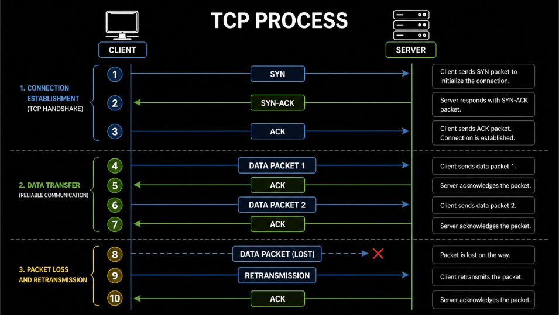
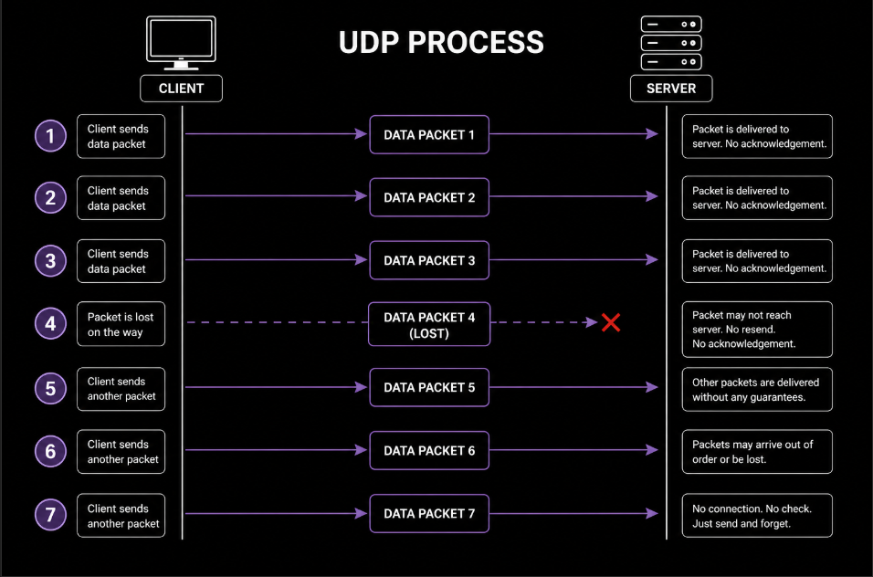
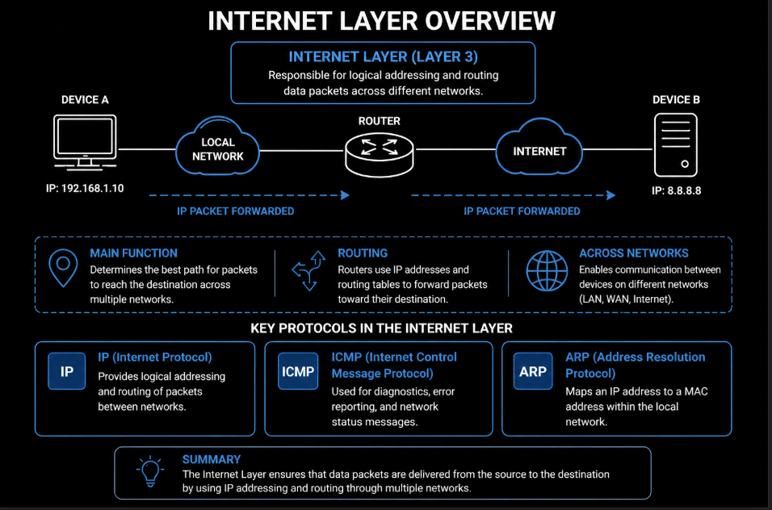
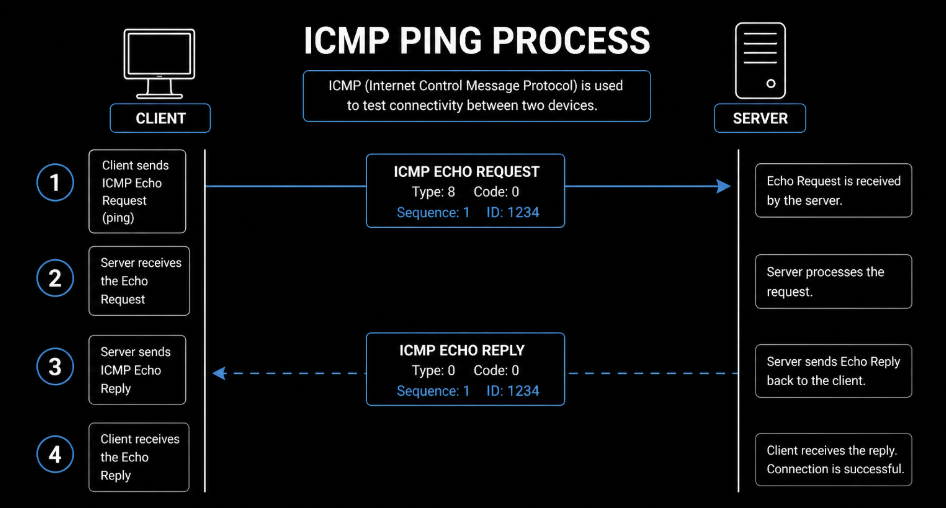
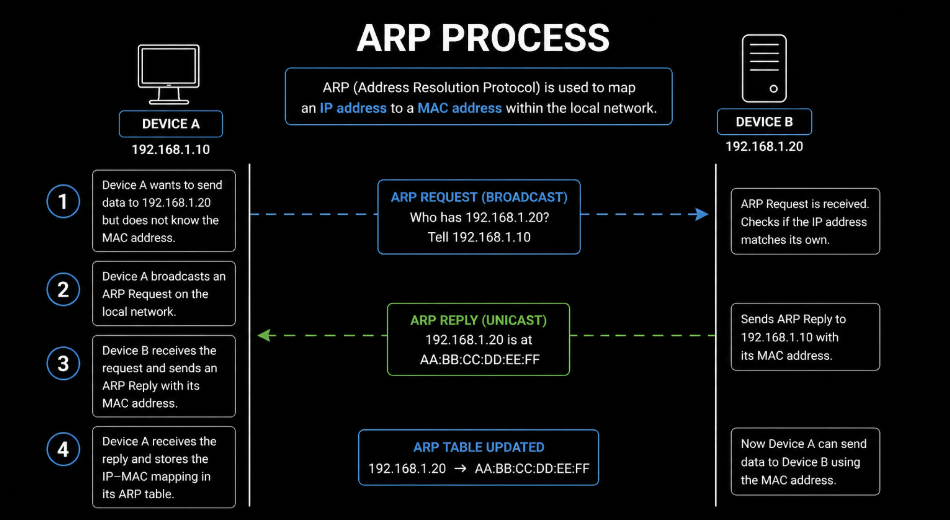

# Kompiuterių tinklai 4 lygis - turinys

- [Transporto sluoksnis](#transporto-sluoksnis)
- [Interneto sluoksnis](#interneto-sluoksnis)

Ankstesniuose lygiuose buvo nagrinėjama, kaip veikia kompiuterių tinklai, kokie įrenginiai naudojami, kaip perduodami duomenys ir kokios paslaugos veikia internete. Tai leidžia suprasti tiek teorinį tinklų veikimą, tiek jų praktinį pritaikymą.

Tačiau norint dar geriau suprasti tinklą, svarbu pažvelgti giliau į pačius protokolus ir jų veikimą skirtinguose sluoksniuose.

Ketvirtame lygyje dėmesys skiriamas tam, kaip konkretūs protokolai veikia TCP/IP modelyje. Čia svarbu suprasti ne tik jų paskirtį, bet ir kaip jie prisideda prie viso duomenų perdavimo proceso.

Galima sakyti, kad šiame etape pereinama nuo bendro protokolų supratimo prie detalesnio jų veikimo analizės.

Pirmiausia nagrinėjamas transporto sluoksnis, nes jis nustato, kaip duomenys yra perduodami tarp įrenginių.

## Transporto sluoksnis

Kad duomenys galėtų būti perduodami tarp skirtingų įrenginių, neužtenka vien tik žinoti IP adresą. Taip pat svarbu suprasti, kaip tie duomenys yra siunčiami, ar jie pasiekia tikslą ir ar nėra prarandami.

Šią funkciją atlieka transporto sluoksnis (*Transport layer*).

Jis yra atsakingas už duomenų perdavimą tarp įrenginių ir nustato, kaip informacija keliauja tinkle.

Transporto sluoksnyje veikia du pagrindiniai protokolai

- **TCP** (*Transmission Control Protocol*)  
- **UDP** (*User Datagram Protocol*)  

Šie protokolai skiriasi tuo, kaip jie perduoda duomenis. Vienas orientuotas į patikimumą, kitas į greitį.

**TCP** (*Transmission Control Protocol*) yra patikimas duomenų perdavimo protokolas.

Prieš perduodant duomenis, TCP pirmiausia sukuria ryšį tarp kliento ir serverio. Tai vadinama *TCP handshake*.

Šis procesas susideda iš trijų žingsnių

**SYN** klientas pradeda ryšį ir siunčia užklausą  tada **SYN-ACK** serveris patvirtina ir atsako ir galiausiai **ACK** klientas patvirtina atsakymą ir ryšys užmezgamas  

Po to prasideda duomenų perdavimas.

Duomenys siunčiami paketais (*packets*), ir kiekvienas paketas turi būti patvirtintas (**ACK**).

Kiekvienas ryšys tinkle vyksta per tam tikrą prievadą (*port*).

Portas leidžia nustatyti, kuriai programai ar paslaugai turi būti perduoti duomenys tame pačiame įrenginyje.

Tai reiškia, kad IP adresas nurodo įrenginį, o portas nurodo konkrečią programą tame įrenginyje.

Pavyzdžiui, naudojami standartiniai portai `:80` naudojamas HTTP ryšiui  ir `:443` naudojamas HTTPS (saugiam) ryšiui  

Jeigu paketas nepasiekia tikslo, jis siunčiamas dar kartą (*retransmission*).

Šį procesą praktiškai galima stebėti naudojant komandą `netstat`, kuri parodo aktyvius TCP ryšius ir jų būsenas, pavyzdžiui **ESTABLISHED** ar **TIME_WAIT**.

Jis užtikrina, kad visi duomenys pasieks tikslą teisinga tvarka ir be klaidų.

TCP prieš siųsdamas duomenis pirmiausia užmezga ryšį tarp įrenginių. Šis procesas vadinamas *connection-oriented*.

Duomenys yra suskaidomi į paketus (*packets*), ir kiekvienas paketas yra tikrinamas.

Jeigu kuris nors paketas dingsta, TCP jį išsiunčia dar kartą. Tai leidžia užtikrinti, kad visa informacija bus perduota tiksliai.

TCP dažniausiai naudojamas naršant internetą (*HTTP/HTTPS*), siunčiant el. laiškus (*SMTP*), perduodant failus (*FTP*)  

**UDP** (*User Datagram Protocol*) yra greitas, bet nepatikimas duomenų perdavimo protokolas.

Jis nenaudoja ryšio užmezgimo, todėl yra vadinamas *connectionless*.

Skirtingai nei TCP, UDP nenaudoja ryšio užmezgimo. Tai reiškia, kad duomenys siunčiami iš karto, be jokio išankstinio susitarimo tarp įrenginių.

Diagramoje matyti, kad duomenys siunčiami tiesiogiai iš kliento į serverį be jokio ryšio sukūrimo, nėra naudojami tokie patvirtinimai kaip **ACK**, paketai (*packets*) gali būti prarasti (*packet loss*), o prarasti paketai nėra siunčiami dar kartą (*retransmission*).

UDP ryšiai taip pat gali būti matomi naudojant `netstat`, tačiau jie neturi būsenų kaip TCP, nes tai yra *connectionless* protokolas.

Duomenys siunčiami be patvirtinimo, todėl nėra garantijos, kad visi paketai pasieks tikslą.

Tačiau dėl to UDP yra greitesnis nei TCP.

UDP dažniausiai naudojamas vaizdo transliacijose (*streaming*), internetiniuose žaidimuose, realaus laiko komunikacijoje  

Svarbu suprasti skirtumą **TCP** užtikrina patikimą duomenų perdavimą, o **UDP** užtikrina greitesnį, bet mažiau patikimą perdavimą  

Transporto sluoksnis leidžia pasirinkti, ar svarbiau yra patikimumas, ar greitis, priklausomai nuo situacijos.

Tačiau vien duomenų perdavimo būdo neužtenka. Net jei duomenys perduodami patikimai ar greitai, vis tiek reikia nuspręsti, kur jie turi būti siunčiami ir kaip pasiekti kitą įrenginį tinkle.

Būtent šią funkciją atlieka interneto sluoksnis (*Internet layer*).

## Interneto sluoksnis

Kad duomenys galėtų pasiekti kitą įrenginį tinkle, neužtenka vien tik juos perduoti. Taip pat reikia žinoti, kur tie duomenys turi būti siunčiami ir kaip surasti kitą įrenginį.

Šią funkciją atlieka interneto sluoksnis (*Internet layer*).

Jis yra atsakingas už duomenų nukreipimą tinkle, naudojant IP adresus.

Interneto sluoksnyje veikia keli svarbūs protokolai **IP** (*Internet Protocol*), **ICMP** (*Internet Control Message Protocol*), **ARP** (*Address Resolution Protocol*).

**IP** (*Internet Protocol*) yra pagrindinis protokolas, kuris nustato, kur duomenys turi būti siunčiami.

Kiekvienas įrenginys tinkle turi IP adresą, todėl IP leidžia paketams (*packets*) pasiekti teisingą gavėją.

IP neatsako už tai, ar duomenys bus pristatyti sėkmingai. Jis tik nukreipia juos tinkamu keliu.

Šį procesą galima stebėti naudojant komandą `tracert`, kuri parodo, kokiu keliu duomenys keliauja iki serverio ir per kokius tarpinius įrenginius jie praeina.

**ICMP** (*Internet Control Message Protocol*) naudojamas tinklo diagnostikai ir klaidų pranešimams.

Diagramoje matyti, kad įrenginys siunčia užklausą kitam įrenginiui (**Echo Request**), o jei ryšys veikia, gaunamas atsakymas (**Echo Reply**). Tai leidžia patikrinti, ar įrenginys yra pasiekiamas tinkle.

Jeigu atsakymas negaunamas, tai reiškia, kad ryšys gali būti sutrikęs arba įrenginys nepasiekiamas.

Jis padeda nustatyti, ar įrenginys pasiekiamas ir ar ryšys veikia.

ICMP naudojamas tokiose komandose kaip `ping`, kurios tikrina ryšį tarp įrenginių.

Jeigu įrenginys nepasiekiamas, ICMP gali grąžinti klaidos pranešimą.

**ARP** (*Address Resolution Protocol*) naudojamas susieti IP adresą su MAC adresu.

Diagramoje matyti, kad įrenginys pirmiausia siunčia užklausą visam tinklui (**ARP Request**), klausdamas, kuris įrenginys turi konkretų IP adresą. Tada įrenginys, turintis tą IP adresą, atsako (**ARP Reply**) ir pateikia savo MAC adresą.

Tokiu būdu IP adresas yra susiejamas su MAC adresu, ir duomenys gali būti siunčiami teisingam įrenginiui.

Tinkle duomenys realiai perduodami naudojant MAC adresus, todėl reikia būdo, kaip sužinoti, kuris MAC adresas atitinka tam tikrą IP adresą.

Kai įrenginys nori siųsti duomenis kitam įrenginiui lokaliame tinkle, jis pirmiausia naudoja ARP, kad surastų jo MAC adresą.

Šią informaciją galima peržiūrėti naudojant komandą `arp -a`, kuri parodo IP ir MAC adresų susiejimus vietiniame tinkle.

Svarbu suprasti skirtumą

- **IP** nustato, kur siųsti duomenis  
- **ICMP** tikrina ryšį ir praneša apie klaidas  
- **ARP** susieja IP adresą su MAC adresu  

Interneto sluoksnis užtikrina, kad duomenys pasiektų teisingą įrenginį tinkle.

Kai jau aišku, kaip nustatomas duomenų kelias ir kaip įrenginiai randami tinkle, galima pereiti prie to, kaip duomenys realiai perduodami per fizinį tinklą.
