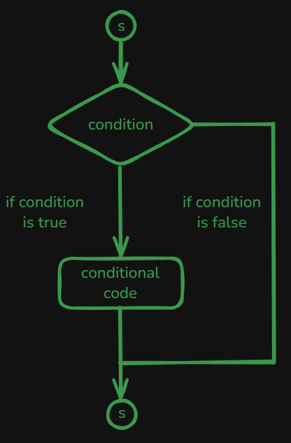
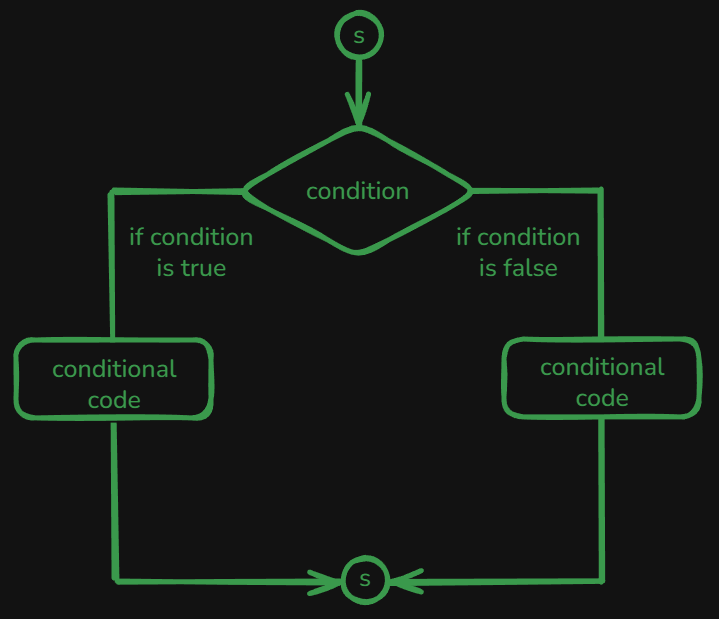
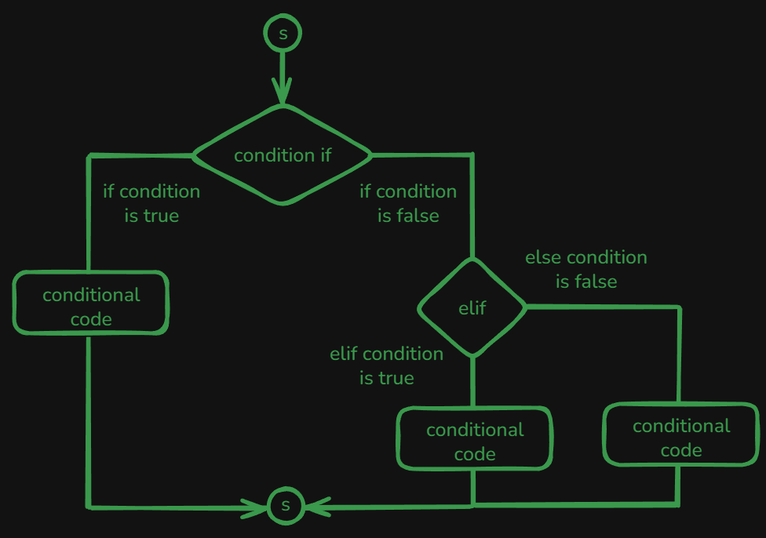
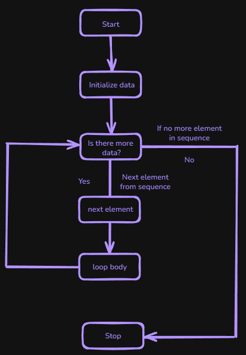
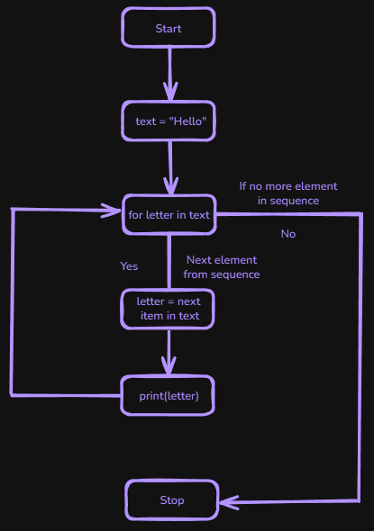
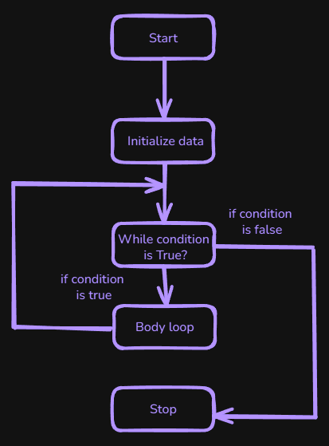
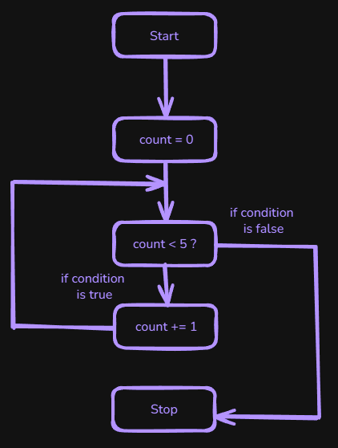

# Content of Python control flow 1 level

- [Control Flow Overview](#content-of-python-control-flow-1-level)
- [If Statement](#if-statement)
- [If-Else Statement](#if-else-statement)
- [If-Elif-Else Statement](#if-elif-else-statement)
- [Loops Overview](#loops-overview)
- [For Loop](#for-loop)
- [Range Function](#range-function)
- [While Loop](#while-loop)

Let's take these core concepts and start with conditional branching to see how it works. Python uses the keywords `if`, `elif`, and `else` for decision-making. You start with an `if` statement followed by a boolean expression and a colon (`:`). The colon begins an indented block of code that runs only if the expression is **True**.

Below you can see syntax:

```py
if condition:
    # code block executed if the condition is True
elif another_condition:
    # code block executed if the previous condition is False and this condition is True
else:
    # code block executed if all above conditions are False
```

If the boolean expression in the `if` statement is **False**, Python will skip that indented block and look for an `elif` statement (if one exists) to evaluate the next condition. If none of the `if` or `elif` conditions are met, and there is an `else` statement, then the code inside the `else` block will run.

## If Statement

Let's start with `if` statements to see how they work. In Python, an `if` statement begins with the keyword `if`, followed by a boolean expression and a colon (`:`). The colon marks the beginning of an indented block of code that executes only if the condition evaluates to **True**.



Below this image, we can see the syntax:

```py
if condition:
    # code block executed if the condition is True
```

And here is a simple example of how to write an `if` statement in code.

```py
temperature = 25

if temperature > 20:
    print("It's warm outside")
```

You can also write an `if` statement on a single line, like this.

```py
if condition: print("Condition is True")
```

*However, this concise format is fit for very simple actions.*

Additionally, when combining conditions using logical operators such as `and` or `or`, it's recommended to use parentheses for clarity.

```py
temperature = 25
humidity = 45

if (temperature > 20) and (humidity < 50):
    print("It's warm and not too humid!")
```

When using an `if` statement, the code block inside it runs only if the condition is true. If the condition is false, nothing is displayed or executed.

## If-Else Statement

However, when you combine `if` with `else`, the code inside the `else` block will run if the condition is false, allowing you to display an alternative message or perform different actions.



Below this image, you can see the syntax for using `if` and `else` statements.

```py
if condition:
    # code block executed if the condition is True
else:
    # code block executed if the condition is False
```

And here's an example of how to implement `if` and `else` statements.

```py
temperature = 15

if temperature > 20:
    print("It's warm outside")
else:
    print("It's not warm outside")
```

You can extend your decision making using `elif` (short for "else if"). Basically, if the condition in your initial `if` statement is false, Python will check the `elif` conditions one by one.

## If-Elif-Else Statement

In this image, we can see the complete flow of `if`, `elif`, and `else` statements.



If one of those conditions is true, its block of code will execute, and the rest will be skipped. If none of the `if` or `elif` conditions are met, the `else` block will execute as a default.

Below is the syntax for using `if`, `elif`, and `else`.

```py
if condition1:
    # code block executed if condition1 is True
elif condition2:
    # code block executed if condition1 is False and condition2 is True
else:
    # code block executed if none of the above conditions are True
```

Here's an example that uses `elif` to handle multiple conditions.

```py
temperature = 15

if temperature > 30:
    print("It's very hot outside")
elif temperature > 20:
    print("It's warm outside")
elif temperature > 10:
    print("It's cool outside")
else:
    print("It's cold outside")
```

Next, we will explore how **loops** work, starting with string data types. In the **data types 2 level**, we will discuss how to implement loops with other **iterable** data types such as **lists**, **dictionaries**, **sets**, and **tuples**.

## loops overview

A **loop** is a control structure in programming that allows a block of code to run repeatedly.

So far, our programs have mostly executed instructions **once**, from top to bottom. However, many tasks require performing the same operation multiple times or repeating logic until a condition changes.

Python provides different types of loops to support these patterns, most commonly the `for` loop and the `while` loop.

Let’s start with the `for` loop.

## for-loop

Below, you can see an image that illustrates its structure.



And here is the basic syntax for a `for` loop.

```py
for item in collection:
    # code block to execute for each item
```

*Loops are designed to work with **sequences** or **collections** of multiple elements. Single values such as a **number**, **boolean**, or **None** are not **iterable** and cannot be used directly in loops.*

And there is example image that illustrates how for loop works.



Below this image, you can see a code snippet demonstrating how the `for` loop is implemented in code.

```py
text = "Hello"

for letter in text: # Loop condition: is there more in data?
    print("letter:", letter) # Display result for each item

print("Done.") # Stop after all items are processed
```

*We have seen how to iterate over strings because they are sequences containing individual characters. Although individual numeric values cannot be iterated over.*

The important idea is that a `for` loop does not depend on *what* the values are, but on whether they can produce values one by one. Because of this, the same looping behavior applies naturally when working with other kinds of structured data.

This is commonly the case when working with **lists**. For example, when **processing items in a shopping cart**, each item must be **handled one by one**.

```py
emails = ["user@example.com", "admin@", "contact@site.com"]

for email in emails:
    if "@" in email:
        print(f"Valid email: {email}")
    else:
        print(f"Invalid email: {email}")
```

Each iteration handles one item independently, allowing the same logic to scale to **any number of items**.

Tuples behave in the same way. They are often used when **values belong together** and their position gives them meaning. For example, **personal information** can be stored as a single unit.

```py
location = (40.7128, -74.0060)

for value in location:
    print(value)
```

Here, the loop moves through all details of one person without needing to know how many fields exist.

In programs, the values produced by a loop are often complete data units rather than simple values.

For example, a list may store **daily measurements**, where each **inner list** represents one day of collected data.

```py
temperatures = [
    [18, 21, 23],
    [17, 20, 22],
    [19, 22, 24]
]

for day in temperatures:
    average = sum(day) / len(day)
    print(f"Average temperature: {average}")
```

A **list** may also contain **dictionaries** when each element represents a **person**, **product**, or **entry with named information**.

```py
users = [
    {"name": "Example1", "age": 25},
    {"name": "Example2", "age": 30}
]

for user in users:
    print(f"{user['name']} is {user['age']} years old")
```

**Lists** can also contain **sets**, which is useful when each element represents a **group of unique values**, such as **permissions** or **tags**.

```py
permissions = [
    {"read", "write"},
    {"read", "admin"}
]

for permission_set in permissions:
    if "admin" in permission_set:
        print("Admin access detected")
```

**Lists** may also contain **tuples** when the structure of the data is fixed, such as **coordinates** or **dimensions**.

```py
coordinates = [
    (1, 2),
    (3, 4)
]

for x, y in coordinates:
    print(f"x = {x}, y = {y}")
```

While **lists** and **tuples** store values by position, dictionaries organize data by meaningful names. This makes them useful when values need to be accessed by **what they represent** rather **than where they appear**.

When a **dictionary** is used directly in a for loop, Python goes through its `keys`. This is helpful when the `keys` themselves are what you want to work with.

```py
students = {"Example1": 9, "Example2": 8}

for name in students:
    print(f"Checking results for {name}")
```

In this example, the loop processes each student name one by one.

The same behavior can be written explicitly using the **`.keys()` method**, which makes the intent clearer when reading the code.

```py
for name in students.keys():
    print(f"Student: {name}")
```

Sometimes the names are not important, and only the stored values matter. In this case, the **`.values()` method** can be used.

```py
for grade in students.values():
    if grade < 9:
        print("Grade below passing level")
```

Here, the loop focuses only on the results, without caring who they belong to.

In many situations, both the name and the associated value are needed together. The `.items()` method provides access to both at the same time.

```py
for name, grade in students.items():
    print(f"{name} scored {grade}")
```

This allows the loop to work with complete pieces of information, while still applying the same logic to every entry in the dictionary.

In programs, a decision does not only choose **one statement** to execute. Instead, it determines **whether a group of items should be processed at all**. In these cases, a **`for` loop** is commonly placed inside an `if`, `elif`, or `else` block.

Conceptually, the conditional decides **which situation applies**, and the loop performs **repeated work** that is relevant only to that situation.

```py
if condition:
    for item in collection:
        # repeated work for this condition
```

A common example is processing records differently depending on the current `mode` of the program.

```py
orders = [
    {"id": "ORD-1001", "status": "pending"},
    {"id": "ORD-1002", "status": "shipped"},
    {"id": "ORD-1003", "status": "pending"}
]

mode = "pending"
```

If the program is running in **pending `mode`**, only pending orders should be processed.

```py
if mode == "pending":
    for order in orders:
        if order["status"] == "pending":
            print("Processing pending order:", order["id"])
elif mode == "shipped":
    for order in orders:
        if order["status"] == "shipped":
            print("Processing shipped order:", order["id"])
else:
    print("Unknown mode")
```

Here, the `if` / `elif` / `else` block selects **which rule applies**, while the `for` loop applies that rule repeatedly to the relevant data. The loop does not run unless the surrounding condition is satisfied.

This pattern appears frequently in programs that work with **lists of records**, where the same data must be handled differently depending on **configuration**, **state**, or **user choice**.

So far, we have used `for` loops to iterate over existing data, such as **strings**, **lists**, **tuples**, and **dictionaries**.  Sometimes, however, there is no collection of values yet, and we simply want to repeat an action a specific number of times or work with a sequence of numbers.

For these situations, Python provides the `range()` function.

## range-function

The `range()` function represents a sequence of numbers generated on demand rather than stored all at once.

```py
print(range(5))
```

When we print the range, we see an output like `range(0, 5)`, which indicates that it represents an interval starting at `0` and ending before `5`.

A common use of `range()` is repeating an action a fixed number of times.

```py
for i in range(5):
    print(i)
```

Here, the loop runs five times, and on each iteration `i` takes the next number in the sequence: `0`, `1`, `2`, `3`, and `4`.

In many cases, the actual number produced by `range()` is not important. What matters is how many times the loop runs. When the loop variable is not needed, `_` is commonly used as a placeholder.

```py
for _ in range(3):
    print("Saving data...")
```

By convention, `_` indicates that the loop variable is intentionally ignored and the loop is used only for repetition.

The numbers produced by `range()` can also be used as part of the loop logic.

```py
total = 0

for i in range(5):
    total += i

print(total)
```

In some situations, the numeric index itself is meaningful. This commonly happens when working with **ordered data**, such as a list of steps, stops, or stages, where the position of each item matters.

```py
stops = ["Station A", "Station B", "Station C", "Station D"]

for i in range(len(stops)):
    print(f"Stop {i + 1}: {stops[i]}")
```

In this example, `range(len(stops))` generates a sequence of indexes that match the positions of the elements in the list. The loop uses the index to access each stop while also keeping track of its order.

This pattern is useful when you need both the position and the value of each element, such as numbering steps, tracking progress, or displaying ordered output.

In all cases, `range()` works naturally with a `for` loop by providing a predictable sequence of numbers, allowing repeated actions or numeric iteration without manually creating a collection.

So far, we have used `for` loops when the number of iterations is known in advance or when looping over an existing sequence. In some cases, we do not know ahead of time how many times a block of code should run. Instead, we want the code to continue running **until a condition changes**.

For these cases, Python provides the `while` loop.

## while-loop

A `while` loop repeatedly executes a block of code **as long as a condition remains True**.

Below is a flowchart that illustrates how a `while` loop operates.



And here is the syntax for a `while` loop.

```py
while condition:
    # code block that executes as long as the condition is True
```

Below is an image that illustrates how a `while` loop works in code.



And here is an example of how the `while` loop looks in code.

```py
count = 0
while count < 5:
    count += 1
    print(count)
```

Here, the loop starts with count set to `0`.

On each iteration, the condition `count < 5` is checked. As long as it remains True, the loop continues to run. Once the condition becomes False, the loop stops automatically.

A `while` loop is often used when waiting for something to happen, such as user input, a state change, or the completion of a task.

Because the loop depends entirely on its condition, it is important that something inside the loop eventually changes that condition. Otherwise, the loop will continue running indefinitely.

```py
while True:
    print("Infinite loop")

# Press Ctrl + C to stop the program
```

A `while` loop is often used when the number of iterations is not known in advance, such as when waiting for user input or a specific action to occur.

In these cases, it is common to use `True` as the condition and control the loop from inside.

```py
while True:
    choice = input("Enter 'q' to quit: ")

    if choice == "q":
        print("Exiting program")
        break
```
